---
## Front matter
lang: ru-RU
title: Использование протокола STP. Агрегирование каналов.
author:
  - Абакумова О. М.
institute:
  - Российский университет дружбы народов, Москва, Россия

## i18n babel
babel-lang: russian
babel-otherlangs: english

## Formatting pdf
toc: false
toc-title: Содержание
slide_level: 2
aspectratio: 169
section-titles: true
theme: metropolis
header-includes:
 - \metroset{progressbar=frametitle,sectionpage=progressbar,numbering=fraction}
mainfont: Open Sans Light
---

# Информация

## Докладчик

:::::::::::::: {.columns align=center}
::: {.column width="70%"}

  * Абакумова Олеся Максимовна
  * Студентка
  * Российский университет дружбы народов
  * 1132220832@pfur.ru
  * <https://github.com/omabakumova>

:::
::: {.column width="30%"}

:::
::::::::::::::

# Цель работы

Изучение принципов работы протокола STP (Spanning Tree Protocol) и технологий агрегирования каналов.

# Задачи

1. Рассмотреть теоретическую часть принципов работы протокола STP.
2. Продемонстрировать работу протокола STP, включая RSTP и Portfast.
3. Рассмотреть методы агрегирования каналов.
4. Настроить агрегирование каналов на примере простейшей модели сети.

# Протокол STP

STP (Spanning Tree Protocol) --- это протокол канального уровня, который предотвращает возникновение петель в Ethernet-сетях, автоматически блокируя избыточные соединения.
Автором оригинального алгоритма STP считается Радия Перлман, сыгравшая ключевую роль в развитии сетевых технологий. В 1990-х годах её разработка стала основой для стандарта IEEE 802.1D.

{#fig:001 width=30%}

## Проблема коммутационных петель

Основная задача STP --- предотвращение петель в сетях с избыточными соединениями:

- При наличии нескольких путей между коммутаторами возникают бесконечные циклы передачи кадров;

- Это приводит к "захлебыванию" сети и полному отказу;

- Пример: при обрыве кабеля простое добавление резервного соединения создает петлю.

## Алгоритм действия STP

1. Инициализация
 
2. Обмен BPDU

3. Выбор корневого моста

4. Построение путей

5. Назначенные порты

6. Блокировка избыточных связей

7. Поддержание топологии

## BPDU-кадры

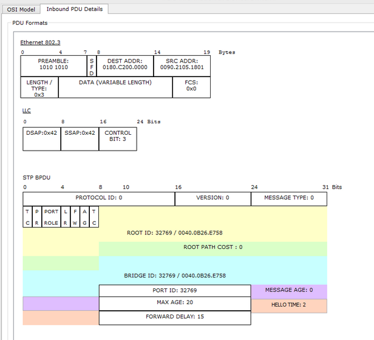{#fig:002 width=50%}

## Разновидности STP

- CST (Classic STP) 

- PVST+ (Per-VLAN STP) 

- RSTP (Rapid STP) 

- MSTP (Multiple STP) 

## Изучение принципов работы STP

{#fig:003 width=80%}

## Изучение принципов работы STP

:::::::::::::: {.columns}
::: {.column width="50%"}
{#fig:004 width=70%}
:::
::: {.column width="50%"}
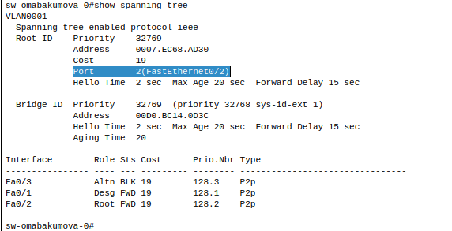{#fig:005 width=70%}
:::
::::::::::::::

## Изучение принципов работы STP

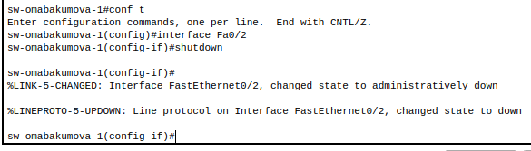{#fig:006 width=80%}

## Изучение принципов работы STP

{#fig:007 width=80%}

## Изучение принципов работы STP

:::::::::::::: {.columns}
::: {.column width="50%"}
{#fig:008 width=80%}
:::
::: {.column width="50%"}
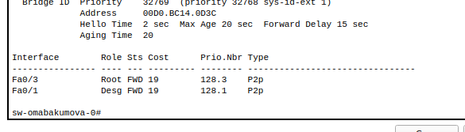{#fig:009 width=80%}
:::
::::::::::::::

## Изучение принципов работы STP

{#fig:010 width=80%}

## Настройка RSTP

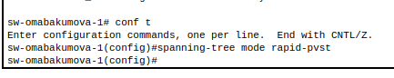{#fig:011 width=80%}

## Настройка RSTP

{#fig:012 width=90%}

## Настройка RSTP

{#fig:013 width=90%}

## Portfast

Проблема стандартного STP:

- Долгий процесс активации порта (~20 сек):

  - Blocking $\rightarrow$ Listening $\rightarrow$ Learning $\rightarrow$ Forwarding;

  - Избыточная задержка для "безопасных" устройств.

## Portfast

Решение — PortFast:

- Мгновенный переход в Forwarding (1-2 сек);

- Обход стадий Listening/Learning.

## Portfast

:::::::::::::: {.columns}
::: {.column width="50%"}
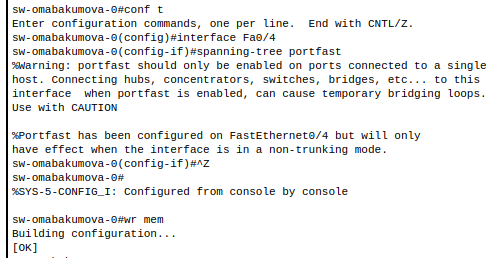{#fig:014 width=80%}
:::
::: {.column width="50%"}
{#fig:015 width=100%}
:::
::::::::::::::

## Portfast

{#fig:016 width=50%}

**Итог:**  
STP создаёт **беспетевую топологию** с резервными путями, отключая избыточные соединения.  

# Агрегирование каналов

Etherchannel --- это технология, позволяющая объединять (агрегировать) несколько физических проводов (каналов, портов) в единый логический интерфейс.

Проблемы без агрегирования:

- Избыточные линки без агрегирования приводят к петлям в сети;

- STP (Spanning Tree Protocol) блокирует лишние линки, оставляя только один активный $\rightarrow$ нет увеличения пропускной способности.

## Агрегирование каналов

Виды агрегирования в Cisco:

1. LACP (IEEE 802.3ad) – открытый стандарт

2. PAgP (Cisco proprietary) – проприетарный протокол:

3. Ручное агрегирование (on) – без протоколов, требует идентичных настроек портов.

## LACP

Link Aggregation Control Protocol (LACP) --- протокол, предназначенный для объединения нескольких физических каналов в один логический в сетях Ethernet.

## LACP

| Режим устройства 1 | Режим устройства 2 | Работает LACP? |  
|-------------------|-------------------|----------------|  
| **Active**        | **Active**        | Да             |  
| **Active**        | **Passive**       | Да             |  
| **Passive**       | **Passive**       | Нет            |  

## Настройка LACP

:::::::::::::: {.columns}
::: {.column width="50%"}
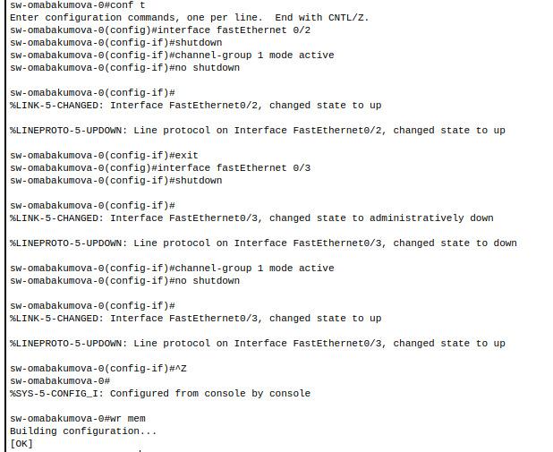{#fig:017 width=70%}
:::
::: {.column width="50%"}
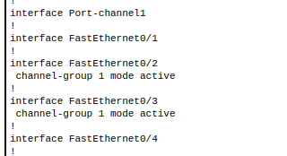{#fig:018 width=60%}
:::
::::::::::::::

## Настройка LACP

:::::::::::::: {.columns}
::: {.column width="50%"}
{#fig:019 width=70%}
:::
::: {.column width="50%"}
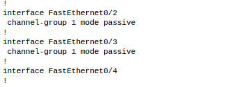{#fig:020 width=90%}
:::
::::::::::::::

## Настройка LACP

:::::::::::::: {.columns}
::: {.column width="50%"}
{#fig:021 width=60%}
:::
::: {.column width="50%"}
{#fig:022 width=60%}
:::
::::::::::::::

## Настройка LACP

{#fig:023 width=60%}

## PAgP

PAgP --- это проприетарный протокол агрегации каналов, разработанный **Cisco**, и применяется преимущественно в сетях с оборудованием этого производителя.

## PAgP

| Режим устройства 1 | Режим устройства 2 | Работает PAgP? |  
|-------------------|-------------------|----------------|  
| **Desirable**     | **Desirable**     | Да             |  
| **Desirable**     | **Auto**          | Да             |  
| **Auto**          | **Auto**          | Нет            |  

## Настройка PAgP

:::::::::::::: {.columns}
::: {.column width="50%"}
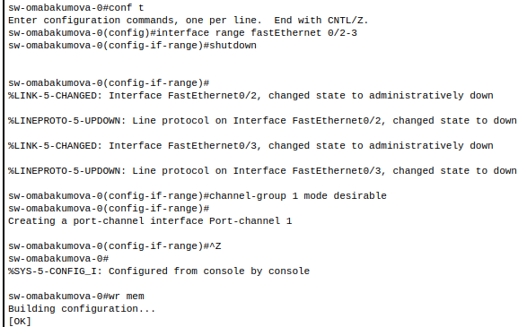{#fig:024 width=70%}
:::
::: {.column width="50%"}
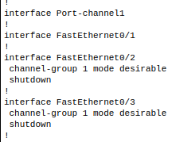{#fig:025 width=70%} 
:::
::::::::::::::

## Настройка PAgP

:::::::::::::: {.columns}
::: {.column width="50%"}
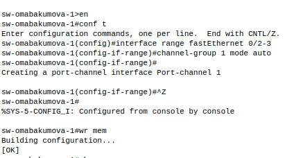{#fig:026 width=80%}
:::
::: {.column width="50%"}
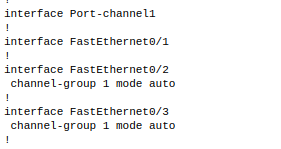{#fig:027 width=80%} 
:::
::::::::::::::

## Настройка PAgP

{#fig:028 width=70%}

## Настройка PAgP

:::::::::::::: {.columns}
::: {.column width="50%"}
{#fig:029 width=70%}
:::
::: {.column width="50%"}
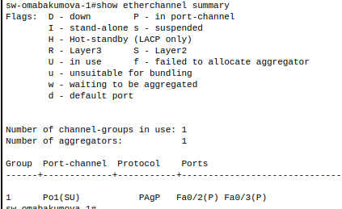{#fig:030 width=60%}
:::
::::::::::::::

## Ручное агрегирование

Ручное агрегирование --- это метод объединения нескольких физических интерфейсов в один логический канал **без использования протоколов динамического согласования** (таких как LACP или PAgP). Все настройки задаются администратором вручную на каждом устройстве.

## Ручное агрегирование

| Режим устройства 1 | Режим устройства 2 | Работает агрегирование? |
|--------------------|--------------------|--------------------------|
| On (Включено)      | On (Включено)      | Да                       |
| Любой другой режим | Любой другой режим | Нет                      |

## Настройка ручного агрегирования

:::::::::::::: {.columns}
::: {.column width="50%"}
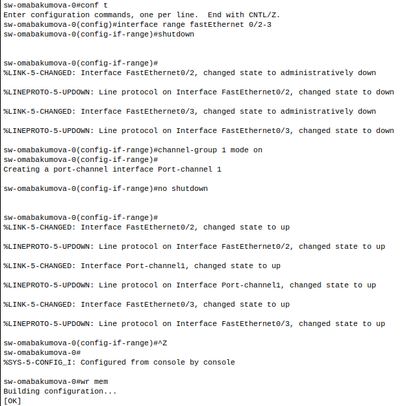{#fig:031 width=60%}
:::
::: {.column width="50%"}
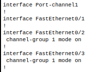{#fig:032 width=60%} 
:::
::::::::::::::

## Настройка ручного агрегирования

:::::::::::::: {.columns}
::: {.column width="50%"}
{#fig:033 width=90%}
:::
::: {.column width="50%"}
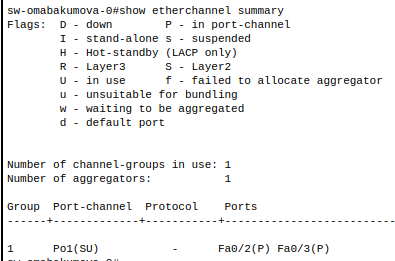{#fig:034 width=60%} 
:::
::::::::::::::

# Выводы

Были изучены принципы работы протокола STP (Spanning Tree Protocol) и технологий агрегирования каналов.

# Список литературы

1. The Wisdom of Crowds [Электронный ресурс]. URL: https://ru.wikipedia.org/wiki/STP.

2. The Wisdom of Crowds [Электронный ресурс]. URL: https://en.wikipedia.org/wiki/Radia_Perlman.

3. Waging Simple Wars [Электронный ресурс]. URL: https://ru.wikipedia.org/wiki/BPDU.

4. Habr [Электронный ресурс]. URL: https://habr.com/ru/articles/321132/. 

5. The Wisdom of Crowds [Электронный ресурс]. URL: https://ru.wikipedia.org/wiki/RSTP.

6. Habr [Электронный ресурс]. URL: https://habr.com/ru/articles/334778/.

