---
## Front matter
title: "Доклад"
subtitle: "Использование протокола STP. Агрегирование каналов."
author: "Абакумова Олеся Максимовна, НФИбд-02-22"

## Generic otions
lang: ru-RU
toc-title: "Содержание"

## Bibliography
bibliography: bib/cite.bib
csl: pandoc/csl/gost-r-7-0-5-2008-numeric.csl

## Pdf output format
toc: true # Table of contents
toc-depth: 2
lof: true # List of figures
lot: true # List of tables
fontsize: 12pt
linestretch: 1.5
papersize: a4
documentclass: scrreprt
## I18n polyglossia
polyglossia-lang:
  name: russian
  options:
	- spelling=modern
	- babelshorthands=true
polyglossia-otherlangs:
  name: english
## I18n babel
babel-lang: russian
babel-otherlangs: english
## Fonts
mainfont: IBM Plex Serif
romanfont: IBM Plex Serif
sansfont: IBM Plex Sans
monofont: IBM Plex Mono
mathfont: STIX Two Math
mainfontoptions: Ligatures=Common,Ligatures=TeX,Scale=0.94
romanfontoptions: Ligatures=Common,Ligatures=TeX,Scale=0.94
sansfontoptions: Ligatures=Common,Ligatures=TeX,Scale=MatchLowercase,Scale=0.94
monofontoptions: Scale=MatchLowercase,Scale=0.94,FakeStretch=0.9
mathfontoptions:
## Biblatex
biblatex: true
biblio-style: "gost-numeric"
biblatexoptions:
  - parentracker=true
  - backend=biber
  - hyperref=auto
  - language=auto
  - autolang=other*
  - citestyle=gost-numeric
## Pandoc-crossref LaTeX customization
figureTitle: "Рис."
tableTitle: "Таблица"
listingTitle: "Листинг"
lofTitle: "Список иллюстраций"
lotTitle: "Список таблиц"
lolTitle: "Листинги"
## Misc options
indent: true
header-includes:
  - \usepackage{indentfirst}
  - \usepackage{float} # keep figures where there are in the text
  - \floatplacement{figure}{H} # keep figures where there are in the text
---

# Цель работы

Изучение принципов работы протокола STP (Spanning Tree Protocol) и технологий агрегирования каналов.

# Задачи

1. Рассмотреть теоретическую часть принципов работы протокола STP.
2. Продемонстрировать работу протокола STP, включая RSTP и Portfast.
3. Рассмотреть методы агрегирования каналов.
4. Настроить агрегирование каналов на примере простейшей модели сети.


# Протокол STP

STP (Spanning Tree Protocol) [@STP] --- это протокол канального уровня, который предотвращает возникновение петель в Ethernet-сетях, автоматически блокируя избыточные соединения. Первая версия протокола, описанная в стандарте IEEE 802.1D, позже была дополнена улучшенными вариациями, такими как RSTP, MSTP, PVST и PVST+. Эти модификации отличаются скоростью работы, поддержкой VLAN и другими особенностями, но сохраняют общий принцип устранения петель.

Автором оригинального алгоритма STP считается Радия Перлман [@Perlman] (рис. [-@fig:001]), сыгравшая ключевую роль в развитии сетевых технологий. В 1990-х годах её разработка стала основой для стандарта IEEE 802.1D.

{#fig:001 width=60%}

## Проблема коммутационных петель

Основная задача STP --- предотвращение петель в сетях с избыточными соединениями:

- При наличии нескольких путей между коммутаторами возникают бесконечные циклы передачи кадров;

- Это приводит к "захлебыванию" сети и полному отказу;

- Пример: при обрыве кабеля простое добавление резервного соединения создает петлю.

Сегодня поддержка STP или его аналогов присутствует практически во всех Ethernet-коммутаторах, за исключением самых простых моделей. Это касается как физического, так и виртуального сетевого оборудования.

## Алгоритм действия STP

1. Инициализация коммутаторов

При запуске сети каждый коммутатор изначально считает себя корневым мостом (root bridge).

2. Обмен BPDU-пакетами

Коммутаторы начинают рассылать Hello BPDU (Bridge Protocol Data Units) через все свои порты с интервалом 2 секунды. Максимальное время ожидания ответа — 20 секунд.

3. Выбор корневого моста

Если коммутатор получает BPDU с Bridge ID меньшим, чем его собственный, он перестаёт генерировать свои BPDU и начинает ретранслировать пакеты от более приоритетного моста. В итоге остаётся только один коммутатор, продолжающий отправку своих BPDU — он и становится корневым мостом.

4. Определение пути к корневому мосту

Остальные коммутаторы ретранслируют BPDU от корневого моста, добавляя в них свой Bridge ID и увеличивая стоимость пути (path cost).

5. Выбор назначенных портов (designated ports)

Для каждого сетевого сегмента, к которому подключено несколько портов, выбирается designated port — тот, через который BPDU от корневого моста поступают в данный сегмент с наименьшей стоимостью.

6. Блокировка избыточных соединений

Все порты, кроме root port (ближайшего к корневому мосту) и designated port, переходят в заблокированное состояние, чтобы исключить петли.

7. Поддержание стабильного состояния

Корневой мост продолжает отправлять Hello BPDU каждые 2 секунды, обеспечивая актуальность топологии сети.

Таким образом, STP автоматически строит беспетевую древовидную топологию, отключая избыточные соединения, но оставляя резервные пути на случай сбоев.

## BPDU-кадры

Коммутаторы обмениваются BPDU (Bridge Protocol Data Unit) [@BPDU] для построения дерева:

- Содержат информацию о корневом коммутаторе, стоимости пути и идентификаторах;

- Отправляются каждые 2 секунды (Hello Time);

- При изменениях топологии запускается процесс перестроения дерева.

{#fig:002 width=80%}

Проанализируем кадр подробнее:

1. Заголовок Ethernet 802.3

- **Preamble & SFD**: Синхронизация (7 байт `10101010` + 1 байт `S`);

- **MAC-адреса**:

  - **Destination MAC**: `0180.C200.0000` (мультикаст для STP);
  
  - **Source MAC**: `0090.2105.1801` (адрес отправителя).
  
- **Length/Type**: `0x3` (длина данных);

- **FCS (Frame Check Sequence)**: `0x0` (контрольная сумма).

2. LLC (Logical Link Control)

- **DSAP/SSAP**: `0x42` (значения для STP);
- **Control Bit**: `3` (управляющий флаг).

3. STP BPDU Структура

- **Protocol ID**: `0` (идентификатор STP);

- **Version**: `0` (STP, не RSTP/MSTP);

- **Message Type**: `0` (Configuration BPDU).


4. 

: Флаги BPDU {#tbl:BPDU}
| Бит | Обозначение | Описание |
|-----|-------------|----------|
| T   | Topology Change | Флаг изменения топологии |
| P   | Proposal | Используется в RSTP для быстрого перехода |
| L   | Learning | Порт в состоянии обучения |
| F   | Forwarding | Порт пересылает данные |
| A   | Agreement | Подтверждение в RSTP |
| T   | TCA (Topology Change Ack) | Подтверждение уведомления о изменении |

5. Идентификаторы

- **Root ID**: `32769 / 0040.0826.E758` (приоритет + MAC корневого моста);

- **Root Path Cost**: `0` (стоимость пути до корня; `0` означает, что это сам корень);

- **Bridge ID**: `32769 / 0040.0826.E758` (идентификатор текущего коммутатора);

- **Port ID**: `32769` (приоритет порта + номер).

6. Таймеры

- **Message Age**: `0` (время с момента генерации BPDU);

- **Max Age**: `20` сек (максимальное время жизни BPDU);

- **Hello Time**: `2` сек (интервал отправки BPDU);

- **Forward Delay**: `15` сек (задержка перед переходом порта в Forwarding).

В качестве вывода можно подчеркнуть:

1. BPDU отправлен **корневым мостом** (Root Path Cost = 0, Root ID = Bridge ID).

2. Используется **классический STP** (не RSTP/MSTP), так как Version = 0.

3. Таймеры стандартные:
   - BPDU рассылаются каждые **2 секунды**;
   
   - Максимальное время ожидания --- **20 секунд**;
   
   - Задержка перехода порта в активное состояние --- **15 секунд**.
   
4. MAC-адреса указывают на **мультикастовый STP-трафик** (`0180.C200.0000`).

**Примечание**: Если Bridge ID совпадает с Root ID, это означает, что коммутатор, отправивший BPDU, является корневым мостом в сети.

## Разновидности STP

- CST (Classic STP) --- одно дерево для всей сети;

- PVST+ (Per-VLAN STP) --- отдельное дерево для каждого VLAN (используется в Cisco);

- RSTP (Rapid STP) --- ускоренная версия с временем сходимости 1-2 секунды;

- MSTP (Multiple STP) --- объединение нескольких VLAN в одно дерево.

## Изучение принципов работы STP

Рассмотрим простейший пример тоопологии сети, демонстрирующей работу STP [@STP_Cisco] (рис. [-@fig:003]):

- Два коммутатора (Switch0 и Switch1) соединены двумя линками (избыточное соединение)

- STP автоматически определяет топологию и блокирует один порт для предотвращения петель

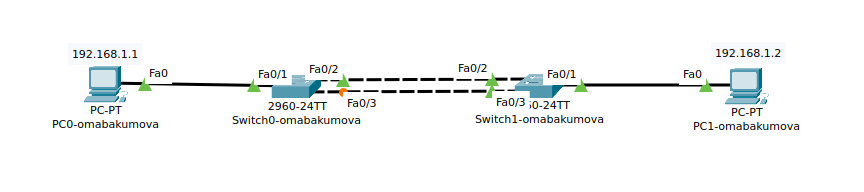{#fig:003 width=80%}

Зайдем на первый коммутатор и посмотрим настройки STP (рис. [-@fig:004]):

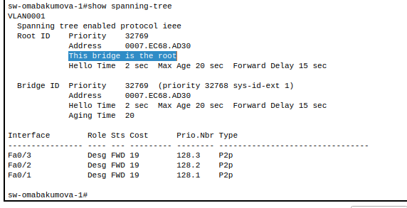{#fig:004 width=80%}

На иллюстрации, демонстрирующей настройки STP первого коммутатора выделена строка, обозначающая, что данный коммутатор является рутовым Также все порты находятся в режиме передачи.

Аналогичным образом посмотрим нулевой коммутатор (рис. [-@fig:005]):

{#fig:005 width=80%}

Этот коммутатор не является корневым. Роутер-порт назначен на интерфейс Fa0/2, в то время как Fa0/3 находится в режиме ожидания.

Далее рассмотрим ситуацию, когда интерфейс Fa0/2 перестает работать. Для наглядности отключим его вручную. Переходим в конфигурацию первого коммутатора (рис. [-@fig:006]):

{#fig:006 width=80%}

Отмечаем, что пропал линк (рис. [-@fig:007]):

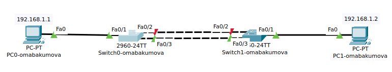{#fig:007 width=80%}

Зайдем на нулевой коммутатор и посмотрим, что там произошло (рис. [-@fig:008]):

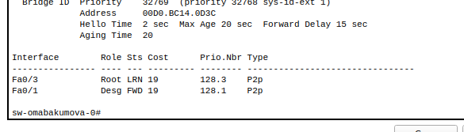{#fig:008 width=80%}

После отключения порта Fa0/2, порт Fa0/3 оказывается в состоянии обучения.Через 20 секунд(как и заявлено), порт перешел в состояние передачи и линк поднялся снова. (рис. [-@fig:009]):

{#fig:009 width=80%}

После поднятия порта Fa0/2, все вернулось к своему исходному виду (рис. [-@fig:010]):

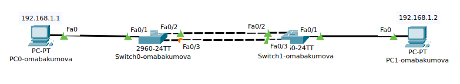{#fig:010 width=80%}

## Настройка RSTP

RSTP (Rapid Spanning Tree Protocol) [@RSTP], также известный как IEEE 802.1w, представляет собой усовершенствованную версию классического STP (Spanning Tree Protocol). Основное отличие заключается в значительно более высокой скорости сходимости сети --- переход на резервные пути занимает доли секунды, что минимизирует потерю данных. В большинстве случаев при переключении теряется всего один пакет, что делает этот протокол гораздо эффективнее в современных сетях с высокими требованиями к отказоустойчивости.

Также он достаточно просто и быстро включается (рис. [-@fig:011]):

{#fig:011 width=80%}

Аналогичным образом включив на другом коммутаторе, проверим скорость обучения и вхждения в состояние передачи на нулевом коммутаторе (рис. [-@fig:012]):

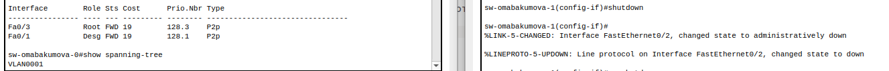{#fig:012 width=100%}

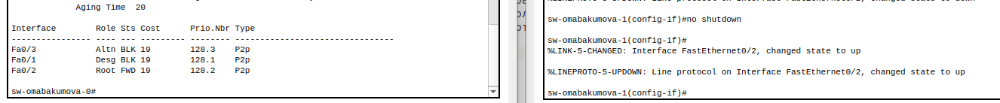{#fig:013 width=100%}

Как можно заметить достаточно было одной секунды для того, чтобы порт Fa0/3 вошел в состояние передачи,аналогично и при поднятии порта Fa0/2. Разница во времени ощутима, но при тестировании не видна.
RSTP гораздо быстрее классического STP.

## Portfast

В стандартной работе STP предусмотрены меры предосторожности, когда коммутатор перед активацией порта последовательно проходит состояния:

- Блокировки (Blocking);

- Прослушивания (Listening);

- Обучения (Learning);

- Передачи (Forwarding).

Этот процесс занимает около 30 секунд (2 интервала Forward Delay по 15 секунд), что обеспечивает безопасность сети, но может создавать неоправданные задержки в определенных сценариях.
Для портов, подключенных к конечным устройствам (компьютерам, IP-телефонам, принтерам), где гарантированно не возникнет сетевых петель, существует функция **PortFast**. PortFast является функцией протокола spanning-tree, которая переводит порт в состояние пересылки сразу после его включения. Эту функцию рекомендуется использовать при подключении узлов, чтобы они могли начать обмен данными по сети VLAN немедленно, не дожидаясь протокола spanning-tree. 
Ее особенности:

1. Мгновенный переход в Forwarding:

- Порт сразу переходит в рабочее состояние;

- Исключаются этапы Listening и Learning;

- Время подключения сокращается до 1-2 секунд.

2. Безопасность реализации:

- Автоматически продолжает участвовать в STP;

- При обнаружении BPDU (признак подключения коммутатора) автоматически отключает PortFast;

- Предотвращает случайное создание петель.

Проведем настройку Portfast на нулевом коммутаторе, выбрав Fa0/4 в качестве интерфейса для настройки (рис. [-@fig:014]):

{#fig:014 width=80%}

Удостоверимся в том, что настройка была проведена успешно с помощью команды ```sh ru ``` (рис. [-@fig:015]):

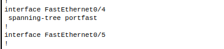{#fig:015 width=80%}

При активации порта он немедленно переходит в состояние Forwarding, однако система выдает предупреждение: данный порт должен использоваться исключительно для подключения конечного устройства (например, компьютера или сервера). Если к нему подсоединить другой коммутатор или сетевое оборудование, возникает риск образования петли, что может нарушить стабильность работы сети.
Теперь добавим еще одно оконечное устройство в рабочую область (рис. [-@fig:016]):

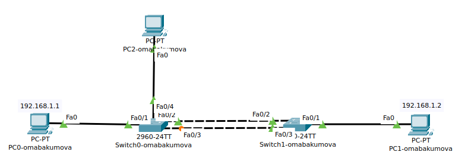{#fig:016 width=80%}

Как видим, порт сразу перешел в состояние Forwarding, пропустив стандартные этапы STP (Listening, Learning). Однако важно помнить: такая настройка допустима только для edge-портов, подключенных к конечным устройствам (ПК, серверам, IP-телефонам).
Если же к этому порту ошибочно подключить коммутатор, хаб или другое сетевое оборудование, может возникнуть кольцевая топология (broadcast-шторм), что приведет к нарушению работы сети. Поэтому необходимо использовать эту функцию осмотрительно и только там, где полностью контролируем подключения.

# Агрегирование каналов

Etherchannel --- это технология, позволяющая объединять (агрегировать) несколько физических проводов (каналов, портов) в единый логический интерфейс. Как правило, это используется для повышения отказоустойчивости и увеличения пропускной способности канала. Обычно, для соединения критически важных узлов (коммутатор-коммутатор, коммутатор-сервер и др.). Само слово Etherchannel введено компанией Cisco и все, что связано с агрегированием, она включает в него. Другие вендоры агрегирование называют по-разному. Huawei называет это Link Aggregation, D-Link называет LAG и так далее.

Проблемы без агрегирования:

- Избыточные линки без агрегирования приводят к петлям в сети;

- STP (Spanning Tree Protocol) блокирует лишние линки, оставляя только один активный $\rightarrow$ нет увеличения пропускной способности.

Виды агрегирования [@Aggregation] в Cisco:

1. LACP (IEEE 802.3ad) – открытый стандарт:

- Режимы: active (всегда отправляет LACP-сообщения) и passive (отвечает, но не инициирует).

- Условия работы:

  - Оба в active или один active + один passive.

2. PAgP (Cisco proprietary) – проприетарный протокол:

- Режимы: desirable (активно пытается установить соединение) и auto (пассивно ждет запроса).

3. Ручное агрегирование (on) – без протоколов, требует идентичных настроек портов.

## LACP

Link Aggregation Control Protocol (LACP) --- протокол, предназначенный для объединения нескольких физических каналов в один логический в сетях Ethernet. Агрегированные каналы LACP используются как для повышения пропускной способности, так и повышения отказоустойчивости.

Для работы протокола LACP (Link Aggregation Control Protocol) необходимо настроить интерфейсы в один из двух режимов: **active** или **passive**.  

- **Active** --- интерфейс сразу начинает отправлять LACP-сообщения, активируя агрегирование каналов.  

- **Passive** --- интерфейс работает в пассивном режиме и активирует LACP только при получении соответствующих сообщений от соседнего устройства.  

Чтобы агрегирование заработало, требуется следующая совместимость режимов.

: Совместимость режимов LACP {#tbl:LACP}

| Режим устройства 1 | Режим устройства 2 | Работает LACP? |  
|-------------------|-------------------|----------------|  
| **Active**        | **Active**        | Да             |  
| **Active**        | **Passive**       | Да             |  
| **Passive**       | **Passive**       | Нет            |  

Таким образом, для гарантированной работы LACP хотя бы одно из устройств должно находиться в режиме **active**. Если оба устройства в **passive**, агрегирование не активируется.

### Настройка LACP

Проведем агрегирование каналов на простейшем примере.Зайдем на нулевой коммутатор и проведем настройку с интерфейсами для начала там (рис. [-@fig:017]):

{#fig:017 width=80%}

{#fig:018 width=80%}

Зайдем на следующий коммутатор и проведем настройку (рис. [-@fig:019]):

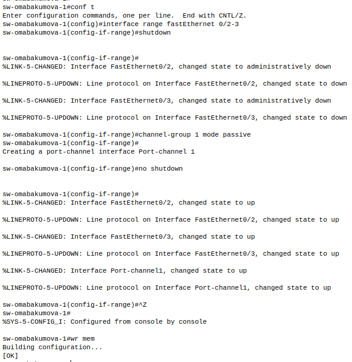{#fig:019 width=80%}

{#fig:020 width=80%}

Посмотрим на то, согласовался ли канал (рис. [-@fig:021]):

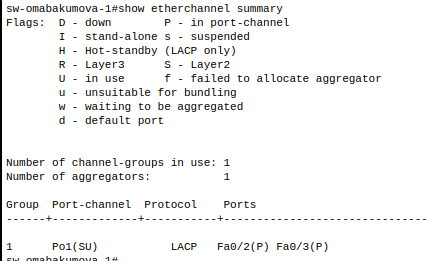{#fig:021 width=80%}

Здесь видно группу port-channel, используемый протокол, интерфейсы и их состояние. В данном случае параметр SU говорит о том, что выполнено агрегирование второго уровня и то, что этот интерфейс используется. А параметр P указывает, что интерфейсы в состоянии port-channel. 
Проверим и на нулевом коммутаторе (рис. [-@fig:022]):

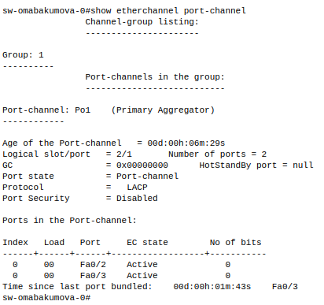{#fig:022 width=80%}

Видим, что есть такой port-channel и в нем присутствуют оба интерфейса.
 
В итоге можно отметить, что все линки зеленые и активные $\rightarrow$ STP на них не срабатывает (рис. [-@fig:023]):

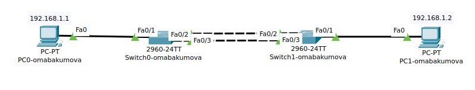{#fig:023 width=80%}

## PAgP

PAgP --- это проприетарный протокол агрегации каналов, разработанный **Cisco**, и применяется преимущественно в сетях с оборудованием этого производителя. В гетерогенных средах (с оборудованием разных вендоров) чаще используют **LACP**, так как он является стандартным (IEEE 802.3ad).  

Режимы работы PAgP:  

1. **Desirable** --- активно отправляет PAgP-сообщения, пытаясь установить агрегированное соединение.  

2. **Auto** --- работает пассивно и активирует PAgP только при получении соответствующих сообщений от соседнего устройства.  

: Совместимость режимов PAgP {#tbl:PAgP}

| Режим устройства 1 | Режим устройства 2 | Работает PAgP? |  
|-------------------|-------------------|----------------|  
| **Desirable**     | **Desirable**     | Да             |  
| **Desirable**     | **Auto**          | Да             |  
| **Auto**          | **Auto**          | Нет            |  

### Настройка PAgP

Перейдем к реализации простейшего примера настройки PAgP.Зайдем на нулевой коммутатор и начнем настройку PAgP с него (рис. [-@fig:024]):

{#fig:024 width=80%}

{#fig:025 width=80%} 

Перейдем ко первому коммутатору (рис. [-@fig:026]):

{#fig:026 width=80%}

{#fig:027 width=80%} 

Помним о выключенных интерфейсах на коммутаторе, поэтому возвращаемся на нулевой и включаем их (рис. [-@fig:028]):

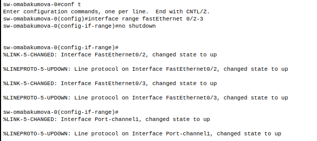{#fig:028 width=80%}

Все поднято, теперь посмотрим в целом результаты настройки на обоих коммутаторах (рис. [-@fig:029]):

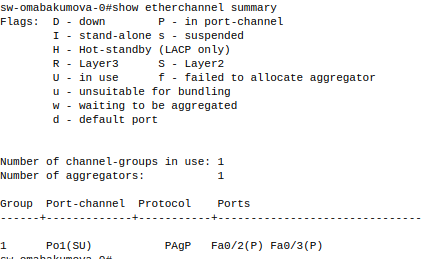{#fig:029 width=80%}

{#fig:030 width=80%}

## Ручное агрегирование

Ручное агрегирование --- это метод объединения нескольких физических интерфейсов в один логический канал **без использования протоколов динамического согласования** (таких как LACP или PAgP). Все настройки задаются администратором вручную на каждом устройстве.

Особенности:

- **Отсутствие автоматической проверки** --- нет механизмов контроля состояния канала и согласования параметров между устройствами;

- **Требуется идентичность настроек** --- скорость, дуплекс, VLAN и другие параметры интерфейсов должны совпадать на обоих концах соединения;

- **Минимальная совместимость** --- работает только при явном указании режима агрегирования на обоих устройствах.

: Совместимость режимов {#tbl:Static Link Aggregation}

| Режим устройства 1 | Режим устройства 2 | Работает агрегирование? |
|--------------------|--------------------|--------------------------|
| On (Включено)      | On (Включено)      | Да                       |
| Любой другой режим | Любой другой режим | Нет                      |

### Настройка ручного агрегирования

Перейдем к настройке ручного агрегирования [@kulyabov2017].Аналогично заходим на нулевой коммутатор для начала (рис. [-@fig:031]):

{#fig:031 width=80%}

{#fig:032 width=80%} 

Аналогичную настройку проведем на первом коммутаторе (рис. [-@fig:033]):

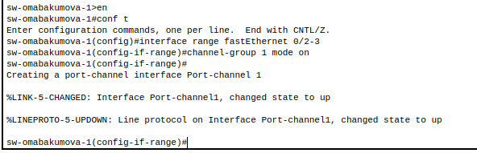{#fig:033 width=80%}

{#fig:034 width=80%} 

При ручном агрегировании в поле протокола указывается "-", что означает отсутствие каких-либо дополнительных протоколов согласования (LACP/PAgP). Все настройки задаются администратором вручную.

Все методы агрегирования действительно отличаются лишь небольшими нюансами в настройке. Выбор конкретного способа зависит от требований к надежности и возможностей сетевого оборудования.

# Выводы

Были изучены принципы работы протокола STP (Spanning Tree Protocol) и технологий агрегирования каналов.

# Список литературы{.unnumbered}

::: {#refs}
:::


