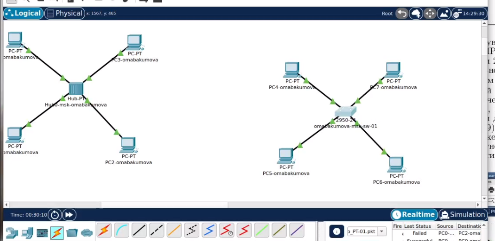

---
## Front matter
title: "Лабораторная работа № 1. Знакомство с Cisco Packet Tracer"
author: "Абакумова Олеся Максимовна, НФИбд-02-22"

## Generic otions
lang: ru-RU
toc-title: "Содержание"

## Bibliography
bibliography: bib/cite.bib
csl: pandoc/csl/gost-r-7-0-5-2008-numeric.csl

## Pdf output format
toc: true # Table of contents
toc-depth: 2
lof: true # List of figures
lot: true # List of tables
fontsize: 12pt
linestretch: 1.5
papersize: a4
documentclass: scrreprt
## I18n polyglossia
polyglossia-lang:
  name: russian
  options:
	- spelling=modern
	- babelshorthands=true
polyglossia-otherlangs:
  name: english
## I18n babel
babel-lang: russian
babel-otherlangs: english
## Fonts
mainfont: IBM Plex Serif
romanfont: IBM Plex Serif
sansfont: IBM Plex Sans
monofont: IBM Plex Mono
mathfont: STIX Two Math
mainfontoptions: Ligatures=Common,Ligatures=TeX,Scale=0.94
romanfontoptions: Ligatures=Common,Ligatures=TeX,Scale=0.94
sansfontoptions: Ligatures=Common,Ligatures=TeX,Scale=MatchLowercase,Scale=0.94
monofontoptions: Scale=MatchLowercase,Scale=0.94,FakeStretch=0.9
mathfontoptions:
## Biblatex
biblatex: true
biblio-style: "gost-numeric"
biblatexoptions:
  - parentracker=true
  - backend=biber
  - hyperref=auto
  - language=auto
  - autolang=other*
  - citestyle=gost-numeric
## Pandoc-crossref LaTeX customization
figureTitle: "Рис."
tableTitle: "Таблица"
listingTitle: "Листинг"
lofTitle: "Список иллюстраций"
lotTitle: "Список таблиц"
lolTitle: "Листинги"
## Misc options
indent: true
header-includes:
  - \usepackage{indentfirst}
  - \usepackage{float} # keep figures where there are in the text
  - \floatplacement{figure}{H} # keep figures where there are in the text
---

# Цель работы

Установка инструмента моделирования конфигурации сети Cisco Packet
Tracer, знакомство с его интерфейсом.

# Теоретическое введение

Packet Tracer — интегрированная обучающая среда моделирования и визуа-
лизации сети устройств и протоколов, выпускаемый фирмой Cisco Systems.
С помощью данного симулятора можно строить модели сетей передачи данных,
изучать настройки и принципы функционирования сетевого оборудования
производителя, проводить диагностику работоспособности моделируемой сети.

# Задание

1. Установить на домашнем устройстве Cisco Packet Tracer.
2. Постройте простейшую сеть в Cisco Packet Tracer, проведите простейшую
настройку оборудования.

# Выполнение лабораторной работы

Предварительно установив на свою систему CIsco Packet Tracer,создадим новый проект lab_PT-01.pkt.

В рабочем пространстве разместим концентратор (Hub-PT) и четыре оконечных устройства PC. Соединим оконечные устройства с концентратором прямым кабелем. Щёлкнув последовательно на каждое оконечном устройстве, зададим статические IP-адреса 192.168.1.11, 192.168.1.12,
192.168.1.13, 192.168.1.14 с маской подсети 255.255.255.0 (рис. [-@fig:001]):

{#fig:001 width=70%}

{#fig:002 width=70%}

В основном окне проекта перейдем из режима реального времени (Realtime) в режим моделирования (Simulation). Выберем на панели инструментов мышкой «Add Simple PDU (P)» и щёлкним сначала на PC0, затем на PC2.
В рабочей области должны появились два конверта, обозначающих пакеты, в списке событий на панели моделирования должны будут появиться
два события, относящихся к пакетам ARP и ICMP соответственно.
На панели моделирования нажмем кнопку «Play» и проследим за движением пакетов ARP и ICMP от устройства PC0 до устройства PC2 и обратно.
Передача пакета начинается с отправки на концентратор, который широковещательно распространяет его по всей сети. При этом, только узел, соответствующий адресу назначения, обрабатывает данный пакет (рис. [-@fig:003]):

{#fig:003 width=70%}

Щёлкнув на строке события, откроем окно информации о PDU и изучим, что происходит на уровне модели OSI при перемещении пакета.
Используя кнопку «Проверь себя» (Challenge Me) на вкладке OSI Model, ответим на вопросы (рис. [-@fig:004]):

{#fig:004 width=70%}

Исходный пакет PDU включает два основных заголовка: IP и ICMP. IP-заголовок содержит адреса источника и назначения, а ICMP-заголовок – тип сообщения ICMP, код, контрольную сумму, идентификатор и порядковый номер. Эти компоненты остаются неизменными на протяжении всей передачи.
К PDU добавляется Ethernet-кадр. Его структура включает: синхронизирующую преамбулу (7 байт), поле SFD, 6-байтовые адреса назначения и источника (Ethernet), поле Type, определяющее протокол верхнего уровня, и 4-байтовую контрольную последовательность FCS для проверки ошибок.

Структура MAC-адреса, например, 0001.63D5.66AA (адрес PC1) и 0009.7C8E.844B (адрес PC2), состоит из двух частей. Первые три байта указывают на производителя оборудования (в этом примере CISCO), а оставшиеся три байта – на уникальный идентификатор устройства:

{#fig:005 width=70%}

Очистим список событий, удалив сценарий моделирования. Выберем на панели инструментов мышкой «Add Simple PDU (P)» и щёлкнем сначала на PC0, затем на PC2. Снова выберем на панели инструментов мышкой «Add Simple PDU (P)» и щёлкнем сначала на PC2, затем на PC0. На панели
моделирования нажмем кнопку «Play» и проследим за возникновением коллизии. В списке событий посмотрим информацию о PDU (рис. [-@fig:006]):

{#fig:006 width=70%}

{#fig:007 width=70%}

Процесс передачи показывает, что пакеты сначала поступают на концентратор, где возникает коллизия в связи с ограничением на одновременную передачу нескольких сообщений. В первом пакете отсутствует информация, относящаяся к PDU, в то время как второй пакет в принципе не должен содержать этих данных. В результате коллизии, второй пакет теряется, а первый пакет, с неполной информацией, широковещательно рассылается, что приводит к возникновению ошибки при обработке.

Перейдем в режим реального времени (Realtime). В рабочем пространстве разместим коммутатор (например Cisco 2950-24) и 4 оконечных устройства PC. Соединим оконечные устройства с коммутатором прямым кабелем. Щёлкнув последовательно на каждом оконечном устройстве, зададим статические IP-адреса 192.168.1.21, 192.168.1.22, 192.168.1.23, 192.168.1.24 с маской подсети 255.255.255.0. (рис. [-@fig:008]):

{#fig:008 width=70%}

В основном окне проекта перейдем из режима реального времени (Realtime) в режим моделирования (Simulation). Выберем на панели инструментов мышкой «Add Simple PDU (P)» и щёлкним сначала на PC4, затем на PC6. В рабочей области появились два конверта, обозначающих пакеты, в списке событий на панели моделирования появились два события, относящихся к пакетам ARP и ICMP соответственно. На панели моделирования нажмем кнопку «Play» и проследим за движением пакетов ARP и ICMP от устройства PC4 до устройства PC6 и обратно.  (рис. [-@fig:009]):

{#fig:009 width=70%}

Аналогично принципу работы с концентратором, пакеты ARP изначально широковещательно рассылаются всем конечным устройствам сети. Однако, только целевой компьютер, которому адресован данный пакет, принимает его. Ответный ARP-пакет, напротив, не рассылается всем узлам, а направляется непосредственно к ПК6, поскольку маршрут уже известен.

В начале передачи, пакет данных (PDU) содержит только IP-заголовок, включающий информацию об IP-адресах отправителя и получателя, а также ICMP-заголовок. ICMP-заголовок содержит сведения о типе пакета ICMP, коде, контрольной сумме, идентификаторе и порядковом номере. Эти заголовки не изменяются в процессе передачи.

Затем добавляется Ethernet-кадр. Он включает преамбулу (7 байт) для синхронизации, поле SFD, адрес назначения (Ethernet-адрес получателя, 6 байт), адрес источника (Ethernet-адрес отправителя, 6 байт), поле Type, указывающее тип протокола верхнего уровня, и поле FCS (4 байта) для проверки целостности кадра.

Пакет передается на коммутатор, в заголовке которого указаны MAC-адреса, определяющие, что передача осуществляется от ПК4 к ПК6. Структура MAC-адреса, например 0003.E4A1.6BED (адрес ПК4) и 0090.2170.B525 (адрес ПК6), показывает, что первые три байта идентифицируют производителя (в данном случае CISCO), а последующие три байта – уникальный идентификатор устройства (рис. [-@fig:010]):

{#fig:010 width=70%}

Очистим список событий, удалив сценарий моделирования. Выберем на панели инструментов мышкой «Add Simple PDU (P)» и щёлкнем сначала на PC4, затем на PC6. Снова выберем на панели инструментов мышкой «Add Simple PDU (P)» и щёлкнем сначала на PC6, затем на PC4. На панели моделирования нажмем кнопку «Play» и проследим за движением
пакетов. 
Коллизия не возникает, потому что пакет не отправляется всем устройствам, а расходится по нужным назначениям коммутатором (рис. [-@fig:011]):

{#fig:011 width=70%}

Перейдем в режим реального времени (Realtime). В рабочем пространстве соединим кроссовым кабелем концентратор и коммутатор. Перейдем в режим моделирования (Simulation). Очистим список событий, удалив сценарий моделирования. Выберем на панели инструментов мышкой «Add Simple PDU (P)» и щёлкнем сначала на PC0, затем на PC4. Снова выберем на панели инструментов мышкой «Add Simple PDU (P)» и щёлкнем сначала на PC4, затем на PC0. На панели моделирования нажмем кнопку «Play» и проследим за движением пакетов (рис. [-@fig:012]):

{#fig:012 width=70%}

{#fig:013 width=70%}

Наблюдается, что пакет, переданный из сети с применением хаба, не достигает адресата, что соответствует предыдущим наблюдениям. В то же время пакет, переданный через сеть с коммутатором, успешно доставляется в пункт назначения. Данное различие объясняется способностью коммутатора функционировать в режиме полного дуплекса, обеспечивая одновременный обмен данными в обоих направлениях и потенциально удваивая пропускную способность соединения.

Очистим список событий, удалив сценарий моделирования. На панели моделирования нажмием «Play» и в списке событий получим пакеты STP. Исследуем структуру STP. 
получим в качестве результата запуск аниматора nam в фоновом режиме.

Заголовок STP (Spanning Tree Protocol) состоит из нескольких полей. Первым идет идентификатор протокола (Protocol Identifier), который занимает 2 байта и всегда равен нулю. Затем следует версия протокола STP (Protocol Version Identifier) — это поле размером 1 байт, значение которого также всегда равно «0». Далее идет тип BPDU (BPDU Type), занимающий 1 байт, который принимает значение «0» для конфигурационного BPDU (CBPDU) и «1» для TCN BPDU. Если говорить о конфигурационном BPDU, то в нем содержится несколько важных полей: флаги (Flags) — 1 байт, который используется для обозначения изменений в топологии и подтверждения топологии, идентификатор корневого моста (Root Identifier), который содержит информацию о корневом коммутаторе, включая его приоритет и MAC-адрес. Также имеется расстояние до корневого моста (Root Path Cost), где указывается общая стоимость пути до корневого коммутатора. Идентификатор моста (Bridge Identifier) включает данные коммутатора-отправителя, такие как приоритет и MAC-адрес. Идентификатор порта (Port Identifier) содержит идентификатор порта, через который отправляется этот BPDU. Поле времени жизни сообщения (Message Age) содержит временной интервал в секундах, необходимый для определения устаревших кадров и их отбрасывания. Максимальное время жизни сообщения (Max Age) отвечает за максимальное время существования сообщения; если оно превышено, кадр отбрасывается. Время приветствия (Hello Time) — это временной интервал, через который коммутатор отправляет BPDU кадры, по умолчанию составляет 2 секунды. Задержка смены состояний (Forward Delay) указывает, сколько секунд порт коммутатора будет находиться в состоянии прослушивания и обучения. Структура Ethernet-кадра в этих пакетах имеет тип 802.3 и включает преамбулу, а также MAC-адреса источника и назначения и длину. Структура MAC-адресов остается неизменной (рис. [-@fig:014]):

{#fig:014 width=70%}

Перейдем в режим реального времени (Realtime). В рабочем пространстве добавим маршрутизатор (например, Cisco 2811). Соединим прямым кабелем коммутатор и маршрутизатор. Щёлкнем на маршрутизаторе и на вкладке его конфигурации пропишем статический IP-адрес 192.168.1.254 с маской 255.255.255.0, активируем порт, поставив галочку «On» напротив «Port Status» (рис. [-@fig:015]):

{#fig:015 width=70%}

{#fig:016 width=70%}

Перейдем в режим моделирования (Simulation). Очистим список событий, удалив сценарий моделирования. Выберем на панели инструментов мышкой «Add Simple PDU (P)» и щёлкнем сначала на PC3, затем на маршрутизаторе. На панели моделирования нажмем кнопку «Play» и проследим
за движением пакетов ARP, ICMP, STP и CDP.

Сначала посылаются пакеты ARP, затем ICMP. В сети с хабом рассылка идет по всем устройствам, а в сети с коммутатором только к пункту назначения. После получения пакета идет идет рассылка STP пакетов всем устройствам сети. Затем появляются пакеты DTP, а потом уже появляются пакеты CDP(англ. Cisco Discovery Protocol) — проприетарный протокол второго уровня, разработанный компанией Cisco Systems (рис. [-@fig:017]):

{#fig:017 width=70%}

Давайте рассмотрим структуру пакета CDP. 

- Поле "Version" указывает на версию используемого протокола CDP и всегда имеет значение 0x01.
- Поле "Time-to-Live" (TTL) определяет время в секундах, в течение которого получатель должен сохранять данные, содержащиеся в пакете CDP.
- Поле "Checksum" включает стандартную контрольную сумму, используемую в протоколе IP.
- Поле "Type" обозначает тип тройки type/length/value.
- Поле "Length" указывает общую длину в байтах для полей type, length и value.
- Поле "Value" содержит данные, которые зависят от значения поля Type.
- Структура кадра Ethernet 802.3 совпадает с таковой в пакетах STP, и mac-адреса остаются неизменными.

# Контрольные вопросы 

1. Дайте определение следующим понятиям: концентратор, коммутатор, маршрутизатор, шлюз (gateway). В каких случаях следует использовать тот или иной тип сетевого оборудования?  
   Ответ:  
   - Концентратор — устройство, соединяющее несколько компьютеров в одной локальной сети, передавая данные ко всем подключённым устройствам. Используется в небольших сетях.  
   - Коммутатор — устройство, которое передаёт данные только на конкретный порт, к которому подключён нужный узел, что увеличивает эффективность сети. Рекомендуется для средних и крупных сетей.  
   - Маршрутизатор — устройство, направляющее пакеты данных между различными сетями, используя IP-адреса. Используется для соединения локальной сети с интернетом или другими сетями.  
   - Шлюз (gateway) — устройство, служащее точкой доступа между различными сетевыми протоколами или архитектурами. Применяется для соединения сетей с различными протоколами.

2. Дайте определение следующим понятиям: ip-адрес, сетевая маска, broadcast-адрес.  
   Ответ:  
   - IP-адрес — уникальный адрес, присвоенный каждому устройству в сети, используемый для идентификации и адресации данных.  
   - Сетевая маска — параметр, который определяет, какая часть IP-адреса относится к сети, а какая — к узлу.  
   - Broadcast-адрес — адрес, используемый для отправки данных всем устройствам в сети, позволяя передавать сообщения всем узлам одновременно.

3. Как можно проверить доступность узла сети?  
   Ответ: Для проверки доступности узла сети можно использовать команду ping, которая отправляет ICMP-запросы на указанный IP-адрес и ожидает ответа. Если узел доступен, он отправляет ответ, что подтверждает его работоспособность.
   
# Выводы

Во время выполнения данной лабораторной работы я научилась пользоваться инструментом моделирования конфигурации сети Cisco PacketTracer, познакомилась с его интерфейсом.

