---
## Front matter
lang: ru-RU
title: Лабораторная работа № 10. Настройка списков управления доступом (ACL)
author:
  - Абакумова О. М.
institute:
  - Российский университет дружбы народов, Москва, Россия


## i18n babel
babel-lang: russian
babel-otherlangs: english

## Formatting pdf
toc: false
toc-title: Содержание
slide_level: 2
aspectratio: 169
section-titles: true
theme: metropolis
header-includes:
 - \metroset{progressbar=frametitle,sectionpage=progressbar,numbering=fraction}
mainfont: Open Sans Light
---

# Информация

## Докладчик

:::::::::::::: {.columns align=center}
::: {.column width="70%"}

  * Абакумова Олеся Максимовна
  * Студентка
  * Российский университет дружбы народов
  * 1132220832@pfur.ru
  * <https://github.com/omabakumova>

:::
::: {.column width="30%"}


:::
::::::::::::::

# Цель работы

Освоить настройку прав доступа пользователей к ресурсам сети.


# Задание

1. Требуется настроить следующие правила доступа:
- web-сервер: разрешить доступ всем пользователям по протоколу HTTP
через порт 80 протокола TCP, а для администратора открыть доступ
по протоколам Telnet и FTP;
- файловый сервер: с внутренних адресов сети доступ открыт по портам
для общедоступных каталогов, с внешних — доступ по протоколу FTP;
- почтовый сервер: разрешить пользователям работать по протоколам
SMTP и POP3 (соответственно через порты 25 и 110 протокола TCP),
а для администратора — открыть доступ по протоколам Telnet и FTP;
- DNS-сервер: открыть порт 53 протокола UDP для доступа из внутренней сети;
- разрешить icmp-сообщения, направленные в сеть серверов;


## Задание

- разрешить доступ в сеть управления сетевым оборудованием только
администратору сети.
- запретить для сети Other любые запросы за пределы сети, за исключением администратора;

2. Требуется проверить правильность действия установленных правил доступа.
3. Требуется выполнить задание для самостоятельной работы по настройке
прав доступа администратора сети на Павловской.
4. При выполнении работы необходимо учитывать соглашение об именовании.

# Выполнение лабораторной работы

## Ошибки предыдущей лабораторной работы

{#fig:001 width=40%}

## Ошибки предыдущей лабораторной работы

{#fig:002 width=40%}

## Ошибки предыдущей лабораторной работы

{#fig:003 width=40%}

## Ошибки предыдущей лабораторной работы

{#fig:004 width=40%}

## Настройка правил доступа

{#fig:005 width=40%}

## Настройка правил доступа

{#fig:006 width=40%}

## Настройка правил доступа

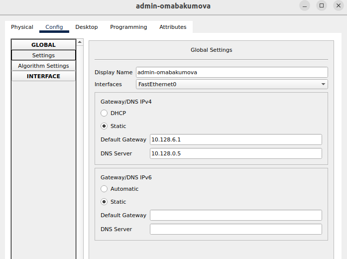{#fig:007 width=40%}

## Настройка правил доступа

{#fig:008 width=25%} 

## Настройка правил доступа

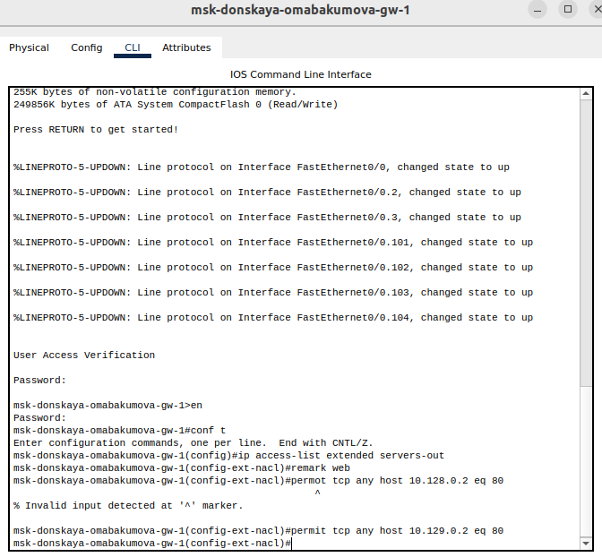{#fig:009 width=40%}

## Настройка правил доступа

{#fig:010 width=40%}

## Настройка правил доступа

```
msk-donskaya-omabakumova-gw-1# configure terminal
msk-donskaya-gw-1(config)# interface f0 /0.3
msk-donskaya-gw-1(config-subif)# ip access-group servers-out out

```

## Настройка правил доступа

{#fig:011 width=40%}

## Настройка правил доступа

{#fig:012 width=40%}

## Настройка правил доступа

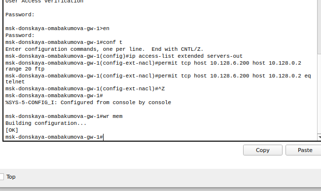{#fig:013 width=40%}

## Настройка правил доступа

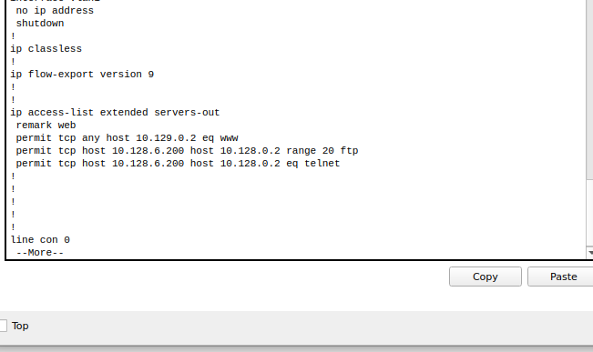{#fig:014 width=40%}

## Настройка правил доступа

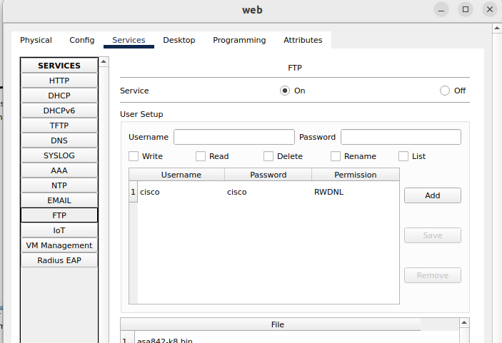{#fig:015 width=40%}

## Настройка правил доступа

{#fig:016 width=40%}

## Настройка правил доступа

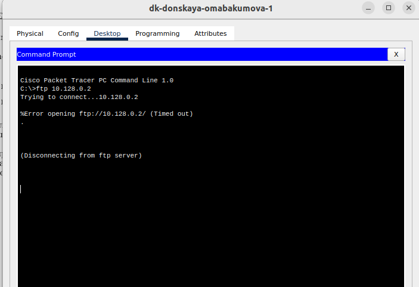{#fig:017 width=40%}

## Настройка правил доступа

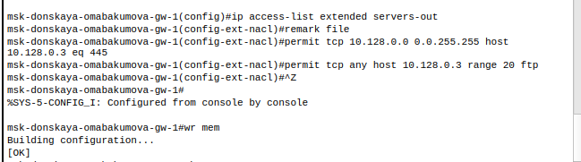{#fig:018 width=40%}

## Настройка правил доступа

{#fig:019 width=40%}

## Настройка правил доступа

{#fig:020 width=40%}

## Настройка правил доступа

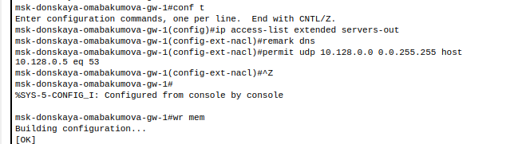{#fig:021 width=40%}

## Настройка правил доступа

{#fig:022 width=40%}

## Настройка правил доступа

{#fig:023 width=40%}

## Настройка правил доступа

{#fig:024 width=40%}

## Настройка правил доступа

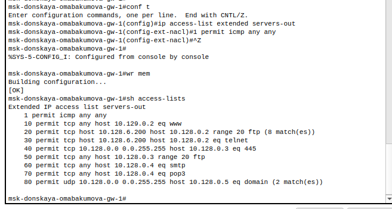{#fig:025 width=40%}

## Настройка правил доступа

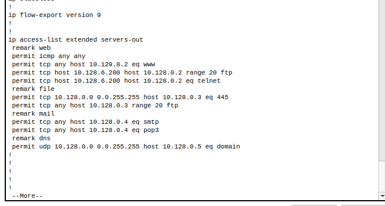{#fig:026 width=40%}

## Настройка правил доступа

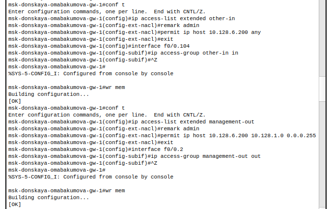{#fig:027 width=40%}

## Самостоятельная работа

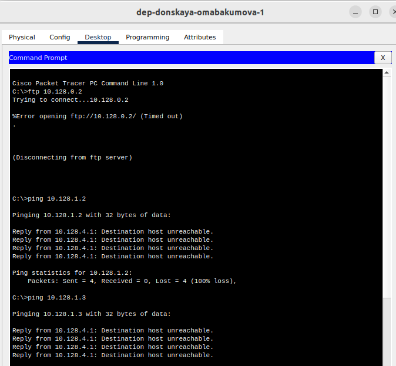{#fig:028 width=40%}

## Самостоятельная работа

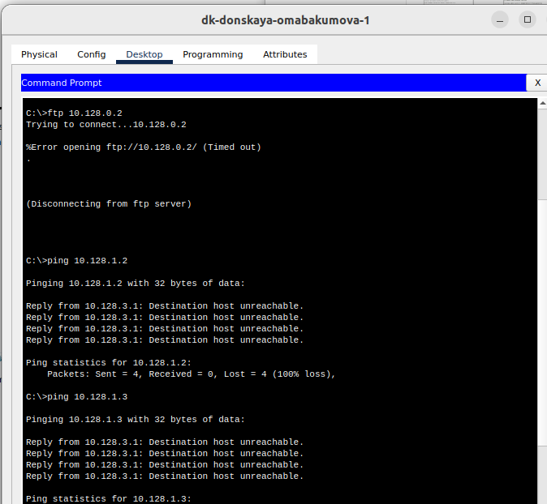{#fig:029 width=40%}

## Самостоятельная работа

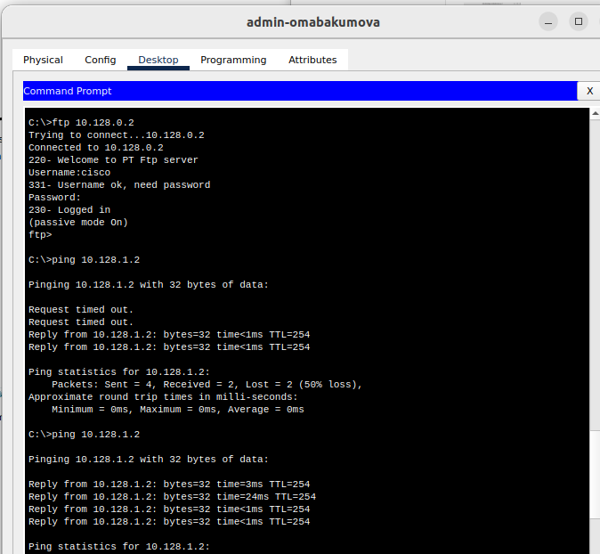{#fig:030 width=40%}

## Самостоятельная работа

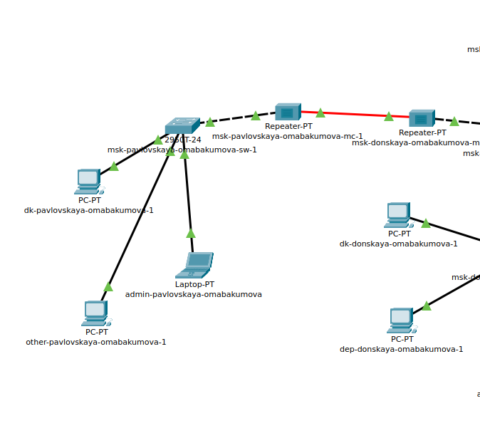{#fig:031 width=40%}

## Самостоятельная работа

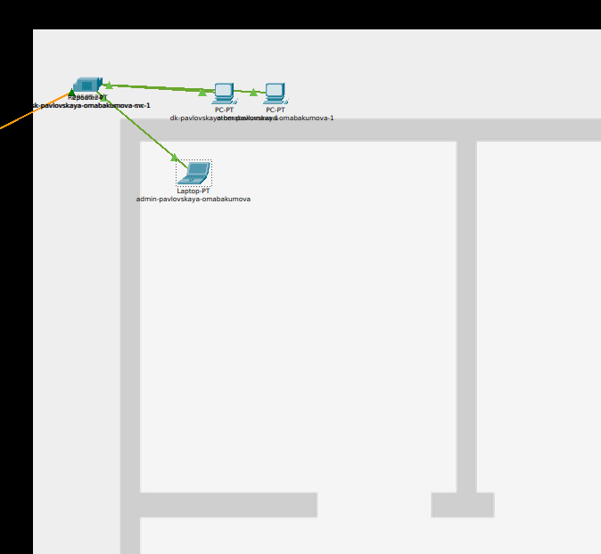{#fig:032 width=40%}

## Самостоятельная работа

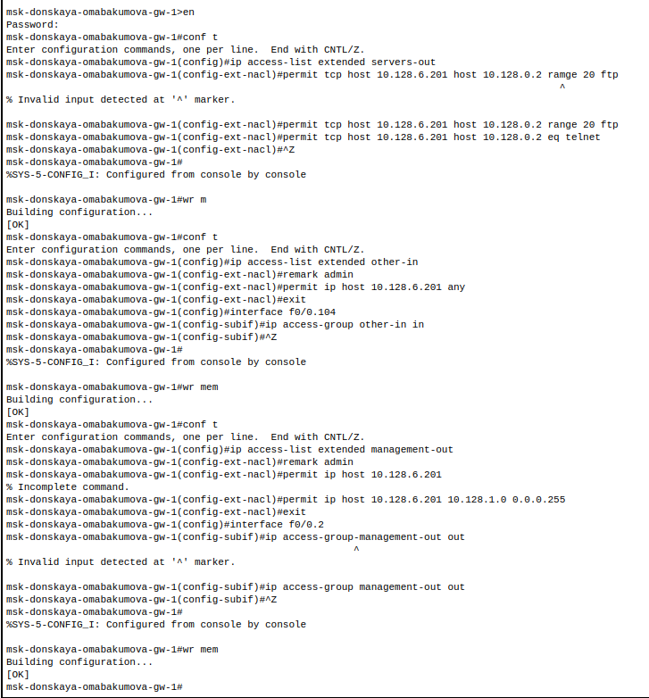{#fig:033 width=40%}

## Самостоятельная работа

{#fig:034 width=40%}

## Самостоятельная работа

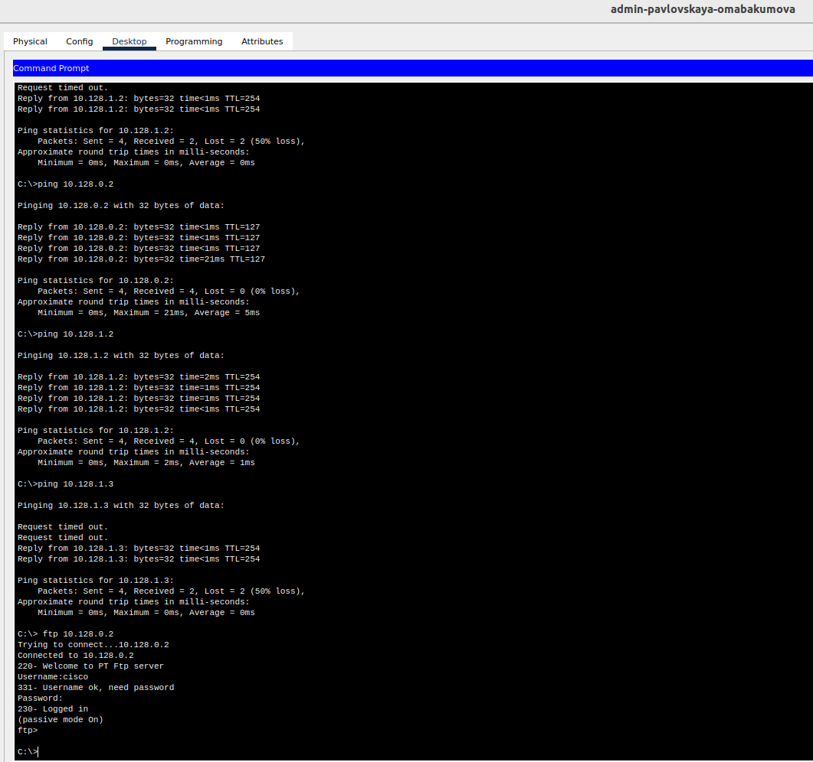{#fig:035 width=40%}

## Web Browser

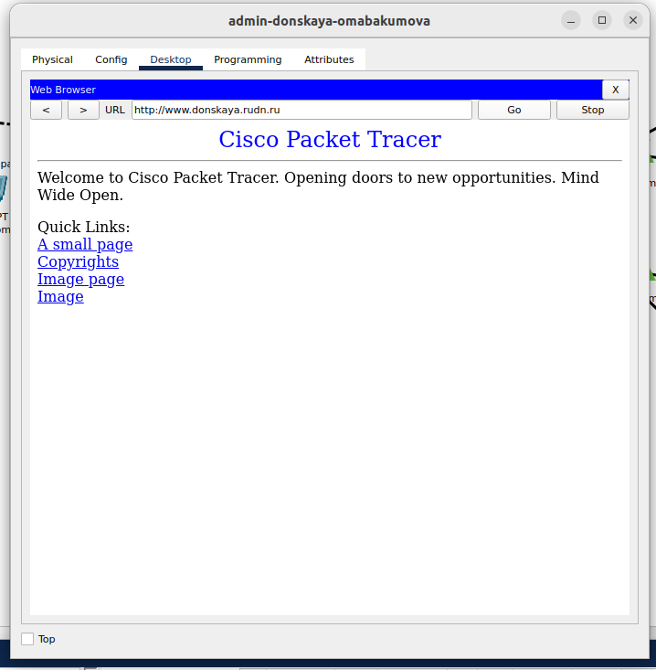{#fig:036 width=40%}

## Web Browser

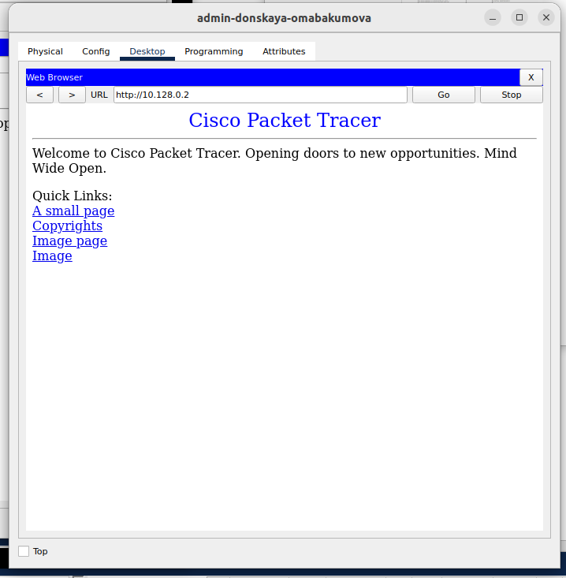{#fig:037 width=40%}

# Выводы

Во время выполнения данной лабораторной работы я освоила настройку прав доступа пользователей к ресурсам сети.

