---
## Front matter
title: "Лабораторная работа № 10. Настройка списков управления доступом (ACL)"
author: "Абакумова Олеся Максимовна, НФИбд-02-22"

## Generic otions
lang: ru-RU
toc-title: "Содержание"

## Bibliography
bibliography: bib/cite.bib
csl: pandoc/csl/gost-r-7-0-5-2008-numeric.csl

## Pdf output format
toc: true # Table of contents
toc-depth: 2
lof: true # List of figures
lot: true # List of tables
fontsize: 12pt
linestretch: 1.5
papersize: a4
documentclass: scrreprt
## I18n polyglossia
polyglossia-lang:
  name: russian
  options:
	- spelling=modern
	- babelshorthands=true
polyglossia-otherlangs:
  name: english
## I18n babel
babel-lang: russian
babel-otherlangs: english
## Fonts
mainfont: IBM Plex Serif
romanfont: IBM Plex Serif
sansfont: IBM Plex Sans
monofont: IBM Plex Mono
mathfont: STIX Two Math
mainfontoptions: Ligatures=Common,Ligatures=TeX,Scale=0.94
romanfontoptions: Ligatures=Common,Ligatures=TeX,Scale=0.94
sansfontoptions: Ligatures=Common,Ligatures=TeX,Scale=MatchLowercase,Scale=0.94
monofontoptions: Scale=MatchLowercase,Scale=0.94,FakeStretch=0.9
mathfontoptions:
## Biblatex
biblatex: true
biblio-style: "gost-numeric"
biblatexoptions:
  - parentracker=true
  - backend=biber
  - hyperref=auto
  - language=auto
  - autolang=other*
  - citestyle=gost-numeric
## Pandoc-crossref LaTeX customization
figureTitle: "Рис."
tableTitle: "Таблица"
listingTitle: "Листинг"
lofTitle: "Список иллюстраций"
lotTitle: "Список таблиц"
lolTitle: "Листинги"
## Misc options
indent: true
header-includes:
  - \usepackage{indentfirst}
  - \usepackage{float} # keep figures where there are in the text
  - \floatplacement{figure}{H} # keep figures where there are in the text
---

# Цель работы

Освоить настройку прав доступа пользователей к ресурсам сети.

# Задание

1. Требуется настроить следующие правила доступа:
- web-сервер: разрешить доступ всем пользователям по протоколу HTTP
через порт 80 протокола TCP, а для администратора открыть доступ
по протоколам Telnet и FTP;
- файловый сервер: с внутренних адресов сети доступ открыт по портам
для общедоступных каталогов, с внешних — доступ по протоколу FTP;
- почтовый сервер: разрешить пользователям работать по протоколам
SMTP и POP3 (соответственно через порты 25 и 110 протокола TCP),
а для администратора — открыть доступ по протоколам Telnet и FTP;
- DNS-сервер: открыть порт 53 протокола UDP для доступа из внутренней сети;
- разрешить icmp-сообщения, направленные в сеть серверов;
- запретить для сети Other любые запросы за пределы сети, за исключением администратора;
- разрешить доступ в сеть управления сетевым оборудованием только
администратору сети.
2. Требуется проверить правильность действия установленных правил доступа.
3. Требуется выполнить задание для самостоятельной работы по настройке
прав доступа администратора сети на Павловской.
4. При выполнении работы необходимо учитывать соглашение об именовании.

# Выполнение лабораторной работы
## Ошибки предыдущей лабораторной работы
В связи с не совсеим правильно настройко агрегирования каналов с оконечного устройства при проверке доступности были получены неутешительные результаты (рис. [-@fig:001]):

{#fig:001 width=80%}

Эти сообщения об ошибках говорят о том, что порт Fa0/23 не может быть добавлен в EtherChannel (агрегированный канал) из-за несовместимости с портами Fa0/20, Fa0/21 и Fa0/22. Ключевая причина несовместимости указана в сообщении: dtp mode of Fa0/23 is off, Fa0/20is on и т.д.
Чтобы добавить Fa0/23 в EtherChannel, необходимо привести его конфигурацию в соответствие с остальными портами.Я решила данную проблему отключением и включением DTP так, как исходя из уведомлений именно с ним возникали разногласия.После достижения верной конфигурации у всех инерфейсов пинг стал проходить!(рис. [-@fig:002]):

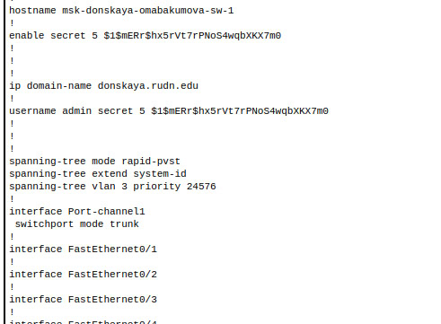{#fig:002 width=80%}

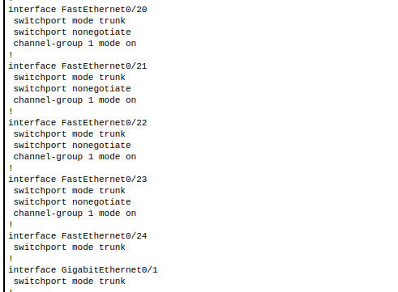{#fig:003 width=80%}

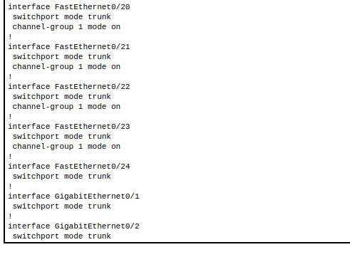{#fig:004 width=80%}

После небольшого важного отступления,можно вернуться к выполнению текущей 
лабораторной работы.
В рабочей области проекта подключим ноутбук администратора с именем
admin к сети к other-donskaya-1 с тем, чтобы разрешить ему потом любые
действия, связанные с управлением сетью. Для этого подсоединим ноутбук
к порту 24 коммутатора msk-donskaya-sw-4 и присвоим ему статический
адрес 10.128.6.200, указав в качестве gateway-адреса 10.128.6.1 и адреса
DNS-сервера 10.128.0.5 (рис. [-@fig:005]):

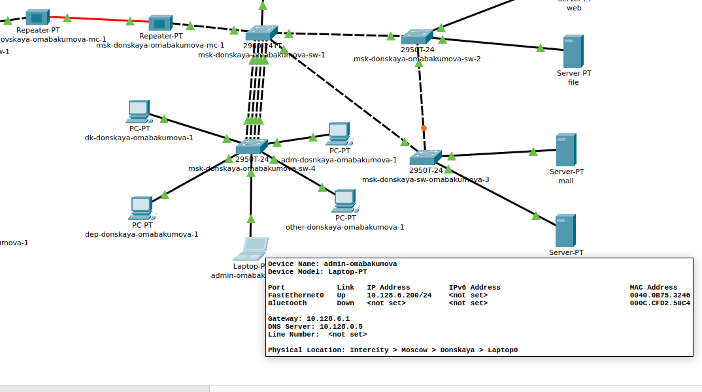{#fig:005 width=80%}

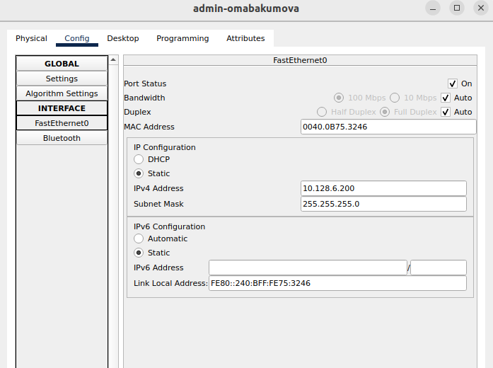{#fig:006 width=80%}

{#fig:007 width=80%}

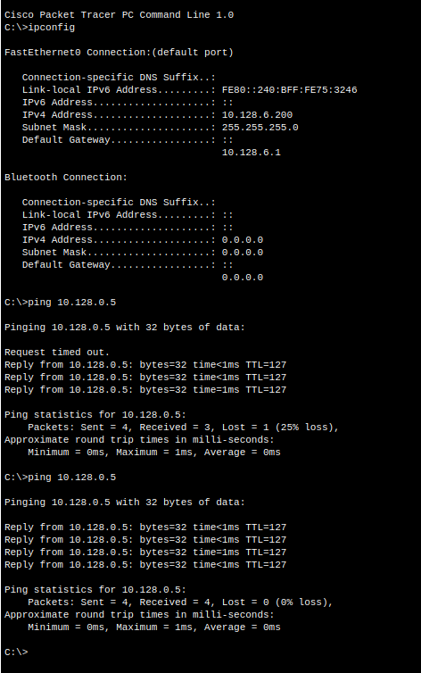{#fig:008 width=80%} 

Права доступа пользователей сети будем настраивать на маршрутизаторе msk-donskaya-omabakumova-gw-1, поскольку именно через него проходит весь
трафик сети. Ограничения можно накладывать как на входящий (in), так и на
исходящий (out) трафик. По отношению к маршрутизатору накладываемые
ограничения будут касаться в основном исходящего трафика.
Различают стандартные (standard) и расширенные (extended) списки кон-
троля доступа (Access Control List, ACL). Стандартные ACL проверяют только
адрес источника трафика, расширенные --- адрес как источника, так и получателя, тип протокола 
и TCP/UDP порты.
Следует помнить, что на оборудовании Cisco правила в списке доступа
проверяются по порядку сверху вниз до первого совпадения --- как только
одно из правил сработало, проверка списка правил прекращается и обработка
трафика происходит на основе сработавшего правила. Поэтому рекомендуется
сначала дать разрешение (permit) на какое-то действие, а уже потом накладывать ограничения (deny). Кроме того, после всех правил в конце дописывается
неявное запрещение на всё, что не разрешено: deny ip any any (implicit deny).
Настроим доступ к web-серверу по порту tcp 80 (рис. [-@fig:009]):

{#fig:009 width=80%}

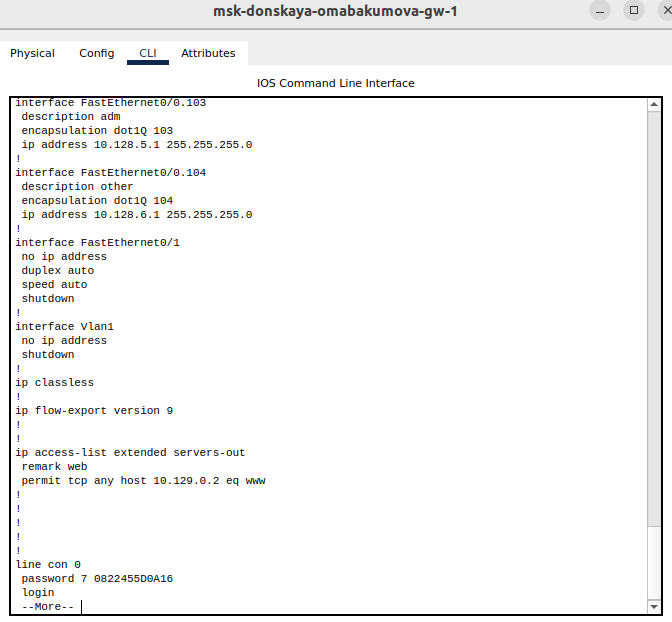{#fig:010 width=80%}

Здесь: создан список контроля доступа с названием servers-out (так как
предполагается ограничить доступ в конкретные подсети и по отношению к маршрутизатору 
это будет исходящий трафик); указано (в качестве
комментария-напоминания remark web), что ограничения предназначены
для работы с web-сервером; дано разрешение доступа (permit) по прото-
колу TCP всем (any) пользователям сети (host) на доступ к web-серверу,
имеющему адрес 10.128.0.2, через порт 80.
Также необходимо добавить список управления доступом к интерфейсу,это выполняется с помощью следующих команд:

```
msk-donskaya-omabakumova-gw-1# configure terminal
msk-donskaya-gw-1(config)# interface f0 /0.3
msk-donskaya-gw-1(config-subif)# ip access-group servers-out out

```
Здесь: к интерфейсу f0/0.3 подключается список прав доступа servers-
out и применяется к исходящему трафику (out).ping будет демонстрировать недоступность web-сервера как по имени, так и по ip-адресу web-сервера.
Можно проверить, что доступ к web-серверу есть через протокол HTTP
(введя в строке браузера хоста ip-адрес web-сервера). При этом команда ping будет демонстрировать недоступность web-сервера как по имени, так
и по ip-адресу web-сервера(рис. [-@fig:011]):

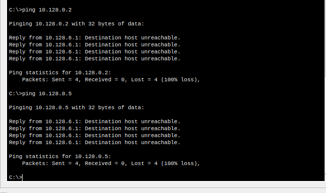{#fig:011 width=80%}

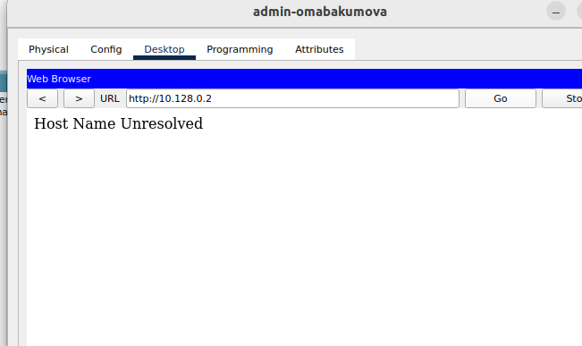{#fig:012 width=80%}

К сожалению разобраться с проблемой с Web Browser мне удалось только под конец лаборатрной работы,поэтому все проверки через Web Browser будут неудачными на данный момент :(
Настроим дополнительный доступ для администратора по протоколам Telnet и FTP (рис. [-@fig:013]):

{#fig:013 width=80%}

{#fig:014 width=80%}

Здесь: в список контроля доступа servers-out добавлено правило, разре-
шающее устройству администратора с ip-адресом 10.128.6.200 доступ на
web-сервер (10.128.0.2) по протоколам FTP и telnet.
Проверим дополнительно, что FTP поднят на серевере web (рис. [-@fig:015]):

{#fig:015 width=80%}

Убедимся, что с узла с ip-адресом 10.128.6.200 есть доступ по протоколу
FTP. Для этого в командной строке устройства администратора введем
ftp 10.128.0.2, а затем по запросу имя пользователя cisco и пароль cisco (рис. [-@fig:016]):

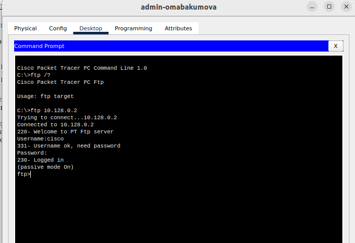{#fig:016 width=80%}

Попробуем провести аналогичную процедуру с другого устройства сети.
Убедимся, что доступ будет запрещён (рис. [-@fig:017]):

{#fig:017 width=80%}

Настроим доступ к файловому серверу (рис. [-@fig:018]):

{#fig:018 width=80%}

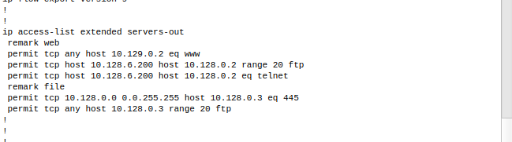{#fig:019 width=80%}

Здесь: в списке контроля доступа servers-out указано (в качестве
комментария-напоминания remark file), что следующие ограничения
предназначены для работы с file-сервером; всем узлам внутренней сети
(10.128.0.0) разрешён доступ по протоколу SMB (работает через порт 445
протокола TCP) к каталогам общего пользования; любым узлам разрешён
доступ к file-серверу по протоколу FTP. Запись 0.0.255.255 --- обратная
маска (wildcard mask).

Настроим доступ к почтовому серверу (рис. [-@fig:020]):

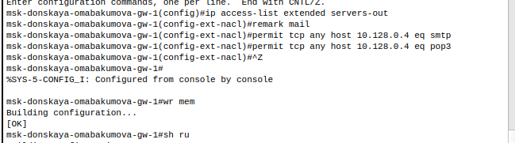{#fig:020 width=80%}

Здесь: в списке контроля доступа servers-out указано (в качестве
комментария-напоминания remark mail), что следующие ограничения
предназначены для работы с почтовым сервером; всем разрешён доступ
к почтовому серверу по протоколам POP3 и SMTP.
Настроим доступ к DNS-серверу (рис. [-@fig:021]):

{#fig:021 width=80%}

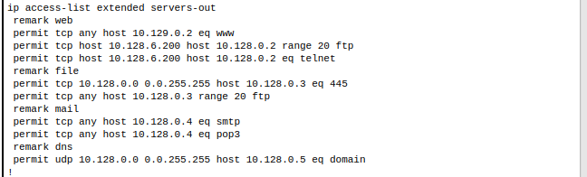{#fig:022 width=80%}

Здесь: в списке контроля доступа servers-out указано (в качестве
комментария-напоминания remark dns), что следующие ограничения предназначены для 
работы с DNS-сервером; всем узлам внутренней сети
разрешён доступ к DNS-серверу через UDP-порт 53.
Проверим доступность web-сервера (через браузер) не только по ip-адресу,
но и по имени.

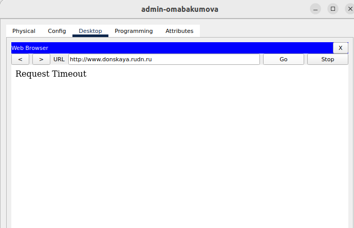{#fig:023 width=80%}

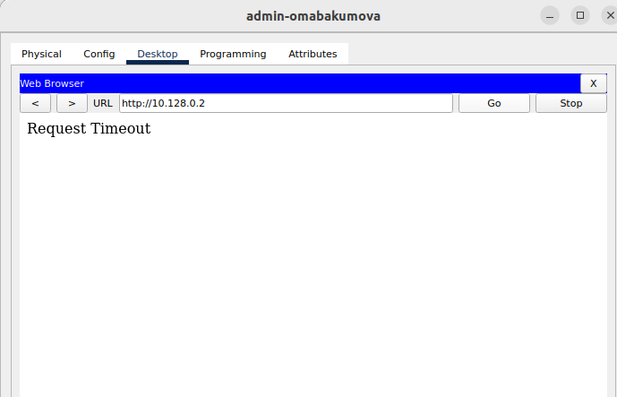{#fig:024 width=80%}

Разрешим  icmp-запросы (рис. [-@fig:025]):

{#fig:025 width=80%}

{#fig:026 width=80%}

Здесь демонстрируется явное управление порядком размещения правил ---правило разрешения для icmp-запросов добавляется в начало списка
контроля доступа.
Проведем настройку доступа для сети Other (требуется наложить ограничение на
исходящий из сети Other трафик, который по отношению к маршрутизатору
msk-donskaya-gw-1 является входящим трафиком,а также настройку доступа администратора к сети сетевого оборудования (рис. [-@fig:027]):

{#fig:027 width=80%}

В случае настройки доступа для сети Other: в списке контроля доступа other-in указано, что следующие правила относятся к администратору сети; даётся разрешение устройству с адресом
10.128.6.200 на любые действия (any); к интерфейсу f0/0.104 подключается
список прав доступа other-in и применяется к входящему трафику (in).
В случае настройки доступа администратора к сети сетевого оборудования:в списке контроля доступа management-out указано (в качестве
комментария-напоминания remark admin), что устройству администратора с адресом 10.128.6.200 разрешён доступ к сети сетевого оборудования
(10.128.1.0); к интерфейсу f0/0.2 подключается список прав доступа
management-out и применяется к исходящему трафику (out).

## Самостоятельная работа

Проверим корректность установленных правил доступа, попытавшись получить доступ по различным протоколам с разных устройств сети к подсети серверов и подсети сетевого оборудования (рис. [-@fig:028]):

{#fig:028 width=80%}

{#fig:029 width=80%}

Ничего не получилось.**Так и должно быть**.

С admin же иная ситуация  (рис. [-@fig:030]):

{#fig:030 width=80%}

Здесь полная доступность,есть доступ по протоколу FTP.
Теперь разрешим администратору из сети Other на Павловской действия, анало-
гичные действиям администратора сети Other на Донской.Для этого разместим новое оконечное устройство в сети на Павловской (рис. [-@fig:031]):

{#fig:031 width=80%}

Важно!Новое оконечное устройство разместилось по умолчанию в Донской области,поэтому переместим его на Павловскую (рис. [-@fig:032]):

{#fig:032 width=80%}

Проведем аналогичную настройку для этого устройства, как и для admin на Донской (рис. [-@fig:033]):

{#fig:033 width=80%}

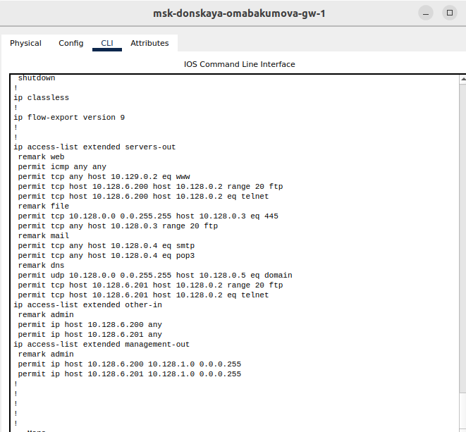{#fig:034 width=80%}

Проверим доступность,должна быть аналогичная доступность, как и у admin на Донской (рис. [-@fig:035]):

{#fig:035 width=80%}

## Web Browser

К сожалению проблема с Web  Browser решилась только сменой компьютера для выполнения лабораторной.После открытия файла лабораторной на другом компьютере,бразуер запустился и все работает! (рис. [-@fig:036]):

{#fig:036 width=80%}

{#fig:037 width=80%}

# Контрольные вопросы 

1. Как задать действие правила для конкретного протокола?

Чтобы задать действие правила для конкретного протокола, вы должны указать протокол в настройках правила. В большинстве систем управления сетевыми правилами, таких как брандмауэры или системы контроля доступа, вы можете выбрать протокол (например, TCP, UDP, ICMP) из выпадающего списка или ввести его вручную. Затем вы задаете действие (например, разрешить или запретить) для этого протокола.

2. Как задать действие правила сразу для нескольких портов?

Чтобы задать действие правила сразу для нескольких портов, вы можете использовать диапазон портов или перечислить порты через запятую в конфигурации правила. Например, в некоторых системах можно указать 80, 443 для HTTP и HTTPS или 1000-2000 для диапазона портов. Важно следовать синтаксису, принятому в вашей системе.

3. Как узнать номер правила в списке прав доступа?

Чтобы узнать номер правила в списке прав доступа, вам нужно просмотреть конфигурацию правил в интерфейсе управления (например, консоли управления брандмауэром). Обычно правила отображаются в виде списка с присвоенными номерами или идентификаторами. Если интерфейс не отображает номера, возможно, вам потребуется обратиться к документации или использовать команду в терминале, чтобы вывести список правил с их номерами.

4. Каким образом можно изменить порядок применения правил в списке контроля доступа?

Чтобы изменить порядок применения правил в списке контроля доступа, вам нужно использовать функцию перемещения или перетаскивания в интерфейсе управления. В большинстве систем управления сетевыми правилами есть возможность изменять порядок правил, просто перетаскивая их вверх или вниз. Также может быть команда для изменения порядка через командную строку или конфигурационный файл, где вы можете вручную изменить последовательность правил.

# Выводы

Во время выполнения данной лабораторной работы я освоила настройку прав доступа пользователей к ресурсам сети.

