---
## Front matter
lang: ru-RU
title: Лабораторная работа № 11. Настройка NAT. Планирование
author:
  - Абакумова О. М.
institute:
  - Российский университет дружбы народов, Москва, Россия

## i18n babel
babel-lang: russian
babel-otherlangs: english

## Formatting pdf
toc: false
toc-title: Содержание
slide_level: 2
aspectratio: 169
section-titles: true
theme: metropolis
header-includes:
 - \metroset{progressbar=frametitle,sectionpage=progressbar,numbering=fraction}
mainfont: Open Sans Light
---

# Информация

## Докладчик

:::::::::::::: {.columns align=center}
::: {.column width="70%"}

  * Абакумова Олеся Максимовна
  * Студентка
  * Российский университет дружбы народов
  * 1132220832@pfur.ru
  * <https://github.com/omabakumova>

:::
::: {.column width="30%"}

:::
::::::::::::::

# Цель работы

Провести подготовительные мероприятия по подключению локальной сети организации к Интернету.

# Задание

1. Построить схему подсоединения локальной сети к Интернету.
2. Построить модельные сети провайдера и сети Интернет.
3. Построить схемы сетей L1, L2, L3.
4. При выполнении работы необходимо учитывать соглашение об именовании

# Теоретическое введение

Network Address Translation (NAT) — механизм преобразования IP-адресов
транзитных пакетов.
В частности, механизм NAT используется для обеспечения доступа устройств
локальных сетей с внутренними IP-адресами к сети Интернет:

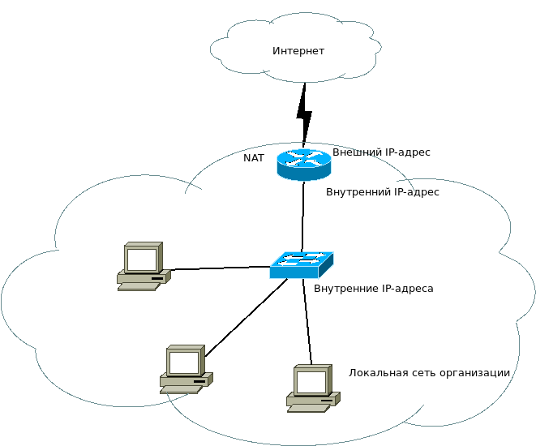{#fig:001 width=35%}

## Теоретическое введение

Типы NAT:

- статический NAT (Static NAT, SNAT) — осуществляет преобразование адресов по принципу 1:1;

- динамический NAT (Dynamic NAT, DNAT) — осуществляет преобразование
адресов по принципу 1:N;

- NAT Overload (или NAT Masquerading, или Port Address Translation, PAT).

# Выполнение лабораторной работы

: Распределение ip-адресов модельного Интернета

| IP-адреса     | Примечание            |
|---------------|-----------------------|
| 192.0.2.1     | provider-gw-1         |
| 192.0.2.11    | www.yandex.ru         |
| 192.0.2.12    | stud.rudn.university  |
| 192.0.2.13    | esystem.pfur.ru       |
| 192.0.2.14    | www.rudn.ru           |

##  Выполнение лабораторной работы

{#fig:002 width=40%}

##  Выполнение лабораторной работы

{#fig:003 width=40%}

##  Выполнение лабораторной работы

{#fig:004 width=40%}

##  Выполнение лабораторной работы

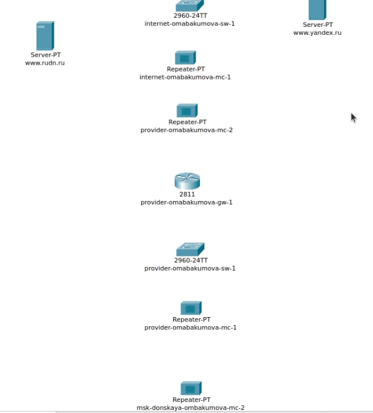{#fig:005 width=40%}

##  Выполнение лабораторной работы

{#fig:006 width=40%}

##  Выполнение лабораторной работы

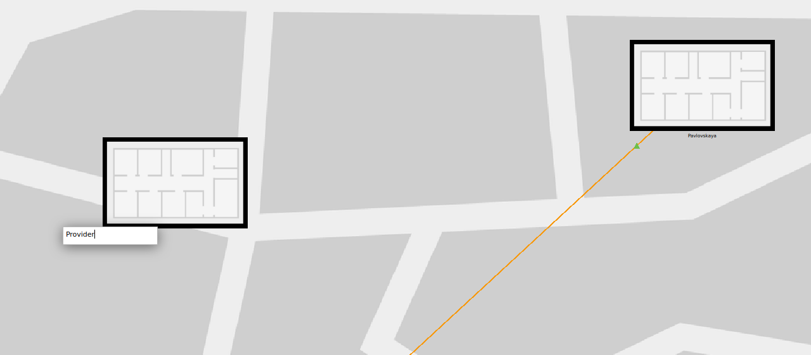{#fig:007 width=40%}

##  Выполнение лабораторной работы

{#fig:008 width=40%}

##  Выполнение лабораторной работы

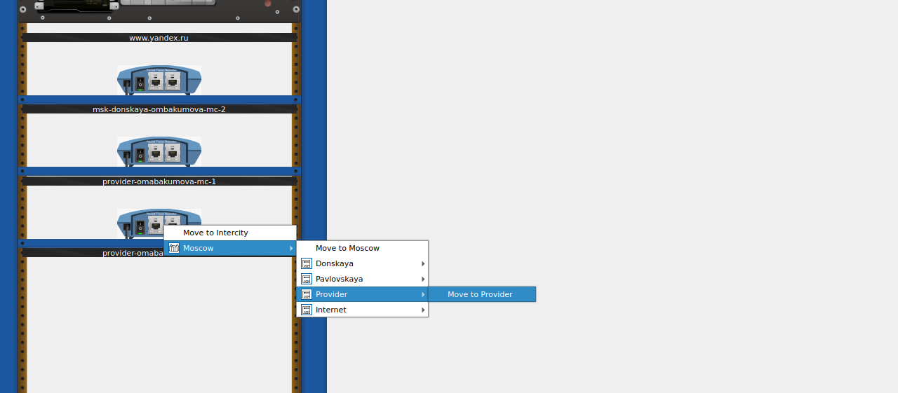{#fig:009 width=40%}

##  Выполнение лабораторной работы

{#fig:011 width=40%}

##  Выполнение лабораторной работы

{#fig:012 width=40%}

##  Выполнение лабораторной работы

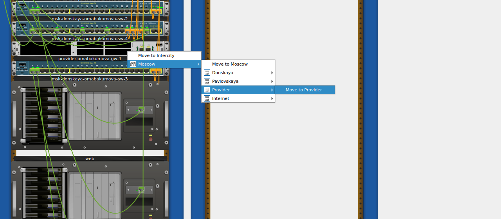{#fig:014 width=40%}

##  Выполнение лабораторной работы

{#fig:015 width=40%}

##  Выполнение лабораторной работы

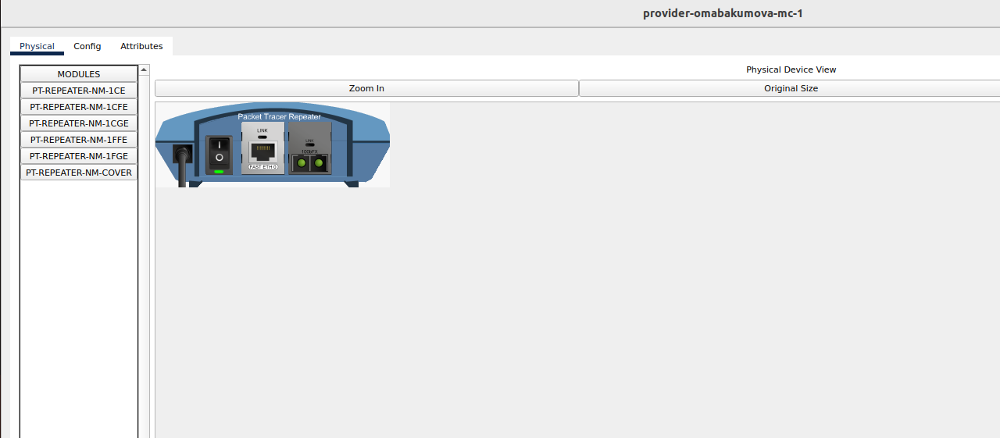{#fig:016 width=40%}

##  Выполнение лабораторной работы

{#fig:017 width=40%}

##  Выполнение лабораторной работы

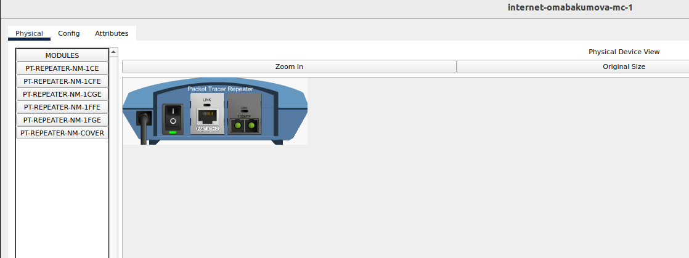{#fig:018 width=40%}

##  Выполнение лабораторной работы

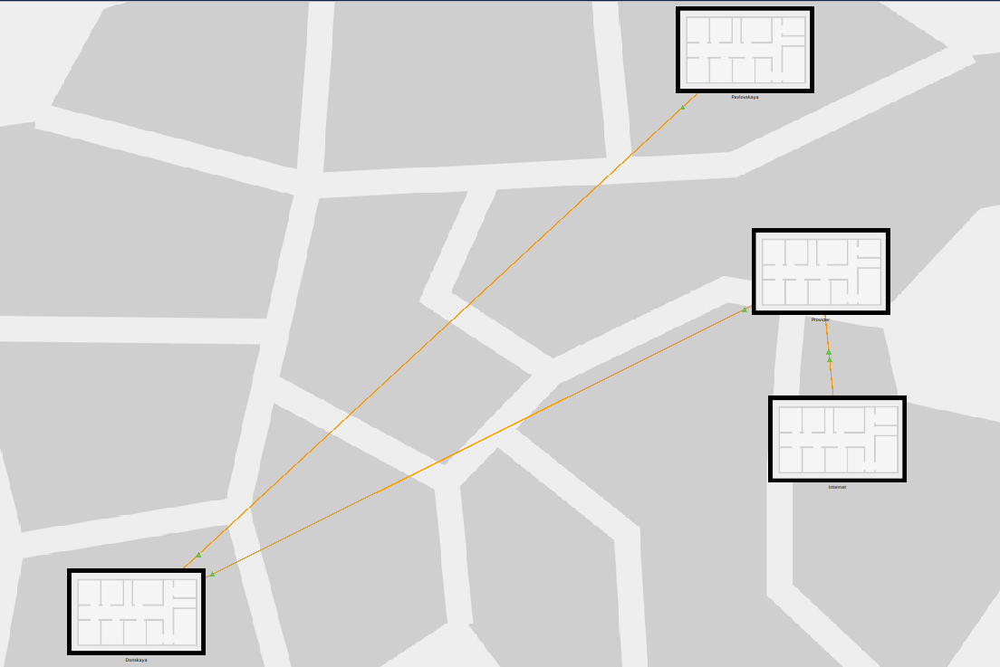{#fig:019 width=40%}

##  Выполнение лабораторной работы

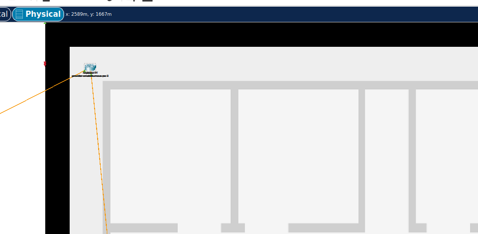{#fig:020 width=40%}

##  Выполнение лабораторной работы

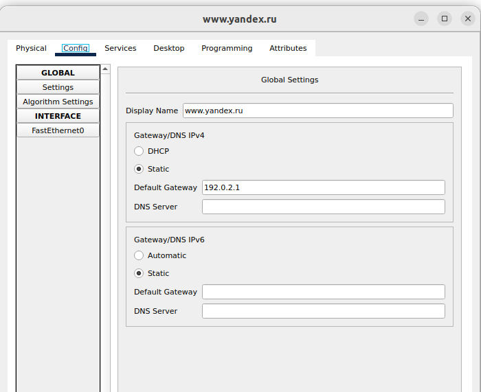{#fig:021 width=40%}

##  Выполнение лабораторной работы

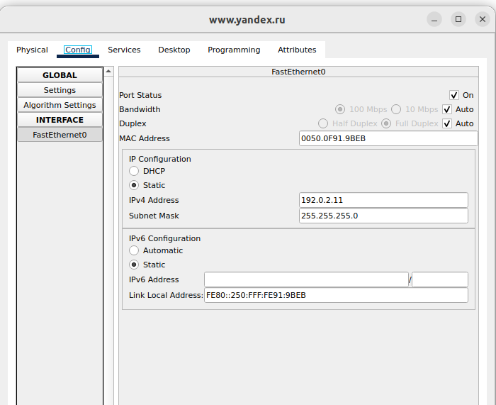{#fig:022 width=40%}

##  Выполнение лабораторной работы

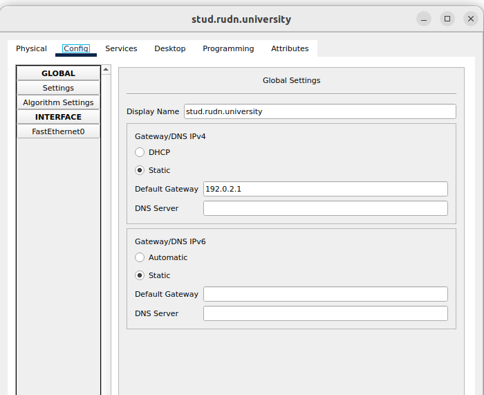{#fig:023 width=40%}

##  Выполнение лабораторной работы

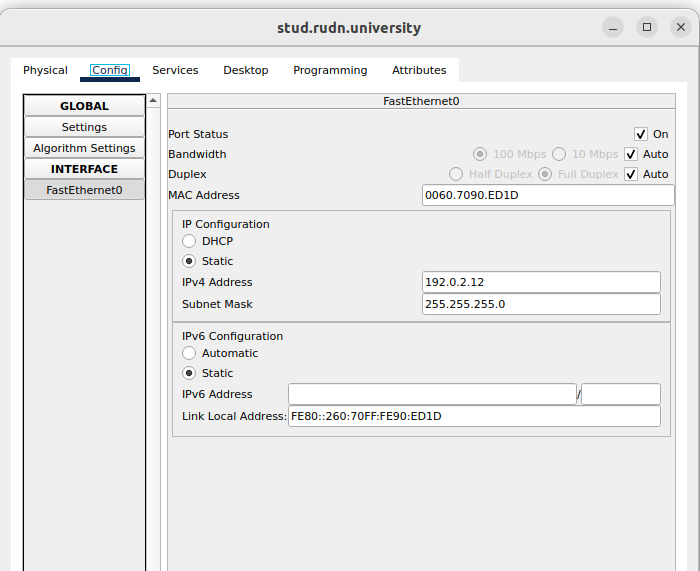{#fig:024 width=40%}

##  Выполнение лабораторной работы

{#fig:025 width=40%}

##  Выполнение лабораторной работы

{#fig:026 width=40%}

##  Выполнение лабораторной работы

{#fig:027 width=40%}

##  Выполнение лабораторной работы

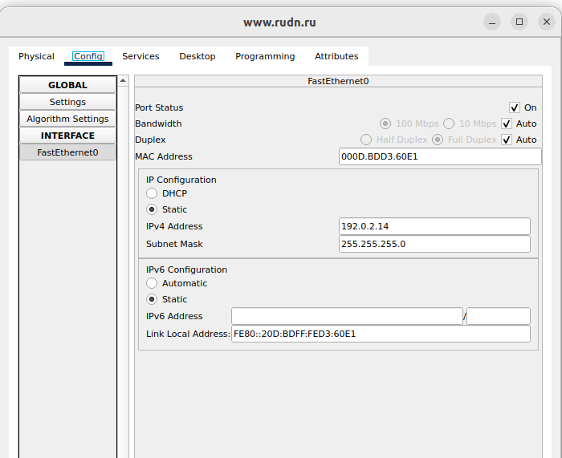{#fig:028 width=40%}

##  Выполнение лабораторной работы

{#fig:029 width=40%}

# Выводы

Во время выполнения данной лабораторной работы я провела подготовительные мероприятия по подключению локальной сети организации к Интернету.

