---
## Front matter
title: "Лабораторная работа № 11. Настройка NAT. Планирование"
author: "Абакумова Олеся Максимовна, НФИбд-02-22"

## Generic otions
lang: ru-RU
toc-title: "Содержание"

## Bibliography
bibliography: bib/cite.bib
csl: pandoc/csl/gost-r-7-0-5-2008-numeric.csl

## Pdf output format
toc: true # Table of contents
toc-depth: 2
lof: true # List of figures
lot: true # List of tables
fontsize: 12pt
linestretch: 1.5
papersize: a4
documentclass: scrreprt
## I18n polyglossia
polyglossia-lang:
  name: russian
  options:
	- spelling=modern
	- babelshorthands=true
polyglossia-otherlangs:
  name: english
## I18n babel
babel-lang: russian
babel-otherlangs: english
## Fonts
mainfont: IBM Plex Serif
romanfont: IBM Plex Serif
sansfont: IBM Plex Sans
monofont: IBM Plex Mono
mathfont: STIX Two Math
mainfontoptions: Ligatures=Common,Ligatures=TeX,Scale=0.94
romanfontoptions: Ligatures=Common,Ligatures=TeX,Scale=0.94
sansfontoptions: Ligatures=Common,Ligatures=TeX,Scale=MatchLowercase,Scale=0.94
monofontoptions: Scale=MatchLowercase,Scale=0.94,FakeStretch=0.9
mathfontoptions:
## Biblatex
biblatex: true
biblio-style: "gost-numeric"
biblatexoptions:
  - parentracker=true
  - backend=biber
  - hyperref=auto
  - language=auto
  - autolang=other*
  - citestyle=gost-numeric
## Pandoc-crossref LaTeX customization
figureTitle: "Рис."
tableTitle: "Таблица"
listingTitle: "Листинг"
lofTitle: "Список иллюстраций"
lotTitle: "Список таблиц"
lolTitle: "Листинги"
## Misc options
indent: true
header-includes:
  - \usepackage{indentfirst}
  - \usepackage{float} # keep figures where there are in the text
  - \floatplacement{figure}{H} # keep figures where there are in the text
---

# Цель работы

Провести подготовительные мероприятия по подключению локальной сети организации к Интернету.

# Задание

1. Построить схему подсоединения локальной сети к Интернету.
2. Построить модельные сети провайдера и сети Интернет.
3. Построить схемы сетей L1, L2, L3.
4. При выполнении работы необходимо учитывать соглашение об именовании

# Теоретическое введение

Network Address Translation (NAT) — механизм преобразования IP-адресов
транзитных пакетов.
В частности, механизм NAT используется для обеспечения доступа устройств
локальных сетей с внутренними IP-адресами к сети Интернет (рис. [-@fig:001]):

{#fig:001 width=80%}

Типы NAT:
- статический NAT (Static NAT, SNAT) — осуществляет преобразование адресов по принципу 1:1 (в частности, один локальный IP-адрес преобразуется
во внешний адрес, выделенный, например, провайдером);
- динамический NAT (Dynamic NAT, DNAT) — осуществляет преобразование
адресов по принципу 1:N (например, один адрес устройства локальной сети
преобразуется в один из адресов диапазона внешних адресов);
- NAT Overload (или NAT Masquerading, или Port Address Translation, PAT) —
осуществляет преобразование адресов по принципу N:1 (например, адреса
группы устройств локальной подсети преобразуются в один внешний адрес,
при этом дополнительно используется механизм адресации через номера
портов).

# Выполнение лабораторной работы

Модельные предположения:
- В сети провайдера располагаются 2 медиаконвертера provider-mc-1
и provider-mc-2 для связи с подсетью «Донская» и сетью модельного
Интернета, маршрутизатор provider-gw-1 и коммутатор provider-sw-1.
Оборудование соединяется между собой по Fast Ethernet согласно схеме
(рис. 11.2).
- В модельной сети Интернет располагаются 4 сервера www.yandex.ru,
www.rudn.ru, stud.rudn.university и esystem.pfur.ru, коммутатор
internet-sw-1 и медиаконвертер internet-mc-1 для связи с сетью провайдера. Серверы подключены к коммутатору посредством Fast Ethernet,
коммутатор подсоединён к медиаконвертеру также по Fast Ethernet.
- Имена и адреса серверам Интернета и маршрутизатору провайдера задаются согласно табл. 11.1. При этом учитывается, что под сеть адресов
модельного Интернета выделяется адрес 192.0.2.0/24, а под сеть провайдера --- 198.51.100.1

: Распределение ip-адресов модельного Интернета {#tbl:ip}

| IP-адреса     | Примечание            |
|---------------|-----------------------|
| 192.0.2.1     | provider-gw-1         |
| 192.0.2.11    | www.yandex.ru         |
| 192.0.2.12    | stud.rudn.university  |
| 192.0.2.13    | esystem.pfur.ru       |
| 192.0.2.14    | www.rudn.ru           |

ВнесЕМ изменения в схему L1 сети, добавив в неё сеть провайдера и сеть
модельного Интернета с указанием названий оборудования и портов подключения.
Внесем также изменения в схемы L2 и L3 сети, указав адреса и VLAN сети провайдера и модельной сети Интернета. Скорректируем таблицы распределения
IP-адресов и портов (рис. [-@fig:002]):

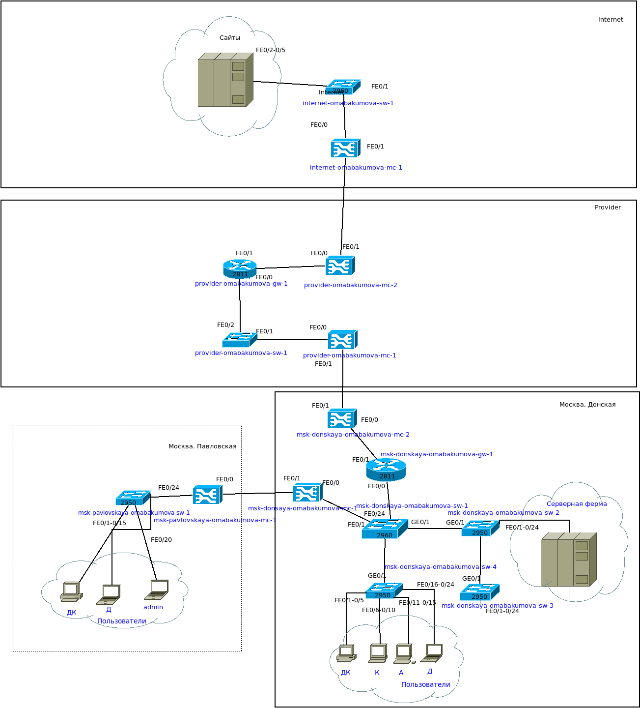{#fig:002 width=80%}

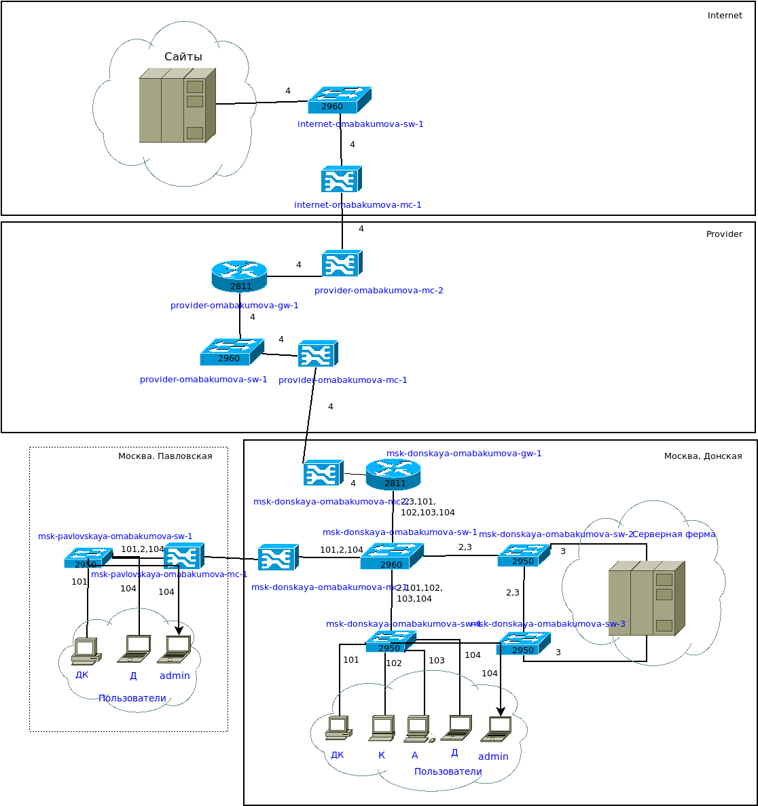{#fig:003 width=80%}

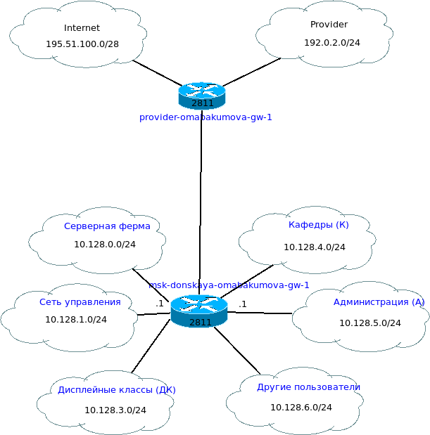{#fig:004 width=80%}

: Таблица портов {#tbl:port}

| Устройство           | Порт          | Примечание           | Access VLAN | Trunk VLAN               |
|----------------------|---------------|----------------------|-------------|--------------------------|
| msk-donskaya-gw-1    | f0/1          | provider-mc-1        |             |                          |
|                      | f0/0          | msk-donskaya-sw-1    |             | 2, 3, 101, 102, 103, 104 |
| msk-donskaya-sw-1    | f0/24         | msk-donskaya-gw-1    |             | 2, 3, 101, 102, 103, 104 |
|                      | f0/20 — f0/23 | msk-donskaya-sw-4    |             | 2, 3                     |
|                      | g0/1          | msk-donskaya-sw-2    |             |                          |
|                      | g0/2          | msk-donskaya-sw-3    |             | 2, 101, 102, 103, 104    |
|                      | f0/1          | msk-donskaya-mc-1    |             | 2, 101, 104              |
| msk-donskaya-sw-2    | g0/1          | msk-donskaya-sw-1    |             | 2, 3                     |
|                      | g0/2          | msk-donskaya-sw-3    |             | 2, 3                     |
|                      | f0/1          | Web-server           | 3           |                          |
|                      | f0/2          | File-server          | 3           |                          |
| msk-donskaya-sw-3    | g0/1          | msk-donskaya-sw-2    |             | 2, 3                     |
|                      | g0/2          | msk-donskaya-sw-1    |             |                          |
|                      | f0/1          | Mail-server          | 3           |                          |
|                      | f0/2          | Dns-server           | 3           |                          |
| msk-donskaya-sw-4    | f0/20 — f0/23 | msk-donskaya-sw-1    |             | 2, 101, 102, 103, 104    |
|                      | f0/1–f0/5     | dk                   | 101         |                          |
|                      | f0/6–f0/10    | departments          | 102         |                          |
|                      | f0/11–f0/15   | adm                  | 103         |                          |
|                      | f0/16–f0/24   | other                | 104         |                          |
|                      | f0/24         | admin                | 104         |                          |
| msk-donskaya-mc-1    | f0/0          | msk-donskaya-sw-1    |             |                          |
|                      | f0/1          | msk-donskaya-mc-1    |             |                          |
| msk-donskaya-mc-2    | f0/0          | msk-donskaya-gw-1    |             |                          |
|                      | f0/1          | provider-mc-1        |             |                          |
| msk-pavlovskaya-mc-1 | f0/0          | msk-pavlovskaya-sw-1 |             |                          |
|                      | f0/1          | msk-donskaya-mc-1    |             |                          |
| msk-pavlovskaya-sw-1 | f0/24         | msk-pavlovskaya-mc-1 |             | 2, 101, 104              |
|                      | f0/1–f0/15    | dk                   | 101         |                          |
|                      | f0/20         | other                | 104         |                          |
|                      | f0/24         | admin-pavlovskaya    | 104         |                          |
| provider-gw-1        | f0/0          | provider-sw-1        |             |                          |
|                      | f0/1          | provider-mc-2        |             |                          |
| provider-sw-1        | f0/1          | provider-mc-1        |             |                          |
|                      | f0/2          | provider-gw-1        |             |                          |
| provider-mc-1        | f0/0          | provider-sw-1        |             |                          |
|                      | f0/1          | msk-donskaya-mc-2    |             |                          |
| provider-mc-2        | f0/0          | provider-gw-1        |             |                          |
|                      | f0/1          | internet-mc-1        |             |                          |
| internet-sw-1        | f0/1          | internet-mc-1        |             |                          |
|                      | f0/2          | esystem.pfur.ru      |             |                          |
|                      | f0/3          | www.rudn.ru          |             |                          |
|                      | f0/4          | stud.rudn.university |             |                          |
|                      | f0/5          | www.yandex.ru        |             |                          |
| internet-mc-1        | f0/0          | internet-sw-1        |             |                          |
|                      | f0/1          | provider-mc-2        |             |                          |

: Таблица IP {#tbl:ipplan}

| IP-адреса               | Примечание              | VLAN |
|-------------------------|-------------------------|------|
| 10.128.0.0/16           | Вся сеть                |      |
| 10.128.0.0/24           | Серверная ферма         | 3    |
| 10.128.0.1              | Шлюз                    |      |
| 10.128.0.2              | Web                     |      |
| 10.128.0.3              | File                    |      |
| 10.128.0.4              | Mail                    |      |
| 10.128.0.5              | Dns                     |      |
| 10.128.0.6-10.128.0.254 | Зарезервировано         |      |
| 10.128.1.0/24           | Управление              | 2    |
| 10.128.1.1              | Шлюз                    |      |
| 10.128.1.2              | msk-donskaya-sw-1       |      |
| 10.128.1.3              | msk-donskaya-sw-2       |      |
| 10.128.1.4              | msk-donskaya-sw-3       |      |
| 10.128.1.5              | msk-donskaya-sw-4       |      |
| 10.128.1.6              | msk-pavlovskaya-sw-1    |      |
| 10.128.1.7-10.128.1.254 | Зарезервировано         |      |
| 10.128.2.0/24           | Cеть Point-to-Point     |      |
| 10.128.2.1              | Шлюз                    |      |
| 10.128.2.2-10.128.2.254 | Зарезервировано         |      |
| 10.128.3.0/24           | Дисплейные классы (ДК)  | 101  |
| 10.128.3.1              | Шлюз                    |      |
| 10.128.3.2-10.128.3.254 | Пул для пользователей   |      |
| 10.128.4.0/24           | Кафедры (К)             | 102  |
| 10.128.4.1              | Шлюз                    |      |
| 10.128.4.2-10.128.4.254 | Пул для пользователей   |      |
| 10.128.5.0/24           | Администрация (А)       | 103  |
| 10.128.5.1              | Шлюз                    |      |
| 10.128.5.2-10.128.5.254 | Пул для пользователей   |      |
| 10.128.6.0/24           | Другие пользователи (Д) | 104  |
| 10.128.6.1              | Шлюз                    |      |
| 10.128.6.2-10.128.6.254 | Пул для пользователей   |      |
| 192.0.2.1               | provider-gw-1           |      |
| 192.0.2.11              | www.yandex.ru           | 4    |
| 192.0.2.12              | stud.rudn.university    | 4    |
| 192.0.2.13              | esystem.pfur.ru         | 4    |
| 192.0.2.14              | www.rudn.ru             | 4    |

На схеме предыдущего нашего проекта разместим согласно необходимое оборудование для сети провайдера и сети модельного Интернета:
4 медиаконвертера (Repeater-PT), 2 коммутатора типа Cisco 2960-24TT,
маршрутизатор типа Cisco 2811, 4 сервера.
Присвоим названия размещённым в сети провайдера и в сети модельного
Интернета объектам согласно модельным предположениям и схеме L1 (рис. [-@fig:005]):

{#fig:005 width=80%}

Пока что никаких соединений нет.Но итоговая схема сети по которой нуно ориентироваться выглядит следующим образом (рис. [-@fig:006]):

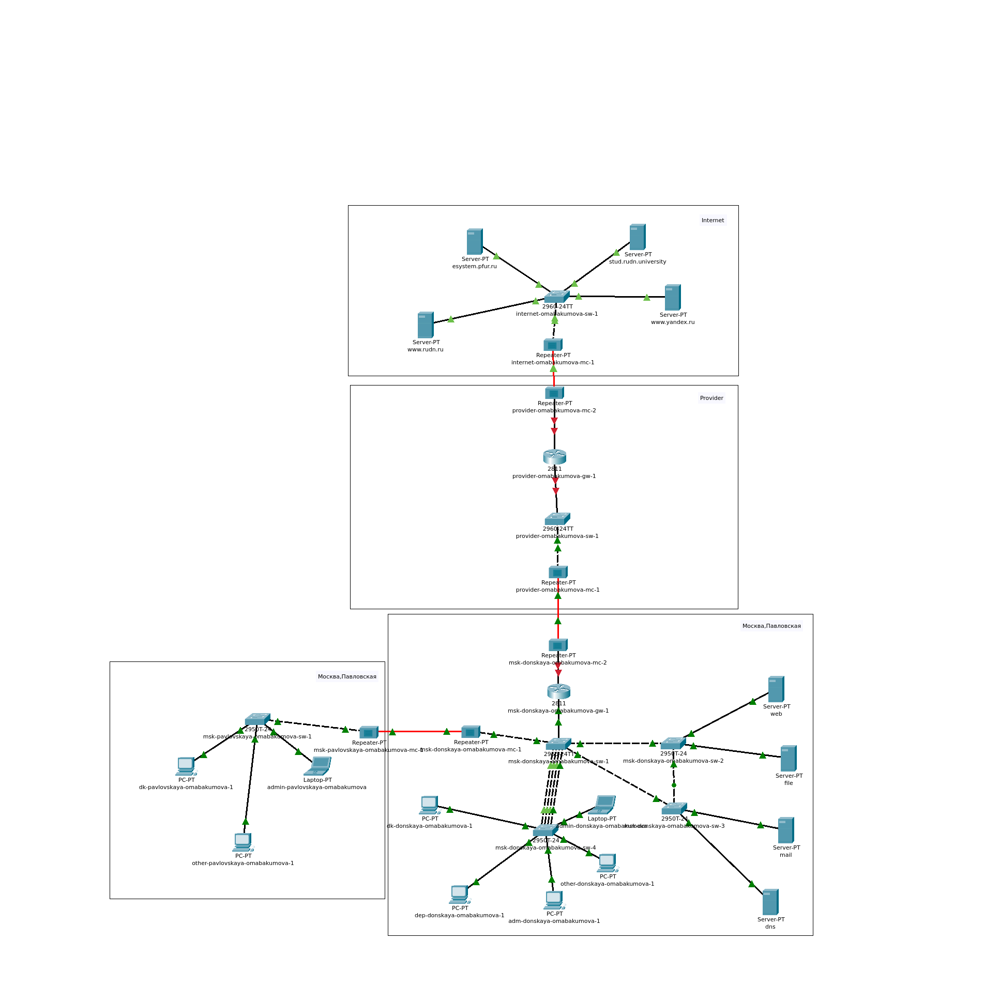{#fig:006 width=80%}

В физической рабочей области добавим здание провайдера и здание,
имитирующее расположение серверов модельного Интернета.
Присвоим им соответствующие названия (рис. [-@fig:007]):

{#fig:007 width=80%}

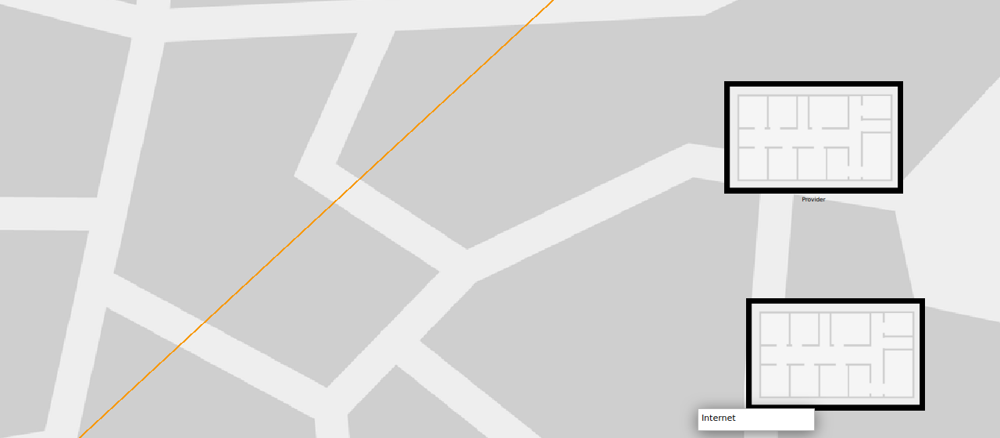{#fig:008 width=80%}

Перенесем из сети «Донская» оборудование провайдера и модельной сети Интернета в соответствующие здания. Перенесем все репитеры на их место (рис. [-@fig:009]):

{#fig:009 width=80%}

Аналогичным бразом перенесем все сервера и прочее оборудование которые не принадлежат Донской (рис. [-@fig:011]):

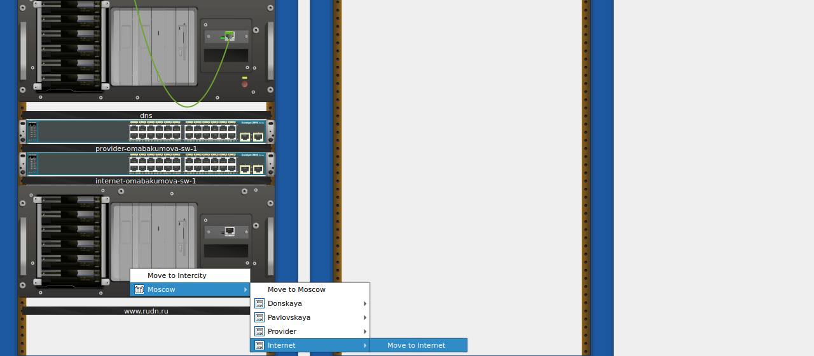{#fig:011 width=80%}

Перенесем таким же образом то,что осталось (рис. [-@fig:012]):

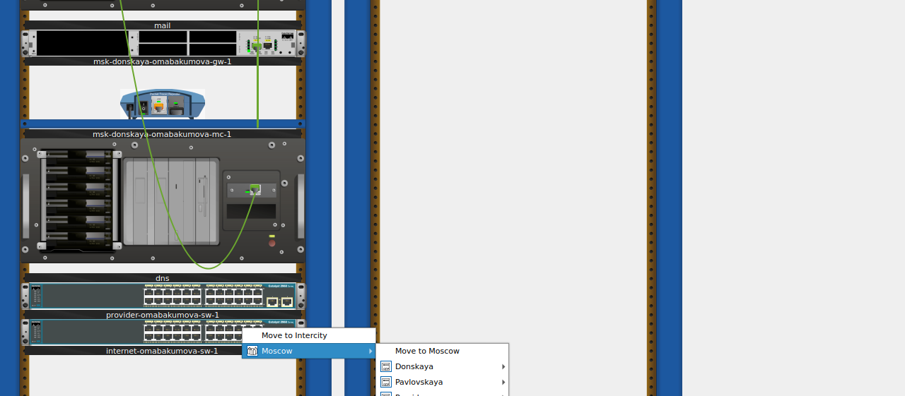{#fig:012 width=80%}

{#fig:014 width=80%}

На медиаконвертерах заменим имеющиеся модули на PT-REPEATER-
NM-1FFE и PT-REPEATER-NM-1CFE для подключения витой пары по
технологии Fast Ethernet и оптоволокна соответственно (рис. [-@fig:015]):

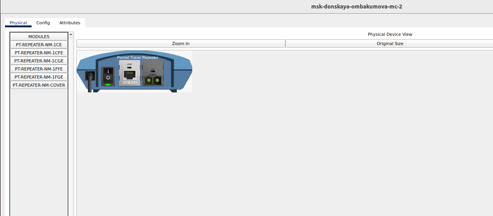{#fig:015 width=80%}

{#fig:016 width=80%}

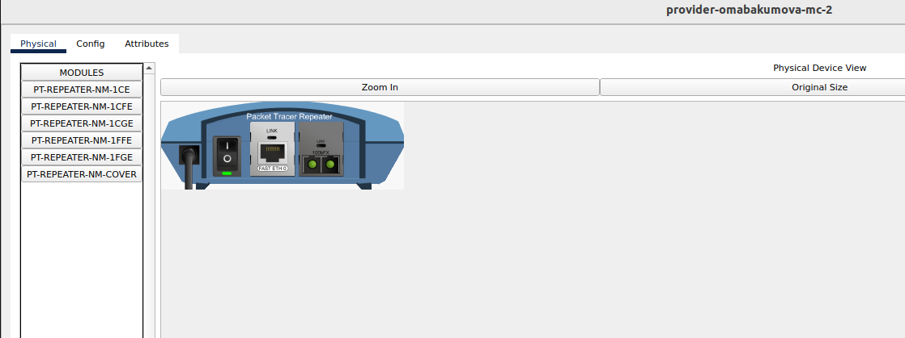{#fig:017 width=80%}

{#fig:018 width=80%}

Проверим как разместилось все в физической рабочей области (рис. [-@fig:019]):

{#fig:019 width=80%}

{#fig:020 width=80%}

Проведя соединение объектов согласно скорректированной нами схеме L1, мы как раз и получим то, что указано на иллюстрации (рис. [-@fig:006]).
Пропишите IP-адреса серверам согласно таблице [-@tbl:ip]:

{#fig:021 width=80%}

{#fig:022 width=80%}

{#fig:023 width=80%}

{#fig:024 width=80%}

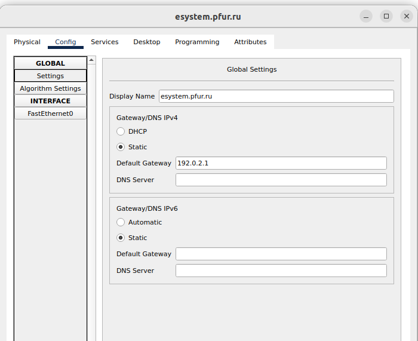{#fig:025 width=80%}

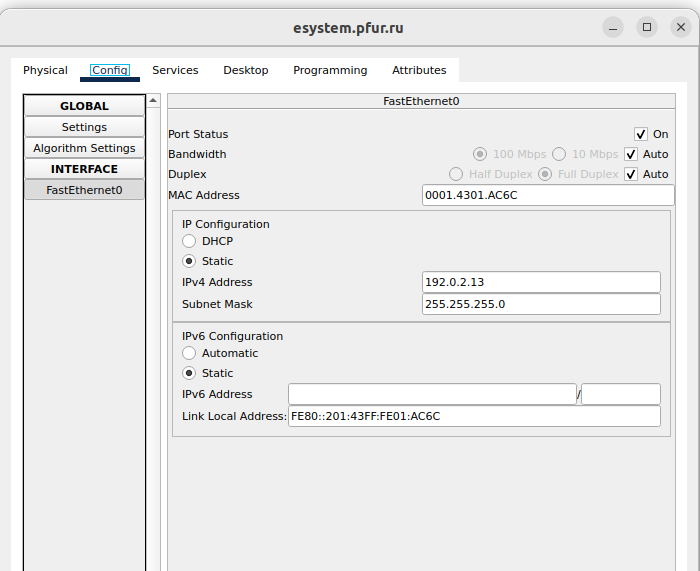{#fig:026 width=80%}

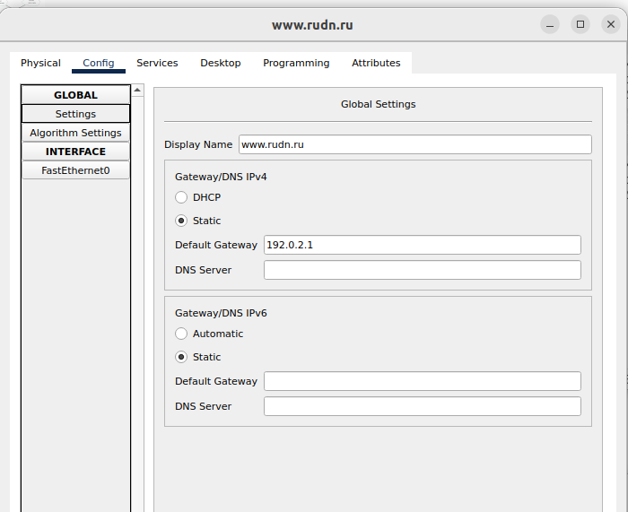{#fig:027 width=80%}

{#fig:028 width=80%}

Пропишем сведения о серверах на DNS-сервере сети «Донская» (рис. [-@fig:029]):

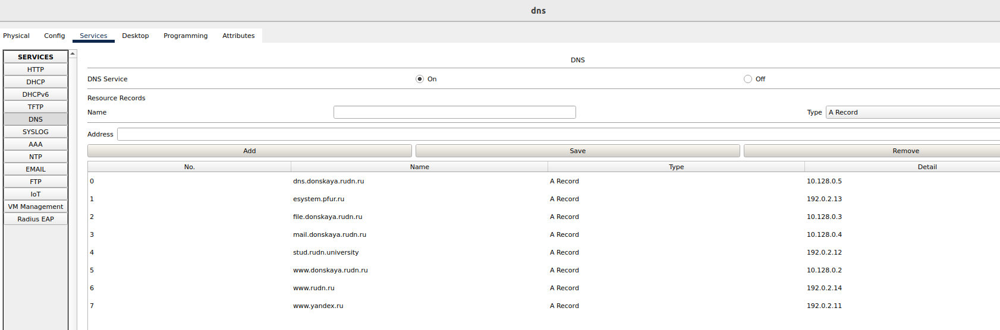{#fig:029 width=80%}

# Контрольные вопросы 

1. Что такое Network Address Translation (NAT)?

Network Address Translation (NAT) — это метод, используемый в сетевых технологиях для преобразования частных IP-адресов в публичные и наоборот. Он позволяет нескольким устройствам в локальной сети использовать один публичный IP-адрес для доступа в интернет, обеспечивая при этом безопасность и экономию адресного пространства.

2. Как определить, находится ли узел сети за NAT?

Чтобы определить, находится ли узел сети за NAT, можно использовать различные методы, такие как проверка IP-адреса, который видит узел в интернете. Если внешний IP-адрес отличается от локального IP-адреса, значит, узел находится за NAT. Также можно воспользоваться специализированными инструментами и сервисами для проверки NAT.

3. Какое оборудование отвечает за преобразование адреса методом NAT?

За преобразование адреса методом NAT обычно отвечает маршрутизатор или брандмауэр. Эти устройства управляют трафиком между локальной сетью и интернетом, выполняя преобразование IP-адресов и портов.

4. В чём отличие статического, динамического и перегруженного NAT?

Статический NAT устанавливает постоянное соответствие между локальным и публичным IP-адресом, что позволяет обеспечить доступ к устройству из интернета по фиксированному адресу. Динамический NAT использует пул публичных адресов и назначает их устройствам по мере необходимости, что позволяет более эффективно использовать адресное пространство. Перегруженный NAT (или PAT — Port Address Translation) позволяет нескольким устройствам в локальной сети использовать один публичный IP-адрес, различая их по номерам портов.

5. Охарактеризуйте типы NAT.

Существует несколько типов NAT: статический NAT, динамический NAT и перегруженный NAT (PAT). Статический NAT обеспечивает постоянное соответствие между локальным и публичным адресами, динамический NAT назначает адреса из пула на временной основе, а перегруженный NAT позволяет множеству устройств использовать один публичный адрес, различая их по портам. Также выделяют такие варианты, как NAT с перекрытием и обратный NAT, которые имеют свои особенности в работе с трафиком и адресами.

# Выводы

Во время выполнения данной лабораторной работы я провела подготовительные мероприятия по подключению локальной сети организации к Интернету.

