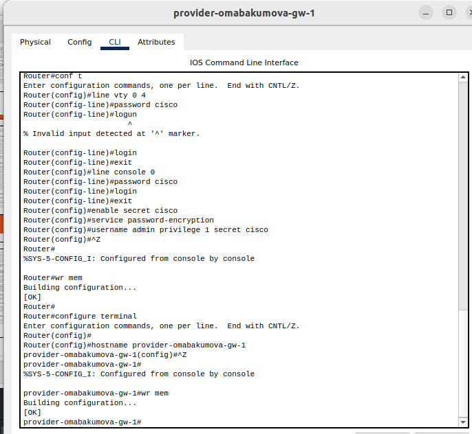
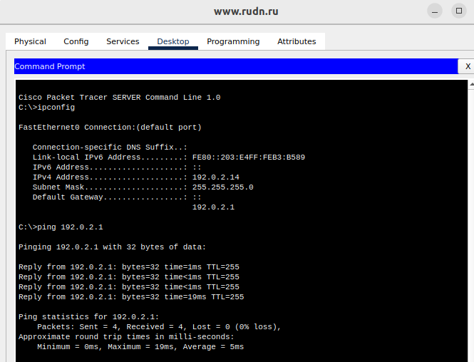
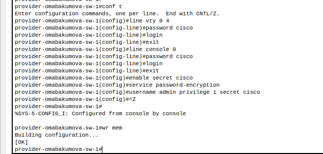
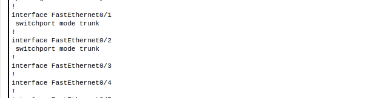
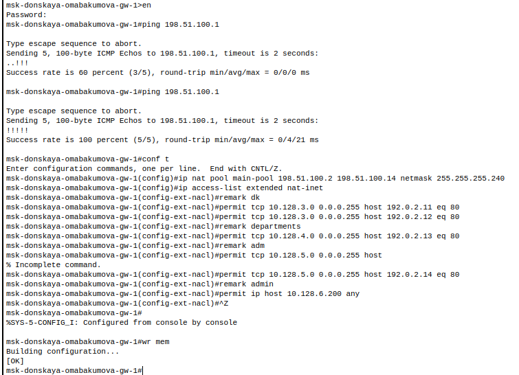
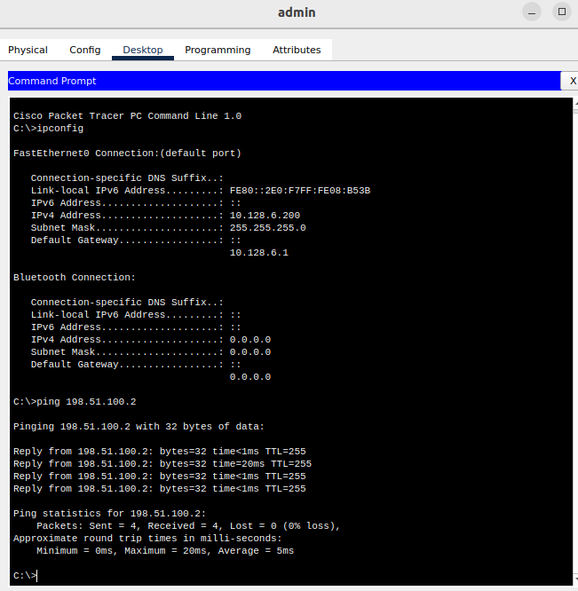
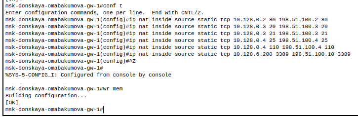
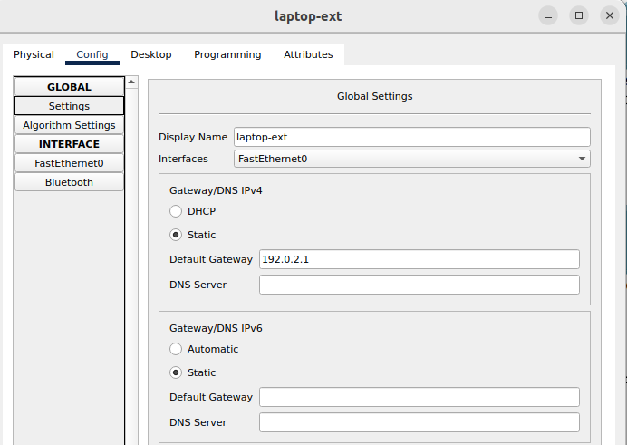
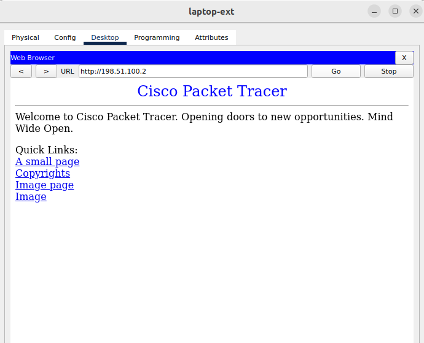
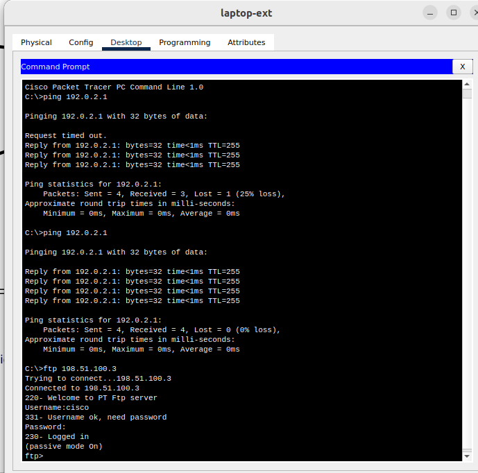

---
## Front matter
lang: ru-RU
title: Лабораторная работа № 12. Настройка NAT
author:
  - Абакумова О. М.
institute:
  - Российский университет дружбы народов, Москва, Россия

## i18n babel
babel-lang: russian
babel-otherlangs: english

## Formatting pdf
toc: false
toc-title: Содержание
slide_level: 2
aspectratio: 169
section-titles: true
theme: metropolis
header-includes:
 - \metroset{progressbar=frametitle,sectionpage=progressbar,numbering=fraction}
mainfont: Open Sans Light
---

# Информация

## Докладчик

:::::::::::::: {.columns align=center}
::: {.column width="70%"}

  * Абакумова Олеся Максимовна
  * Студентка
  * Российский университет дружбы народов
  * 1132220832@pfur.ru
  * <https://github.com/omabakumova>

:::
::: {.column width="30%"}

:::
::::::::::::::

# Цель работы

Приобретение практических навыков по настройке доступа локальной сети к внешней сети посредством NAT.

# Задание

1. Сделать первоначальную настройку маршрутизатора provider-gw-1 и коммутатора provider-sw-1 провайдера: задать имя, настроить доступ по
паролю и т.п.
2. Настроить интерфейсы маршрутизатора provider-gw-1 и коммутатора
provider-sw-1 провайдера.
3. Настроить интерфейсы маршрутизатора сети «Донская» для доступа к сети
провайдера.
4. Настроить на маршрутизаторе сети «Донская» NAT с правилами.
5. Настроить доступ из внешней сети в локальную сеть организации.
6. Проверить работоспособность заданных настроек.
7. При выполнении работы необходимо учитывать соглашение об именовании.

# Выполнение лабораторной работы

## Выполнение лабораторной работы

: Распределение внешних ip-адресов

| IP-адреса               | Примечание                  | VLAN |
|-------------------------|-----------------------------|------|
| 198.51.100.0/28         | Выделено провайдером        | 4    |
| 198.51.100.1            | Маршрутизатор провайдера    |      |
| 198.51.100.2            | msk-donskaya-gw-1           |      |
| 198.51.100.2–198.51.100.14 | Пул адресов для NAT      |      |
| 198.51.100.2            | Web                         |      |
| 198.51.100.3            | File                        |      |
| 198.51.100.4            | Mail                        |      |

## Выполнение лабораторной работы

: Таблица VLAN 

| № VLAN | Имя VLAN     | Примечание                     |
|--------|--------------|--------------------------------|
| 1      | default      | Не используется                |
| 2      | management   | Для управления устройствами    |
| 3      | servers      | Для серверной фермы            |
| 4      | nat          | Линк в Интернет                |
| 5-100  |              | Зарезервировано                |
| 101    | dk           | Дисплейные классы (ДК)         |
| 102    | departments  | Кафедры                       |
| 103    | adm          | Администрация                 |
| 104    | other        | Для других пользователей       |

##  Выполнение лабораторной работы

{#fig:001 width=40%}

##  Выполнение лабораторной работы

{#fig:002 width=40%}

##  Выполнение лабораторной работы

{#fig:003 width=40%}

##  Выполнение лабораторной работы

{#fig:004 width=40%}

##  Выполнение лабораторной работы

{#fig:005 width=40%}

##  Выполнение лабораторной работы

{#fig:006 width=40%}

##  Выполнение лабораторной работы

{#fig:007 width=40%}

##  Выполнение лабораторной работы

{#fig:008 width=40%}

##  Выполнение лабораторной работы

{#fig:009 width=80%}

##  Выполнение лабораторной работы

{#fig:010 width=40%}

##  Выполнение лабораторной работы

{#fig:011 width=40%}

##  Выполнение лабораторной работы

{#fig:012 width=40%}

##  Выполнение лабораторной работы

{#fig:013 width=40%}

##  Выполнение лабораторной работы

{#fig:014 width=25%}

##  Выполнение лабораторной работы

{#fig:015 width=40%}

##  Выполнение лабораторной работы

{#fig:016 width=40%}

##  Выполнение лабораторной работы

{#fig:017 width=40%}

##  Выполнение лабораторной работы

{#fig:018 width=40%}

##  Выполнение лабораторной работы

{#fig:019 width=40%}

##  Выполнение лабораторной работы

{#fig:020 width=40%}

##  Выполнение лабораторной работы

{#fig:021 width=40%}

##  Выполнение лабораторной работы

{#fig:022 width=40%}

# Выводы

Во время выполнения данной лабораторной работы я приобрела практические навыки по настройке доступа локальной сети к внешней сети посредством NAT.

