---
## Front matter
title: "Лабораторная работа № 12. Настройка NAT"
author: "Абакумова Олеся Максимовна, НФИбд-02-22"

## Generic otions
lang: ru-RU
toc-title: "Содержание"

## Bibliography
bibliography: bib/cite.bib
csl: pandoc/csl/gost-r-7-0-5-2008-numeric.csl

## Pdf output format
toc: true # Table of contents
toc-depth: 2
lof: true # List of figures
lot: true # List of tables
fontsize: 12pt
linestretch: 1.5
papersize: a4
documentclass: scrreprt
## I18n polyglossia
polyglossia-lang:
  name: russian
  options:
	- spelling=modern
	- babelshorthands=true
polyglossia-otherlangs:
  name: english
## I18n babel
babel-lang: russian
babel-otherlangs: english
## Fonts
mainfont: IBM Plex Serif
romanfont: IBM Plex Serif
sansfont: IBM Plex Sans
monofont: IBM Plex Mono
mathfont: STIX Two Math
mainfontoptions: Ligatures=Common,Ligatures=TeX,Scale=0.94
romanfontoptions: Ligatures=Common,Ligatures=TeX,Scale=0.94
sansfontoptions: Ligatures=Common,Ligatures=TeX,Scale=MatchLowercase,Scale=0.94
monofontoptions: Scale=MatchLowercase,Scale=0.94,FakeStretch=0.9
mathfontoptions:
## Biblatex
biblatex: true
biblio-style: "gost-numeric"
biblatexoptions:
  - parentracker=true
  - backend=biber
  - hyperref=auto
  - language=auto
  - autolang=other*
  - citestyle=gost-numeric
## Pandoc-crossref LaTeX customization
figureTitle: "Рис."
tableTitle: "Таблица"
listingTitle: "Листинг"
lofTitle: "Список иллюстраций"
lotTitle: "Список таблиц"
lolTitle: "Листинги"
## Misc options
indent: true
header-includes:
  - \usepackage{indentfirst}
  - \usepackage{float} # keep figures where there are in the text
  - \floatplacement{figure}{H} # keep figures where there are in the text
---

# Цель работы

Приобретение практических навыков по настройке доступа локальной сети к внешней сети посредством NAT.

# Задание

1. Сделать первоначальную настройку маршрутизатора provider-gw-1 и коммутатора provider-sw-1 провайдера: задать имя, настроить доступ по
паролю и т.п.
2. Настроить интерфейсы маршрутизатора provider-gw-1 и коммутатора
provider-sw-1 провайдера.
3. Настроить интерфейсы маршрутизатора сети «Донская» для доступа к сети
провайдера.
4. Настроить на маршрутизаторе сети «Донская» NAT с правилами.
5. Настроить доступ из внешней сети в локальную сеть организации.
6. Проверить работоспособность заданных настроек.
7. При выполнении работы необходимо учитывать соглашение об именовании.


# Выполнение лабораторной работы

В ходе выполнения лабораторной работы нам понадобятся таблица распредления внешних ip-адресов (табл. [-@tbl:ip]) и таблица VLAN (табл. [-@tbl:vlan]).

: Распределение внешних ip-адресов {#tbl:ip}

| IP-адреса               | Примечание                  | VLAN |
|-------------------------|-----------------------------|------|
| 198.51.100.0/28         | Выделено провайдером        | 4    |
| 198.51.100.1            | Маршрутизатор провайдера    |      |
| 198.51.100.2            | msk-donskaya-gw-1           |      |
| 198.51.100.2–198.51.100.14 | Пул адресов для NAT      |      |
| 198.51.100.2            | Web                         |      |
| 198.51.100.3            | File                        |      |
| 198.51.100.4            | Mail                        |      |

: Таблица VLAN {#tbl:vlan}

| № VLAN | Имя VLAN     | Примечание                     |
|--------|--------------|--------------------------------|
| 1      | default      | Не используется                |
| 2      | management   | Для управления устройствами    |
| 3      | servers      | Для серверной фермы            |
| 4      | nat          | Линк в Интернет                |
| 5-100  |              | Зарезервировано                |
| 101    | dk           | Дисплейные классы (ДК)         |
| 102    | departments  | Кафедры                       |
| 103    | adm          | Администрация                 |
| 104    | other        | Для других пользователей       |

Для начала произведем первоначальную настройку маршрутизатора в области Provider (рис. [-@fig:001]):

{#fig:001 width=80%}

Также сразу же произведем первоначальную настройку интерфейсов маршрутизатора (рис. [-@fig:002]):

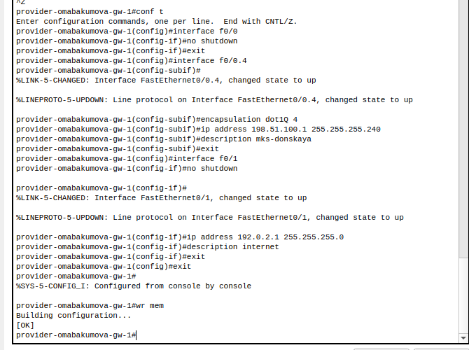{#fig:002 width=80%}

Проверим доступность маршрутизатора с сервера www.rudn.ru.Пинг может не пройти сразу,это связано с работой Cisco Packet Tracer с учетом коммутатора в области Provider.Мне помогло несколько раз перезапустить рабочий файл с сетью с отсоединением и повторным присоединением коммутатора (рис. [-@fig:003]):

{#fig:003 width=80%}

Далее произведем первоначальную настройку коммутатора с учетом настройки его интерфейсов, сделав порты транковыми (рис. [-@fig:004]):

{#fig:004 width=80%}

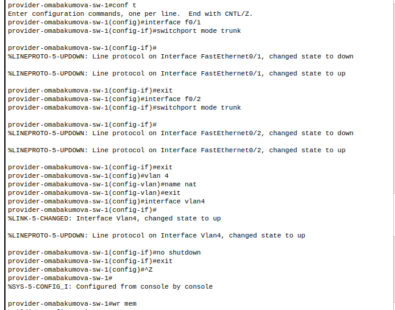{#fig:005 width=80%}

Проверим корректность примененных изменений с помощью команды ```sh ru``` (рис. [-@fig:006]):

{#fig:006 width=80%}

Проведем настройку интерфейсов уже на msk-donskaya-omabakumova-gw-1 (рис. [-@fig:007]):

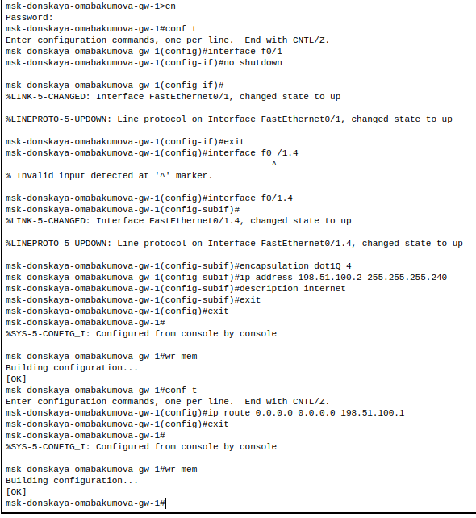{#fig:007 width=80%}

Также с помощью той же команды удостоверимся в корректности проведенной настройки (рис. [-@fig:008]):

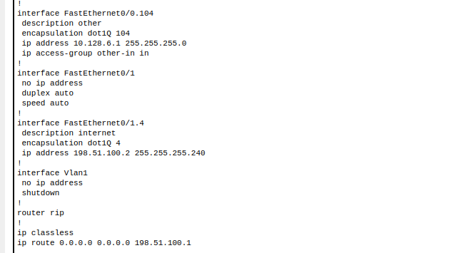{#fig:008 width=80%}

Попробуем пропинговать с msk-donskaya-omabakumova-gw-1 маршрутизатор провайдера (рис. [-@fig:009]):

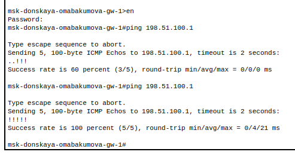{#fig:009 width=80%}

Пинг проходит в первый раз с потерей в два пакета,при повторном пинговании без потерь.

Настроим пула адресов для NAT с настройкой списка доступа. Также уточним с кем и кто может работать(настройки для конкретных сетей) (рис. [-@fig:010]):

{#fig:010 width=80%}

Проверим наличие изменений (рис. [-@fig:011]):

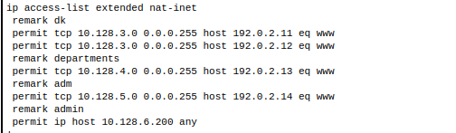{#fig:011 width=80%}

Также продолжим настройку  NAT. Теперь настроим Port Address Translation (PAT) и сделаем настройку интерфейсов для NAT (рис. [-@fig:012]):

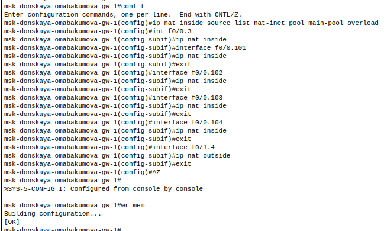{#fig:012 width=80%}

Проверим работоспособность сети сделав пингвание на оконечном устройстве admin в области Донская (рис. [-@fig:013]):

{#fig:013 width=80%}

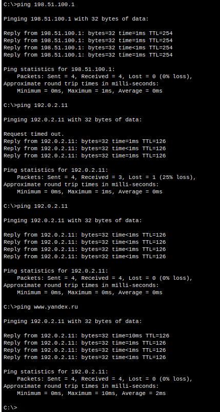{#fig:014 width=80%}

Как можно заметить для начала пустили пинг по статическому адресу www.yandex.ru,затем просто www.yandex.ru.Пинг успешно прошел.
С оконечного устройства dk-donskaya-omabakumova-1 запустим Web-Browser и посмотрим, что мы получим при запросе www.yandex.ru (рис. [-@fig:015]):

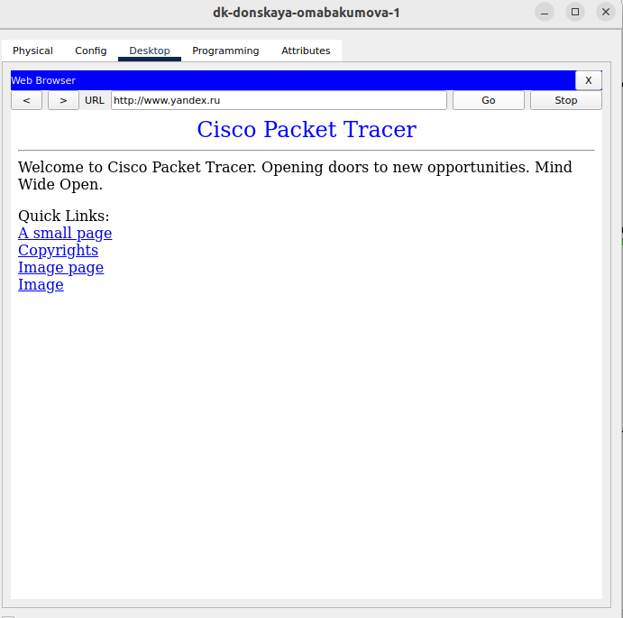{#fig:015 width=80%}

Мы успешно открыли страницу www.yandex.ru.
Проведем настройку доступа из Интернета (рис. [-@fig:016]):

{#fig:016 width=80%}

Дополнительно к заданиям лабораторной работы для проверки поной работоспосбности сети создадим в области Internet оконечное устройство laptop-ext (рис. [-@fig:017]):

{#fig:017 width=80%}

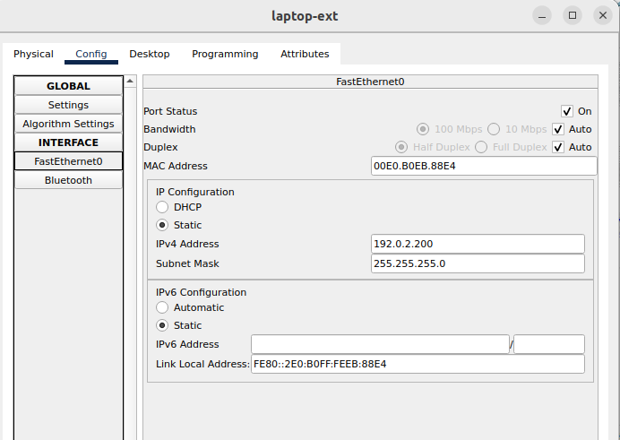{#fig:018 width=80%}

Так как по умолчанию оконечно устройство при создании оказывается в области  Донская, нам необходимо его перенести в область Internet.Это можно сделать перейдя в физическую рабочую область (рис. [-@fig:019]):

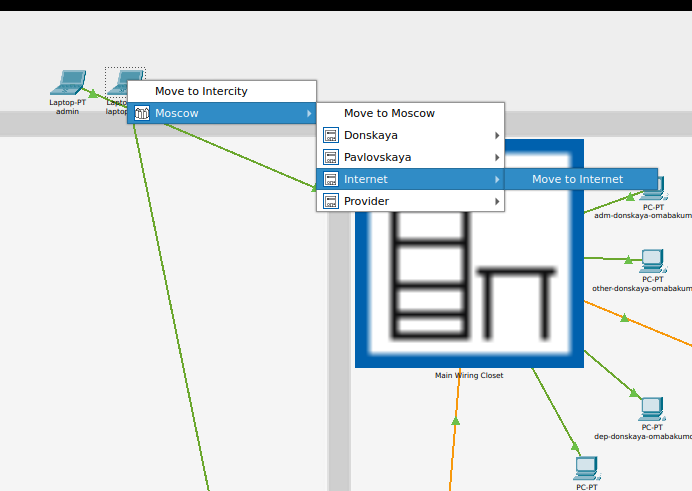{#fig:019 width=80%}

Теперь убедимся в работоспособности сети, проведя несколько тестов на новом оконечном устройстве (рис. [-@fig:020]):

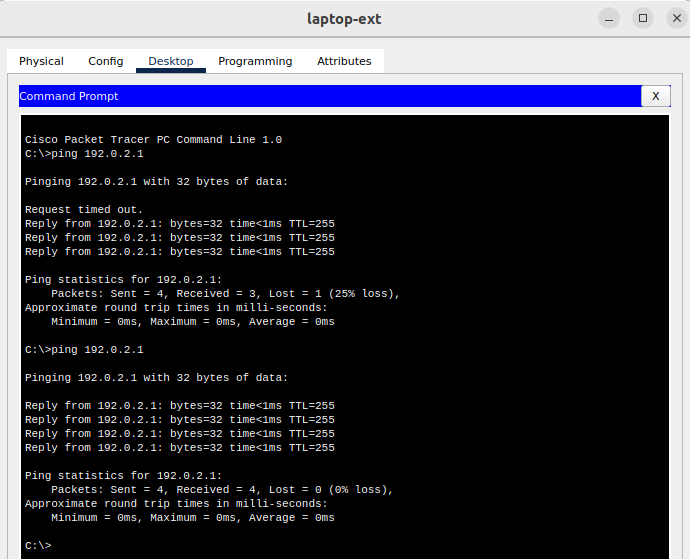{#fig:020 width=80%}

{#fig:021 width=80%}

{#fig:022 width=80%}

# Контрольные вопросы 

1. В чём состоит основной принцип работы NAT (что даёт наличие NAT в сети организации)? 
Основной принцип работы NAT (Network Address Translation) заключается в преобразовании частных IP-адресов, используемых внутри локальной сети, в один или несколько публичных IP-адресов, которые используются для выхода в интернет. Это позволяет организациям экономить IP-адреса, так как несколько устройств могут использовать один публичный адрес, а также обеспечивает дополнительный уровень безопасности, скрывая внутреннюю структуру сети от внешних пользователей.

2. В чём состоит принцип настройки NAT (на каком оборудовании и что нужно настроить для из локальной сети во внешнюю сеть через NAT)? 
Принцип настройки NAT обычно осуществляется на маршрутизаторах или брандмауэрах, которые поддерживают эту функцию. Для настройки NAT необходимо определить интерфейсы: внутренний (где находятся частные IP-адреса) и внешний (где находится публичный IP-адрес). Затем нужно настроить правила преобразования адресов, указывая, какие адреса должны быть преобразованы и каким образом.

3. Можно ли применить Cisco IOS NAT к субинтерфейсам? Да, Cisco IOS NAT может быть применён к субинтерфейсам. 
Это позволяет реализовать NAT для различных виртуальных сетей, работающих на одном физическом интерфейсе маршрутизатора, что удобно для разделения трафика и управления различными сетевыми сегментами.

4. Что такое пулы IP NAT? 
Пулы IP NAT представляют собой наборы публичных IP-адресов, которые могут быть использованы для динамического преобразования адресов устройств внутри локальной сети. Когда устройство запрашивает доступ к интернету, маршрутизатор выбирает доступный адрес из пула и использует его для преобразования частного адреса устройства, что позволяет нескольким устройствам делить ограниченное количество публичных IP-адресов.

5. Что такое статические преобразования NAT? 
Статические преобразования NAT --- это метод, при котором конкретный частный IP-адрес всегда сопоставляется с определённым публичным IP-адресом. Это позволяет обеспечить постоянный доступ к внутреннему ресурсу из внешней сети, так как статическое сопоставление гарантирует, что внешний адрес будет всегда вести к одному и тому же внутреннему адресу.

# Выводы

Во время выполнения данной лабораторной работы я приобрела практические навыки по настройке доступа локальной сети к внешней сети посредством NAT.
