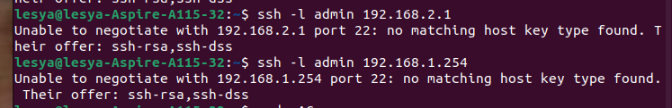

---
## Front matter
title: "Лабораторная работа № 2. Предварительная настройка оборудования Cisco"
author: "Абакумова Олеся Максимовна, НФИбд-02-22"

## Generic otions
lang: ru-RU
toc-title: "Содержание"

## Bibliography
bibliography: bib/cite.bib
csl: pandoc/csl/gost-r-7-0-5-2008-numeric.csl

## Pdf output format
toc: true # Table of contents
toc-depth: 2
lof: true # List of figures
lot: true # List of tables
fontsize: 12pt
linestretch: 1.5
papersize: a4
documentclass: scrreprt
## I18n polyglossia
polyglossia-lang:
  name: russian
  options:
	- spelling=modern
	- babelshorthands=true
polyglossia-otherlangs:
  name: english
## I18n babel
babel-lang: russian
babel-otherlangs: english
## Fonts
mainfont: IBM Plex Serif
romanfont: IBM Plex Serif
sansfont: IBM Plex Sans
monofont: IBM Plex Mono
mathfont: STIX Two Math
mainfontoptions: Ligatures=Common,Ligatures=TeX,Scale=0.94
romanfontoptions: Ligatures=Common,Ligatures=TeX,Scale=0.94
sansfontoptions: Ligatures=Common,Ligatures=TeX,Scale=MatchLowercase,Scale=0.94
monofontoptions: Scale=MatchLowercase,Scale=0.94,FakeStretch=0.9
mathfontoptions:
## Biblatex
biblatex: true
biblio-style: "gost-numeric"
biblatexoptions:
  - parentracker=true
  - backend=biber
  - hyperref=auto
  - language=auto
  - autolang=other*
  - citestyle=gost-numeric
## Pandoc-crossref LaTeX customization
figureTitle: "Рис."
tableTitle: "Таблица"
listingTitle: "Листинг"
lofTitle: "Список иллюстраций"
lotTitle: "Список таблиц"
lolTitle: "Листинги"
## Misc options
indent: true
header-includes:
  - \usepackage{indentfirst}
  - \usepackage{float} # keep figures where there are in the text
  - \floatplacement{figure}{H} # keep figures where there are in the text
---

# Цель работы

Получить основные навыки по начальному конфигурированию оборудования
Cisco.

# Задание

1. Сделать предварительную настройку маршрутизатора:
- задать имя в виде «город-территория-учётная_запись-тип_оборудования-номер»,например msk-donskaya-osbender-gw-1;
- задать интерфейсу Fast Ethernet с номером 0 ip-адрес 192.168.1.254 и маску 255.255.255.0, затем поднять интерфейс;
- задать пароль для доступа к привилегированному режиму (сначала в открытом виде, затем — в зашифрованном);
- настроить доступ к оборудованию сначала через telnet, затем — через ssh (используя в качестве имени домена donskaya.rudn.edu);
- сохранить и экспортировать конфигурацию в отдельный файл.
2. Сделать предварительную настройку коммутатора:
- задать имя в виде «город-территория-учётная_запись-тип_оборудования-номер»,например msk-donskaya-osbender-sw-1;
- задать интерфейсу vlan 2 ip-адрес 192.168.2.1 и маску 255.255.255.0, затем поднять интерфейс;
- привязать интерфейс Fast Ethernet с номером 1 к vlan 2;
- задать в качестве адреса шлюза по умолчанию адрес 192.168.2.254;
- задать пароль для доступа к привилегированному режиму (сначала
в открытом виде, затем — в зашифрованном);
- настроить доступ к оборудованию сначала через telnet, затем — через ssh (используя в качестве имени домена donskaya.rudn.edu);
- для пользователя admin задать доступ 1-го уровня по паролю;
- сохранить и экспортировать конфигурацию в отдельный файл.

# Выполнение лабораторной работы

В логической рабочей области Packet Tracer разместите коммутатор, маршрутизатор и 2 оконечных устройства типа PC, соедините один PC с маршрутизатором, другой PC — с коммутатором (рис. [-@fig:001]):

{#fig:001 width=70%}

Проведем настройку маршрутизатора в соответствии с заданием.Для начала зададим ему ip-адресс, после того как правильно именовали его (рис. [-@fig:002]):

{#fig:002 width=70%}

Затем зададим для него hostname в его консоли (рис. [-@fig:003]):

{#fig:003 width=70%}

Зададим интерфейсу Fast Ethernet с номером 0 ip-адрес 192.168.1.254
и маску 255.255.255.0,затем поднимем его (рис. [-@fig:004]):

{#fig:004 width=70%}

Теперь требуется задать пароль для доступа к привилегированному режиму (сначала
в открытом виде, затем — в зашифрованном) и настроить доступ к оборудованию через ssh (используя в качестве имени домена donskaya.rudn.edu) (рис. [-@fig:005]):

{#fig:005 width=70%}

После настройки маршрутизатора,сохраним и экспортируем конфигурацию в отдельный файл (рис. [-@fig:006]):

{#fig:006 width=70%}

Теперь настроим коммутатор аналогичным методом.Для начала зададим ему правильное именование (рис. [-@fig:007]):

{#fig:007 width=70%}

После именования и задачи hostanme для коммутатора, зададим интерфейсу vlan 2 ip-адрес 192.168.2.1 и маску 255.255.255.0 и поднимем его (рис. [-@fig:008]):

{#fig:008 width=70%}

Привяжем интерфейс Fast Ethernet с номером 1 к vlan 2 и зададим в качестве адреса шлюза по умолчанию адрес 192.168.2.254 (рис. [-@fig:009]):

{#fig:009 width=70%}

Также зададим пароль для доступа к привилегированному режиму (сначала в открытом виде, затем — в зашифрованном), для пользователя admin задать доступ 1-го уровня по паролю (рис. [-@fig:010]):

{#fig:010 width=70%}

Настроим доступ к оборудованию через ssh (используя в качестве имени домена donskaya.rudn.edu) (рис. [-@fig:011]):

{#fig:011 width=70%}

Сохраним и экспортируем конфигурацию коммутатора (рис. [-@fig:012]):

{#fig:012 width=70%}

Проверим работоспособность соединений с помощью команды **ping** (рис. [-@fig:013]):

{#fig:013 width=70%}

{#fig:014 width=70%}

Попробуем подключиться к коммутатору и маршрутизатору через ssh [-@fig:015]):

{#fig:015 width=70%}

К сожалению, у меня не получилось подключиться по ssh к коммутатору и маршрутизатору ;(.

# Контрольные вопросы 

1. Укажите возможные способы подключения к сетевому оборудованию.  
Возможные способы подключения к сетевому оборудованию включают: использование консольного кабеля (обычно RJ-45 к DB-9), подключение через Telnet, подключение через SSH, а также использование веб-интерфейса (если он поддерживается устройством).

2. Каким типом сетевого кабеля следует подключать оконечное оборудование пользователя к маршрутизатору и почему?  
Для подключения оконечного оборудования пользователя к маршрутизатору следует использовать кабель категории 5e или выше (например, Cat 6). Это связано с тем, что такие кабели обеспечивают достаточную скорость передачи данных и поддержку современных сетевых стандартов, таких как Ethernet.

3. Каким типом сетевого кабеля следует подключать оконечное оборудование пользователя к коммутатору и почему?  
Для подключения оконечного оборудования пользователя к коммутатору также рекомендуется использовать кабель категории 5e или выше (например, Cat 6). Это необходимо для обеспечения высокой скорости передачи данных и надежной работы в локальной сети.

4. Каким типом сетевого кабеля следует подключать коммутатор к коммутатору и почему?  
Для подключения коммутатора к коммутатору лучше использовать оптоволоконные кабели или медные кабели категории 6 и выше (например, Cat 6a), особенно если нужно обеспечить высокую пропускную способность на больших расстояниях. Оптоволоконные кабели обеспечивают большую дальность и пропускную способность, что делает их предпочтительными для межкоммутаторных соединений.

5. Укажите возможные способы настройки доступа к сетевому оборудованию по паролю.  
Возможные способы настройки доступа к сетевому оборудованию по паролю включают установку пароля на консольный доступ, настройку пароля для VTY-линий (для Telnet/SSH) и использование аутентификации через протоколы, такие как RADIUS или TACACS+.

6. Укажите возможные способы настройки удалённого доступа к сетевому оборудованию. Какой из способов предпочтительнее и почему?  
Возможные способы настройки удалённого доступа к сетевому оборудованию включают Telnet и SSH. SSH является предпочтительным способом, так как он обеспечивает шифрование данных, что делает соединение более безопасным по сравнению с Telnet, который передает данные в открытом виде и подвержен перехвату.
   
# Выводы

Во время выполнения данной лабораторной работы я получила основные навыки по начальному конфигурированию оборудования Cisco.

