---
## Front matter
lang: ru-RU
title: Лабораторная работа № 3. Планирование локальной сети организации
author:
  - Абакумова О. М.
institute:
  - Российский университет дружбы народов, Москва, Россия

## i18n babel
babel-lang: russian
babel-otherlangs: english

## Formatting pdf
toc: false
toc-title: Содержание
slide_level: 2
aspectratio: 169
section-titles: true
theme: metropolis
header-includes:
 - \metroset{progressbar=frametitle,sectionpage=progressbar,numbering=fraction}
mainfont: Open Sans Light
---

# Информация

## Докладчик

:::::::::::::: {.columns align=center}
::: {.column width="70%"}

  * Абакумова Олеся Максимовна
  * Студентка
  * Российский университет дружбы народов
  * 1132220832@pfur.ru
  * <https://github.com/omabakumova>

:::
::: {.column width="30%"}

:::
::::::::::::::

# Цель работы

Познакомиться с принципами планирования локальной сети организации.

# Задания 

1. Используя графический редактор (например, Dia), требуется повторить
схемы L1, L2, L3, а также сопутствующие им таблицы VLAN, IP-адресов
и портов подключения оборудования планируемой сети.
2. Рассмотренный выше пример планирования адресного пространства сети
базируется на разбиении сети 10.128.0.0/16 на соответствующие подсети.
Требуется сделать аналогичный план адресного пространства для сетей
172.16.0.0/12 и 192.168.0.0/16 с соответствующими схемами сети и сопутствующими таблицами VLAN, IP-адресов и портов подключения оборудования.

# Выполнение лабораторной работы

## Схема сети 10.128.0.0/16

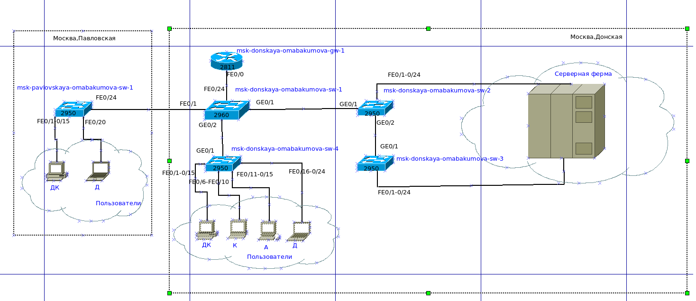{#fig:001 width=70%}

## Схема сети 10.128.0.0/16

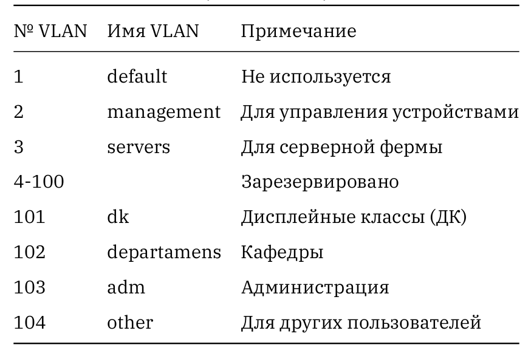{#fig:002 width=50%}

## Схема сети 10.128.0.0/16

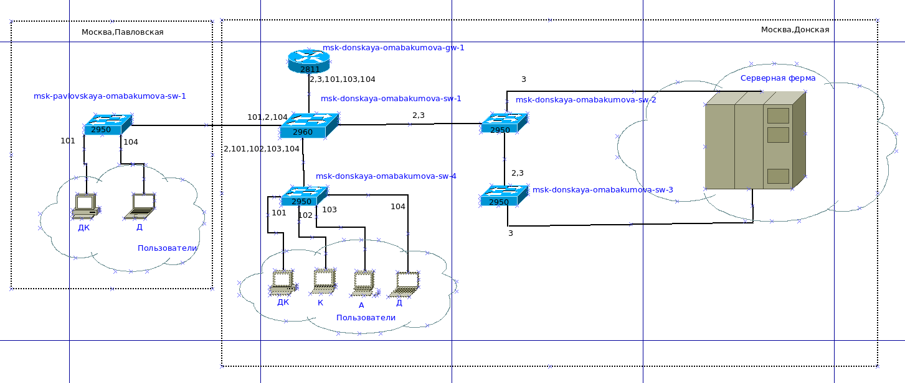{#fig:003 width=70%}

## Схема сети 10.128.0.0/16

{#fig:004 width=40%}

## Схема сети 10.128.0.0/16

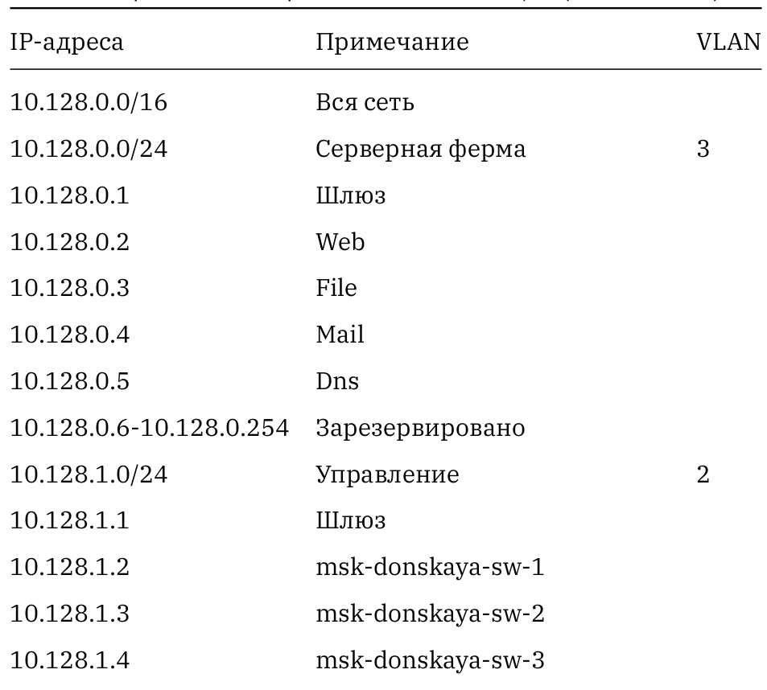{#fig:005 width=35%}

## Схема сети 10.128.0.0/16

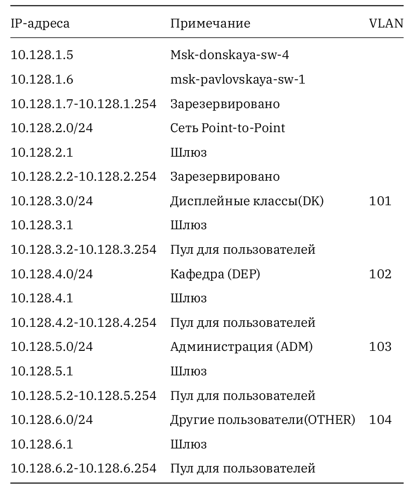{#fig:006 width=35%}

## Схема сети 10.128.0.0/16

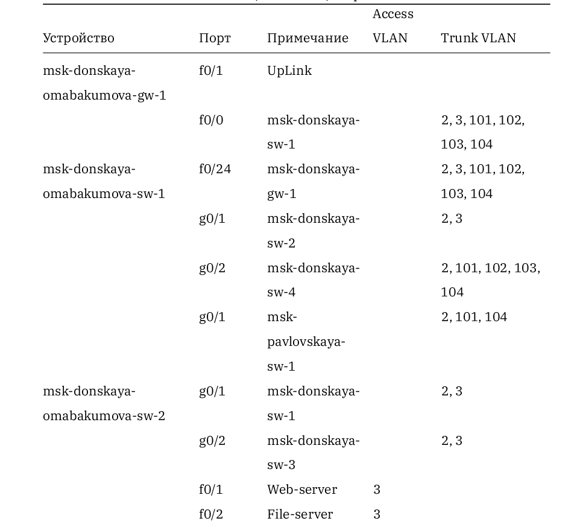{#fig:007 width=35%}

## Схема сети 10.128.0.0/16

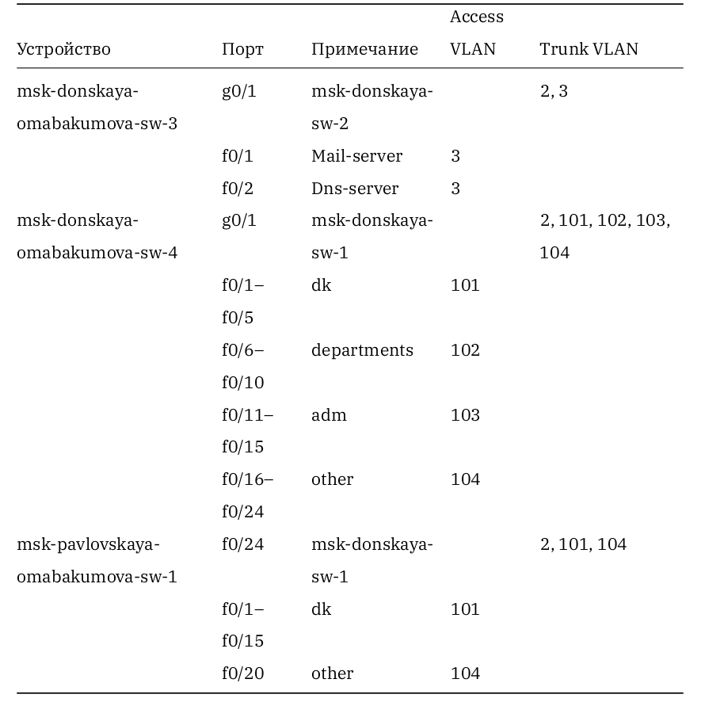{#fig:008 width=40%}

## Схема сети 10.128.0.0/16

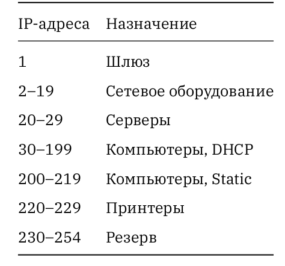{#fig:009 width=40%}

## Схема сети 172.16.0.0/12

{#fig:010 width=40%}

## Схема сети 172.16.0.0/12

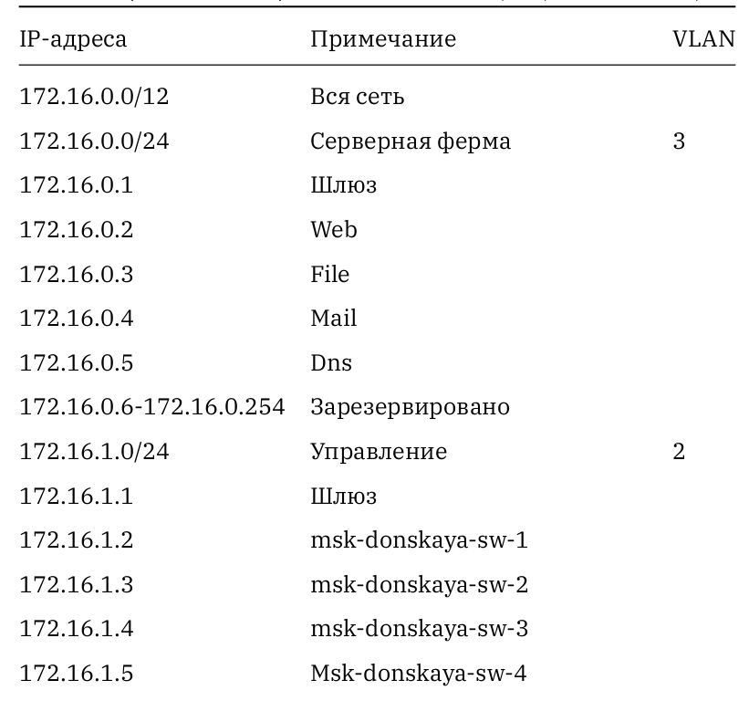{#fig:011 width=35%}

## Схема сети 172.16.0.0/12

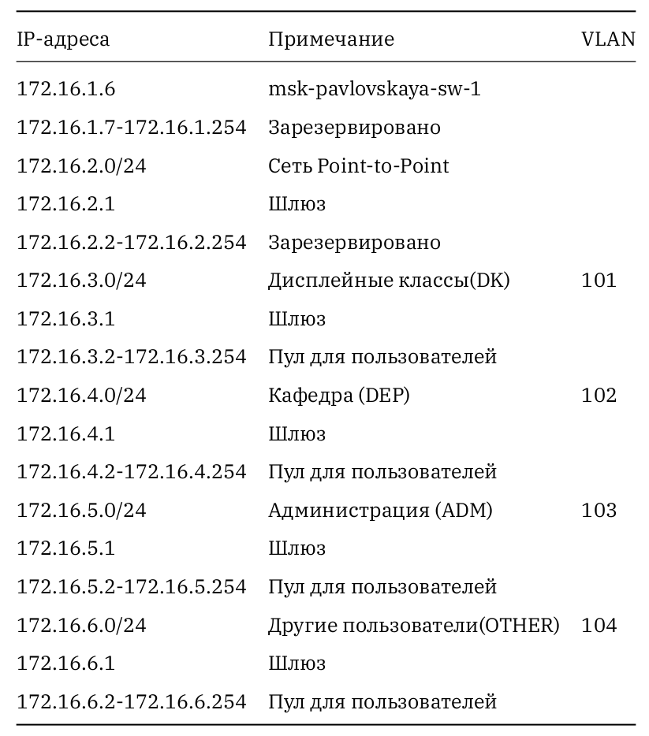{#fig:012 width=40%}

## Схема сети 192.168.0.0/16

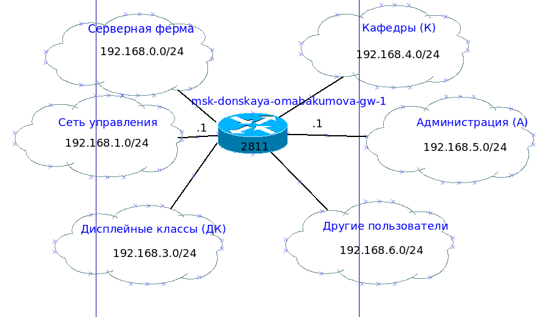{#fig:013 width=40%}

## Схема сети 192.168.0.0/16

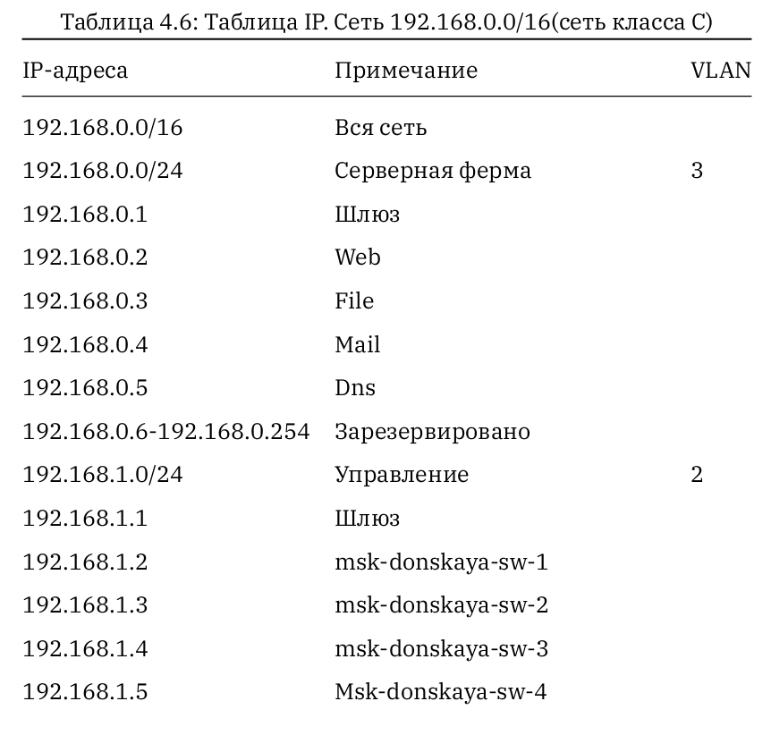{#fig:014 width=35%}

## Схема сети 192.168.0.0/16

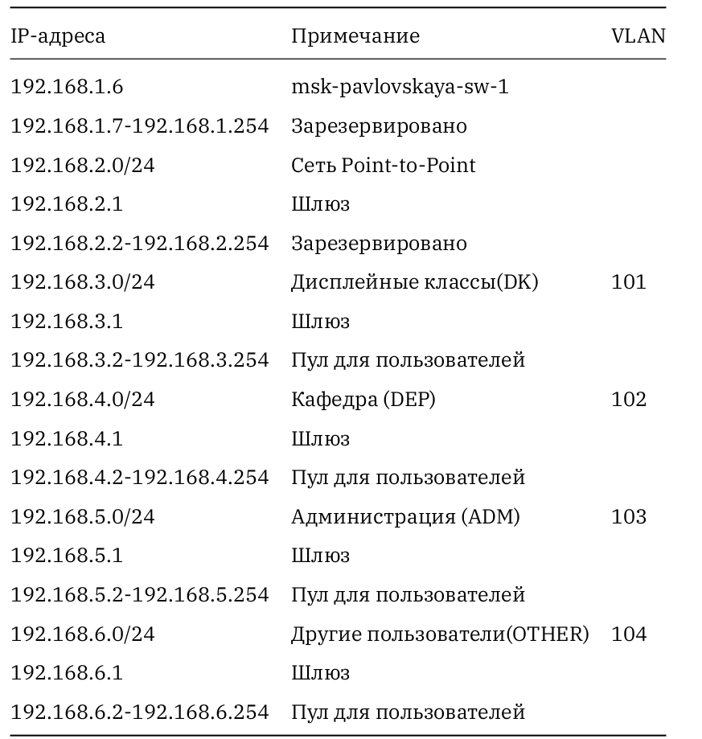{#fig:015 width=35%}

# Выводы

Во время выполнения данной лабораторной работы я ознакомилась с принципами планирования локальной сети организации.

