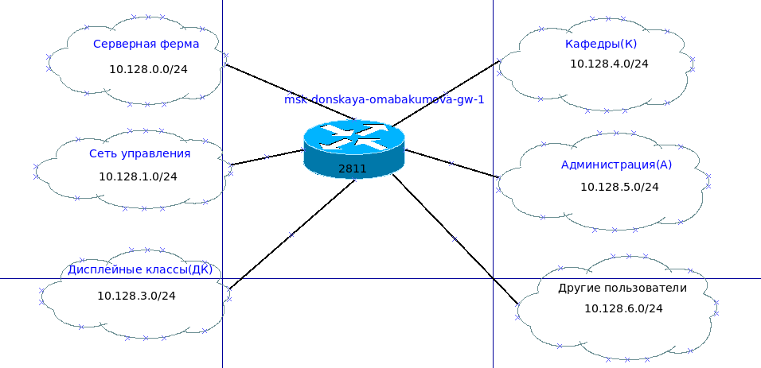
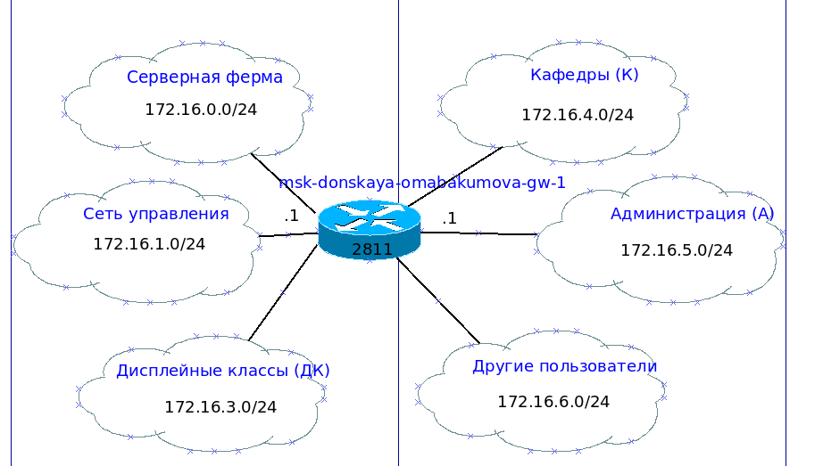

---
## Front matter
title: "Лабораторная работа № 3. Планирование локальной сети организации"
author: "Абакумова Олеся Максимовна, НФИбд-02-22"

## Generic otions
lang: ru-RU
toc-title: "Содержание"

## Bibliography
bibliography: bib/cite.bib
csl: pandoc/csl/gost-r-7-0-5-2008-numeric.csl

## Pdf output format
toc: true # Table of contents
toc-depth: 2
lof: true # List of figures
lot: true # List of tables
fontsize: 12pt
linestretch: 1.5
papersize: a4
documentclass: scrreprt
## I18n polyglossia
polyglossia-lang:
  name: russian
  options:
	- spelling=modern
	- babelshorthands=true
polyglossia-otherlangs:
  name: english
## I18n babel
babel-lang: russian
babel-otherlangs: english
## Fonts
mainfont: IBM Plex Serif
romanfont: IBM Plex Serif
sansfont: IBM Plex Sans
monofont: IBM Plex Mono
mathfont: STIX Two Math
mainfontoptions: Ligatures=Common,Ligatures=TeX,Scale=0.94
romanfontoptions: Ligatures=Common,Ligatures=TeX,Scale=0.94
sansfontoptions: Ligatures=Common,Ligatures=TeX,Scale=MatchLowercase,Scale=0.94
monofontoptions: Scale=MatchLowercase,Scale=0.94,FakeStretch=0.9
mathfontoptions:
## Biblatex
biblatex: true
biblio-style: "gost-numeric"
biblatexoptions:
  - parentracker=true
  - backend=biber
  - hyperref=auto
  - language=auto
  - autolang=other*
  - citestyle=gost-numeric
## Pandoc-crossref LaTeX customization
figureTitle: "Рис."
tableTitle: "Таблица"
listingTitle: "Листинг"
lofTitle: "Список иллюстраций"
lotTitle: "Список таблиц"
lolTitle: "Листинги"
## Misc options
indent: true
header-includes:
  - \usepackage{indentfirst}
  - \usepackage{float} # keep figures where there are in the text
  - \floatplacement{figure}{H} # keep figures where there are in the text
---

# Цель работы

Познакомиться с принципами планирования локальной сети организации.

# Теоретическое введение

Сеть организации должна соответствовать так называемой «иерархической
модели сети», т.е. оборудование сетевой инфраструктуры при планировании
должно быть распределено по трём уровням:

1. **Уровень ядра (Core Layer)** --- высокопроизводительные сетевые устройства
(коммутаторы, маршрутизаторы), обеспечивающие скоростную передачу
трафика между сегментами уровня распределения.

2. **Уровень распределения (Distribution Layer)** --- устройства (коммутато-
ры, маршрутизаторы), обеспечивающие применение политик безопасности
и качества обслуживания (QoS), агрегацию и маршрутизацию трафика
посредством VLAN, определение широковещательных доменов.

3. **Уровень доступа (Access Layer)** --- устройства для подключения серверов
и оконечного оборудования пользователей к сети организации.

# Задание

1. Используя графический редактор (например, Dia), требуется повторить
схемы L1, L2, L3, а также сопутствующие им таблицы VLAN, IP-адресов
и портов подключения оборудования планируемой сети.
2. Рассмотренный выше пример планирования адресного пространства сети
базируется на разбиении сети 10.128.0.0/16 на соответствующие подсети.
Требуется сделать аналогичный план адресного пространства для сетей
172.16.0.0/12 и 192.168.0.0/16 с соответствующими схемами сети и сопутствующими таблицами VLAN, IP-адресов и портов подключения оборудования.

# Выполнение лабораторной работы

Примерная схема планируемой сети с указанием типов и номеров портов
подключения устройств, соответствующая физическому уровню модели OSI
(L1), будет иметь вид (рис. [-@fig:001]):

{#fig:001 width=80%}

В качестве оборудования уровня ядра будем использовать маршрутизатор Cisco 2811, на уровне распределения — коммутаторы Cisco 2960 с возможностью настройки VLAN, а на уровне доступа — коммутаторы Cisco 2950.
Далее спланируем распределение VLAN. Рекомендуется выделять
в отдельные подсети (VLAN) устройства управления сетью, а также различные
группы пользователей (табл. [-@tbl:vlan]):

:Таблица VLAN {#tbl:vlan}

| № VLAN       | Имя VLAN    | Примечание                  |
|--------------|-------------|-----------------------------|
| 1            | default     | Не используется             |
| 2            | management  | Для управления устройствами |
| 3            | servers     | Для серверной фермы         |
| 4-100        |             | Зарезервировано             |
| 101          | dk          | Дисплейные классы (ДК)      |
| 102          | departamens | Кафедры                     |
| 103          | adm         | Администрация               |
| 104          | other       | Для других пользователей    |

Примерная схема сети с указанием номеров VLAN, соответствующая ка-
нальному уровню модели OSI (L2), будет иметь вид (рис. [-@fig:002]):

{#fig:002 width=80%}

Далее необходимо определить адресное пространство, ассоциированное с выделенными VLAN. Примерная схема сети, соответствующая сетевому уровню
модели OSI (L3), будет иметь вид (рис. [-@fig:003]):

{#fig:003 width=70%}

Более детальное распределение IP-адресов в сети (табл. [-@tbl:ip]).
При планировании IP-адресация (разбиении адресного пространства сети
на подсети) следует учитывать потенциальное количество устройств подсети,
а также возможность увеличения их числа.

:Таблица IP. Сеть 10.128.0.0/16(сеть класс  A) {#tbl:ip}

| IP-адреса               | Примечание                 | VLAN |
|-------------------------|----------------------------|------|
| 10.128.0.0/16           | Вся сеть                   |      |
| 10.128.0.0/24           | Серверная ферма            | 3    |
| 10.128.0.1              | Шлюз                       |      |
| 10.128.0.2              | Web                        |      |
| 10.128.0.3              | File                       |      |
| 10.128.0.4              | Mail                       |      |
| 10.128.0.5              | Dns                        |      |
| 10.128.0.6-10.128.0.254 | Зарезервировано            |      |
| 10.128.1.0/24           | Управление                 | 2    |
| 10.128.1.1              | Шлюз                       |      |
| 10.128.1.2              | msk-donskaya-sw-1          |      |
| 10.128.1.3              | msk-donskaya-sw-2          |      |
| 10.128.1.4              | msk-donskaya-sw-3          |      |
| 10.128.1.5              | Msk-donskaya-sw-4          |      |
| 10.128.1.6              | msk-pavlovskaya-sw-1       |      |
| 10.128.1.7-10.128.1.254 | Зарезервировано            |      |
| 10.128.2.0/24           | Сеть Point-to-Point        |      |
| 10.128.2.1              | Шлюз                       |      |
| 10.128.2.2-10.128.2.254 | Зарезервировано            |      |
| 10.128.3.0/24           | Дисплейные классы(DK)      | 101  |
| 10.128.3.1              | Шлюз                       |      |
| 10.128.3.2-10.128.3.254 | Пул для пользователей      |      |
| 10.128.4.0/24           | Кафедра (DEP)              | 102  |
| 10.128.4.1              | Шлюз                       |      |
| 10.128.4.2-10.128.4.254 | Пул для пользователей      |      |
| 10.128.5.0/24           | Администрация (ADM)        | 103  |
| 10.128.5.1              | Шлюз                       |      |
| 10.128.5.2-10.128.5.254 | Пул для пользователей      |      |
| 10.128.6.0/24           | Другие пользователи(OTHER) | 104  |
| 10.128.6.1              | Шлюз                       |      |
| 10.128.6.2-10.128.6.254 | Пул для пользователей      |      |

Приведён также план подключения оборудования сети по портам (табл. [-@tbl:fiz]):

:Таблица портов {#tbl:fiz}

| Устройство                       | Порт        | Примечание           | Access VLAN | Trunk VLAN               |
|----------------------------------|-------------|----------------------|-------------|--------------------------|
| msk-donskaya-omabakumova-gw-1    | f0/1        | UpLink               |             |                          |
|                                  | f0/0        | msk-donskaya-sw-1    |             | 2, 3, 101, 102, 103, 104 |
| msk-donskaya-omabakumova-sw-1    | f0/24       | msk-donskaya-gw-1    |             | 2, 3, 101, 102, 103, 104 |
|                                  | g0/1        | msk-donskaya-sw-2    |             | 2, 3                     |
|                                  | g0/2        | msk-donskaya-sw-4    |             | 2, 101, 102, 103, 104    |
|                                  | g0/1        | msk-pavlovskaya-sw-1 |             | 2, 101, 104              |
| msk-donskaya-omabakumova-sw-2    | g0/1        | msk-donskaya-sw-1    |             | 2, 3                     |
|                                  | g0/2        | msk-donskaya-sw-3    |             | 2, 3                     |
|                                  | f0/1        | Web-server           | 3           |                          |
|                                  | f0/2        | File-server          | 3           |                          |
| msk-donskaya-omabakumova-sw-3    | g0/1        | msk-donskaya-sw-2    |             | 2, 3                     |
|                                  | f0/1        | Mail-server          | 3           |                          |
|                                  | f0/2        | Dns-server           | 3           |                          |
| msk-donskaya-omabakumova-sw-4    | g0/1        | msk-donskaya-sw-1    |             | 2, 101, 102, 103, 104    |
|                                  | f0/1–f0/5   | dk                   | 101         |                          |
|                                  | f0/6–f0/10  | departments          | 102         |                          |
|                                  | f0/11–f0/15 | adm                  | 103         |                          |
|                                  | f0/16–f0/24 | other                | 104         |                          |
| msk-pavlovskaya-omabakumova-sw-1 | f0/24       | msk-donskaya-sw-1    |             | 2, 101, 104              |
|                                  | f0/1–f0/15  | dk                   | 101         |                          |
|                                  | f0/20       | other                | 104         |                          | 

Регламент выделения ip-адресов дан в табл. [-@tbl:reg] :

:Регламент выделения ip-адресов (для сети класса C) {#tbl:reg}

| IP-адреса | Назначение           |
|-----------|----------------------|
| 1         | Шлюз                 |
| 2–19      | Сетевое оборудование |
| 20–29     | Серверы              |
| 30–199    | Компьютеры, DHCP     |
| 200–219   | Компьютеры, Static   |
| 220–229   | Принтеры             |
| 230–254   | Резерв               |

Сделаем аналогичный план адресного пространства для сетей 172.16.0.0/12(сеть класс B) и 192.168.0.0/16(сеть класс C) с соответствующими схемами сети и сопутствующими таблицами VLAN, IP-адресов и портов подключения оборудования.В данном случае схемы физического и канального уровней останутся аналогичными без изменений.Соответственно,задокументируем схемы сетевого уровня для этих сетей.
Начнем с 172.16.0.0/12.Схема маршрутизации такой сети на сетевом уровне будет выглядеть следующим образом (рис. [-@fig:004]):

{#fig:004 width=70%}

Таблица детального распределния IP-адресов для такой сети приведена ниже (табл. [-@tbl:ip2]):

:Таблица IP. Сеть 172.16.0.0/12(сеть класса B) {#tbl:ip2}

| IP-адреса               | Примечание                 | VLAN |
|-------------------------|----------------------------|------|
| 172.16.0.0/12           | Вся сеть                   |      |
| 172.16.0.0/24           | Серверная ферма            | 3    |
| 172.16.0.1              | Шлюз                       |      |
| 172.16.0.2              | Web                        |      |
| 172.16.0.3              | File                       |      |
| 172.16.0.4              | Mail                       |      |
| 172.16.0.5              | Dns                        |      |
| 172.16.0.6-172.16.0.254 | Зарезервировано            |      |
| 172.16.1.0/24           | Управление                 | 2    |
| 172.16.1.1              | Шлюз                       |      |
| 172.16.1.2              | msk-donskaya-sw-1          |      |
| 172.16.1.3              | msk-donskaya-sw-2          |      |
| 172.16.1.4              | msk-donskaya-sw-3          |      |
| 172.16.1.5              | Msk-donskaya-sw-4          |      |
| 172.16.1.6              | msk-pavlovskaya-sw-1       |      |
| 172.16.1.7-172.16.1.254 | Зарезервировано            |      |
| 172.16.2.0/24           | Сеть Point-to-Point        |      |
| 172.16.2.1              | Шлюз                       |      |
| 172.16.2.2-172.16.2.254 | Зарезервировано            |      |
| 172.16.3.0/24           | Дисплейные классы(DK)      | 101  |
| 172.16.3.1              | Шлюз                       |      |
| 172.16.3.2-172.16.3.254 | Пул для пользователей      |      |
| 172.16.4.0/24           | Кафедра (DEP)              | 102  |
| 172.16.4.1              | Шлюз                       |      |
| 172.16.4.2-172.16.4.254 | Пул для пользователей      |      |
| 172.16.5.0/24           | Администрация (ADM)        | 103  |
| 172.16.5.1              | Шлюз                       |      |
| 172.16.5.2-172.16.5.254 | Пул для пользователей      |      |
| 172.16.6.0/24           | Другие пользователи(OTHER) | 104  |
| 172.16.6.1              | Шлюз                       |      |
| 172.16.6.2-172.16.6.254 | Пул для пользователей      |      |

Теперь аналогично сделаем план адресного пространства для сети 192.168.0.0/16.Схема мрашрутизации на сетевом уровне для нее будет следующая (рис. [-@fig:005]):

{#fig:005 width=70%}

Теперь составим для этой сети таблицу детального распределения IP-адресов, как и для всех предыдущих сетей (табл. [-@tbl:ip3]):

:Таблица IP. Сеть 192.168.0.0/16(сеть класса C) {#tbl:ip3}

| IP-адреса                 | Примечание                 | VLAN |
|---------------------------|----------------------------|------|
| 192.168.0.0/16            | Вся сеть                   |      |
| 192.168.0.0/24            | Серверная ферма            | 3    |
| 192.168.0.1               | Шлюз                       |      |
| 192.168.0.2               | Web                        |      |
| 192.168.0.3               | File                       |      |
| 192.168.0.4               | Mail                       |      |
| 192.168.0.5               | Dns                        |      |
| 192.168.0.6-192.168.0.254 | Зарезервировано            |      |
| 192.168.1.0/24            | Управление                 | 2    |
| 192.168.1.1               | Шлюз                       |      |
| 192.168.1.2               | msk-donskaya-sw-1          |      |
| 192.168.1.3               | msk-donskaya-sw-2          |      |
| 192.168.1.4               | msk-donskaya-sw-3          |      |
| 192.168.1.5               | Msk-donskaya-sw-4          |      |
| 192.168.1.6               | msk-pavlovskaya-sw-1       |      |
| 192.168.1.7-192.168.1.254 | Зарезервировано            |      |
| 192.168.2.0/24            | Сеть Point-to-Point        |      |
| 192.168.2.1               | Шлюз                       |      |
| 192.168.2.2-192.168.2.254 | Зарезервировано            |      |
| 192.168.3.0/24            | Дисплейные классы(DK)      | 101  |
| 192.168.3.1               | Шлюз                       |      |
| 192.168.3.2-192.168.3.254 | Пул для пользователей      |      |
| 192.168.4.0/24            | Кафедра (DEP)              | 102  |
| 192.168.4.1               | Шлюз                       |      |
| 192.168.4.2-192.168.4.254 | Пул для пользователей      |      |
| 192.168.5.0/24            | Администрация (ADM)        | 103  |
| 192.168.5.1               | Шлюз                       |      |
| 192.168.5.2-192.168.5.254 | Пул для пользователей      |      |
| 192.168.6.0/24            | Другие пользователи(OTHER) | 104  |
| 192.168.6.1               | Шлюз                       |      |
| 192.168.6.2-192.168.6.254 | Пул для пользователей      |      |

В таблицах [-@tbl:ip2] и [-@tbl:ip3] показаны маршрутизационные схемы для двух различных сетей. Мы изменили лишь первые два байта (октета), так как в этих сетях возможно выделение подсети с маской 255.255.255.0 (/24), аналогично сети 10.128.0.0/16.

# Контрольные вопросы 

1. Что такое модель взаимодействия открытых систем (OSI)? Какие уровни в ней есть? Какие функции закреплены за каждым уровнем модели OSI? 

Модель взаимодействия открытых систем (OSI) — это концептуальная модель, разработанная для стандартизации функций сетевых систем и упрощения взаимодействия между различными сетевыми устройствами. Она состоит из семи уровней: физический уровень (определяет физические характеристики передачи данных), канальный уровень (обеспечивает надежную передачу данных между узлами), сетевой уровень (отвечает за маршрутизацию и адресацию), транспортный уровень (гарантирует доставку данных и управление потоком), сеансовый уровень (управляет сессиями связи), представительный уровень (обрабатывает данные для приложения) и прикладной уровень (предоставляет интерфейсы для пользовательских приложений).

2. Какие функции выполняет коммутатор? 

Коммутатор выполняет функции соединения устройств в локальной сети, фильтрации и перенаправления кадров данных на основе MAC-адресов, а также управления трафиком, обеспечивая эффективность передачи данных. Он может также выполнять функции VLAN, обеспечивать безопасность и управление сетью.

3. Какие функции выполняет маршрутизатор? 

Маршрутизатор отвечает за соединение различных сетей, маршрутизацию пакетов данных между ними, определение оптимальных маршрутов для передачи информации, а также управление трафиком и обеспечением безопасности через фильтрацию пакетов.

4. В чём отличие коммутаторов третьего уровня от коммутаторов второго уровня? 

Коммутаторы второго уровня работают на канальном уровне модели OSI и осуществляют коммутирование на основе MAC-адресов, тогда как коммутаторы третьего уровня работают на сетевом уровне и могут выполнять маршрутизацию пакетов данных между различными подсетями, используя IP-адреса.

5. Что такое сетевой интерфейс? 

Сетевой интерфейс — это точка подключения устройства к сети, которая позволяет ему обмениваться данными с другими устройствами. Он может быть как физическим (например, сетевой адаптер), так и логическим (например, виртуальный интерфейс).

6. Что такое сетевой порт? 

Сетевой порт — это логическая конструкция, которая используется для идентификации конкретного процесса или службы на устройстве в сети. Порты позволяют различным приложениям обмениваться данными по одному и тому же IP-адресу, используя разные номера портов.

7. Кратко охарактеризуйте технологии Ethernet, Fast Ethernet, Gigabit Ethernet. 

Ethernet — это стандарт для локальных сетей, обеспечивающий передачу данных на скорости до 10 Мбит/с. Fast Ethernet увеличивает скорость передачи до 100 Мбит/с, используя ту же технологию. Gigabit Ethernet обеспечивает ещё более высокую скорость передачи данных — до 1 Гбит/с, что делает его подходящим для современных высокоскоростных сетей.

8. Что такое IP-адрес (IPv4-адрес)? Определите понятия сеть, подсеть, маска подсети. Охарактеризуйте служебные IP-адреса. Приведите пример с пояснениями разбиения сети на две или более подсетей с указанием числа узлов в каждой подсети. 

IP-адрес (IPv4-адрес) — это уникальный адрес, присваиваемый устройству в сети для его идентификации. Сеть — это группа устройств, объединённых в одну логическую структуру; подсеть — это часть сети, выделенная для более эффективного управления; маска подсети определяет, какая часть IP-адреса относится к сети, а какая — к узлам. Служебные IP-адреса включают адреса для локальных сетей (например, 192.168.x.x) и специальные адреса (например, 0.0.0.0). Например, сеть 192.168.1.0 с маской 255.255.255.0 может быть разбита на две подсети: 192.168.1.0/25 (число узлов — 126) и 192.168.1.128/25 (число узлов — 126).

9. Дайте определение понятию VLAN. Для чего применяется VLAN в сети организации? Какие преимущества даёт применение VLAN в сети организации? Приведите примеры разных ситуаций. 

VLAN (виртуальная локальная сеть) — это логическая подгруппа устройств в сети, которая позволяет разделять трафик и управлять им независимо от физической топологии сети. VLAN применяется для улучшения безопасности, управления трафиком и повышения производительности сети. Преимущества включают возможность изоляции трафика между группами пользователей и упрощение управления сетью. Например, в организации можно создать отдельные VLAN для бухгалтерии и IT-отдела, чтобы ограничить доступ к конфиденциальной информации.

10. В чём отличие Trunk Port от Access Port? 

Trunk Port — это порт на коммутаторе, который может передавать трафик нескольких VLAN одновременно и используется для соединения с другими коммутаторами или маршрутизаторами. Access Port — это порт, который принадлежит только одной VLAN и используется для подключения конечных устройств, таких как компьютеры или принтеры, к сети.
   
# Выводы

Во время выполнения данной лабораторной работы я ознакомилась с принципами планирования локальной сети организации.

