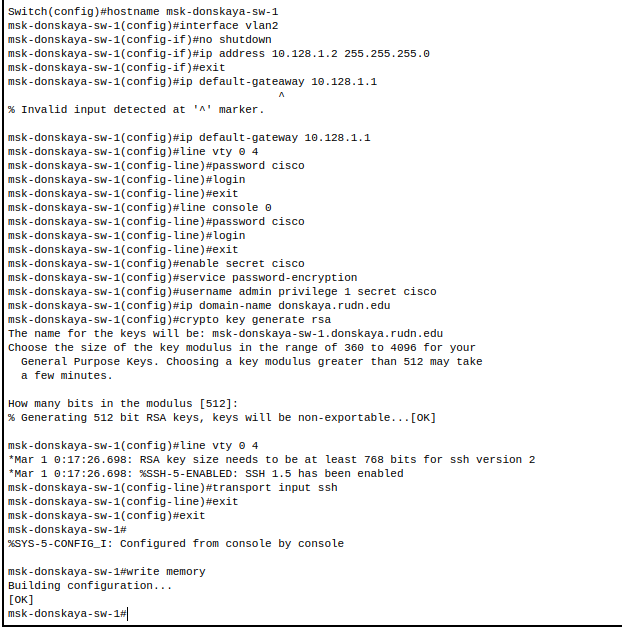
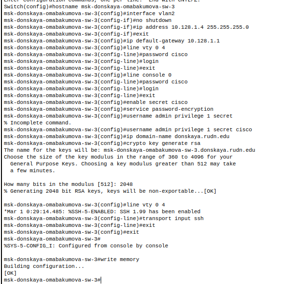
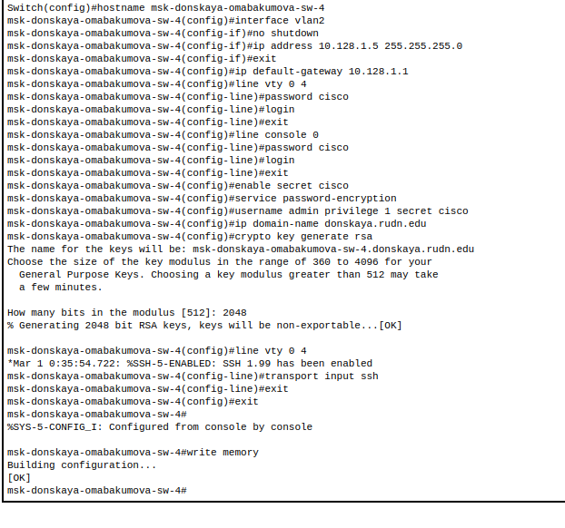
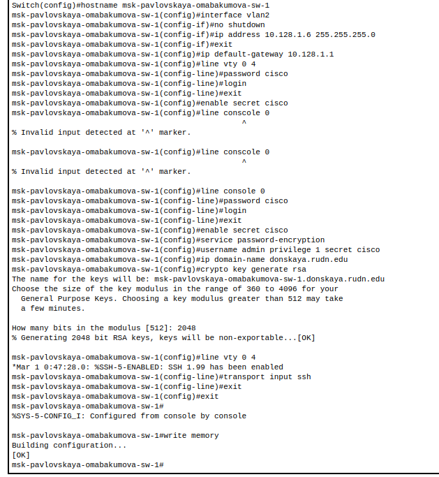

---
## Front matter
lang: ru-RU
title: Лабораторная работа № 4. Первоначальное конфигурирование сети
author:
  - Абакумова О. М.
institute:
  - Российский университет дружбы народов, Москва, Россия

## i18n babel
babel-lang: russian
babel-otherlangs: english

## Formatting pdf
toc: false
toc-title: Содержание
slide_level: 2
aspectratio: 169
section-titles: true
theme: metropolis
header-includes:
 - \metroset{progressbar=frametitle,sectionpage=progressbar,numbering=fraction}
mainfont: Open Sans Light
---

# Информация

## Докладчик

:::::::::::::: {.columns align=center}
::: {.column width="70%"}

  * Абакумова Олеся Максимовна
  * Студентка
  * Российский университет дружбы народов
  * 1132220832@pfur.ru
  * <https://github.com/omabakumova>

:::
::: {.column width="30%"}

:::
::::::::::::::

# Цель работы

Провести подготовительную работу по первоначальной настройке коммутаторов сети.

# Задания 

Требуется сделать первоначальную настройку коммутаторов сети. Под первоначальной
настройкой понимается указание имени устройства, его IP-адреса, настройка
доступа по паролю к виртуальным терминалам и консоли, настройка удалённого доступа к устройству по ssh.

# Выполнение лабораторной работы

## Первоначальная настройка коммутаторов сети

{#fig:001 width=40%}

## Первоначальная настройка коммутаторов сети

{#fig:002 width=40%}

## Первоначальная настройка коммутаторов сети

{#fig:003 width=40%}

## Первоначальная настройка коммутаторов сети

{#fig:004 width=40%}

## Первоначальная настройка коммутаторов сети

{#fig:005 width=40%}

## Первоначальная настройка коммутаторов сети

{#fig:006 width=40%}

## Первоначальная настройка коммутаторов сети

{#fig:007 width=40%}

# Выводы

Во время выполнения данной лабораторной работы я провела подготовительную работу по первоначальной настройке коммутаторов сети.

