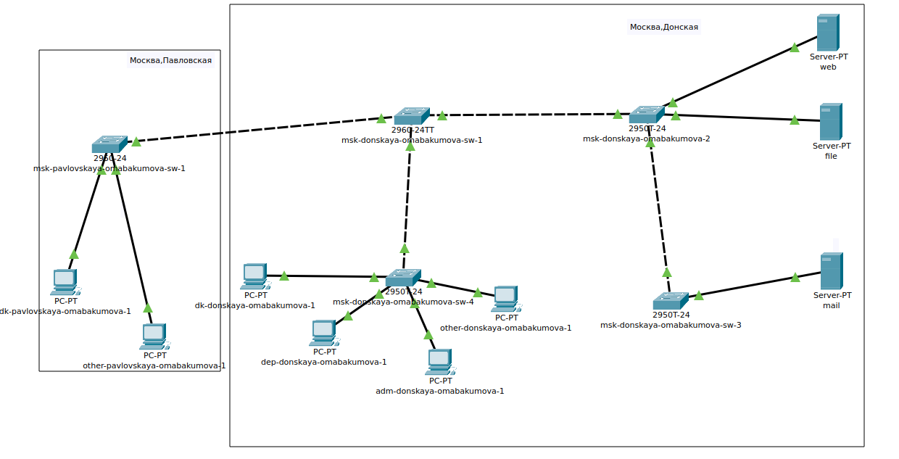
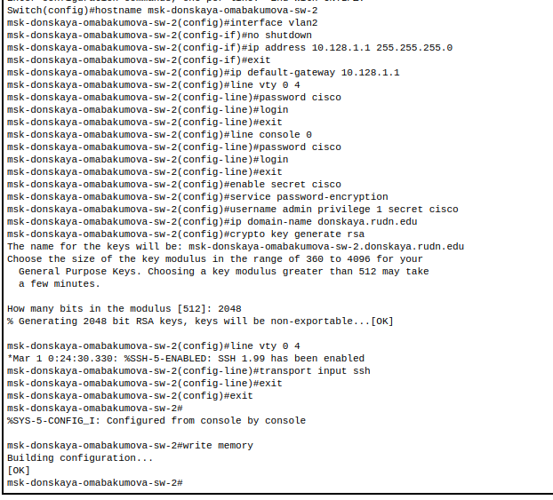
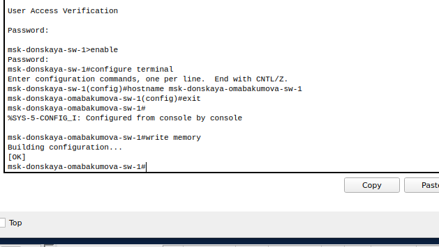

---
## Front matter
title: "Лабораторная работа № 4. Первоначальное конфигурирование сети"
author: "Абакумова Олеся Максимовна, НФИбд-02-22"

## Generic otions
lang: ru-RU
toc-title: "Содержание"

## Bibliography
bibliography: bib/cite.bib
csl: pandoc/csl/gost-r-7-0-5-2008-numeric.csl

## Pdf output format
toc: true # Table of contents
toc-depth: 2
lof: true # List of figures
lot: true # List of tables
fontsize: 12pt
linestretch: 1.5
papersize: a4
documentclass: scrreprt
## I18n polyglossia
polyglossia-lang:
  name: russian
  options:
	- spelling=modern
	- babelshorthands=true
polyglossia-otherlangs:
  name: english
## I18n babel
babel-lang: russian
babel-otherlangs: english
## Fonts
mainfont: IBM Plex Serif
romanfont: IBM Plex Serif
sansfont: IBM Plex Sans
monofont: IBM Plex Mono
mathfont: STIX Two Math
mainfontoptions: Ligatures=Common,Ligatures=TeX,Scale=0.94
romanfontoptions: Ligatures=Common,Ligatures=TeX,Scale=0.94
sansfontoptions: Ligatures=Common,Ligatures=TeX,Scale=MatchLowercase,Scale=0.94
monofontoptions: Scale=MatchLowercase,Scale=0.94,FakeStretch=0.9
mathfontoptions:
## Biblatex
biblatex: true
biblio-style: "gost-numeric"
biblatexoptions:
  - parentracker=true
  - backend=biber
  - hyperref=auto
  - language=auto
  - autolang=other*
  - citestyle=gost-numeric
## Pandoc-crossref LaTeX customization
figureTitle: "Рис."
tableTitle: "Таблица"
listingTitle: "Листинг"
lofTitle: "Список иллюстраций"
lotTitle: "Список таблиц"
lolTitle: "Листинги"
## Misc options
indent: true
header-includes:
  - \usepackage{indentfirst}
  - \usepackage{float} # keep figures where there are in the text
  - \floatplacement{figure}{H} # keep figures where there are in the text
---

# Цель работы

Провести подготовительную работу по первоначальной настройке коммутаторов сети.

# Задание

Требуется сделать первоначальную настройку коммутаторов сети. Под первоначальной
настройкой понимается указание имени устройства, его IP-адреса, настройка
доступа по паролю к виртуальным терминалам и консоли, настройка удалённого доступа к устройству по ssh.

# Выполнение лабораторной работы

В логической рабочей области Packet Tracer разместим коммутаторы и око-
нечные устройства согласно схеме сети L1 (рис. [-@fig:001]):

{#fig:001 width=80%}

Используя типовую конфигурацию коммутатора, настроим
все коммутаторы, изменяя название устройства и его IP-адрес согласно
плану IP (табл. [-@tbl:ip]).

:Таблица IP. Сеть 10.128.0.0/16(сеть класс  A) {#tbl:ip}

| IP-адреса               | Примечание                 | VLAN |
|-------------------------|----------------------------|------|
| 10.128.0.0/16           | Вся сеть                   |      |
| 10.128.0.0/24           | Серверная ферма            | 3    |
| 10.128.0.1              | Шлюз                       |      |
| 10.128.0.2              | Web                        |      |
| 10.128.0.3              | File                       |      |
| 10.128.0.4              | Mail                       |      |
| 10.128.0.5              | Dns                        |      |
| 10.128.0.6-10.128.0.254 | Зарезервировано            |      |
| 10.128.1.0/24           | Управление                 | 2    |
| 10.128.1.1              | Шлюз                       |      |
| 10.128.1.2              | msk-donskaya-sw-1          |      |
| 10.128.1.3              | msk-donskaya-sw-2          |      |
| 10.128.1.4              | msk-donskaya-sw-3          |      |
| 10.128.1.5              | msk-donskaya-sw-4          |      |
| 10.128.1.6              | msk-pavlovskaya-sw-1       |      |
| 10.128.1.7-10.128.1.254 | Зарезервировано            |      |
| 10.128.2.0/24           | Сеть Point-to-Point        |      |
| 10.128.2.1              | Шлюз                       |      |
| 10.128.2.2-10.128.2.254 | Зарезервировано            |      |
| 10.128.3.0/24           | Дисплейные классы(DK)      | 101  |
| 10.128.3.1              | Шлюз                       |      |
| 10.128.3.2-10.128.3.254 | Пул для пользователей      |      |
| 10.128.4.0/24           | Кафедра (DEP)              | 102  |
| 10.128.4.1              | Шлюз                       |      |
| 10.128.4.2-10.128.4.254 | Пул для пользователей      |      |
| 10.128.5.0/24           | Администрация (ADM)        | 103  |
| 10.128.5.1              | Шлюз                       |      |
| 10.128.5.2-10.128.5.254 | Пул для пользователей      |      |
| 10.128.6.0/24           | Другие пользователи(OTHER) | 104  |
| 10.128.6.1              | Шлюз                       |      |
| 10.128.6.2-10.128.6.254 | Пул для пользователей      |      |

Настроим первый коммутатор msk-donskaya-omabakumova-sw-1 (рис. [-@fig:002]):

{#fig:002 width=80%}

Аналогичным образом проведем настройку для всех оставшихся коммутаторов:

1. Для  msk-donskaya-sw-2 (рис. [-@fig:003]):

{#fig:003 width=70%}

2. Для  msk-donskaya-sw-3 (рис. [-@fig:004]):

{#fig:004 width=70%}

3. Для  msk-donskaya-sw-4 (рис. [-@fig:005]):

{#fig:005 width=70%}

Нам осталось провести настройку для коммутатора из другой области по аналогии (рис. [-@fig:006]):

{#fig:006 width=70%}

При настройке msk-donskaya-omabakumova-sw-1 я допустила ошибку в именовании.Я все исправила (рис. [-@fig:007]):

{#fig:007 width=70%}

# Контрольные вопросы 

1. При помощи каких команд можно посмотреть конфигурацию сетевого оборудования?  
   Для просмотра конфигурации сетевого оборудования обычно используются команды show running-config или show startup-config в Cisco IOS, а также cat /etc/network/interfaces в Linux.

2. При помощи каких команд можно посмотреть стартовый конфигурационный файл оборудования?  
   Для просмотра стартового конфигурационного файла оборудования используется команда show startup-config в Cisco IOS.

3. При помощи каких команд можно экспортировать конфигурационный файл оборудования?  
   Для экспорта конфигурационного файла оборудования в Cisco IOS используется команда copy running-config startup-config для сохранения текущей конфигурации, а также copy running-config tftp: или copy running-config ftp: для отправки конфигурации на TFTP или FTP сервер.

4. При помощи каких команд можно импортировать конфигурационный файл оборудования?  
   Для импорта конфигурационного файла оборудования в Cisco IOS используется команда copy tftp: running-config или copy ftp: running-config, чтобы загрузить конфигурацию с TFTP или FTP сервера.
   
# Выводы

Во время выполнения данной лабораторной работы я провела подготовительную работу по первоначальной настройке коммутаторов сети.

