---
## Front matter
lang: ru-RU
title: Лабораторная работа № 5. Конфигурирование VLAN
author:
  - Абакумова О. М.
institute:
  - Российский университет дружбы народов, Москва, Россия

## i18n babel
babel-lang: russian
babel-otherlangs: english

## Formatting pdf
toc: false
toc-title: Содержание
slide_level: 2
aspectratio: 169
section-titles: true
theme: metropolis
header-includes:
 - \metroset{progressbar=frametitle,sectionpage=progressbar,numbering=fraction}
mainfont: Open Sans Light
---

# Информация

## Докладчик

:::::::::::::: {.columns align=center}
::: {.column width="70%"}

  * Абакумова Олеся Максимовна
  * Студентка
  * Российский университет дружбы народов
  * 1132220832@pfur.ru
  * <https://github.com/omabakumova>

:::
::: {.column width="30%"}

:::
::::::::::::::

# Цель работы

Получить основные навыки по настройке VLAN на коммутаторах сети.

# Задание

1. На коммутаторах сети настроить Trunk-порты на соответствующих интер-
фейсах, связывающих коммутаторы между
собой.
2. Коммутатор msk-donskaya-sw-1 настроить как VTP-сервер и прописать на
нём номера и названия VLAN.
3. Коммутаторы msk-donskaya-sw-2 — msk-donskaya-sw-4,msk-pavlovskaya-sw-1 настроить как VTP-клиенты, на интерфейсах указать
принадлежность к соответствующему VLAN.

# Задание

4. На серверах прописать IP-адреса.
5. На оконечных устройствах указать соответствующий адрес шлюза и прописать статические IP-адреса из диапазона соответствующей сети, следуя
регламенту выделения ip-адресов.
6. Проверить доступность устройств, принадлежащих одному VLAN, и недоступность устройств, принадлежащих разным VLAN.
7. При выполнении работы необходимо учитывать соглашение об именовании.

# Выполнение лабораторной работы

## Настройка Trunk-портов

{#fig:001 width=40%}

## Настройка Trunk-портов

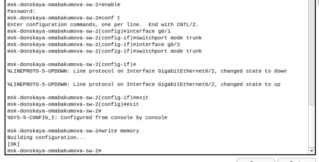{#fig:002 width=40%}

## Настройка Trunk-портов

{#fig:003 width=40%}

## Настройка Trunk-портов

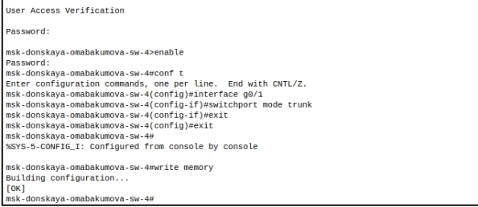{#fig:004 width=40%}

## Настройка Trunk-портов

{#fig:005 width=40%}

## Настройка Trunk-портов

{#fig:006 width=40%}

## Настройка VTP

{#fig:007 width=40%}

## Настройка VTP

{#fig:008 width=40%}

## Настройка VTP

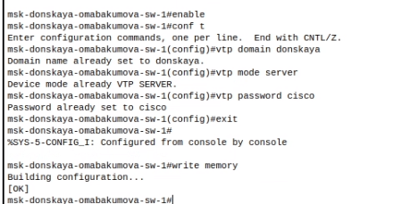{#fig:009 width=40%}

## Настройка VTP

{#fig:010 width=40%}

## Настройка VTP

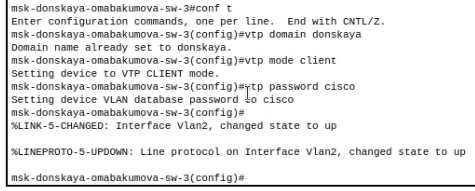{#fig:011 width=40%}

## Настройка VTP

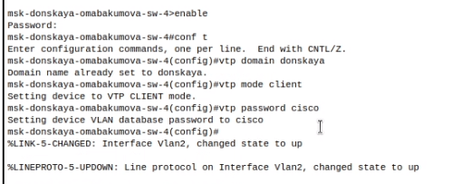{#fig:012 width=40%}

## Настройка VTP

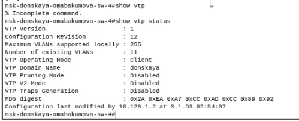{#fig:013 width=40%}

## Настройка VTP

{#fig:014 width=40%}

## Настройка VTP

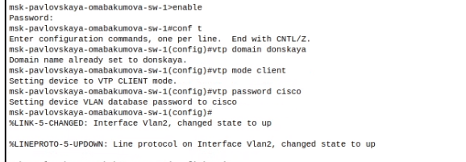{#fig:015 width=40%}

## Настройка конфигурации портов

{#fig:016 width=40%}

## Настройка конфигурации портов

{#fig:017 width=40%}

## Настройка конфигурации портов

{#fig:018 width=40%}

## Настройка конфигурации портов

{#fig:019 width=40%}

## Настройка шлюзов и IP-адреса у оконечных устройств

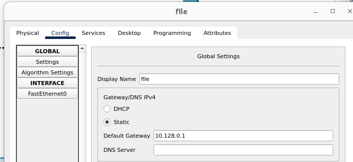{#fig:020 width=40%}

## Настройка шлюзов и IP-адреса у оконечных устройств

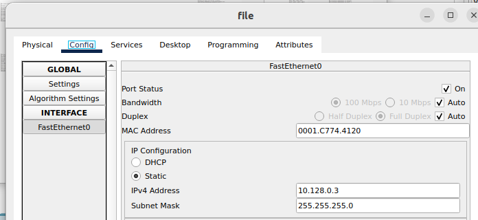{#fig:021 width=40%}

## Пингование адресов

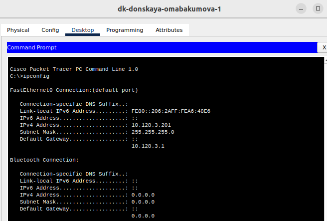{#fig:022 width=40%}

## Пингование адресов

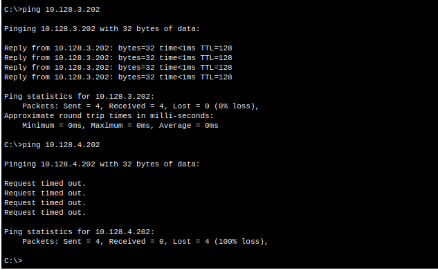{#fig:023 width=40%}

## Режим симуляции

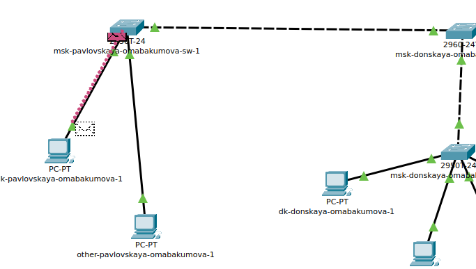{#fig:024 width=40%}

## Режим симуляции

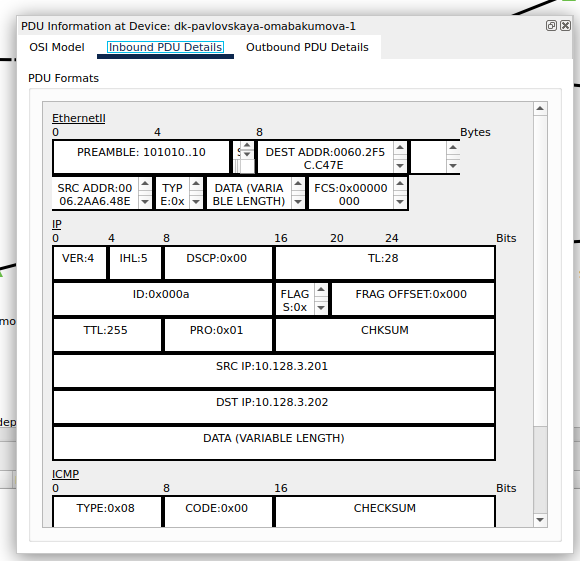{#fig:025 width=40%}

## Режим симуляции

{#fig:026 width=40%}

# Выводы

Во время выполнения данной лабораторной работы я приобрела основные навыки по настройке VLAN на коммутаторах сети.

