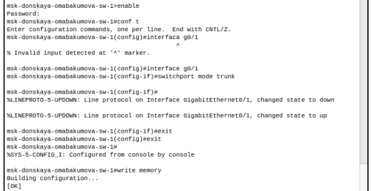
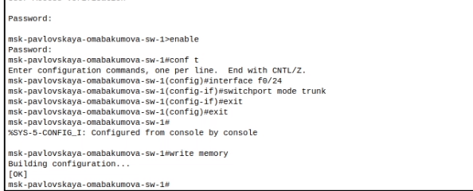
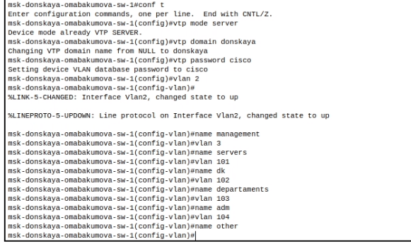
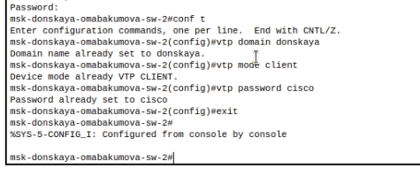
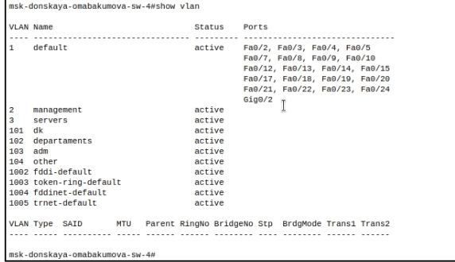
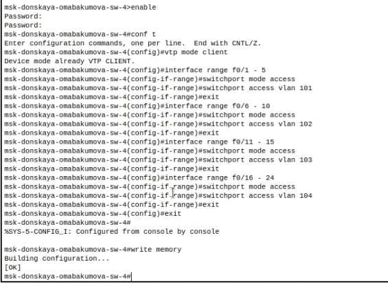
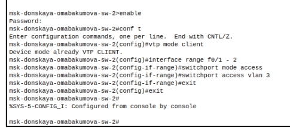
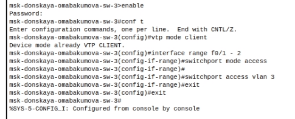
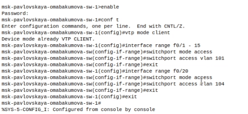
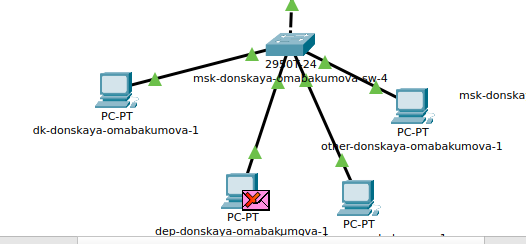

---
## Front matter
title: "Лабораторная работа № 5. Конфигурирование VLAN"
author: "Абакумова Олеся Максимовна, НФИбд-02-22"

## Generic otions
lang: ru-RU
toc-title: "Содержание"

## Bibliography
bibliography: bib/cite.bib
csl: pandoc/csl/gost-r-7-0-5-2008-numeric.csl

## Pdf output format
toc: true # Table of contents
toc-depth: 2
lof: true # List of figures
lot: true # List of tables
fontsize: 12pt
linestretch: 1.5
papersize: a4
documentclass: scrreprt
## I18n polyglossia
polyglossia-lang:
  name: russian
  options:
	- spelling=modern
	- babelshorthands=true
polyglossia-otherlangs:
  name: english
## I18n babel
babel-lang: russian
babel-otherlangs: english
## Fonts
mainfont: IBM Plex Serif
romanfont: IBM Plex Serif
sansfont: IBM Plex Sans
monofont: IBM Plex Mono
mathfont: STIX Two Math
mainfontoptions: Ligatures=Common,Ligatures=TeX,Scale=0.94
romanfontoptions: Ligatures=Common,Ligatures=TeX,Scale=0.94
sansfontoptions: Ligatures=Common,Ligatures=TeX,Scale=MatchLowercase,Scale=0.94
monofontoptions: Scale=MatchLowercase,Scale=0.94,FakeStretch=0.9
mathfontoptions:
## Biblatex
biblatex: true
biblio-style: "gost-numeric"
biblatexoptions:
  - parentracker=true
  - backend=biber
  - hyperref=auto
  - language=auto
  - autolang=other*
  - citestyle=gost-numeric
## Pandoc-crossref LaTeX customization
figureTitle: "Рис."
tableTitle: "Таблица"
listingTitle: "Листинг"
lofTitle: "Список иллюстраций"
lotTitle: "Список таблиц"
lolTitle: "Листинги"
## Misc options
indent: true
header-includes:
  - \usepackage{indentfirst}
  - \usepackage{float} # keep figures where there are in the text
  - \floatplacement{figure}{H} # keep figures where there are in the text
---

# Цель работы

Получить основные навыки по настройке VLAN на коммутаторах сети.

# Задание

1. На коммутаторах сети настроить Trunk-порты на соответствующих интер-
фейсах, связывающих коммутаторы между
собой.
2. Коммутатор msk-donskaya-sw-1 настроить как VTP-сервер и прописать на
нём номера и названия VLAN.
3. Коммутаторы msk-donskaya-sw-2 — msk-donskaya-sw-4,msk-pavlovskaya-sw-1 настроить как VTP-клиенты, на интерфейсах указать
принадлежность к соответствующему VLAN.
4. На серверах прописать IP-адреса.
5. На оконечных устройствах указать соответствующий адрес шлюза и прописать статические IP-адреса из диапазона соответствующей сети, следуя
регламенту выделения ip-адресов.
6. Проверить доступность устройств, принадлежащих одному VLAN, и недоступность устройств, принадлежащих разным VLAN.
7. При выполнении работы необходимо учитывать соглашение об именовании.

# Выполнение лабораторной работы

Используя (табл. [-@tbl:fiz]), настроим Trunk-порты для коммутаторов следующим образом (рис. [-@fig:001]):

:Таблица портов {#tbl:fiz}

| Устройство                       | Порт        | Примечание           | Access VLAN | Trunk VLAN               |
|----------------------------------|-------------|----------------------|-------------|--------------------------|
| msk-donskaya-omabakumova-gw-1    | f0/1        | UpLink               |             |                          |
|                                  | f0/0        | msk-donskaya-sw-1    |             | 2, 3, 101, 102, 103, 104 |
| msk-donskaya-omabakumova-sw-1    | f0/24       | msk-donskaya-gw-1    |             | 2, 3, 101, 102, 103, 104 |
|                                  | g0/1        | msk-donskaya-sw-2    |             | 2, 3                     |
|                                  | g0/2        | msk-donskaya-sw-4    |             | 2, 101, 102, 103, 104    |
|                                  | g0/1        | msk-pavlovskaya-sw-1 |             | 2, 101, 104              |
| msk-donskaya-omabakumova-sw-2    | g0/1        | msk-donskaya-sw-1    |             | 2, 3                     |
|                                  | g0/2        | msk-donskaya-sw-3    |             | 2, 3                     |
|                                  | f0/1        | Web-server           | 3           |                          |
|                                  | f0/2        | File-server          | 3           |                          |
| msk-donskaya-omabakumova-sw-3    | g0/1        | msk-donskaya-sw-2    |             | 2, 3                     |
|                                  | f0/1        | Mail-server          | 3           |                          |
|                                  | f0/2        | Dns-server           | 3           |                          |
| msk-donskaya-omabakumova-sw-4    | g0/1        | msk-donskaya-sw-1    |             | 2, 101, 102, 103, 104    |
|                                  | f0/1–f0/5   | dk                   | 101         |                          |
|                                  | f0/6–f0/10  | departments          | 102         |                          |
|                                  | f0/11–f0/15 | adm                  | 103         |                          |
|                                  | f0/16–f0/24 | other                | 104         |                          |
| msk-pavlovskaya-omabakumova-sw-1 | f0/24       | msk-donskaya-sw-1    |             | 2, 101, 104              |
|                                  | f0/1–f0/15  | dk                   | 101         |                          |
|                                  | f0/20       | other                | 104         |                          | 

{#fig:001 width=80%}

{#fig:002 width=80%}

{#fig:003 width=80%}

{#fig:004 width=80%}

{#fig:005 width=80%}

{#fig:006 width=80%}

Настроим конфигурацию VTP на msk-donskaya-omabakumova-sw-1 и выведем информацию о VLAN (рис. [-@fig:007]):

{#fig:007 width=80%}

{#fig:008 width=80%}

Теперь настроим msk-donskaya-omabakumova-sw-1, как VTP-сервер (рис. [-@fig:009]):

{#fig:009 width=80%}

Остальные коммутаторы, как VTP-клиенты (рис. [-@fig:010]):

{#fig:010 width=80%}

{#fig:011 width=80%}

{#fig:012 width=80%}

Выведем информацию о VTP (рис. [-@fig:013]):

{#fig:013 width=80%}

{#fig:014 width=80%}

Осталось настроить, как VTP-клиент msk-pavlovskaya-omabakumova-sw-1 (рис. [-@fig:015]):

{#fig:015 width=80%}

Далее настроим конфигурацию диапазона портов, используя также (табл. [-@tbl:fiz]),получим следующее (рис. [-@fig:016])::

{#fig:016 width=80%}

{#fig:017 width=80%}

{#fig:018 width=80%}

{#fig:019 width=80%}

Теперь с помощью таблицы (табл. [-@tbl:ip]), настроим шлюз и IP-адрес у всех оконечных устройств (рис. [-@fig:020]):

:Таблица IP {#tbl:ip}

| IP-адреса               | Примечание                 | VLAN |
|-------------------------|----------------------------|------|
| 10.128.0.0/16           | Вся сеть                   |      |
| 10.128.0.0/24           | Серверная ферма            | 3    |
| 10.128.0.1              | Шлюз                       |      |
| 10.128.0.2              | Web                        |      |
| 10.128.0.3              | File                       |      |
| 10.128.0.4              | Mail                       |      |
| 10.128.0.5              | Dns                        |      |
| 10.128.0.6-10.128.0.254 | Зарезервировано            |      |
| 10.128.1.0/24           | Управление                 | 2    |
| 10.128.1.1              | Шлюз                       |      |
| 10.128.1.2              | msk-donskaya-sw-1          |      |
| 10.128.1.3              | msk-donskaya-sw-2          |      |
| 10.128.1.4              | msk-donskaya-sw-3          |      |
| 10.128.1.5              | Msk-donskaya-sw-4          |      |
| 10.128.1.6              | msk-pavlovskaya-sw-1       |      |
| 10.128.1.7-10.128.1.254 | Зарезервировано            |      |
| 10.128.2.0/24           | Сеть Point-to-Point        |      |
| 10.128.2.1              | Шлюз                       |      |
| 10.128.2.2-10.128.2.254 | Зарезервировано            |      |
| 10.128.3.0/24           | Дисплейные классы(DK)      | 101  |
| 10.128.3.1              | Шлюз                       |      |
| 10.128.3.2-10.128.3.254 | Пул для пользователей      |      |
| 10.128.4.0/24           | Кафедра (DEP)              | 102  |
| 10.128.4.1              | Шлюз                       |      |
| 10.128.4.2-10.128.4.254 | Пул для пользователей      |      |
| 10.128.5.0/24           | Администрация (ADM)        | 103  |
| 10.128.5.1              | Шлюз                       |      |
| 10.128.5.2-10.128.5.254 | Пул для пользователей      |      |
| 10.128.6.0/24           | Другие пользователи(OTHER) | 104  |
| 10.128.6.1              | Шлюз                       |      |
| 10.128.6.2-10.128.6.254 | Пул для пользователей      |      |

{#fig:020 width=80%}

{#fig:021 width=80%}

Аналогичным образом настраиваются и лругие оконечные устройства.

Зайдем в терминал оконечного устройства dk-donskaya-omabakumova-1 и выведем некоторую информацию об IP (рис. [-@fig:022]):

{#fig:022 width=80%}

Теперь попробуем пропинговать IP-адреса 10.128.3.202 и 10.128.4.202 (рис. [-@fig:023]):

{#fig:023 width=80%}

Как можно заметить первый адрес пропинговался успешной, что не сказать о втором. Это связано с тем что сначала мы пингуем устройства в одной сети, а затем из разных.

Теперь попробуем запустить симуляцию и отправить пакеты. Для начала из доступных из друг друга сетей (рис. [-@fig:024]):

{#fig:024 width=80%}

Также мы можем посмотреть информацию об ICMP-пакете,то есть PDU (рис. [-@fig:025]):

{#fig:025 width=80%}

Но взяв из другой сети, у нас появляются проблемы (рис. [-@fig:026]):

{#fig:026 width=80%}

# Контрольные вопросы 

1. Какая команда используется для просмотра списка VLAN на сетевом устройстве?

Команда для просмотра списка VLAN зависит от операционной системы сетевого устройства. Например, на устройствах Cisco используется команда show vlan brief, а на устройствах Juniper - show vlans.

2. Охарактеризуйте VLAN Trunking Protocol (VTP). Приведите перечень команд с пояснениями для настройки и просмотра информации о VLAN.

VTP (VLAN Trunking Protocol) - это протокол Cisco, предназначенный для упрощения администрирования VLAN в сети. Он позволяет автоматически распространять информацию о VLAN на все коммутаторы в домене VTP, избавляя от необходимости настраивать VLAN вручную на каждом устройстве.

- vtp mode [client | server | transparent] - устанавливает режим работы VTP.
- vtp domain <имя_домена> - настраивает имя домена VTP.
- vtp password <пароль> - задает пароль для домена VTP.
- show vtp status - отображает текущий статус VTP.
- show vlan - отображает информацию о VLAN, включая те, которые изучены через VTP.

3. Охарактеризуйте Internet Control Message Protocol (ICMP). Опишите формат пакета ICMP.

ICMP (Internet Control Message Protocol) - это протокол сетевого уровня, используемый для отправки сообщений об ошибках и другой информации, связанной с IP. ICMP-пакеты инкапсулируются в IP-пакеты.

Формат пакета ICMP включает заголовок и данные. Заголовок содержит такие поля, как тип, код, контрольная сумма, а также поля, специфичные для конкретного типа сообщения ICMP (например, адрес назначения, недоступный порт и т.д.). Данные обычно содержат часть исходного пакета, вызвавшего ошибку.

4. Охарактеризуйте Address Resolution Protocol (ARP). Опишите формат пакета ARP.

ARP (Address Resolution Protocol) - это протокол, используемый для определения MAC-адреса устройства по его IP-адресу в локальной сети.

Формат пакета ARP включает аппаратный тип, тип протокола, длину аппаратного адреса, длину адреса протокола, код операции, исходный MAC-адрес, исходный IP-адрес, целевой MAC-адрес и целевой IP-адрес.

5. Что такое MAC-адрес? Какова его структура?

MAC-адрес (Media Access Control address) - это уникальный идентификатор, присваиваемый каждому сетевому интерфейсу. Он используется для идентификации устройств в локальной сети.

MAC-адрес имеет длину 48 бит (6 байт) и обычно записывается в шестнадцатеричном формате, например, 00:1A:2B:3C:4D:5E. Первые 3 байта (OUI - Organizationally Unique Identifier) идентифицируют производителя, а последние 3 байта - уникальный идентификатор интерфейса.
   
# Выводы

Во время выполнения данной лабораторной работы я приобрела основные навыки по настройке VLAN на коммутаторах сети.

