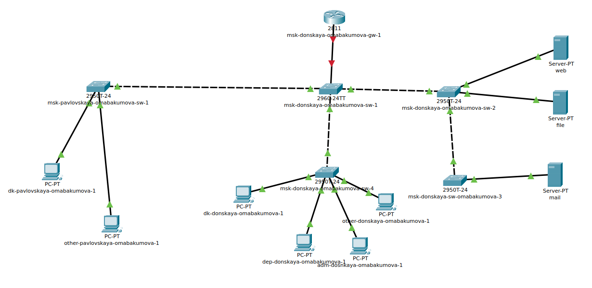
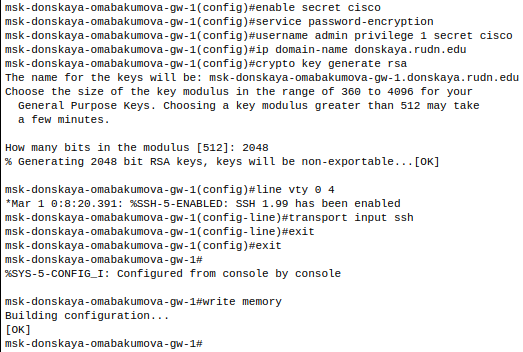
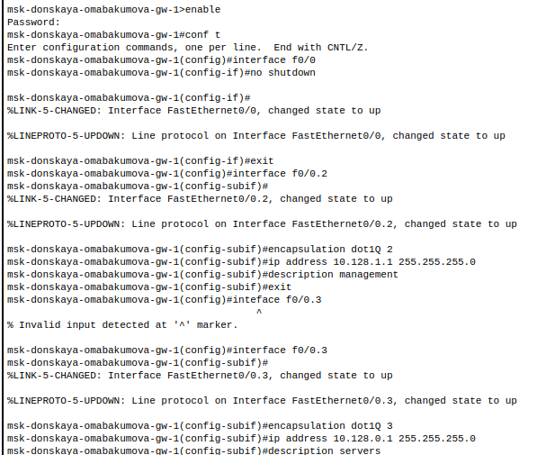
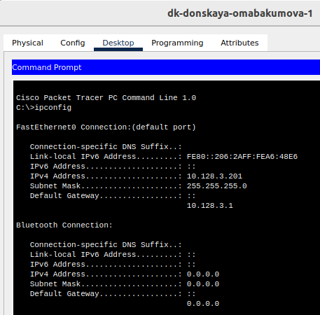
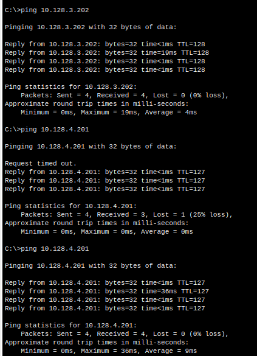

---
## Front matter
lang: ru-RU
title: Лабораторная работа № 6. Статическая маршрутизация VLAN
author:
  - Абакумова О. М.
institute:
  - Российский университет дружбы народов, Москва, Россия

## i18n babel
babel-lang: russian
babel-otherlangs: english

## Formatting pdf
toc: false
toc-title: Содержание
slide_level: 2
aspectratio: 169
section-titles: true
theme: metropolis
header-includes:
 - \metroset{progressbar=frametitle,sectionpage=progressbar,numbering=fraction}
mainfont: Open Sans Light
---

# Информация

## Докладчик

:::::::::::::: {.columns align=center}
::: {.column width="70%"}

  * Абакумова Олеся Максимовна
  * Студентка
  * Российский университет дружбы народов
  * 1132220832@pfur.ru
  * <https://github.com/omabakumova>

:::
::: {.column width="30%"}

:::
::::::::::::::

# Цель работы

Настроить статическую маршрутизацию VLAN в сети.

# Задание

1. Добавить в локальную сеть маршрутизатор, провести его первоначальную
настройку.
2. Настроить статическую маршрутизацию VLAN.
3. При выполнении работы необходимо учитывать соглашение об именовании.

# Выполнение лабораторной работы

## Настройка маршрутизатора

{#fig:001 width=80%}

## Настройка маршрутизатора

{#fig:002 width=80%}

## Настройка маршрутизатора

{#fig:003 width=50%}

## Настройка маршрутизатора

{#fig:004 width=80%}

## Настройка статической маршрутизации

{#fig:005 width=50%}

## Настройка статической маршрутизации

{#fig:006 width=50%}

## Настройка статической маршрутизации

{#fig:007 width=30%}

## Настройка статической маршрутизации

{#fig:008 width=30%}

## Настройка статической маршрутизации

{#fig:009 width=80%}

## Настройка статической маршрутизации

{#fig:010 width=50%}

# Выводы

Во время выполнения данной лабораторной работы я приобрела настраивания статической маршрутизации VLAN в сети.

