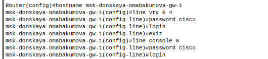
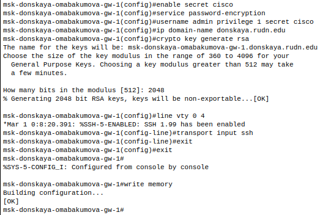
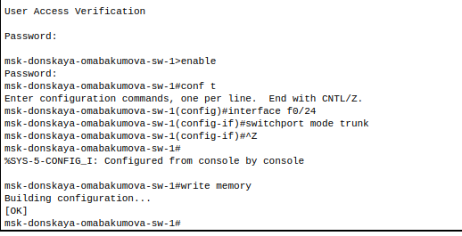
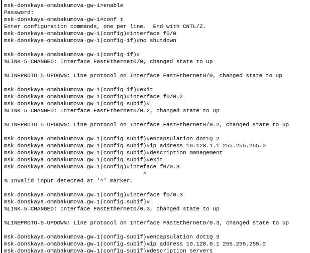
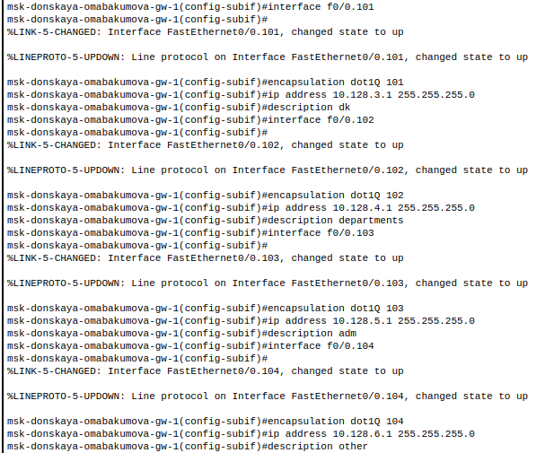
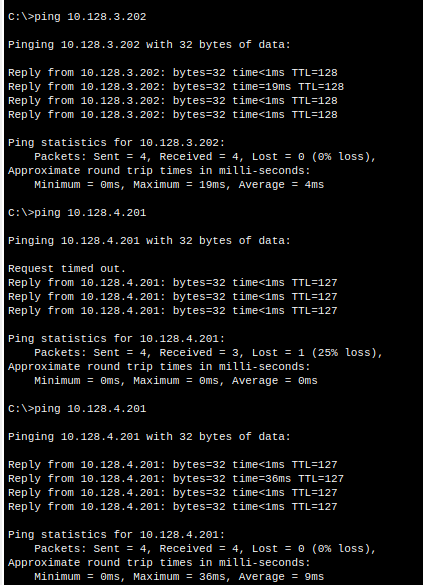
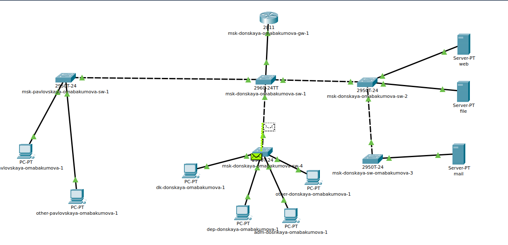
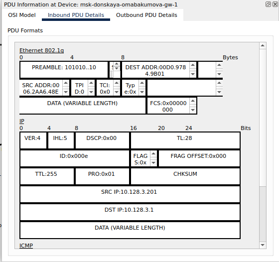

---
## Front matter
title: "Лабораторная работа № 6. Статическая маршрутизация VLAN"
author: "Абакумова Олеся Максимовна, НФИбд-02-22"

## Generic otions
lang: ru-RU
toc-title: "Содержание"

## Bibliography
bibliography: bib/cite.bib
csl: pandoc/csl/gost-r-7-0-5-2008-numeric.csl

## Pdf output format
toc: true # Table of contents
toc-depth: 2
lof: true # List of figures
lot: true # List of tables
fontsize: 12pt
linestretch: 1.5
papersize: a4
documentclass: scrreprt
## I18n polyglossia
polyglossia-lang:
  name: russian
  options:
	- spelling=modern
	- babelshorthands=true
polyglossia-otherlangs:
  name: english
## I18n babel
babel-lang: russian
babel-otherlangs: english
## Fonts
mainfont: IBM Plex Serif
romanfont: IBM Plex Serif
sansfont: IBM Plex Sans
monofont: IBM Plex Mono
mathfont: STIX Two Math
mainfontoptions: Ligatures=Common,Ligatures=TeX,Scale=0.94
romanfontoptions: Ligatures=Common,Ligatures=TeX,Scale=0.94
sansfontoptions: Ligatures=Common,Ligatures=TeX,Scale=MatchLowercase,Scale=0.94
monofontoptions: Scale=MatchLowercase,Scale=0.94,FakeStretch=0.9
mathfontoptions:
## Biblatex
biblatex: true
biblio-style: "gost-numeric"
biblatexoptions:
  - parentracker=true
  - backend=biber
  - hyperref=auto
  - language=auto
  - autolang=other*
  - citestyle=gost-numeric
## Pandoc-crossref LaTeX customization
figureTitle: "Рис."
tableTitle: "Таблица"
listingTitle: "Листинг"
lofTitle: "Список иллюстраций"
lotTitle: "Список таблиц"
lolTitle: "Листинги"
## Misc options
indent: true
header-includes:
  - \usepackage{indentfirst}
  - \usepackage{float} # keep figures where there are in the text
  - \floatplacement{figure}{H} # keep figures where there are in the text
---

# Цель работы

Настроить статическую маршрутизацию VLAN в сети.

# Задание

1. Добавить в локальную сеть маршрутизатор, провести его первоначальную
настройку.
2. Настроить статическую маршрутизацию VLAN.
3. При выполнении работы необходимо учитывать соглашение об именовании.

# Выполнение лабораторной работы

В логической области проекта разместить маршрутизатор Cisco 2811, подключить его к порту 24 коммутатора msk-donskaya-sw-1 в соответствии с таблицей портов (табл. [-@tbl:fiz])(рис. [-@fig:001]):

:Таблица портов {#tbl:fiz}

| Устройство                       | Порт        | Примечание           | Access VLAN | Trunk VLAN               |
|----------------------------------|-------------|----------------------|-------------|--------------------------|
| msk-donskaya-omabakumova-gw-1    | f0/1        | UpLink               |             |                          |
|                                  | f0/0        | msk-donskaya-sw-1    |             | 2, 3, 101, 102, 103, 104 |
| msk-donskaya-omabakumova-sw-1    | f0/24       | msk-donskaya-gw-1    |             | 2, 3, 101, 102, 103, 104 |
|                                  | g0/1        | msk-donskaya-sw-2    |             | 2, 3                     |
|                                  | g0/2        | msk-donskaya-sw-4    |             | 2, 101, 102, 103, 104    |
|                                  | g0/1        | msk-pavlovskaya-sw-1 |             | 2, 101, 104              |
| msk-donskaya-omabakumova-sw-2    | g0/1        | msk-donskaya-sw-1    |             | 2, 3                     |
|                                  | g0/2        | msk-donskaya-sw-3    |             | 2, 3                     |
|                                  | f0/1        | Web-server           | 3           |                          |
|                                  | f0/2        | File-server          | 3           |                          |
| msk-donskaya-omabakumova-sw-3    | g0/1        | msk-donskaya-sw-2    |             | 2, 3                     |
|                                  | f0/1        | Mail-server          | 3           |                          |
|                                  | f0/2        | Dns-server           | 3           |                          |
| msk-donskaya-omabakumova-sw-4    | g0/1        | msk-donskaya-sw-1    |             | 2, 101, 102, 103, 104    |
|                                  | f0/1–f0/5   | dk                   | 101         |                          |
|                                  | f0/6–f0/10  | departments          | 102         |                          |
|                                  | f0/11–f0/15 | adm                  | 103         |                          |
|                                  | f0/16–f0/24 | other                | 104         |                          |
| msk-pavlovskaya-omabakumova-sw-1 | f0/24       | msk-donskaya-sw-1    |             | 2, 101, 104              |
|                                  | f0/1–f0/15  | dk                   | 101         |                          |
|                                  | f0/20       | other                | 104         |                          | 

{#fig:001 width=80%}

Проведем первоначальную настройку маршрутизатора, сконфигурировав маршрутизатор, задав на
нём имя, пароль для доступа к консоли, настроим удалённое подключение к нему по ssh (рис. [-@fig:002]):

{#fig:002 width=80%}

{#fig:003 width=80%}

Настроим порт 24 коммутатора msk-donskaya-sw-1 как trunk-порт (рис. [-@fig:004]):

{#fig:004 width=80%}

На интерфейсе f0/0 маршрутизатора msk-donskaya-omabakumova-gw-1 настроим виртуальные интерфейсы, соответствующие номерам VLAN. Согласно таблице
IP-адресов (табл. [-@tbl:fiz])  зададим соответствующие IP-адреса
на виртуальных интерфейсах (рис. [-@fig:005]):

{#fig:005 width=80%}

{#fig:006 width=80%}

Теперь проверим доступность оконечных устройств из разных VLAN (рис. [-@fig:007]):

{#fig:007 width=80%}

{#fig:008 width=80%}

Используя режим симуляции в Packet Tracer, изучим процесс передвижения пакета ICMP по сети (рис. [-@fig:009]):

{#fig:009 width=80%}

остановив симуляцию,мы можем рассмотреть поподробнее пакет типа ICMP,взглянув на информацию о PDU (рис. [-@fig:010]):

{#fig:010 width=80%}

# Контрольные вопросы 

1. Охарактеризуйте стандарт IEEE 802.1Q.

IEEE 802.1Q --- это стандарт, разработанный для управления виртуальными локальными сетями (VLAN) в Ethernet-сетях. Он определяет метод тегирования Ethernet-кадров, позволяя разделять трафик на разные виртуальные сети в рамках одной физической сети. Это позволяет улучшить безопасность и управляемость сети, а также оптимизировать использование ресурсов. Стандарт 802.1Q добавляет специальный тег к кадрам Ethernet, который содержит информацию о VLAN, к которой принадлежит кадр. Это позволяет коммутаторам правильно маршрутизировать трафик и обеспечивать изоляцию между различными VLAN.

2. Опишите формат кадра IEEE 802.1Q.

Формат кадра IEEE 802.1Q включает несколько ключевых компонентов. Сначала идет Ethernet-заголовок, который содержит стандартные поля, такие как MAC-адреса источника и назначения, а также тип/длину кадра. Затем вставляется тег VLAN, который состоит из 4 байт. Он включает TPID (Tag Protocol Identifier) --- 2 байта, устанавливаемый в значение 0x8100, что указывает на наличие тега VLAN. Далее идет TCI (Tag Control Information) --- 2 байта, содержащие Priority Code Point (PCP) для приоритизации трафика, Drop Eligible Indicator (DEI), указывающий на возможность отбрасывания кадра при перегрузке, и VLAN Identifier (VID), определяющий идентификатор VLAN (от 0 до 4095). После этого следует поле данных, содержащее полезную нагрузку, и контрольная сумма для проверки целостности кадра. Таким образом, формат кадра IEEE 802.1Q позволяет эффективно обрабатывать и маршрутизировать трафик в соответствии с заданной виртуальной локальной сетью.
   
# Выводы

Во время выполнения данной лабораторной работы я приобрела настраивания статической маршрутизации VLAN в сети.

