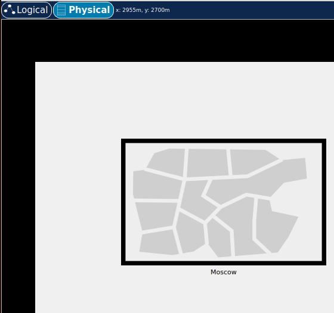
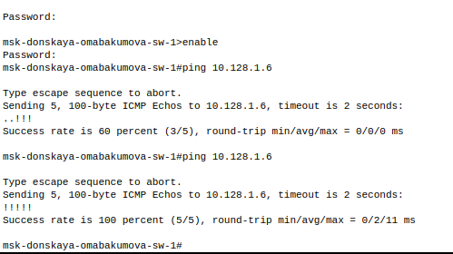
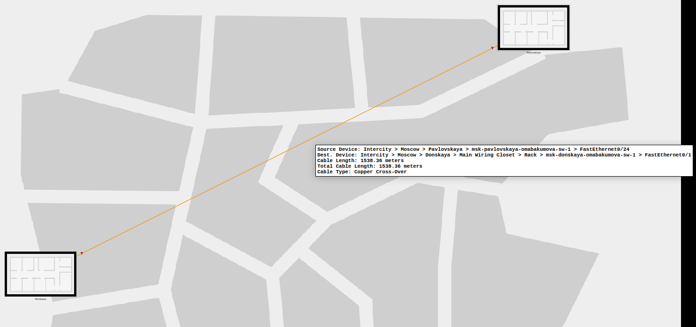
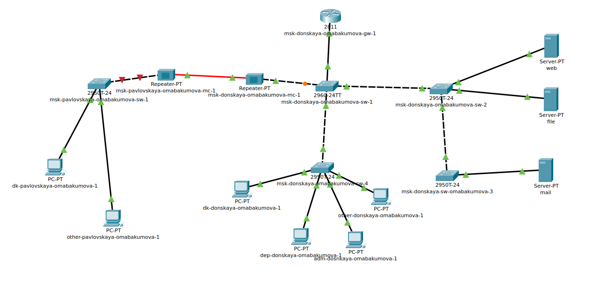
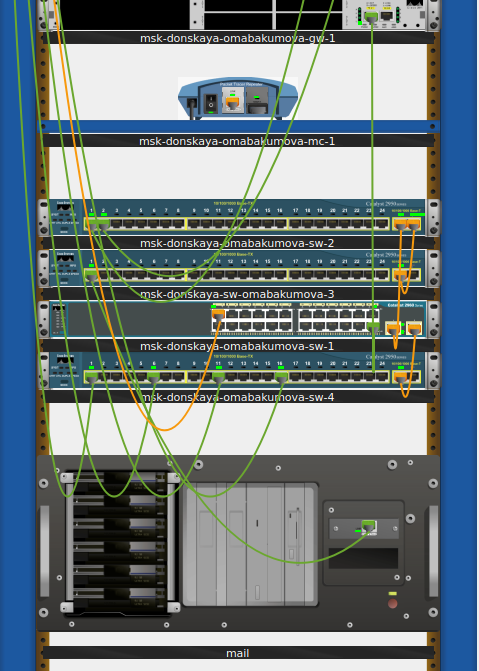

---
## Front matter
title: "Лабораторная работа № 7. Учёт физических параметров сети"
author: "Абакумова Олеся Максимовна, НФИбд-02-22"

## Generic otions
lang: ru-RU
toc-title: "Содержание"

## Bibliography
bibliography: bib/cite.bib
csl: pandoc/csl/gost-r-7-0-5-2008-numeric.csl

## Pdf output format
toc: true # Table of contents
toc-depth: 2
lof: true # List of figures
lot: true # List of tables
fontsize: 12pt
linestretch: 1.5
papersize: a4
documentclass: scrreprt
## I18n polyglossia
polyglossia-lang:
  name: russian
  options:
	- spelling=modern
	- babelshorthands=true
polyglossia-otherlangs:
  name: english
## I18n babel
babel-lang: russian
babel-otherlangs: english
## Fonts
mainfont: IBM Plex Serif
romanfont: IBM Plex Serif
sansfont: IBM Plex Sans
monofont: IBM Plex Mono
mathfont: STIX Two Math
mainfontoptions: Ligatures=Common,Ligatures=TeX,Scale=0.94
romanfontoptions: Ligatures=Common,Ligatures=TeX,Scale=0.94
sansfontoptions: Ligatures=Common,Ligatures=TeX,Scale=MatchLowercase,Scale=0.94
monofontoptions: Scale=MatchLowercase,Scale=0.94,FakeStretch=0.9
mathfontoptions:
## Biblatex
biblatex: true
biblio-style: "gost-numeric"
biblatexoptions:
  - parentracker=true
  - backend=biber
  - hyperref=auto
  - language=auto
  - autolang=other*
  - citestyle=gost-numeric
## Pandoc-crossref LaTeX customization
figureTitle: "Рис."
tableTitle: "Таблица"
listingTitle: "Листинг"
lofTitle: "Список иллюстраций"
lotTitle: "Список таблиц"
lolTitle: "Листинги"
## Misc options
indent: true
header-includes:
  - \usepackage{indentfirst}
  - \usepackage{float} # keep figures where there are in the text
  - \floatplacement{figure}{H} # keep figures where there are in the text
---

# Цель работы

Получить навыки работы с физической рабочей областью Packet Tracer,а также учесть физические параметры сети.

# Задание

1. Требуется заменить соединение между коммутаторами двух территорий
msk-donskaya-sw-1 и msk-pavlovskaya-sw-1 на соединение, учитывающее физические параметры сети, а именно — расстояние между двумя
территориями.
При выполнении работы необходимо учитывать соглашение об именовании

# Выполнение лабораторной работы

Открыв проект предыдущей лабораторной работы перейдем в физическую область Packet Tracer. Присвоим назва-
ние городу — Moscow (рис. [-@fig:001]):

{#fig:001 width=80%}

Щёлкнув на изображении города, мы увидим изображение здания.
Присвоим ему название Donskaya. Добавим здание для территории
Pavlovskaya (рис. [-@fig:002]):

{#fig:002 width=80%}

Щёлкнув на изображении здания Donskaya, переместим изображение, обозначающее серверное помещение.Щёлкнув на изображении серверной, мы увидим отображение серверных стоек (рис. [-@fig:003]):

{#fig:003 width=80%}

Переместим коммутатор msk-pavlovskaya-sw-1 и два оконечных устройства dk-pavlovskaya-1 и other-pavlovskaya-1 на территорию Pavlovskaya,
используя меню Move физической рабочей области Packet Tracer (рис. [-@fig:004]):

{#fig:004 width=80%}

{#fig:005 width=80%}

Вернувшись в логическую рабочую область Packet Tracer, пропингуем с коммутатора msk-donskaya-sw-1 коммутатор msk-pavlovskaya-sw-1.
Убедимся в работоспособности соединения (рис. [-@fig:006]):

{#fig:006 width=80%}

В меню Options , Preferences во вкладке Interface активируем разрешение
на учёт физических характеристик среды передачи (Enable Cable Length Effects) и  в физической рабочей области Packet Tracer разместим две территории на
расстоянии более 100 м друг от друга (рекомендуемое расстояние — около 1000 м или более) (рис. [-@fig:007]):

{#fig:007 width=80%}

Вернувшись в логическую рабочую область Packet Tracer, пропингуем с коммутатора msk-donskaya-sw-1 коммутатор msk-pavlovskaya-sw-1.
Убедимся в **неработоспособности** соединения (рис. [-@fig:008]):

{#fig:008 width=80%} 

Удалим соединение между msk-donskaya-sw-1 и msk-pavlovskaya-sw-1.
Добавим в логическую рабочую область два повторителя (Repeater-
PT). Присвоим им соответствующие названия msk-donskaya-mc-1
и msk-pavlovskaya-mc-1. Заменим имеющиеся модули на PT-REPEATER-
NM-1FFE и PT-REPEATER-NM-1CFE для подключения оптоволокна
и витой пары по технологии Fast Ethernet  (рис. [-@fig:009]):

{#fig:009 width=80%}

{#fig:010 width=80%}

{#fig:011 width=80%}

Переместим msk-pavlovskaya-mc-1 на территорию Pavlovskaya (в физиче-
ской рабочей области Packet Tracer).
Подключим коммутатор msk-donskaya-sw-1 к msk-donskaya-mc-1 по витой паре, msk-donskaya-mc-1 и msk-pavlovskaya-mc-1 — по оптоволокну,
msk-pavlovskaya-sw-1 к msk-pavlovskaya-mc-1 — по витой паре

{#fig:012 width=80%}

Переместим msk-pavlovskaya-mc-1 на территорию Pavlovskaya (в физической рабочей области Packet Tracer) (рис. [-@fig:013]):

{#fig:013 width=80%}

Убедимся в работоспособности соединения между msk-donskaya-sw-1 и msk-pavlovskaya-sw-1  (рис. [-@fig:014]):

{#fig:014 width=80%}

# Контрольные вопросы 

1. Перечислите возможные среды передачи данных. На какие характеристики среды передачи данных следует обращать внимание при планировании сети?  
Среди возможных сред передачи данных можно выделить следующие: витая пара (экраненная и неэкраненная), коаксиальный кабель, оптоволокно, радиосигналы (Wi-Fi), инфракрасные сигналы и спутниковая связь. При планировании сети следует обращать внимание на такие характеристики, как ширина полосы пропускания, дальность передачи, устойчивость к помехам, стоимость, легкость установки и обслуживания, а также требования к безопасности и надежности.

2. Перечислите категории витой пары. Чем они отличаются? Какая категория в каких условиях может применяться?  
Существует несколько категорий витой пары, среди которых наиболее распространены: Cat 5e, Cat 6, Cat 6a, Cat 7 и Cat 8. Основные отличия между ними заключаются в максимальной скорости передачи данных и частотах:  

- Cat 5e поддерживает скорость до 1 Гбит/с на расстоянии до 100 метров и частоту до 100 МГц.  

- Cat 6 поддерживает скорость до 10 Гбит/с на расстоянии до 55 метров и частоту до 250 МГц.  

- Cat 6a поддерживает скорость до 10 Гбит/с на расстоянии до 100 метров и частоту до 500 МГц.  

- Cat 7 поддерживает скорость до 10 Гбит/с на расстоянии до 100 метров и частоту до 600 МГц с улучшенной защитой от помех.  

- Cat 8 поддерживает скорость до 25-40 Гбит/с на расстоянии до 30 метров и частоту до 2000 МГц.  
Каждая категория используется в зависимости от требований к скорости и расстоянию передачи данных: например, Cat 5e можно использовать для домашних сетей, а Cat 6a и выше — для дата-центров и корпоративных сетей.

3. В чем отличие одномодового и многомодового оптоволокна? Какой тип кабеля в каких условиях может применяться?  
Одномодовое оптоволокно имеет более узкое сердечник (обычно около 9 мкм) и предназначено для передачи света от одного источника (лазера) на большие расстояния (до нескольких километров) с высокой пропускной способностью и минимальными потерями. Оно используется в магистральных линиях связи и сетях с высокой нагрузкой. Многомодовое оптоволокно имеет более широкий сердечник (обычно от 50 до 62.5 мкм) и используется для передачи света от нескольких источников (светодиодов) на короткие расстояния (до нескольких сотен метров). Оно применяется в локальных сетях, таких как офисные здания или кампусы.

4. Какие разъёмы встречаются на патчах оптоволокна? Чем они отличаются?  
На патчах оптоволокна встречаются различные разъемы, среди которых наиболее распространены SC, LC, ST, MTP/MPO. Разъем SC (Square Connector) — это квадратный разъем с простым механическим соединением, часто используется в телекоммуникациях. LC (Lucent Connector) — это компактный разъем с меньшими размерами, что позволяет экономить место в панелях распределения. ST (Straight Tip) — это разъем с байонетным замком, который часто используется в старых системах. MTP/MPO (Multi-fiber Push On/Pull Off) — это разъем для многомодового волокна, который позволяет подключать сразу несколько волокон, что удобно для высокопроизводительных систем. Каждый тип разъема имеет свои особенности подключения и применения в зависимости от требований системы.
   
# Выводы

Во время выполнения данной лабораторной работы я приобрела навыки работы с физической рабочей областью Packet Tracer,а также учла физические параметры сети.

