---
## Front matter
lang: ru-RU
title: Лабораторная работа № 8. Настройка сетевых сервисов DHCP
author:
  - Абакумова О. М.
institute:
  - Российский университет дружбы народов, Москва, Россия

## i18n babel
babel-lang: russian
babel-otherlangs: english

## Formatting pdf
toc: false
toc-title: Содержание
slide_level: 2
aspectratio: 169
section-titles: true
theme: metropolis
header-includes:
 - \metroset{progressbar=frametitle,sectionpage=progressbar,numbering=fraction}
mainfont: Open Sans Light
---

# Информация

## Докладчик

:::::::::::::: {.columns align=center}
::: {.column width="70%"}

  * Абакумова Олеся Максимовна
  * Студентка
  * Российский университет дружбы народов
  * 1132220832@pfur.ru
  * <https://github.com/omabakumova>

:::
::: {.column width="30%"}

:::
::::::::::::::

# Цель работы

Приобретение практических навыков по настройке динамического распределения IP-адресов посредством протокола DHCP (Dynamic Host Configuration
Protocol) в локальной сети.

# Задание

1. Добавить DNS-записи для домена donskaya.rudn.ru на сервер dns.
2. Настроить DHCP-сервис на маршрутизаторе.
3. Заменить в конфигурации оконечных устройствах статическое распределение адресов на динамическое.
4. При выполнении работы необходимо учитывать соглашение об именовании.

# Выполнение лабораторной работы

## DNS-записи для домена donskaya.rudn.ru на сервере dns

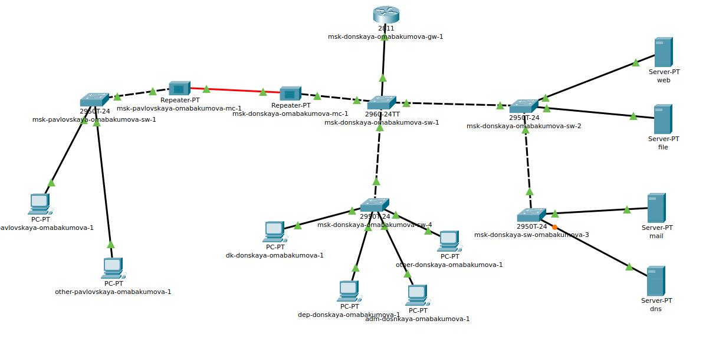{#fig:001 width=80%}

## DNS-записи для домена donskaya.rudn.ru на сервере dns

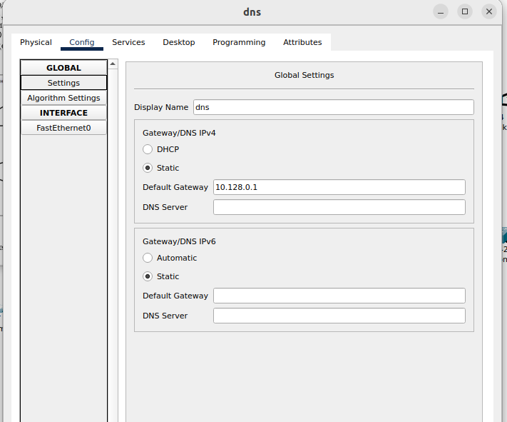{#fig:002 width=50%}

## DNS-записи для домена donskaya.rudn.ru на сервере dns

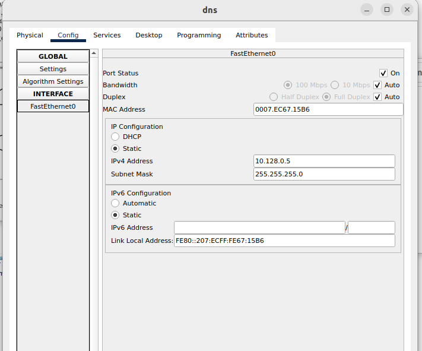{#fig:003 width=50%}

## DNS-записи для домена donskaya.rudn.ru на сервере dns

{#fig:004 width=50%}

## DNS-записи для домена donskaya.rudn.ru на сервере dns

:Регламент выделения ip-адресов 

| IP-адреса | Назначение           |
|-----------|----------------------|
| 1         | Шлюз                 |
| 2–19      | Сетевое оборудование |
| 20–29     | Серверы              |
| 30–199    | Компьютеры, DHCP     |
| 200–219   | Компьютеры, Static   |
| 220–229   | Принтеры             |
| 230–254   | Резерв               |

## DNS-записи для домена donskaya.rudn.ru на сервере dns

{#fig:005 width=80%}

## Настройка DHCP-сервера на маршрутизаторе

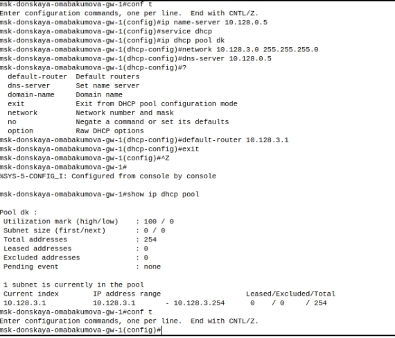{#fig:006 width=50%}

## Настройка DHCP-сервера на маршрутизаторе

{#fig:007 width=50%}

## Настройка DHCP-сервера на маршрутизаторе

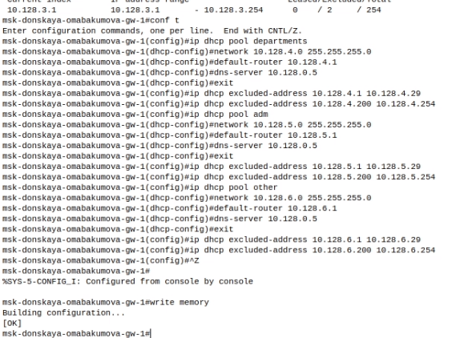{#fig:008 width=50%} 

## Настройка DHCP-сервера на маршрутизаторе

{#fig:009 width=80%}

## Настройка DHCP-сервера на маршрутизаторе

{#fig:010 width=50%}

## Настройка DHCP-сервера на маршрутизаторе

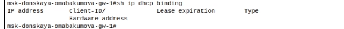{#fig:011 width=80%}

## Замена статического распределения на динамическое

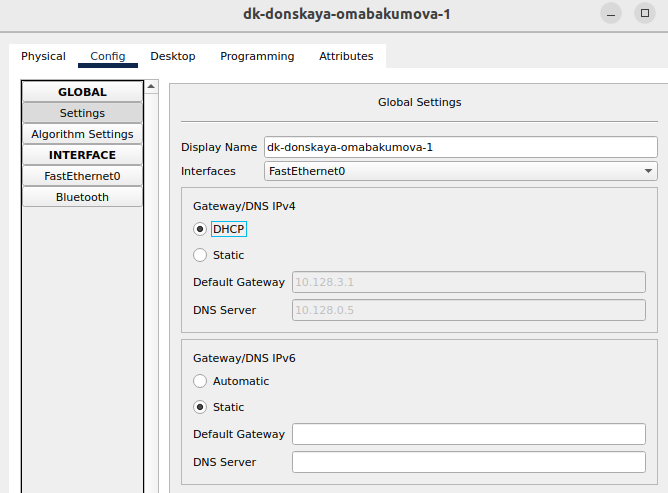{#fig:012 width=50%}

## Замена статического распределения на динамическое

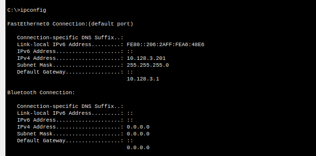{#fig:013 width=80%}

## Замена статического распределения на динамическое

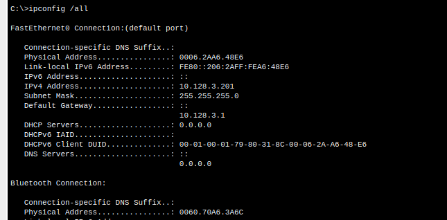{#fig:014 width=80%}

## Замена статического распределения на динамическое

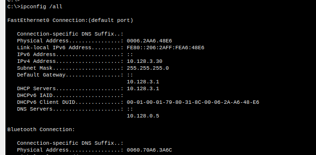{#fig:015 width=80%}

## Замена статического распределения на динамическое

{#fig:016 width=80%}

## Замена статического распределения на динамическое

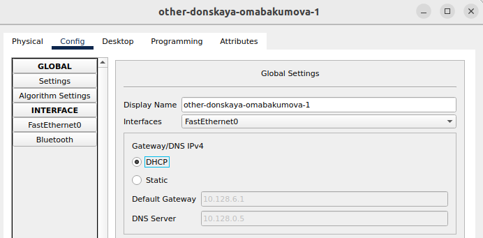{#fig:017 width=80%}

## Замена статического распределения на динамическое

{#fig:018 width=80%}

## Замена статического распределения на динамическое

{#fig:019 width=80%}

## Замена статического распределения на динамическое

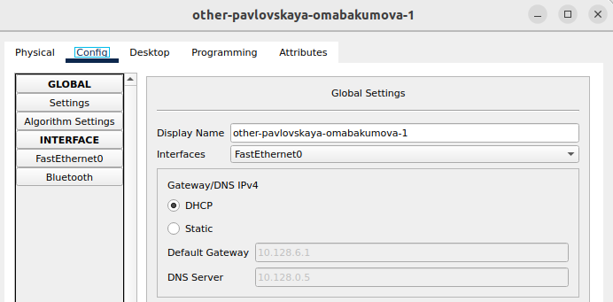{#fig:020 width=80%}

## Замена статического распределения на динамическое

{#fig:021 width=70%}

## Замена статического распределения на динамическое

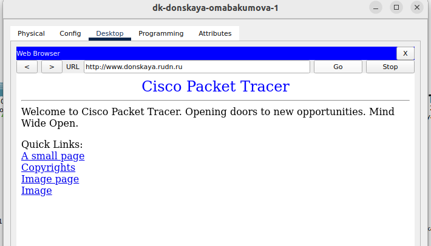{#fig:022 width=70%}

## Замена статического распределения на динамическое

{#fig:023 width=70%}

## Замена статического распределения на динамическое

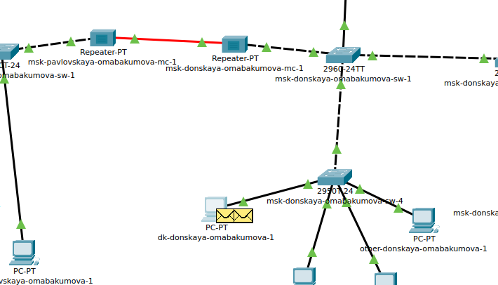{#fig:024 width=70%}

## Замена статического распределения на динамическое

{#fig:025 width=80%}

## Замена статического распределения на динамическое

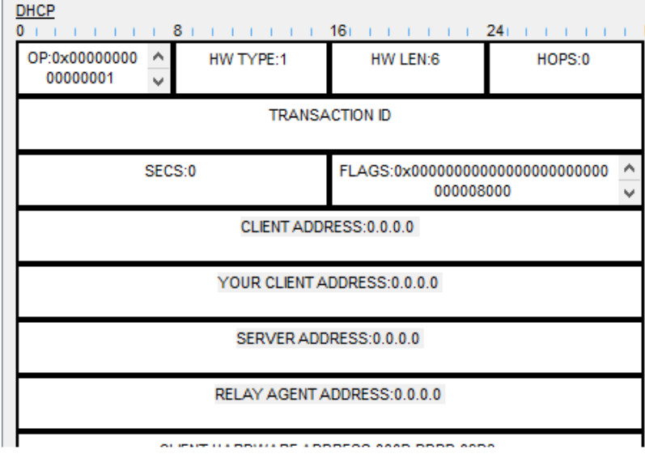{#fig:026 width=50%}

## Замена статического распределения на динамическое

{#fig:027 width=50%}

# Выводы

Во время выполнения данной лабораторной работы я приобрела практические навыки по настройке динамического распределения IP-адресов посредством протокола DHCP (Dynamic Host Configuration
Protocol) в локальной сети.

