---
## Front matter
title: "Лабораторная работа № 8. Настройка сетевых сервисов DHCP"
author: "Абакумова Олеся Максимовна, НФИбд-02-22"

## Generic otions
lang: ru-RU
toc-title: "Содержание"

## Bibliography
bibliography: bib/cite.bib
csl: pandoc/csl/gost-r-7-0-5-2008-numeric.csl

## Pdf output format
toc: true # Table of contents
toc-depth: 2
lof: true # List of figures
lot: true # List of tables
fontsize: 12pt
linestretch: 1.5
papersize: a4
documentclass: scrreprt
## I18n polyglossia
polyglossia-lang:
  name: russian
  options:
	- spelling=modern
	- babelshorthands=true
polyglossia-otherlangs:
  name: english
## I18n babel
babel-lang: russian
babel-otherlangs: english
## Fonts
mainfont: IBM Plex Serif
romanfont: IBM Plex Serif
sansfont: IBM Plex Sans
monofont: IBM Plex Mono
mathfont: STIX Two Math
mainfontoptions: Ligatures=Common,Ligatures=TeX,Scale=0.94
romanfontoptions: Ligatures=Common,Ligatures=TeX,Scale=0.94
sansfontoptions: Ligatures=Common,Ligatures=TeX,Scale=MatchLowercase,Scale=0.94
monofontoptions: Scale=MatchLowercase,Scale=0.94,FakeStretch=0.9
mathfontoptions:
## Biblatex
biblatex: true
biblio-style: "gost-numeric"
biblatexoptions:
  - parentracker=true
  - backend=biber
  - hyperref=auto
  - language=auto
  - autolang=other*
  - citestyle=gost-numeric
## Pandoc-crossref LaTeX customization
figureTitle: "Рис."
tableTitle: "Таблица"
listingTitle: "Листинг"
lofTitle: "Список иллюстраций"
lotTitle: "Список таблиц"
lolTitle: "Листинги"
## Misc options
indent: true
header-includes:
  - \usepackage{indentfirst}
  - \usepackage{float} # keep figures where there are in the text
  - \floatplacement{figure}{H} # keep figures where there are in the text
---

# Цель работы

Приобретение практических навыков по настройке динамического распределения IP-адресов посредством протокола DHCP (Dynamic Host Configuration
Protocol) в локальной сети.

# Задание

1. Добавить DNS-записи для домена donskaya.rudn.ru на сервер dns.
2. Настроить DHCP-сервис на маршрутизаторе.
3. Заменить в конфигурации оконечных устройствах статическое распределение адресов на динамическое.
4. При выполнении работы необходимо учитывать соглашение об именовании.

# Выполнение лабораторной работы

В логическую рабочую область проекта добавим сервер dns и подключим
его к коммутатору msk-donskaya-sw-3 через порт Fa0/2 (рис. 8.1), не забыв
активировать порт при помощи соответствующих команд на коммутаторе.
В конфигурации сервера укажите в качестве адреса шлюза 10.128.0.1,
а в качестве адреса самого сервера — 10.128.0.5 с соответствующей маской
255.255.255.0.(рис. [-@fig:001]):

{#fig:001 width=80%}

{#fig:002 width=80%}

{#fig:003 width=80%}

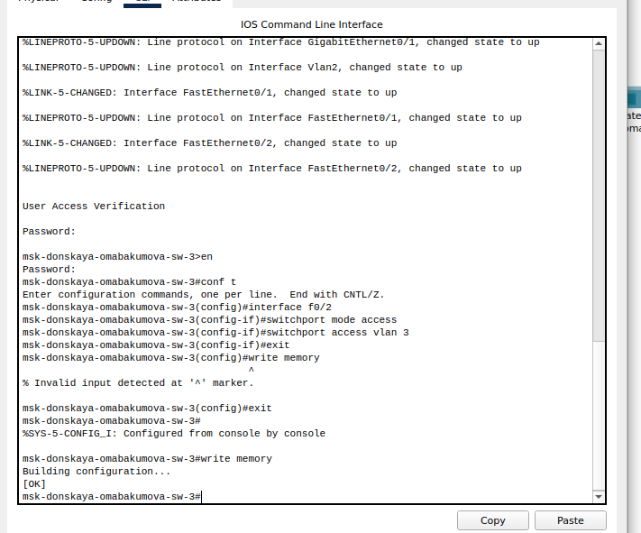{#fig:004 width=80%}

Настроим сервис DNS (рис. [-@fig:005]):

- в конфигурации сервера выберем службу DNS, активируем её (выбрав
флаг On);

- в поле Type в качестве типа записи DNS выберем записи типа A
(A Record);

- в поле Name укажем доменное имя, по которому можно обратиться,
например, к web-серверу --- www.donskaya.rudn.ru, затем укажем его
IP-адрес в соответствующем поле 10.128.0.2;

- нажав на кнопку Add , добавим DNS-запись на сервер;

- аналогичным образом добавим DNS-записи для серверов mail, file, dns
согласно распределению адресов согласно [-@tbl:reg];

- сохраним конфигурацию сервера.

:Регламент выделения ip-адресов {#tbl:reg}

| IP-адреса | Назначение           |
|-----------|----------------------|
| 1         | Шлюз                 |
| 2–19      | Сетевое оборудование |
| 20–29     | Серверы              |
| 30–199    | Компьютеры, DHCP     |
| 200–219   | Компьютеры, Static   |
| 220–229   | Принтеры             |
| 230–254   | Резерв               |

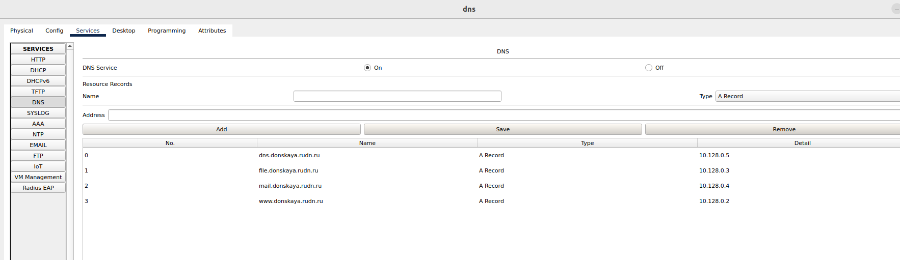{#fig:005 width=80%}

Настроим DHCP-сервис на маршрутизаторе: укажем IP-адрес DNS-сервера;
затем перейдем к настройке DHCP; зададим название конфигурируемому
диапазону адресов (пулу адресов), укажем адрес сети, а также адреса шлюза и DNS-сервера; 
зададим пулы адресов, исключаемых из динамического
распределения (рис. [-@fig:006]):

{#fig:006 width=80%}

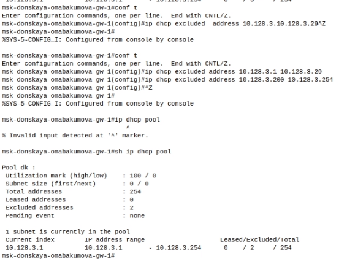{#fig:007 width=80%}

{#fig:008 width=80%} 

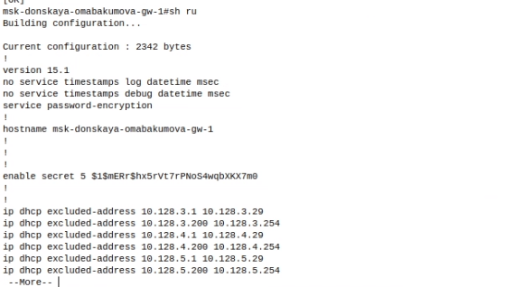{#fig:009 width=80%}

Выведем информацию о пулах DHCP (рис. [-@fig:010]):

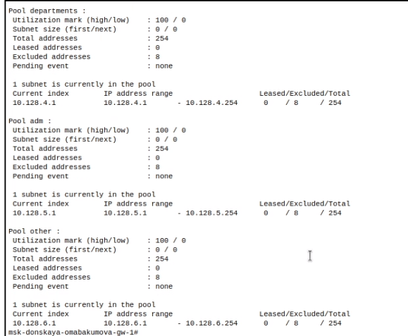{#fig:010 width=80%}

Выведем информацию об привязках выданных адресов (рис. [-@fig:011]):

{#fig:011 width=80%}

На оконечных устройствах заменим в настройках статическое распределение адресов на динамическое. Рассмотрим подробно на примере dk-donskaya-omabakumova-1 (рис. [-@fig:012]):

{#fig:012 width=80%}

Первоначально при запросе вывода информации у нас не будет никаких изменений (рис. [-@fig:013]):

{#fig:013 width=80%}

{#fig:014 width=80%}

Но через некоторое время запроса вывода информации мы увидим, что распределение сменилось на динамическое (рис. [-@fig:015]):

{#fig:015 width=80%}

Проделаем аналогичную смену статического распределения на динамическое на всех оконечных устройствах (рис. [-@fig:016]):

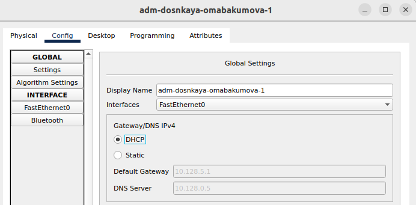{#fig:016 width=80%}

{#fig:017 width=80%}

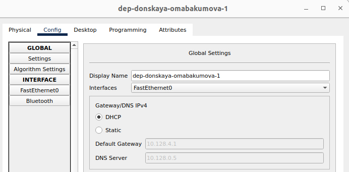{#fig:018 width=80%}

{#fig:019 width=80%}

{#fig:020 width=80%}

Теперь проверим доступность,пропингуем адреса (рис. [-@fig:021]):

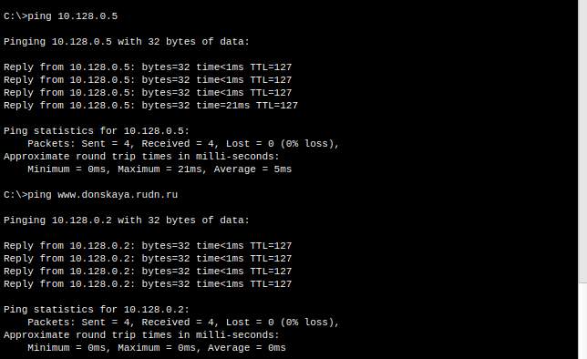{#fig:021 width=80%}

Пинг не сразу конечно же проходил,но через пару упорных попыток пакеты были отправлены и получены без потерь.

Также можно поизучать www.donskaya.rudn.ru в "Web Browser" (рис. [-@fig:022]):

{#fig:022 width=80%}

Теперь  перейдем в режим симуляции и изучим каким образом происходит запрос адреса по
протоколу DHCP (рис. [-@fig:023]):

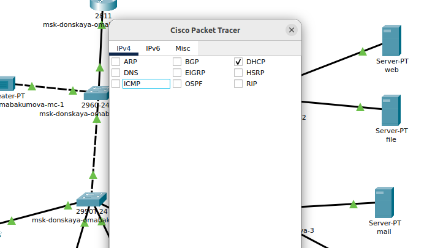{#fig:023 width=80%}

{#fig:024 width=80%}

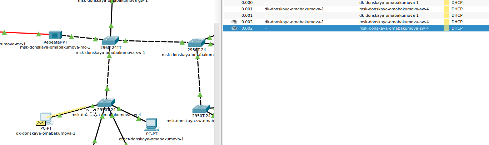{#fig:025 width=80%}

В качестве результата симуляции рассмотрим информацию о PDU.Оконечное устройство отправляет запрос на получение ip-
адреса по протоколу DHCP. Сначала DHCP-пакет рассылается всем устройствам
сети и принимается маршрутизатором. В заголовках DHCP при этом указан
только MAC-адрес устройства, которому нужен адрес, ip-адреса еще нет (рис. [-@fig:026]):

{#fig:026 width=80%}

Маршрутизатор, получив запрос, выделяет IP-адрес для указанного MAC-адреса, основываясь на информации о занятых адресах в данной подсети. 
Затем он отправляет ответ обратно устройству, указывая, какой именно IP-адрес был выделен. 
В этом ответе также указываются адрес шлюза подсети и адрес самого устройства. После получения этого ответа устройство подтверждает маршрутизатору, 
что приняло назначенный IP-адрес (рис. [-@fig:027]):

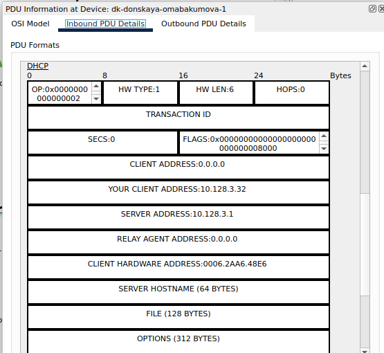{#fig:027 width=80%}

# Контрольные вопросы 

1. За что отвечает протокол DHCP? 

Протокол DHCP (Dynamic Host Configuration Protocol) отвечает за автоматическое назначение IP-адресов и других сетевых параметров устройствам в локальной сети, что упрощает процесс настройки сетевых подключений.

2. Какие типы DHCP-сообщений передаются по сети? 

В сети передаются несколько типов DHCP-сообщений, включая DHCPDISCOVER (запрос на получение IP-адреса), DHCPOFFER (предложение IP-адреса), DHCPREQUEST (запрос на подтверждение выбранного адреса) и DHCPACK (подтверждение назначения IP-адреса).

3. Какие параметры могут быть переданы в сообщениях DHCP? 

В сообщениях DHCP могут передаваться такие параметры, как IP-адрес, адреса шлюза, адреса DNS-серверов, маска подсети, время аренды IP-адреса и другие настройки, необходимые для корректной работы устройства в сети.

4. Что такое DNS? 

DNS (Domain Name System) --- это система доменных имен, которая отвечает за преобразование доменных имен в IP-адреса, позволяя пользователям обращаться к ресурсам в интернете по удобным именам вместо числовых адресов.

5. Какие типы записи описания ресурсов есть в DNS и для чего они используются? 

В DNS существует несколько типов записей описания ресурсов, включая A-записи (для сопоставления доменного имени с IPv4-адресом), AAAA-записи (для IPv6-адресов), CNAME-записи (для создания алиасов для доменных имен), MX-записи (для указания почтовых серверов) и TXT-записи (для хранения текстовой информации, например, для проверки домена). Эти записи используются для управления и настройки работы доменных имен в сети.
   
# Выводы

Во время выполнения данной лабораторной работы я приобрела практические навыки по настройке динамического распределения IP-адресов посредством протокола DHCP (Dynamic Host Configuration
Protocol) в локальной сети.

