---
## Front matter
lang: ru-RU
title: Лабораторная работа № 9. Использование протокола STP. Агрегирование каналов
author:
  - Абакумова О. М.
institute:
  - Российский университет дружбы народов, Москва, Россия

## i18n babel
babel-lang: russian
babel-otherlangs: english

## Formatting pdf
toc: false
toc-title: Содержание
slide_level: 2
aspectratio: 169
section-titles: true
theme: metropolis
header-includes:
 - \metroset{progressbar=frametitle,sectionpage=progressbar,numbering=fraction}
mainfont: Open Sans Light
---

# Информация

## Докладчик

:::::::::::::: {.columns align=center}
::: {.column width="70%"}

  * Абакумова Олеся Максимовна
  * Студентка
  * Российский университет дружбы народов
  * 1132220832@pfur.ru
  * <https://github.com/omabakumova>

:::
::: {.column width="30%"}

:::
::::::::::::::

# Цель работы

Изучение возможностей протокола STP и его модификаций по обеспечению
отказоустойчивости сети, агрегированию интерфейсов и перераспределению
нагрузки между ними.

# Задание

1. Сформируйте резервное соединение между коммутаторами msk-donskaya-
sw-1 и msk-donskaya-sw-3.
2. Настройте балансировку нагрузки между резервными соединениями.
3. Настройте режим Portfast на тех интерфейсах коммутаторов, к которым
подключены серверы.
4. Изучите отказоустойчивость резервного соединения.
5. Сформируйте и настройте агрегированное соединение интерфейсов Fa0/20
– Fa0/23 между коммутаторами msk-donskaya-sw-1 и msk-donskaya-sw-4.
6. При выполнении работы необходимо учитывать соглашение об именовании.

# Выполнение лабораторной работы

## Резервное соединение

{#fig:001 width=40%}

## Резервное соединение

{#fig:002 width=40%}

## Резервное соединение

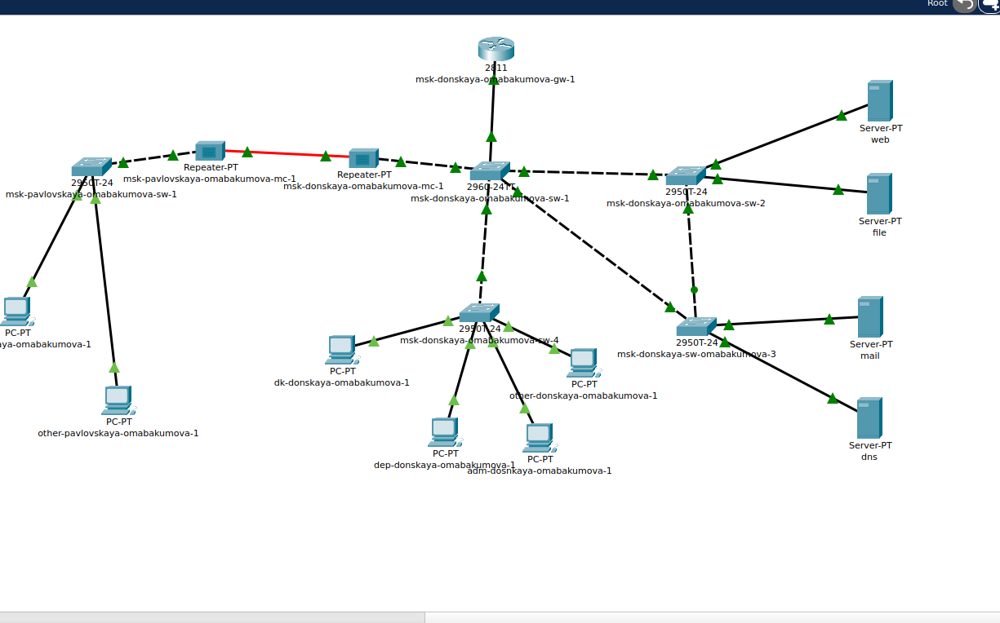{#fig:003 width=40%}

## Резервное соединение

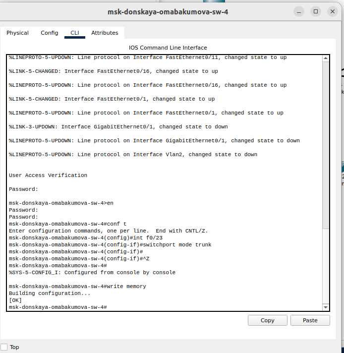{#fig:004 width=40%}

## Резервное соединение

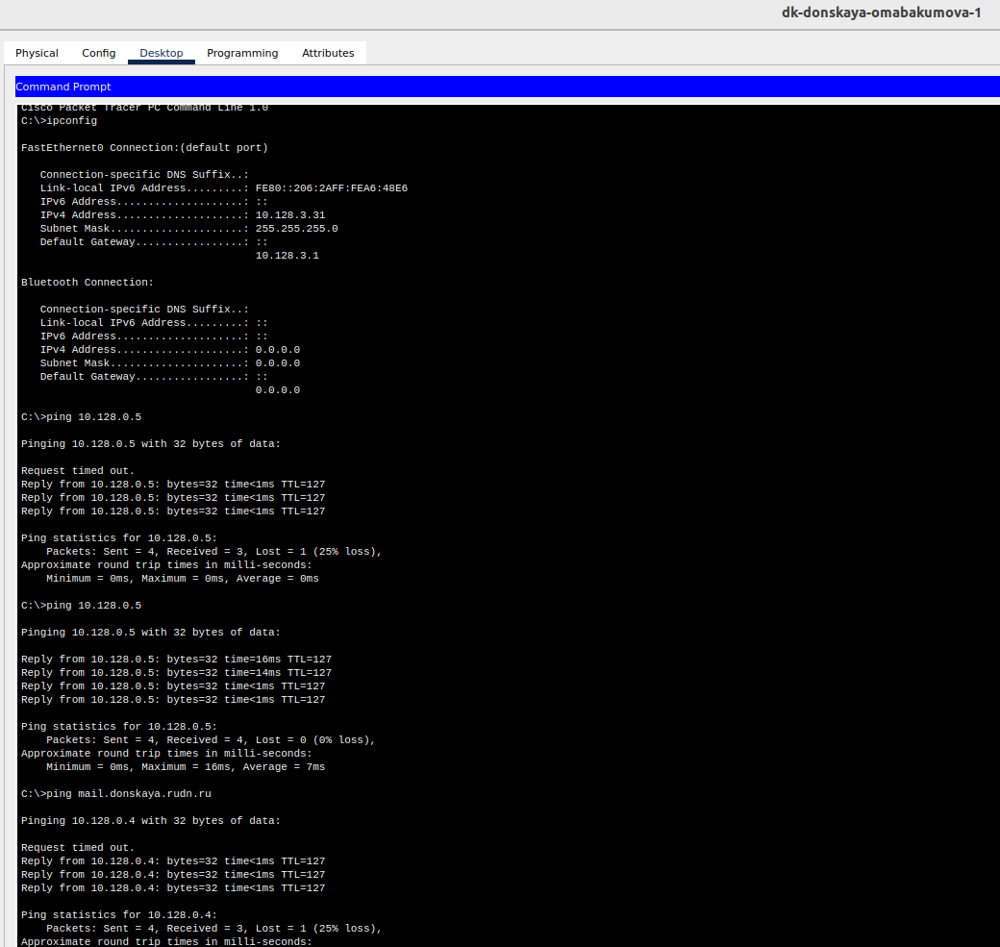{#fig:005 width=40%}

## Резервное соединение

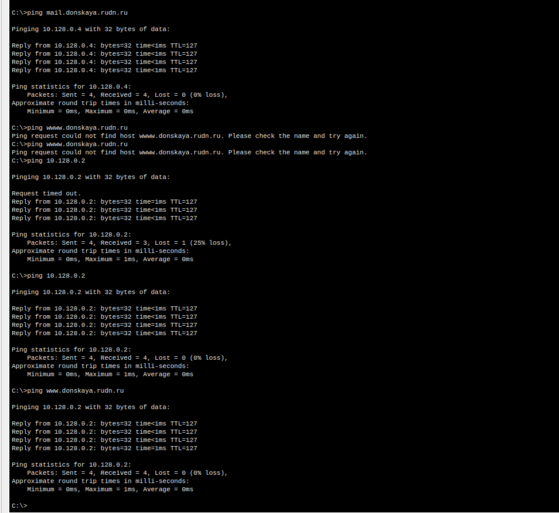{#fig:006 width=40%}

## Резервное соединение

{#fig:007 width=40%}

## Резервное соединение

{#fig:008 width=40%} 

## Резервное соединение

{#fig:009 width=40%}

## Резервное соединение

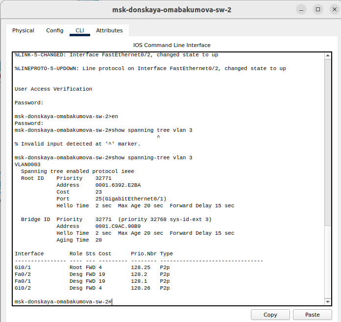{#fig:010 width=40%}

## Резервное соединение

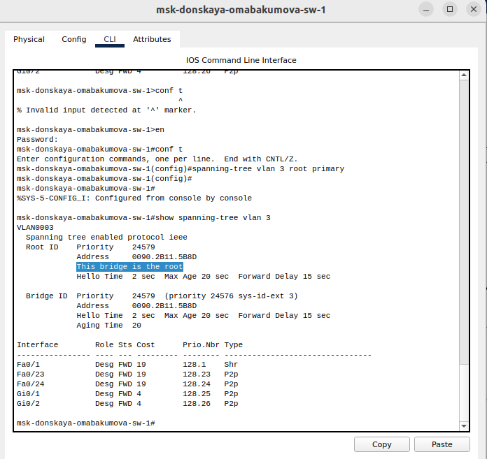{#fig:011 width=40%}

## Резервное соединение

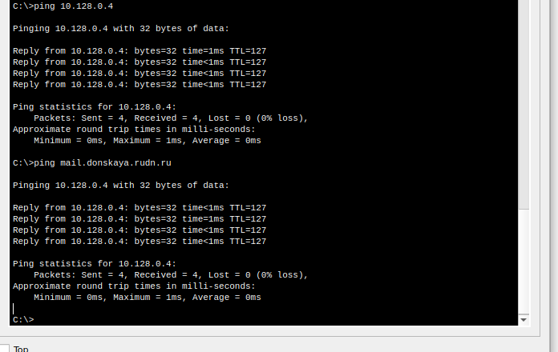{#fig:012 width=40%}

## Резервное соединение

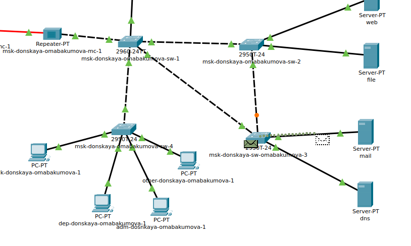{#fig:013 width=40%}

## Резервное соединение

{#fig:014 width=40%}

## Portfast

{#fig:015 width=40%}

## Portfast

{#fig:016 width=40%}

## Portfast

{#fig:017 width=40%}

## Portfast

{#fig:018 width=40%}

## Отказоустойчивость

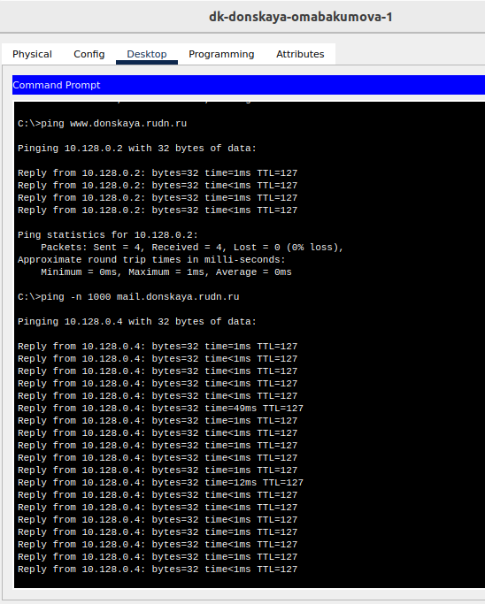{#fig:019 width=35%}

## Отказоустойчивость

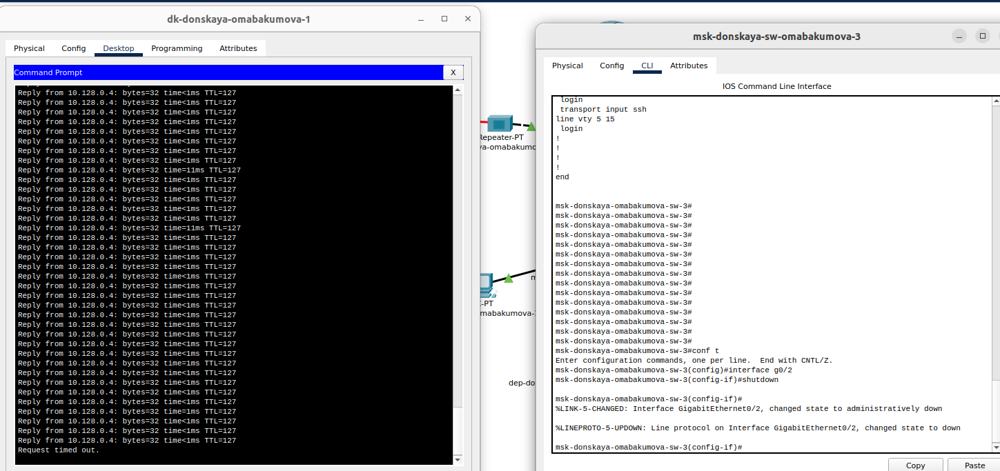{#fig:020 width=55%}

## Отказоустойчивость

{#fig:021 width=55%}

## Отказоустойчивость

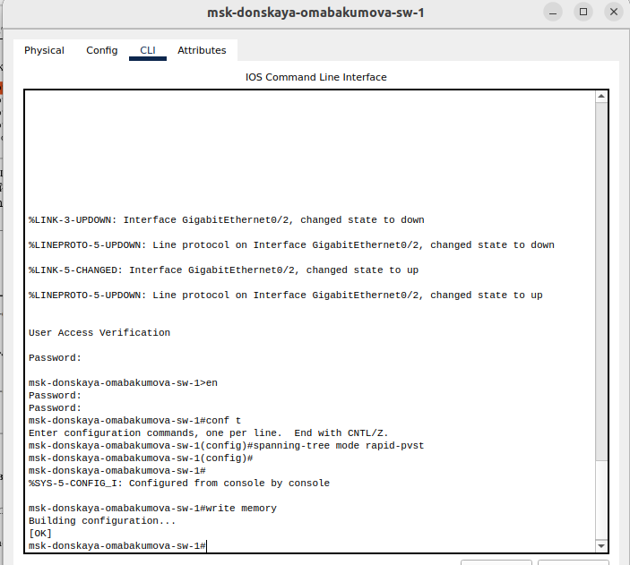{#fig:022 width=40%}

## Отказоустойчивость

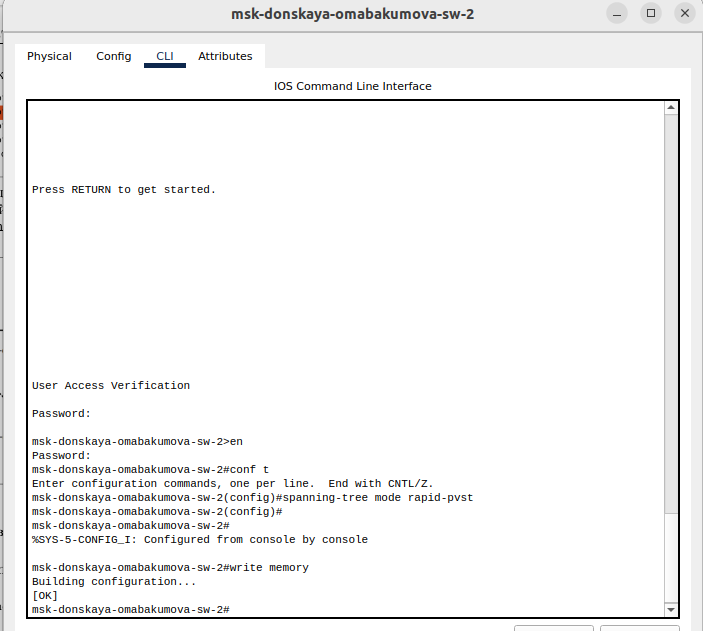{#fig:023 width=40%}

## Отказоустойчивость

{#fig:024 width=40%}

## Отказоустойчивость

{#fig:025 width=40%}

## Отказоустойчивость

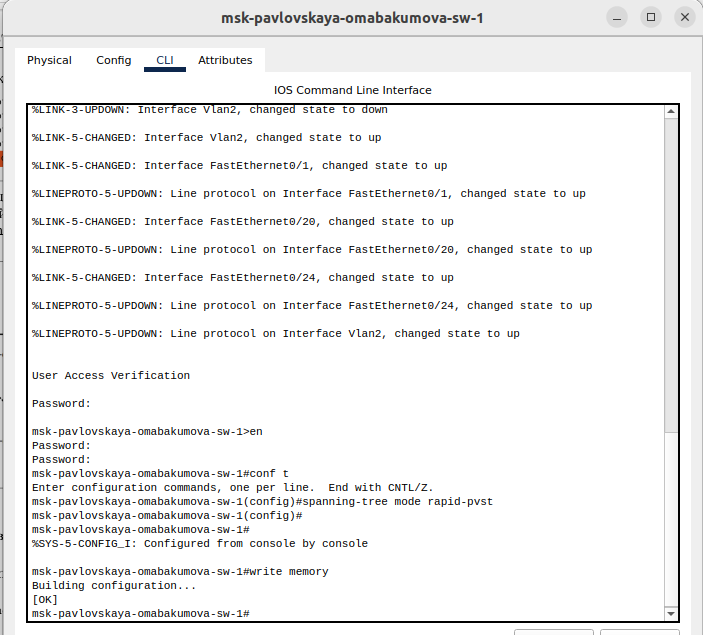{#fig:026 width=40%}

## Отказоустойчивость

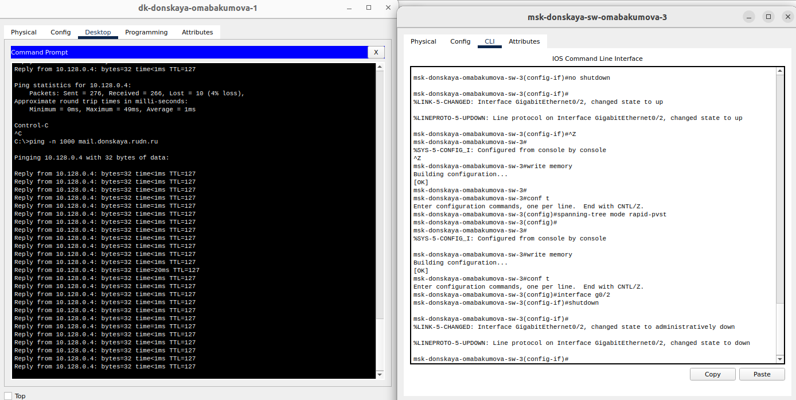{#fig:027 width=55%}

## Отказоустойчивость

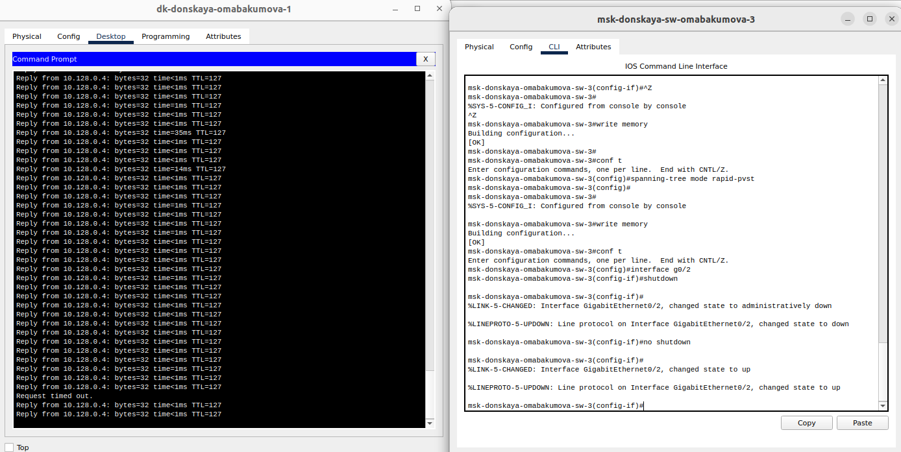{#fig:028 width=55%}

## Агрегирование

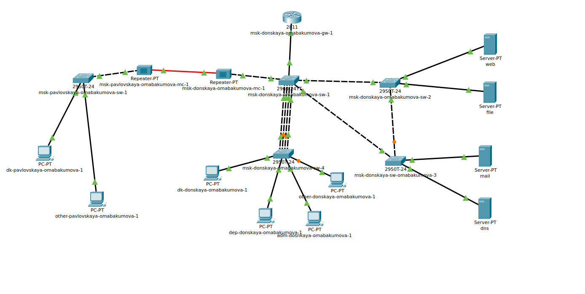{#fig:029 width=55%}

## Агрегирование

{#fig:030 width=40%}

## Агрегирование

{#fig:031 width=40%}

# Выводы

Во время выполнения данной лабораторной работы я изучила протокол STP и его модификации по обеспечению отказоустойчивости сети, агрегированию интерфейсов и перераспределению
нагрузки между ними.

