---
## Front matter
title: "Лабораторная работа № 9. Использование протокола STP. Агрегирование каналов"
author: "Абакумова Олеся Максимовна, НФИбд-02-22"

## Generic otions
lang: ru-RU
toc-title: "Содержание"

## Bibliography
bibliography: bib/cite.bib
csl: pandoc/csl/gost-r-7-0-5-2008-numeric.csl

## Pdf output format
toc: true # Table of contents
toc-depth: 2
lof: true # List of figures
lot: true # List of tables
fontsize: 12pt
linestretch: 1.5
papersize: a4
documentclass: scrreprt
## I18n polyglossia
polyglossia-lang:
  name: russian
  options:
	- spelling=modern
	- babelshorthands=true
polyglossia-otherlangs:
  name: english
## I18n babel
babel-lang: russian
babel-otherlangs: english
## Fonts
mainfont: IBM Plex Serif
romanfont: IBM Plex Serif
sansfont: IBM Plex Sans
monofont: IBM Plex Mono
mathfont: STIX Two Math
mainfontoptions: Ligatures=Common,Ligatures=TeX,Scale=0.94
romanfontoptions: Ligatures=Common,Ligatures=TeX,Scale=0.94
sansfontoptions: Ligatures=Common,Ligatures=TeX,Scale=MatchLowercase,Scale=0.94
monofontoptions: Scale=MatchLowercase,Scale=0.94,FakeStretch=0.9
mathfontoptions:
## Biblatex
biblatex: true
biblio-style: "gost-numeric"
biblatexoptions:
  - parentracker=true
  - backend=biber
  - hyperref=auto
  - language=auto
  - autolang=other*
  - citestyle=gost-numeric
## Pandoc-crossref LaTeX customization
figureTitle: "Рис."
tableTitle: "Таблица"
listingTitle: "Листинг"
lofTitle: "Список иллюстраций"
lotTitle: "Список таблиц"
lolTitle: "Листинги"
## Misc options
indent: true
header-includes:
  - \usepackage{indentfirst}
  - \usepackage{float} # keep figures where there are in the text
  - \floatplacement{figure}{H} # keep figures where there are in the text
---

# Цель работы

Изучение возможностей протокола STP и его модификаций по обеспечению
отказоустойчивости сети, агрегированию интерфейсов и перераспределению
нагрузки между ними.

# Задание

1. Сформируйте резервное соединение между коммутаторами msk-donskaya-
sw-1 и msk-donskaya-sw-3.
2. Настройте балансировку нагрузки между резервными соединениями.
3. Настройте режим Portfast на тех интерфейсах коммутаторов, к которым
подключены серверы.
4. Изучите отказоустойчивость резервного соединения.
5. Сформируйте и настройте агрегированное соединение интерфейсов Fa0/20
– Fa0/23 между коммутаторами msk-donskaya-sw-1 и msk-donskaya-sw-4.
6. При выполнении работы необходимо учитывать соглашение об именовании.

# Выполнение лабораторной работы

Сформируем резервное соединение между коммутаторами msk-donskaya-
sw-1 и msk-donskaya-sw-3. Для этого:
- заменим соединение между коммутаторами msk-donskaya-sw-1
(Gig0/2) и msk-donskaya-sw-4 (Gig0/1) на соединение между коммутаторами msk-donskaya-sw-1 (Gig0/2) и msk-donskaya-sw-3 (Gig0/2);
- сделаем порт на интерфейсе Gig0/2 коммутатора msk-donskaya-sw-3
транковым
- соединение между коммутаторами msk-donskaya-sw-1 и msk-donskaya-
sw-4 сделаем через интерфейсы Fa0/23, не забыв активировать их
в транковом режиме.(рис. [-@fig:001]):

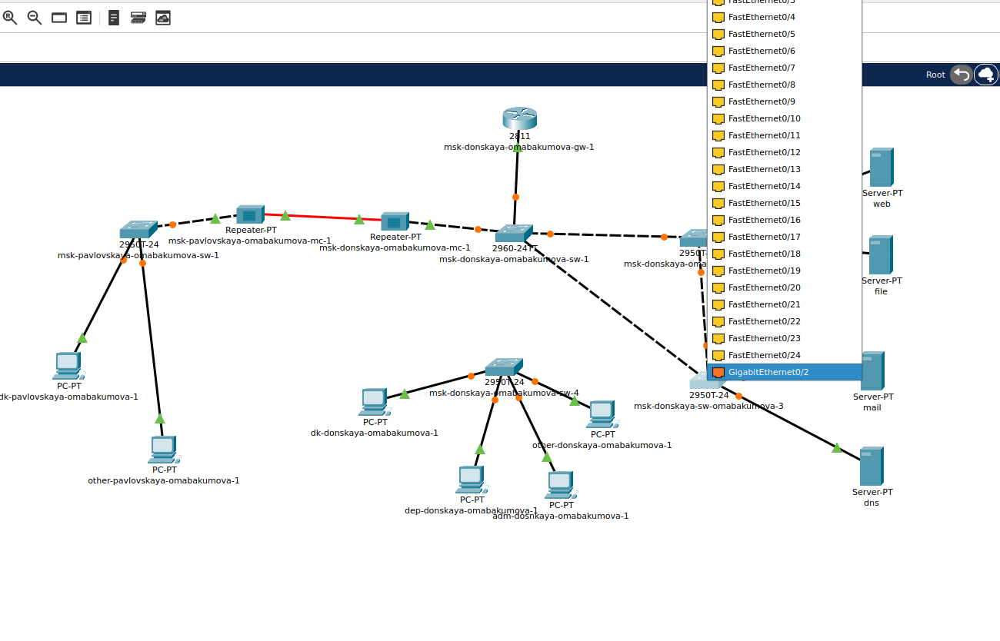{#fig:001 width=80%}

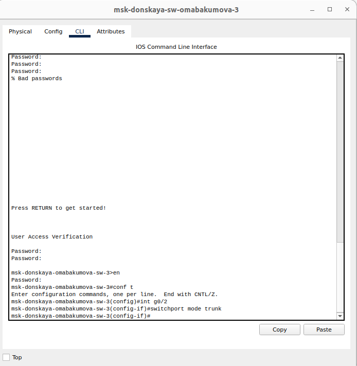{#fig:002 width=80%}

{#fig:003 width=80%}

{#fig:004 width=80%}

С оконечного устройства dk-donskaya-1 пропингуем серверы mail и web.
В режиме симуляции проследим движение пакетов ICMP. Убедимся, что
движение пакетов происходит через коммутатор msk-donskaya-sw-2 (рис. [-@fig:005]):

{#fig:005 width=80%}

{#fig:006 width=80%}

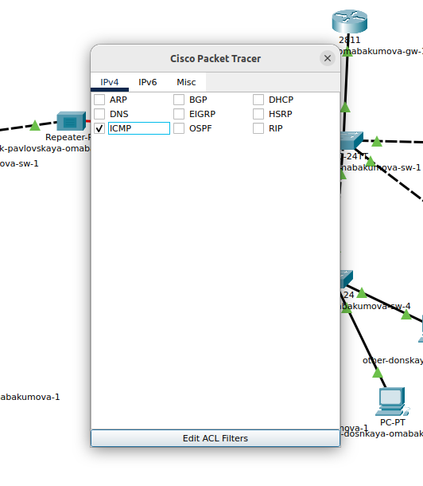{#fig:007 width=80%}

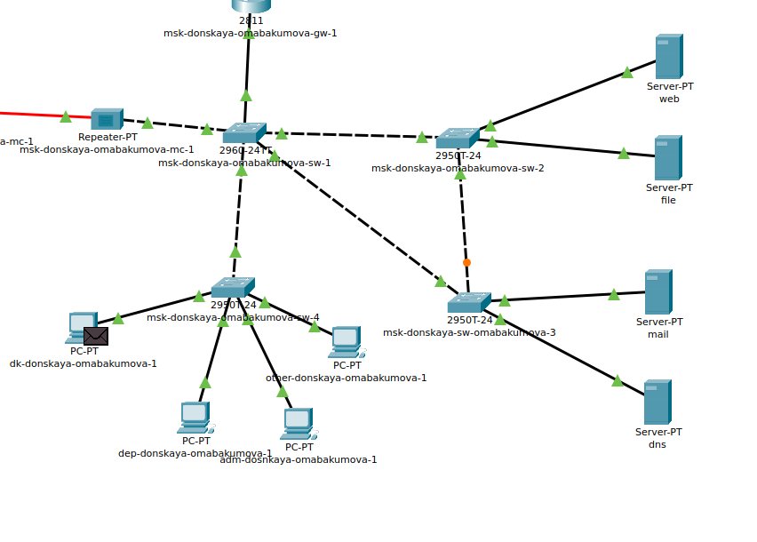{#fig:008 width=80%} 

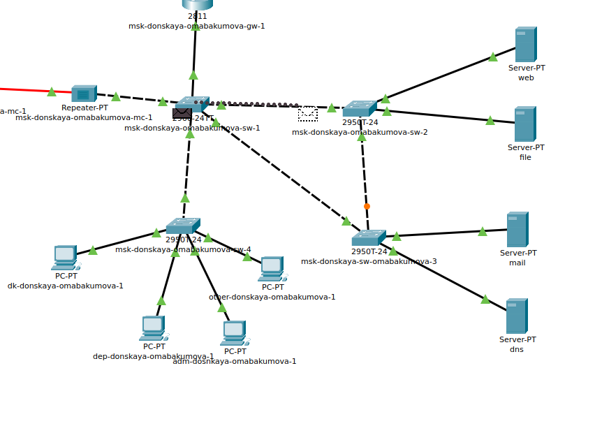{#fig:009 width=80%}

На коммутаторе msk-donskaya-omabakumva-sw-2 посмотрим состояние протокола STP
для vlan 3 (рис. [-@fig:010]):

{#fig:010 width=80%}

По какой-то причине у меня не было строки.
В качестве корневого коммутатора STP настроим коммутатор msk-
donskaya-omabakumova-sw-1 (рис. [-@fig:011]):

{#fig:011 width=80%}

Используя режим симуляции, убедимся, что пакеты ICMP пойдут от
хоста dk-donskaya-1 до mail через коммутаторы msk-donskaya-sw-1 и msk-
donskaya-sw-3, а от хоста dk-donskaya-1 до web через коммутаторы
msk-donskaya-sw-1 и msk-donskaya-sw-2 (рис. [-@fig:012]):

{#fig:012 width=80%}

{#fig:013 width=80%}

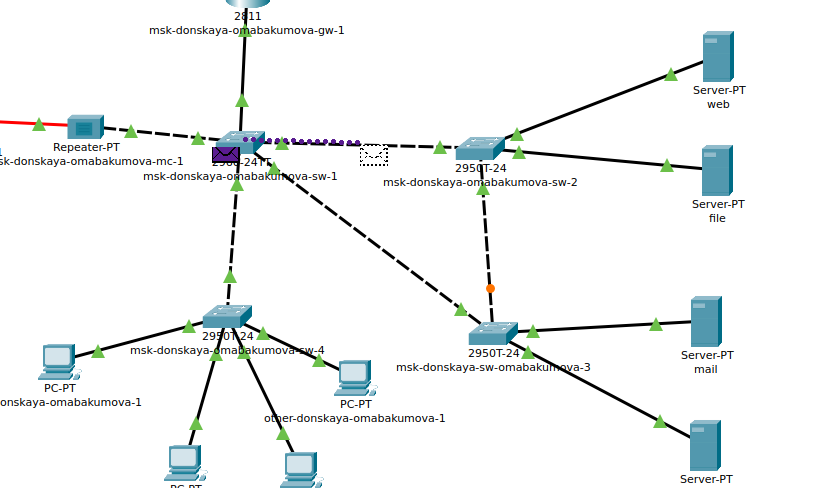{#fig:014 width=80%}

Настроим режим Portfast на тех интерфейсах коммутаторов, к которым
подключены серверы (рис. [-@fig:015]):

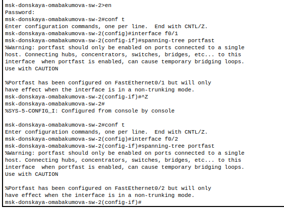{#fig:015 width=80%}

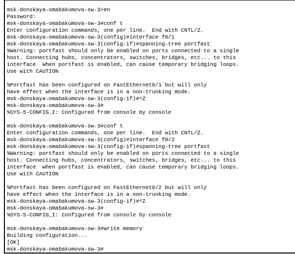{#fig:016 width=80%}

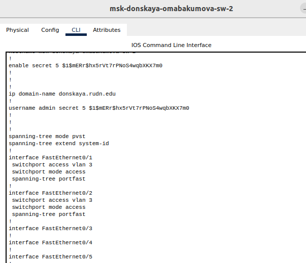{#fig:017 width=80%}

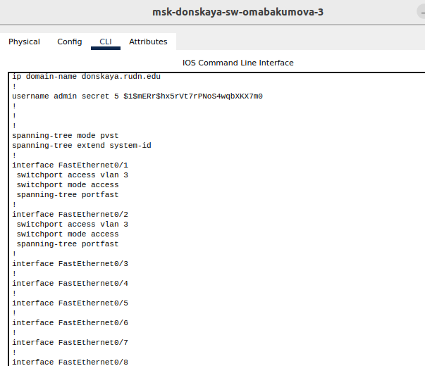{#fig:018 width=80%}

Изучим отказоустойчивость протокола STP и время восстановления соеди-
нения при переключении на резервное соединение. Для этого используем
команду ping -n 1000 mail.donskaya.rudn.ru на хосте dk-donskaya-1,
а разрыв соединения обеспечим переводом соответствующего интерфейса
коммутатора в состояние shutdown (рис. [-@fig:019]):

{#fig:019 width=80%}

{#fig:020 width=80%}

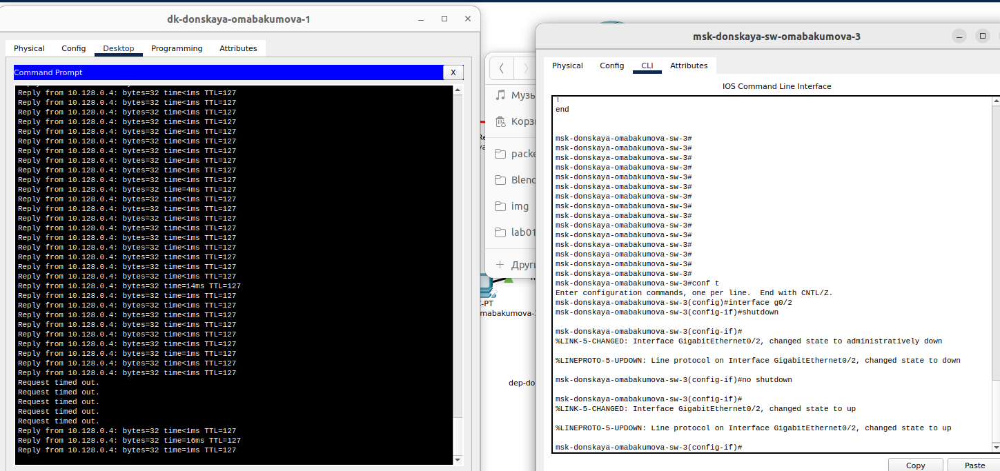{#fig:021 width=80%}

Переключим коммутаторы режим работы по протоколу Rapid PVST+: (рис. [-@fig:022]):

{#fig:022 width=80%}

{#fig:023 width=80%}

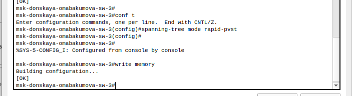{#fig:024 width=80%}

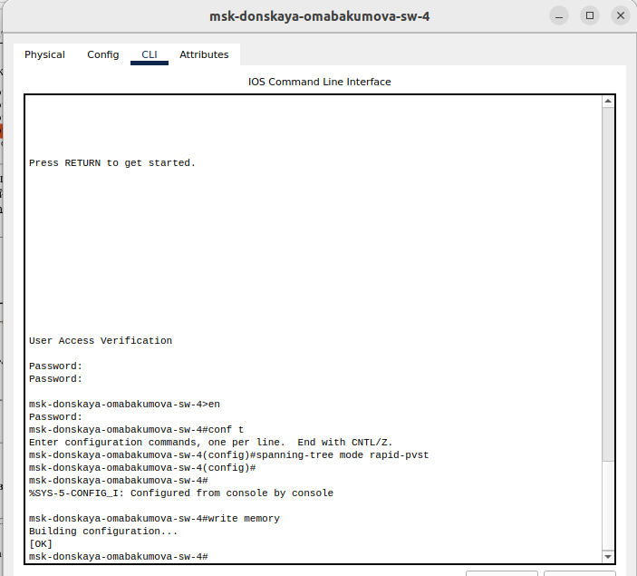{#fig:025 width=80%}

{#fig:026 width=80%}

Изучим отказоустойчивость протокола Rapid PVST+ и время восстановления соединения при переключении на резервное соединение (рис. [-@fig:027]):

{#fig:027 width=80%}

{#fig:028 width=80%}

Сформируем агрегированное соединение интерфейсов Fa0/20 – Fa0/23
между коммутаторами msk-donskaya-omabakumova-sw-1 и msk-donskaya-omabakumova-sw-4 (рис. [-@fig:029]):

{#fig:029 width=80%}

Настроим агрегирование каналов (режим EtherChannel) (рис. [-@fig:030]):

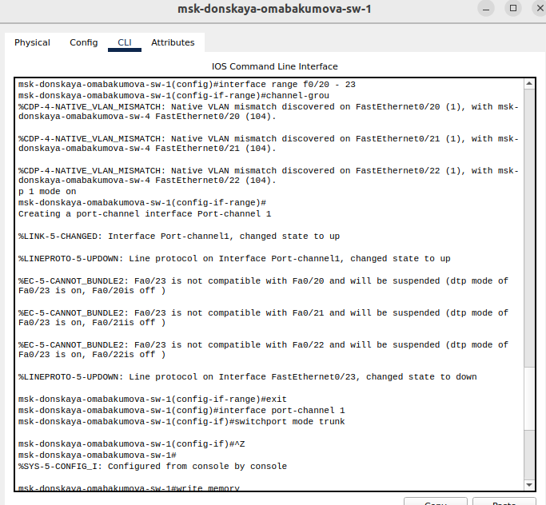{#fig:030 width=80%}

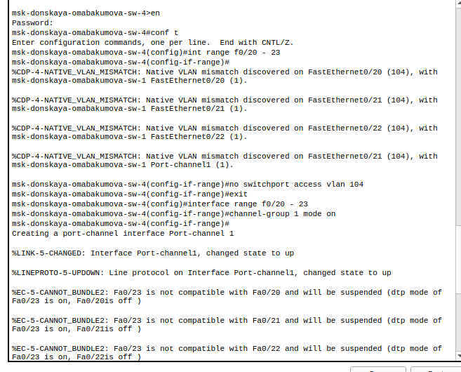{#fig:031 width=80%}

# Контрольные вопросы 

1. Какую информацию можно получить, воспользовавшись командой определения состояния протокола STP для VLAN (на корневом и не на корневом устройстве)?Примеры вывода подобной информации позволяют увидеть root ID, bridge ID, root cost, таймеры, состояние портов и их роли, как на корневом мосту (где видна общая картина STP), так и на некорневых, где отображается информация о ближайшем корневом мосту и состоянии отдельных портов для данной VLAN.Пример (Cisco): show spanning-tree vlan 1 (где 1 - номер VLAN). Вывод покажет, является ли устройство корневым мостом, ID корневого моста, приоритет моста, стоимость пути до корневого моста для данного свитча, состояние каждого порта (forwarding, blocking, listening, learning) и его роль (root port, designated port, alternate port).

2. При помощи какой команды можно узнать, в каком режиме, STP или Rapid PVST+, работает устройство?Примеры вывода позволяют проверить конфигурацию режима STP.Пример (Cisco): show spanning-tree summary. Вывод покажет текущий режим spanning tree (например, Spanning tree enabled protocol rstp), а также общее состояние spanning tree. Дополнительно можно использовать show spanning-tree interface <интерфейс> для информации о конкретном интерфейсе.

3. Для чего и в каких случаях нужно настраивать режим Portfast?Portfast нужен для сокращения времени перевода порта в состояние forwarding на портах, подключенных к конечным устройствам (компьютеры, принтеры и т.д.), чтобы избежать задержек при подключении этих устройств к сети. При включении Portfast, порт сразу переходит в состояние forwarding, минуя этапы listening и learning, что значительно ускоряет подключение. Portfast не следует использовать на портах, подключенных к другим коммутаторам, чтобы избежать петель.

4. В чем состоит принцип работы агрегированного интерфейса? Для чего он используется?Агрегированный интерфейс (или trunk, port channel) объединяет несколько физических каналов в один логический. Принцип работы заключается в распределении трафика между физическими каналами, увеличивая пропускную способность и обеспечивая отказоустойчивость (если один канал выходит из строя, трафик перенаправляется на другие). Он используется для увеличения пропускной способности между коммутаторами или между коммутатором и сервером, а также для обеспечения redundancy.

5. В чём принципиальные отличия при использовании протоколов LACP (Link Aggregation Control Protocol), PAgP (Port Aggregation Protocol) и статического агрегирования без использования протоколов?LACP - стандартный протокол, динамически управляющий агрегацией каналов. PAgP - проприетарный протокол Cisco, выполняющий аналогичную функцию. Статическое агрегирование не использует протоколы, и объединение каналов настраивается вручную, что менее гибко и не позволяет автоматически реагировать на сбои каналов. LACP и PAgP позволяют автоматически обнаруживать и настраивать агрегированные каналы, а также отключать каналы при обнаружении проблем, обеспечивая отказоустойчивость. Статическая конфигурация требует ручного вмешательства в случае сбоев.

6. При помощи каких команд можно узнать состояние агрегированного канала EtherChannel? Состояние EtherChannel можно узнать с помощью команд, отображающих общую информацию о канале, а также информацию о каждом участнике канала.Пример (Cisco): show etherchannel summary отображает общую информацию о EtherChannel: номера каналов, протоколы (LACP, PAgP), состояние каналов (SU - Success, P - In port-channel). show etherchannel port-channel отображает детализированную информацию о конкретном канале, включая список интерфейсов, входящих в канал, и их состояние. show etherchannel load-balance показывает метод распределения нагрузки между каналами. show lacp neighbor или show pagp neighbor показывает информацию о соседнем устройстве, с которым установлен LACP/PAgP.
# Выводы

Во время выполнения данной лабораторной работы я изучила протокол STP и его модификации по обеспечению отказоустойчивости сети, агрегированию интерфейсов и перераспределению
нагрузки между ними.

