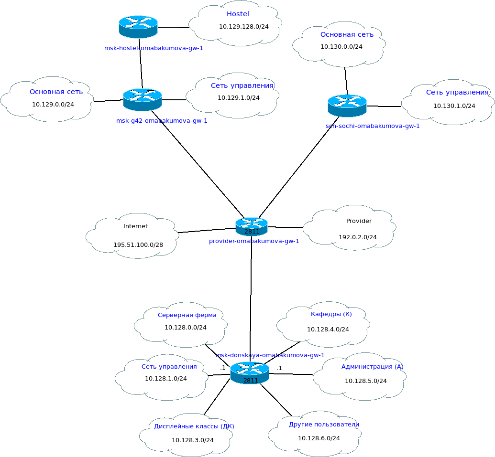
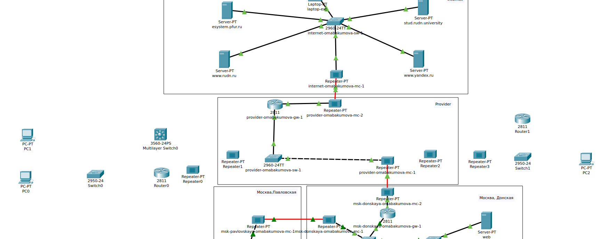
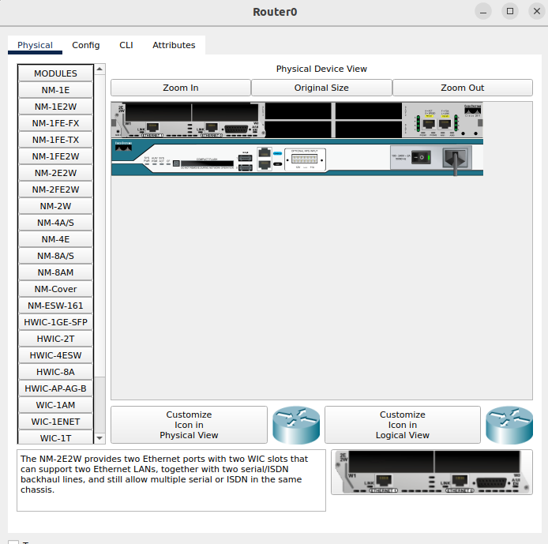
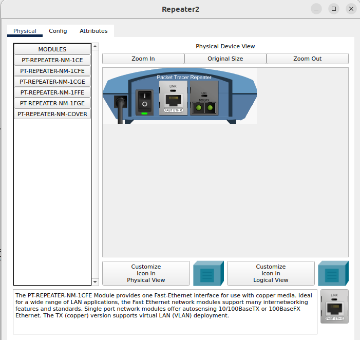
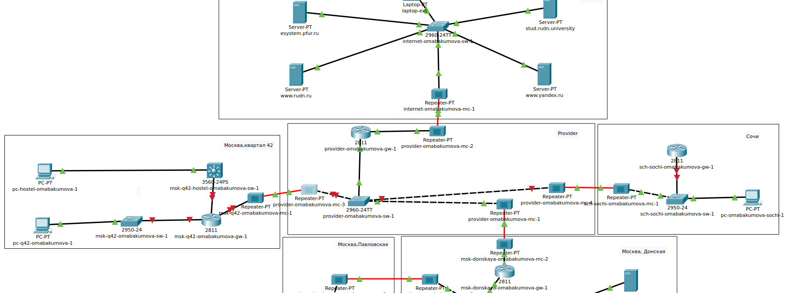
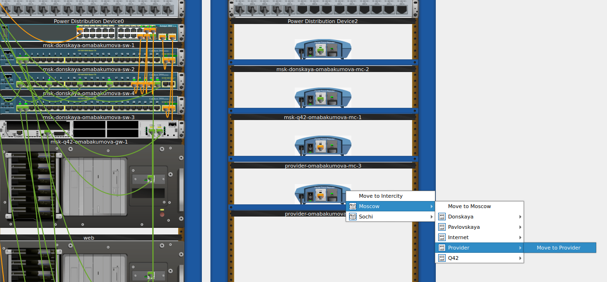
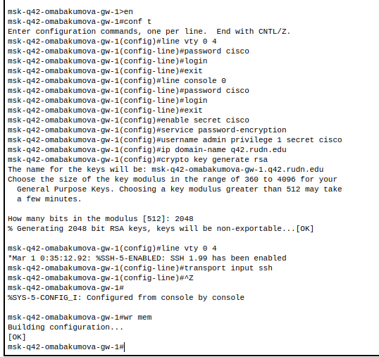
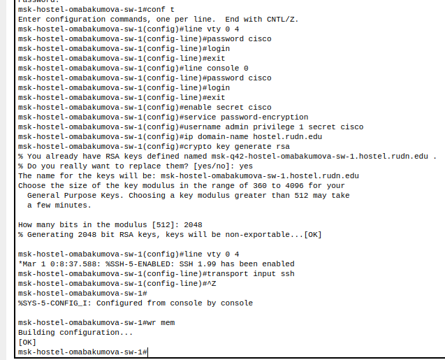
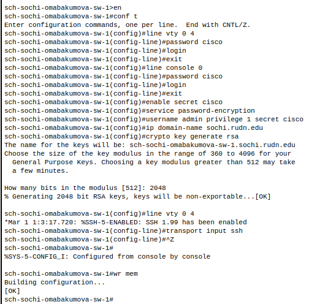

---
## Front matter
lang: ru-RU
title: Лабораторная работа № 13. Статическая маршрутизация в Интернете. Планирование
author:
  - Абакумова О. М.
institute:
  - Российский университет дружбы народов, Москва, Россия

## i18n babel
babel-lang: russian
babel-otherlangs: english

## Formatting pdf
toc: false
toc-title: Содержание
slide_level: 2
aspectratio: 169
section-titles: true
theme: metropolis
header-includes:
 - \metroset{progressbar=frametitle,sectionpage=progressbar,numbering=fraction}
mainfont: Open Sans Light
---

# Информация

## Докладчик

:::::::::::::: {.columns align=center}
::: {.column width="70%"}

  * Абакумова Олеся Максимовна
  * Студентка
  * Российский университет дружбы народов
  * 1132220832@pfur.ru
  * <https://github.com/omabakumova>

:::
::: {.column width="30%"}

:::
::::::::::::::

# Цель работы

Провести подготовительные мероприятия по организации взаимодействия
через сеть провайдера посредством статической маршрутизации локальной
сети с сетью основного здания, расположенного в 42-м квартале в Москве,
и сетью филиала, расположенного в г. Сочи.

# Задание

1. Внести изменения в схемы L1, L2 и L3 сети, добавив в них информацию
о сети основной территории (42-й квартал в Москве) и сети филиала в г. Сочи.
2. Дополнить схему проекта, добавив подсеть основной территории организации 42-го квартала в Москве и подсеть филиала в г. Сочи.
3. Сделать первоначальную настройку добавленного в проект оборудования.
7. При выполнении работы необходимо учитывать соглашение об именовании.

# Выполнение лабораторной работы

## Выполнение лабораторной работы

{#fig:001 width=50%}

## Выполнение лабораторной работы

{#fig:002 width=50%}

## Выполнение лабораторной работы

{#fig:003 width=50%}

## Выполнение лабораторной работы

{#fig:004 width=50%}

## Выполнение лабораторной работы

{#fig:005 width=50%}

## Выполнение лабораторной работы

{#fig:006 width=50%}

## Выполнение лабораторной работы

{#fig:007 width=50%}

## Выполнение лабораторной работы

{#fig:008 width=50%}

## Выполнение лабораторной работы

{#fig:009 width=50%}

## Выполнение лабораторной работы

{#fig:010 width=50%}

## Выполнение лабораторной работы

{#fig:011 width=50%}

## Выполнение лабораторной работы

{#fig:012 width=50%}

## Выполнение лабораторной работы

{#fig:013 width=50%}

## Выполнение лабораторной работы

{#fig:014 width=50%}

## Выполнение лабораторной работы

{#fig:015 width=50%}

## Выполнение лабораторной работы

{#fig:016 width=50%}

## Выполнение лабораторной работы

{#fig:017 width=50%}

## Выполнение лабораторной работы

{#fig:018 width=50%}

## Выполнение лабораторной работы

{#fig:019 width=50%}

## Выполнение лабораторной работы

{#fig:020 width=50%}

## Выполнение лабораторной работы

{#fig:021 width=50%}

## Выполнение лабораторной работы

{#fig:022 width=50%}

## Выполнение лабораторной работы

{#fig:023 width=50%}

# Выводы

В процессе выполнения лабораторной работы я провела подготовительные мероприятия по организации взаимодействия
через сеть провайдера посредством статической маршрутизации локальной
сети с сетью основного здания, расположенного в 42-м квартале в Москве,
и сетью филиала, расположенного в г. Сочи.

