---
## Front matter
title: "Лабораторная работа № 13. Статическая маршрутизация в Интернете. Планирование"
author: "Абакумова Олеся Максимовна, НФИбд-02-22"

## Generic otions
lang: ru-RU
toc-title: "Содержание"

## Bibliography
bibliography: bib/cite.bib
csl: pandoc/csl/gost-r-7-0-5-2008-numeric.csl

## Pdf output format
toc: true # Table of contents
toc-depth: 2
lof: true # List of figures
lot: true # List of tables
fontsize: 12pt
linestretch: 1.5
papersize: a4
documentclass: scrreprt
## I18n polyglossia
polyglossia-lang:
  name: russian
  options:
	- spelling=modern
	- babelshorthands=true
polyglossia-otherlangs:
  name: english
## I18n babel
babel-lang: russian
babel-otherlangs: english
## Fonts
mainfont: IBM Plex Serif
romanfont: IBM Plex Serif
sansfont: IBM Plex Sans
monofont: IBM Plex Mono
mathfont: STIX Two Math
mainfontoptions: Ligatures=Common,Ligatures=TeX,Scale=0.94
romanfontoptions: Ligatures=Common,Ligatures=TeX,Scale=0.94
sansfontoptions: Ligatures=Common,Ligatures=TeX,Scale=MatchLowercase,Scale=0.94
monofontoptions: Scale=MatchLowercase,Scale=0.94,FakeStretch=0.9
mathfontoptions:
## Biblatex
biblatex: true
biblio-style: "gost-numeric"
biblatexoptions:
  - parentracker=true
  - backend=biber
  - hyperref=auto
  - language=auto
  - autolang=other*
  - citestyle=gost-numeric
## Pandoc-crossref LaTeX customization
figureTitle: "Рис."
tableTitle: "Таблица"
listingTitle: "Листинг"
lofTitle: "Список иллюстраций"
lotTitle: "Список таблиц"
lolTitle: "Листинги"
## Misc options
indent: true
header-includes:
  - \usepackage{indentfirst}
  - \usepackage{float} # keep figures where there are in the text
  - \floatplacement{figure}{H} # keep figures where there are in the text
---

# Цель работы

Провести подготовительные мероприятия по организации взаимодействия
через сеть провайдера посредством статической маршрутизации локальной
сети с сетью основного здания, расположенного в 42-м квартале в Москве,
и сетью филиала, расположенного в г. Сочи.

# Задание

1. Внести изменения в схемы L1, L2 и L3 сети, добавив в них информацию
о сети основной территории (42-й квартал в Москве) и сети филиала в г. Сочи.
2. Дополнить схему проекта, добавив подсеть основной территории организации 42-го квартала в Москве и подсеть филиала в г. Сочи.
3. Сделать первоначальную настройку добавленного в проект оборудования.
7. При выполнении работы необходимо учитывать соглашение об именовании.


# Выполнение лабораторной работы

В ходе выполнения лабораторной работы нам понадобятся таблица распредления внешних ip-адресов (табл. [-@tbl:ipsch]), таблица VLAN (табл. [-@tbl:vlan]) и таблица IP для связующих разные территории линков (табл. [-@tbl:iplink]) с обновленными данными.

: Таблица VLAN {#tbl:vlan}

| № VLAN       | Имя VLAN         | Примечание                                          |
|--------------|------------------|-----------------------------------------------------|
| 1            | default          | Не используется                                     |
| 2            | management       | Для управления устройствами                         |
| 3            | servers          | Для серверной фермы                                 |
| 4            | nat              | Зарезервировано                                     |
| 5            | q42              | Линк в сеть квартала 42 в Москве                    |
| 6            | sochi            | Линк в сеть филиала в Сочи                          |
| 101          | dk               | Дисплейные классы (ДК)                              |
| 102          | departments      | Кафедры                                             |
| 103          | adm              | Администрация                                       |
| 104          | other            | Для других пользователей                            |
| 201          | q42-main         | Основной для квартала 42 в Москве                   |
| 202          | q42-management   | Для управления устройствами 42-го квартала в Москве |
| 301          | hostel-main      | Основной для общежитий в квартале 42 в Москве       |
| 401          | sochi-main       | Основной для филиала в Сочи                         |
| 402          | sochi-management | Для управления устройствами в филиала в Сочи        |

: Таблица IP для филиала в г. Сочи {#tbl:ipsch}

| IP-адреса                        | Примечание                              | VLAN |
|----------------------------------|-----------------------------------------|------|
| 10.130.0.0/16                    | Вся сеть филиала в Сочи                 |      |
| 10.130.0.0/24                    | Основная сеть филиала в Сочи            | 401  |
| 10.130.0.1                       | sch-sochi-gw-1                          |      |
| 10.130.0.200                     | pc-sochi-1                              |      |
| 10.130.1.0/24                    | Сеть для управления устройствами в Сочи | 402  |
| 10.130.1.1                       | sch-sochi-gw-1                          |      |


: Таблица IP для связующих разные территории линков {#tbl:iplink}
                                                             
| IP-адреса                                         | Примечание                                                   | VLAN |
|---------------------------------------------------|--------------------------------------------------------------|------|
| 10.128.255.0/24                                   | Вся сеть для линков                                          |      |
| 10.128.255.0/30                                   | Линк на 42-й квартал                                         | 5    |
| 10.128.255.1                                      | msk-donskaya-gw-1                                            |      |
| 10.128.255.2                                      | msk-q42-gw-1                                                 |      |
| 10.128.255.4/30                                   | Линк в Сочи 6                                                | 6    |
| 10.128.255.5                                      | msk-donskaya-gw-1                                            |      |
| 10.128.255.6                                      | sch-sochi-gw-1                                               |      |
| 10.129.0.0/16                                     | Вся сеть квартала 42 в Москве                                |      |
| 10.129.0.0/24                                     | Основная сеть квартала 42 в Москве                           | 201  |
| 10.129.0.1                                        | msk-q42-gw-1                                                 |      |
| 10.129.0.200                                      | pc-q42-1                                                     |      |
| 10.129.1.0/24                                     | Сеть для управления устройствами в сети квартала 42 в Москве | 202  |
| 10.129.1.1                                        | msk-q42-gw-1                                                 |      |
| 10.129.1.2                                        | msk-hostel-gw-1                                              |      |
| 10.129.128.0/17                                   | Вся сеть hostel                                              |      |
| 10.129.128.0/24                                   | Основная сеть hostel                                         | 301  |
| 10.129.128.1                                      | msk-hostel-gw-1                                              |      |
| 10.129.128.200                                    | pc-hostel-1                                                  |      |

Для начала внесем изменения в схемы L1, L2 и L3 сети, добавив в них информацию
о сети основной территории (42-й квартал в Москве) и сети филиала в г. Сочи (рис. [-@fig:001]):

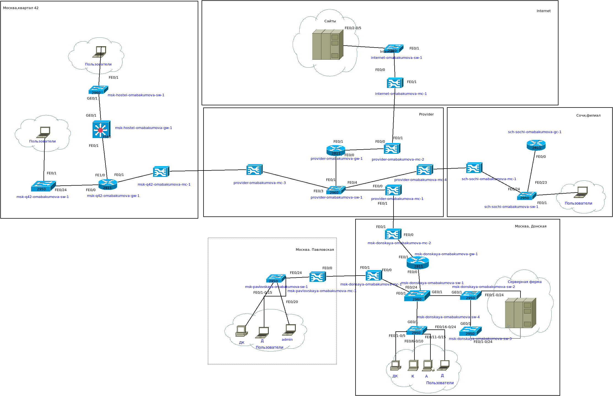{#fig:001 width=80%}

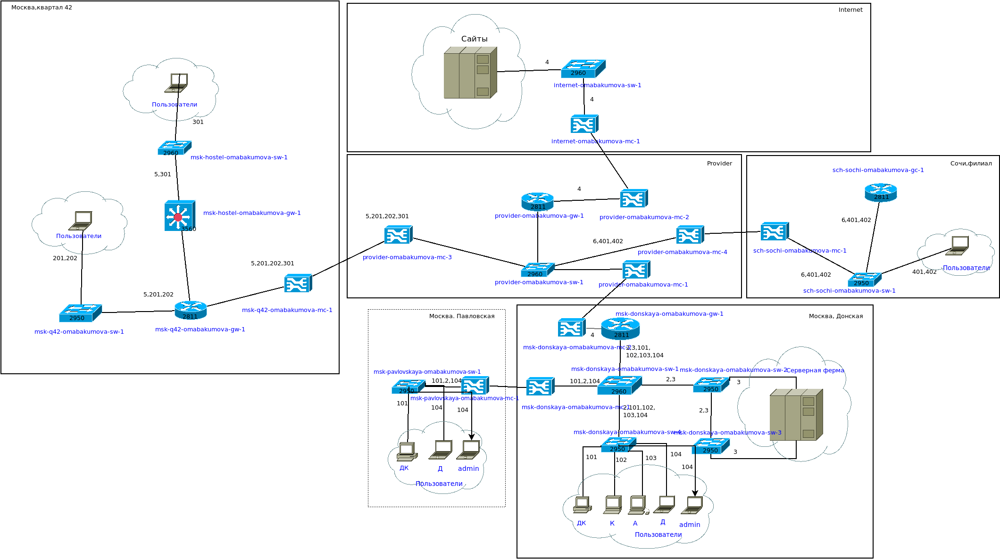{#fig:002 width=80%}

{#fig:003 width=80%}

Предварительно разместим коммутаторы,маршрутизаторы,репитеры и оконечные устройства (рис. [-@fig:004]):

{#fig:004 width=80%}

**Здесь не хватает одного коммутатора согласно диаграммам,он будет добавлено и настроено ближе к концу**

На маршрутизаторе добавим дополнительный интерфейс (рис. [-@fig:005]):

{#fig:005 width=80%}

Также произведем замену модле на медиаконвертерах (рис. [-@fig:006]):

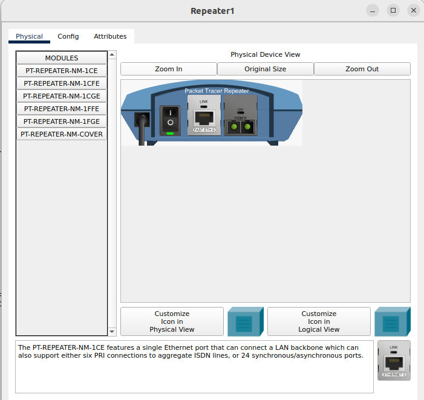{#fig:006 width=80%}

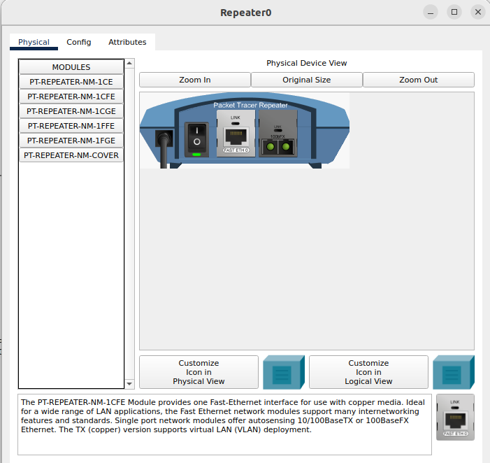{#fig:007 width=80%}

{#fig:008 width=80%}

{#fig:009 width=80%}

Добавим необходимые соединения в соответствии со схемами (рис. [-@fig:010]):

{#fig:010 width=80%}

Далее необходимо перейти в физическую рабочую область.Добавим г.Сочи и также в г.Москве добавим 42 квартал.В г.Сочи добавим здание "Sochi" (рис. [-@fig:011]):

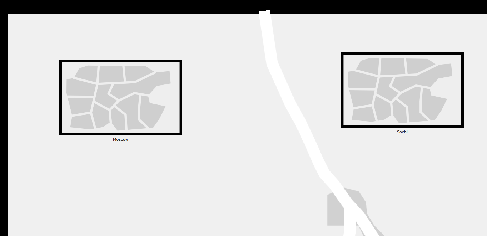{#fig:011 width=80%}

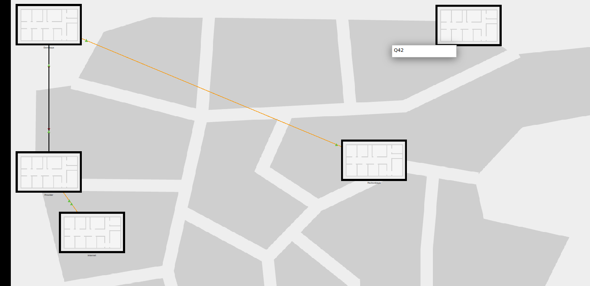{#fig:012 width=80%}

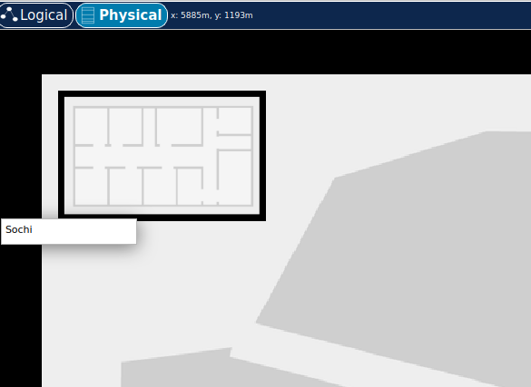{#fig:013 width=80%}

Теперь так, как все добавленные устройства по умолчанию разместились в области Донской, их необходимо разместить по местам (рис. [-@fig:014]):

{#fig:014 width=80%}

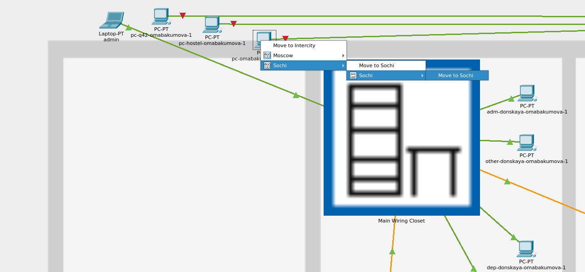{#fig:015 width=80%}

Все устройства перемещаются аналогичным способом по своим местам.
Чтобы удостовериться в том, что устройства на своих местах достаточно просто на них навести и мы увидим их местоположение (рис. [-@fig:016]):

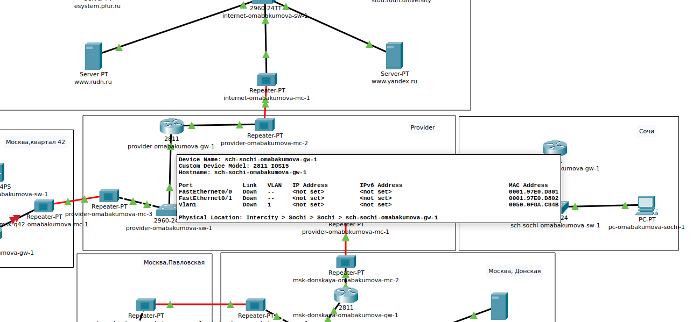{#fig:016 width=80%}

Теперь проведем первоначальную настройку коммутаторов и маршрутизаторов (рис. [-@fig:017]):

{#fig:017 width=80%}

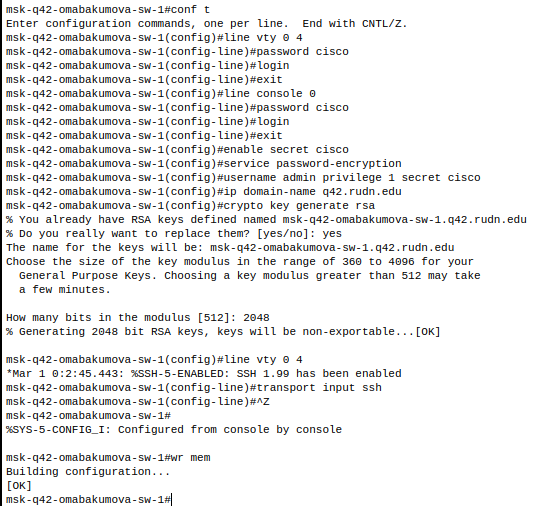{#fig:018 width=80%}

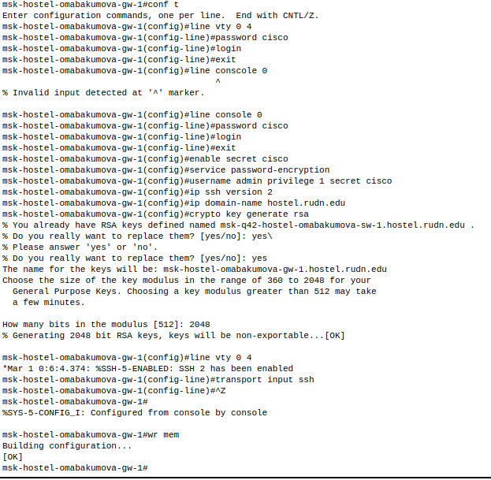{#fig:019 width=80%}

{#fig:020 width=80%}

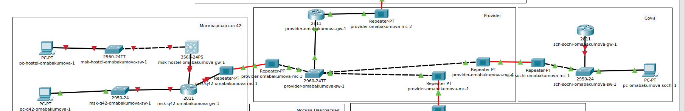{#fig:021 width=80%}

{#fig:022 width=80%}

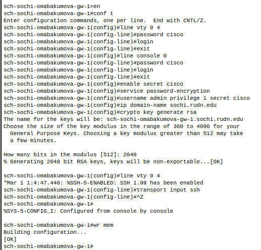{#fig:023 width=50%}

P.S. Из-за собственной невнимательности настройку пришлось проводить несколько раз :D

# Контрольные вопросы 

1. В каких случаях следует использовать статическую маршрутизацию? Приведите примеры.

Статическую маршрутизацию следует использовать в следующих случаях:  

- **В небольших сетях** с ограниченным количеством маршрутов, где ручная настройка не вызывает сложностей.  

- **Для подключения к провайдеру**, когда известен единственный маршрут к шлюзу.  

- **В сетях с фиксированной топологией**, где изменения происходят редко.  

- **Для маршрутов по умолчанию (default route)**, например, когда весь трафик должен идти через один шлюз.  

- **В DMZ или корпоративных сетях**, где требуется жесткий контроль над передачей трафика.  

- **Для резервных каналов связи**, если динамическая маршрутизация нежелательна из-за сложности или избыточности.  

**Примеры:**  

-  Малое предприятие с одним маршрутизатором и двумя сетями:  
   ```  
   ip route 192.168.2.0 255.255.255.0 192.168.1.1  
   ```  
   (Все пакеты в сеть `192.168.2.0/24` направляются через шлюз `192.168.1.1`.)  

-  Домашний роутер с маршрутом по умолчанию к провайдеру:  
   ```  
   ip route 0.0.0.0 0.0.0.0 100.64.1.1  
   ```  

2. Укажите основные принципы статической маршрутизации между VLANs.

При настройке статической маршрутизации между VLAN используются следующие принципы:  

- **Наличие маршрутизатора или L3-коммутатора** --- для передачи трафика между VLAN требуется устройство, поддерживающее маршрутизацию (Router-on-a-Stick или меж-VLAN маршрутизацию). 
 
- **Создание интерфейсов VLAN (SVI)** --- на L3-коммутаторе или маршрутизаторе должны быть настроены виртуальные интерфейсы для каждого VLAN с уникальными IP-адресами.  

- **Назначение IP-адресов шлюза** --- каждый VLAN должен иметь свой шлюз по умолчанию (обычно это IP SVI-интерфейса).  

- **Прописывание статических маршрутов** --- если трафик должен идти через другой маршрутизатор, добавляются соответствующие записи.  

- **Настройка trunk-портов** --- между коммутатором и маршрутизатором (или L3-коммутатором) должен быть настроен trunk для передачи тегированных фреймов.  


# Выводы

В процессе выполнения лабораторной работы я провела подготовительные мероприятия по организации взаимодействия
через сеть провайдера посредством статической маршрутизации локальной
сети с сетью основного здания, расположенного в 42-м квартале в Москве,
и сетью филиала, расположенного в г. Сочи.
