---
## Front matter
lang: ru-RU
title: Лабораторная работа № 14. Статическая маршрутизация в Интернете. Настройка
author:
  - Абакумова О. М.
institute:
  - Российский университет дружбы народов, Москва, Россия


## i18n babel
babel-lang: russian
babel-otherlangs: english

## Formatting pdf
toc: false
toc-title: Содержание
slide_level: 2
aspectratio: 169
section-titles: true
theme: metropolis
header-includes:
 - \metroset{progressbar=frametitle,sectionpage=progressbar,numbering=fraction}
mainfont: Open Sans Light
---

# Информация

## Докладчик

:::::::::::::: {.columns align=center}
::: {.column width="70%"}

  * Абакумова Олеся Максимовна
  * Студентка
  * Российский университет дружбы народов
  * 1132220832@pfur.ru
  * <https://github.com/omabakumova>

:::
::: {.column width="30%"}


:::
::::::::::::::

# Цель работы

Настроить взаимодействие через сеть провайдера посредством статической
маршрутизации локальной сети организации с сетью основного здания, расположенного в 42-м квартале в Москве, и сетью филиала, расположенного
в г. Сочи.

# Задание

1. Настроить связь между территориями.

2. Настроить оборудование, расположенное в квартале 42 в Москве.

3. Настроить оборудование, расположенное в филиале в г. Сочи.

4. Настроить статическую маршрутизацию между территориями.

# Задание

5. Настроить статическую маршрутизацию на территории квартала 42 в г.
Москве.

6. Настроить NAT на маршрутизаторе msk-donskaya-gw-1.

7. При выполнении работы необходимо учитывать соглашение об именовании.


# Выполнение лабораторной работы

## Выполнение лабораторной работы

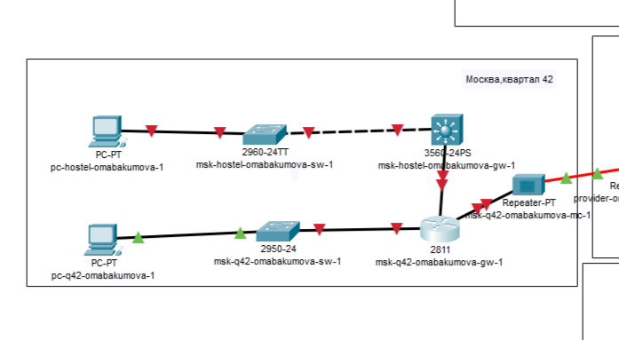{#fig:001 width=50%}

## Выполнение лабораторной работы

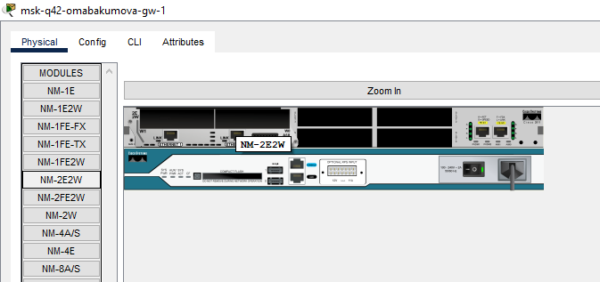{#fig:002 width=50%}

## Выполнение лабораторной работы

{#fig:003 width=50%}

## Настройка линка между площадками

{#fig:004 width=30%}

## Настройка линка между площадками

{#fig:005 width=40%}

## Настройка линка между площадками

{#fig:006 width=50%}

## Настройка линка между площадками

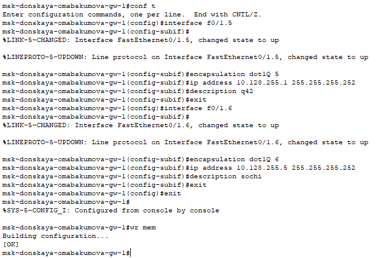{#fig:007 width=50%}

## Настройка линка между площадками

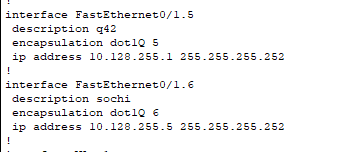{#fig:008 width=50%}

## Настройка линка между площадками

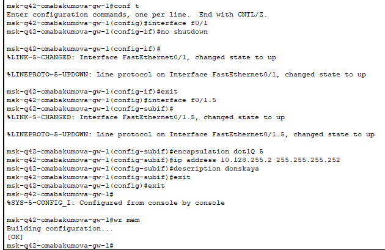{#fig:009 width=50%}

## Настройка линка между площадками

{#fig:010 width=50%}

## Настройка линка между площадками

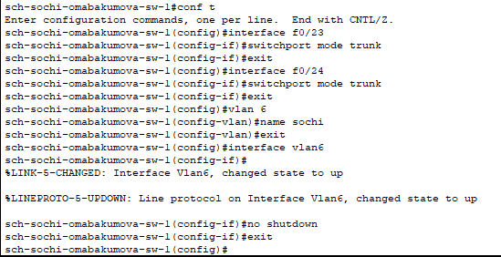{#fig:011 width=50%}

## Настройка линка между площадками

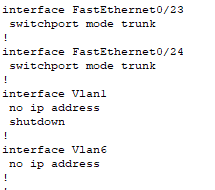{#fig:012 width=40%}

## Настройка линка между площадками

```

sch-sochi-omabakumova-gw-1> enable
sch-sochi-omabakumova-gw-1# configure terminal
sch-sochi-omabakumova-gw-1(config)# interface f0/0
sch-sochi-omabakumova-gw-1(config-if)#no shutdown
sch-sochi-omabakumova-gw-1(config-if)#exit
sch-sochi-omabakumova-gw-1(config)# interface f0 /0.6
sch-sochi-omabakumova-gw-1(config-subif)# encapsulation dot1Q 6
sch-sochi-omabakumova-gw-1(config-subif)#ip address 10.128.255.6 255.255.255.252
sch-sochi-omabakumova-gw-1(config-subif)# description donskaya
sch-sochi-omabakumova-gw-1(config-subif)#exit
sch-sochi-omabakumova-gw-1(config)#exit

```

## Настройка линка между площадками

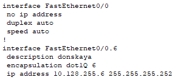{#fig:013 width=50%}

## Настройка линка между площадками

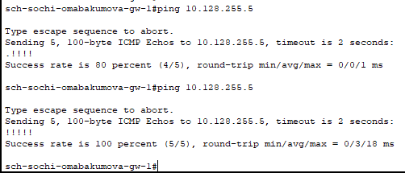{#fig:014 width=50%}

## Настройка площадки 42-го квартала

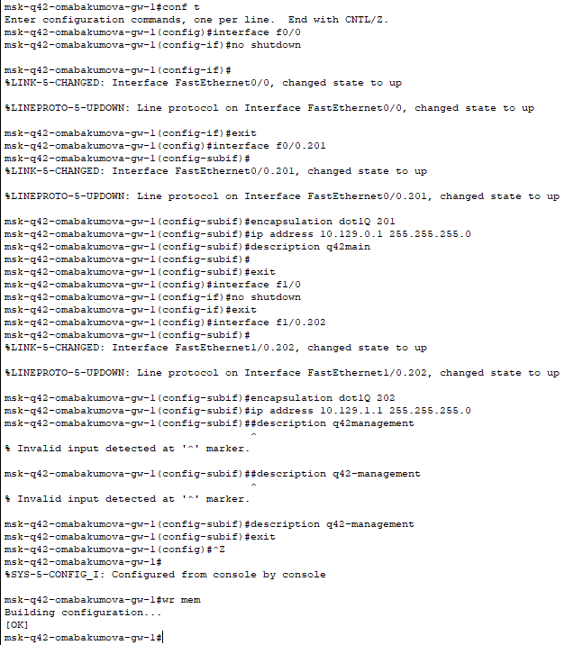{#fig:015 width=30%}

## Настройка площадки 42-го квартала

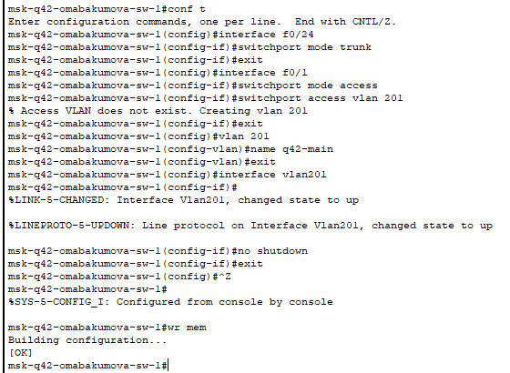{#fig:016 width=50%}

## Настройка площадки 42-го квартала

{#fig:017 width=50%}

## Настройка площадки 42-го квартала

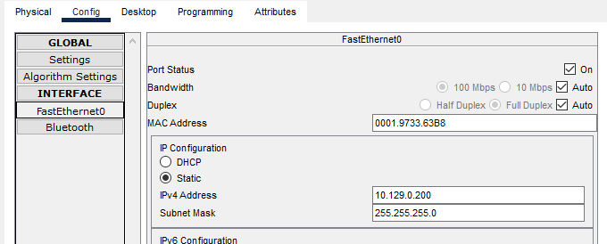{#fig:018 width=50%}

## Настройка площадки 42-го квартала

{#fig:019 width=30%}

## Настройка площадки 42-го квартала

{#fig:020 width=50%}

## Настройка площадки 42-го квартала

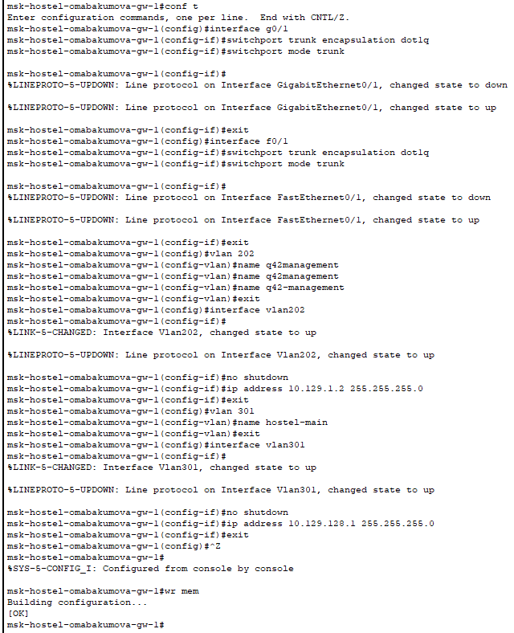{#fig:021 width=30%}

## Настройка площадки 42-го квартала

{#fig:022 width=50%}

## Настройка площадки 42-го квартала

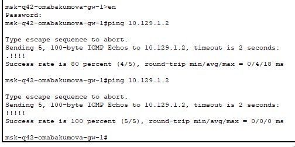{#fig:023 width=50%}

## Настройка площадки 42-го квартала

{#fig:024 width=50%}

## Настройка площадки 42-го квартала

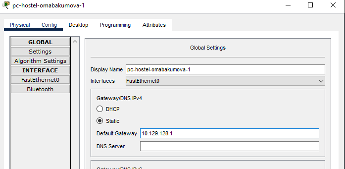{#fig:025 width=50%}

## Настройка площадки 42-го квартала

{#fig:026 width=50%}

## Настройка площадки 42-го квартала

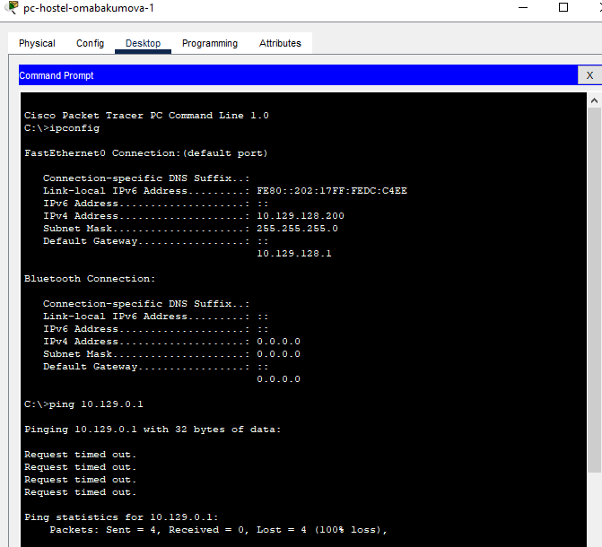{#fig:027 width=50%}

## Настройка площадки в Сочи

{#fig:028 width=50%}

## Настройка площадки в Сочи

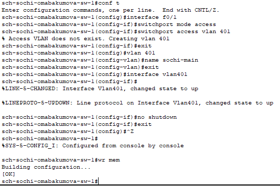{#fig:029 width=50%}

## Настройка площадки в Сочи

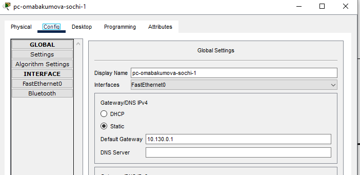{#fig:030 width=50%}

## Настройка площадки в Сочи

{#fig:031 width=50%}

## Настройка маршрутизации между площадками

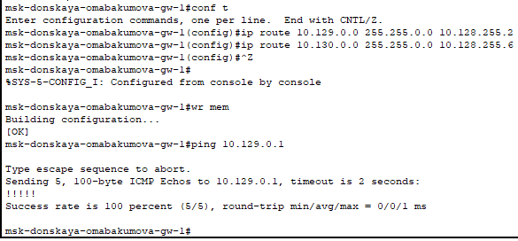{#fig:032 width=50%}

## Настройка маршрутизации между площадками

{#fig:033 width=50%}

## Настройка маршрутизации между площадками

{#fig:034 width=20%}

## Настройка маршрутизации между площадками

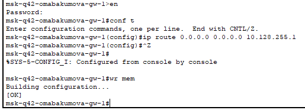{#fig:035 width=50%}

## Настройка маршрутизации между площадками

{#fig:036 width=50%}

## Настройка маршрутизации между площадками

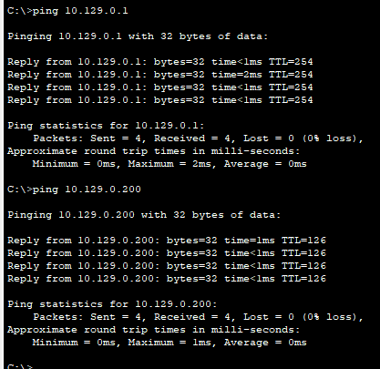{#fig:037 width=40%}

## Настройка маршрутизации между площадками

{#fig:038 width=50%}

## Настройка маршрутизации на 42 квартале

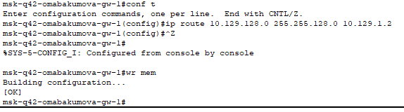{#fig:039 width=50%}

## Настройка маршрутизации на 42 квартале

{#fig:040 width=50%}

## Настройка маршрутизации на 42 квартале

{#fig:041 width=20%}

## Настройка NAT

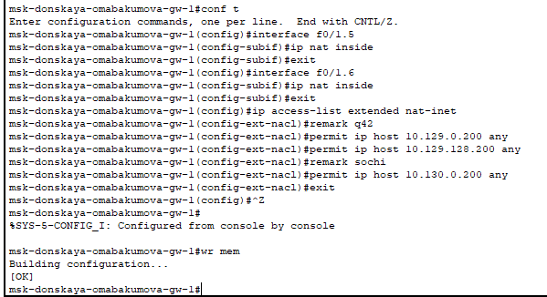{#fig:042 width=50%}

## Настройка NAT

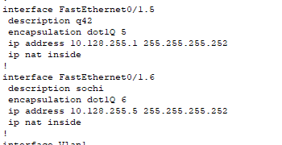{#fig:043 width=50%}

## Настройка NAT

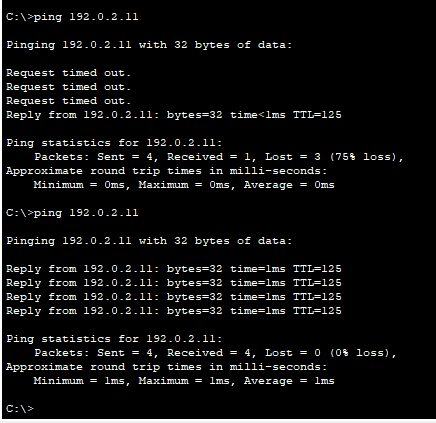{#fig:044 width=40%}

## Настройка NAT

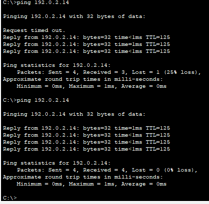{#fig:045 width=40%}


# Выводы

В процессе выполнения лабораторной работы я настроила взаимодействие через сеть провайдера посредством статической
маршрутизации локальной сети организации с сетью основного здания, расположенного в 42-м квартале в Москве, и сетью филиала, расположенного
в г. Сочи.

