---
## Front matter
title: "Лабораторная работа № 14. Статическая маршрутизация в Интернете. Настройка"
author: "Абакумова Олеся Максимовна, НФИбд-02-22"

## Generic otions
lang: ru-RU
toc-title: "Содержание"

## Bibliography
bibliography: bib/cite.bib
csl: pandoc/csl/gost-r-7-0-5-2008-numeric.csl

## Pdf output format
toc: true # Table of contents
toc-depth: 2
lof: true # List of figures
lot: true # List of tables
fontsize: 12pt
linestretch: 1.5
papersize: a4
documentclass: scrreprt
## I18n polyglossia
polyglossia-lang:
  name: russian
  options:
	- spelling=modern
	- babelshorthands=true
polyglossia-otherlangs:
  name: english
## I18n babel
babel-lang: russian
babel-otherlangs: english
## Fonts
mainfont: IBM Plex Serif
romanfont: IBM Plex Serif
sansfont: IBM Plex Sans
monofont: IBM Plex Mono
mathfont: STIX Two Math
mainfontoptions: Ligatures=Common,Ligatures=TeX,Scale=0.94
romanfontoptions: Ligatures=Common,Ligatures=TeX,Scale=0.94
sansfontoptions: Ligatures=Common,Ligatures=TeX,Scale=MatchLowercase,Scale=0.94
monofontoptions: Scale=MatchLowercase,Scale=0.94,FakeStretch=0.9
mathfontoptions:
## Biblatex
biblatex: true
biblio-style: "gost-numeric"
biblatexoptions:
  - parentracker=true
  - backend=biber
  - hyperref=auto
  - language=auto
  - autolang=other*
  - citestyle=gost-numeric
## Pandoc-crossref LaTeX customization
figureTitle: "Рис."
tableTitle: "Таблица"
listingTitle: "Листинг"
lofTitle: "Список иллюстраций"
lotTitle: "Список таблиц"
lolTitle: "Листинги"
## Misc options
indent: true
header-includes:
  - \usepackage{indentfirst}
  - \usepackage{float} # keep figures where there are in the text
  - \floatplacement{figure}{H} # keep figures where there are in the text
---

# Цель работы

Настроить взаимодействие через сеть провайдера посредством статической
маршрутизации локальной сети организации с сетью основного здания, расположенного в 42-м квартале в Москве, и сетью филиала, расположенного
в г. Сочи.

# Задание

1. Настроить связь между территориями.
2. Настроить оборудование, расположенное в квартале 42 в Москве.
3. Настроить оборудование, расположенное в филиале в г. Сочи.
4. Настроить статическую маршрутизацию между территориями.
5. Настроить статическую маршрутизацию на территории квартала 42 в г.
Москве.
6. Настроить NAT на маршрутизаторе msk-donskaya-gw-1.
7. При выполнении работы необходимо учитывать соглашение об именовании.


# Выполнение лабораторной работы

В ходе выполнения предыдущей лабораторной работы была допущена ошибка в области 42 квартала в Москве (рис. [-@fig:001]):

{#fig:001 width=80%}

Тест на дурака был пройден и я успешно установила не тот модуль на маршрутизатор в этой области, хотя в тексте лабораторной работы было указано какой.Поменяем на нужный (рис. [-@fig:003]):

{#fig:002 width=80%}

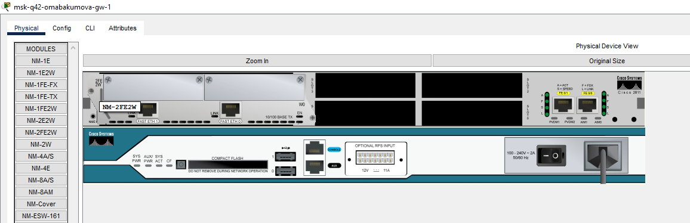{#fig:003 width=80%}

## Настройка линка между площадками

Проведем настройку линка между площадками.Начнем с коммутатора в области провайдера (рис. [-@fig:004]):

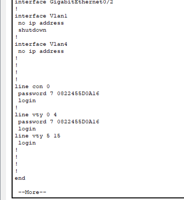{#fig:004 width=80%}

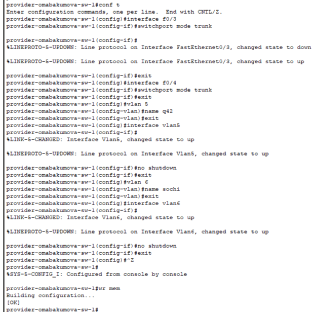{#fig:005 width=80%}

Необходимые vlan и интерфейсы подняты (рис. [-@fig:006]):

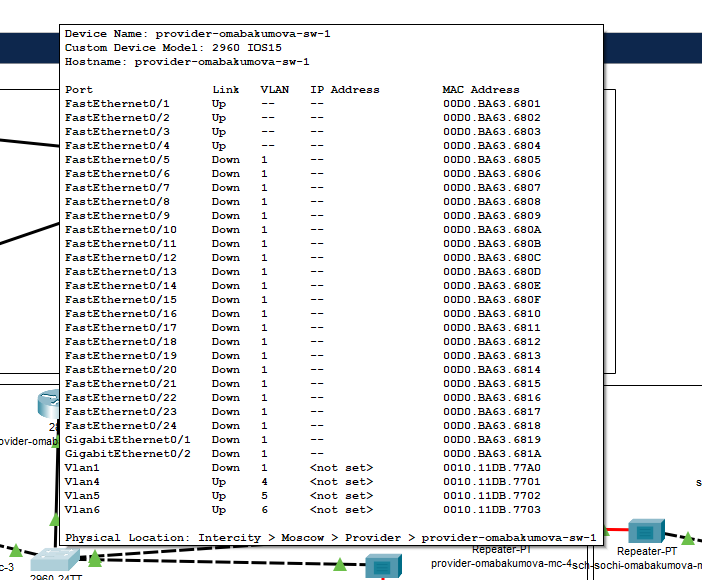{#fig:006 width=80%}

Проведем аналогично настройку интерфейсов для последующих устройств (рис. [-@fig:007]):

{#fig:007 width=80%}

{#fig:008 width=80%}

{#fig:009 width=80%}

Попробуем пропинговать с маршрутизатора (рис. [-@fig:010]):

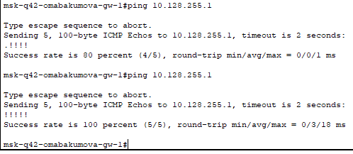{#fig:010 width=80%}

Продолжим настрйоку интерфейсов уже в области г.Сочи (рис. [-@fig:011]):

{#fig:011 width=80%}

{#fig:012 width=80%}

Аналогично провоедем настройку и для маршрутизатора в области г.Сочи:

```

sch-sochi-omabakumova-gw-1> enable
sch-sochi-omabakumova-gw-1# configure terminal
sch-sochi-omabakumova-gw-1(config)# interface f0/0
sch-sochi-omabakumova-gw-1(config-if)#no shutdown
sch-sochi-omabakumova-gw-1(config-if)#exit
sch-sochi-omabakumova-gw-1(config)# interface f0 /0.6
sch-sochi-omabakumova-gw-1(config-subif)# encapsulation dot1Q 6
sch-sochi-omabakumova-gw-1(config-subif)#ip address 10.128.255.6 255.255.255.252
sch-sochi-omabakumova-gw-1(config-subif)# description donskaya
sch-sochi-omabakumova-gw-1(config-subif)#exit
sch-sochi-omabakumova-gw-1(config)#exit

```

{#fig:013 width=80%}

Удостоверимся в работоспособности маршрутизатора с помощью пингования (рис. [-@fig:014]):

{#fig:014 width=80%}

## Настройка площадки 42-го квартала

Перейдем к настройке площадки 42 квартала.Начнем с маршрутизатора msk-q42-omabakumova-gw-1 (рис. [-@fig:015]):

{#fig:015 width=80%}

Аналогично и для коммутатора msk-q42-omabakumova-sw-1 (рис. [-@fig:016]):

{#fig:016 width=80%}

Проведем настройку оконечного устройства 42 квартала pc-q42-omabakumova-1 (рис. [-@fig:017]):

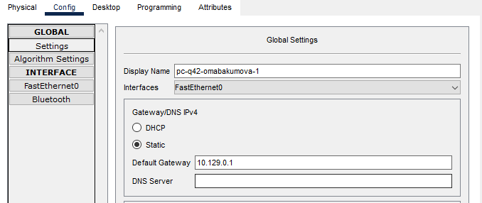{#fig:017 width=80%}

{#fig:018 width=80%}

Данная настройка была проведена для того, чтобы проверить работоспособность сети в данны момент с учетом, примененных настроек (рис. [-@fig:019]):

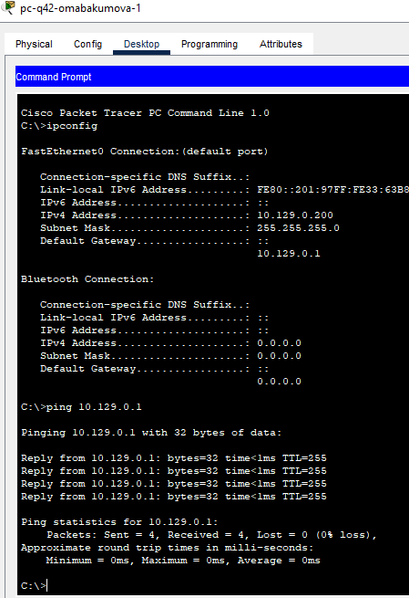{#fig:019 width=80%}

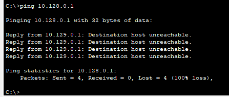{#fig:020 width=80%}

Как можно заметить пинг не проходит за пределы областии 42 квартала, пока что.
Продолжим настройку.Передйем к маршрутизирующему коммутатору (рис. [-@fig:021]):

{#fig:021 width=80%}

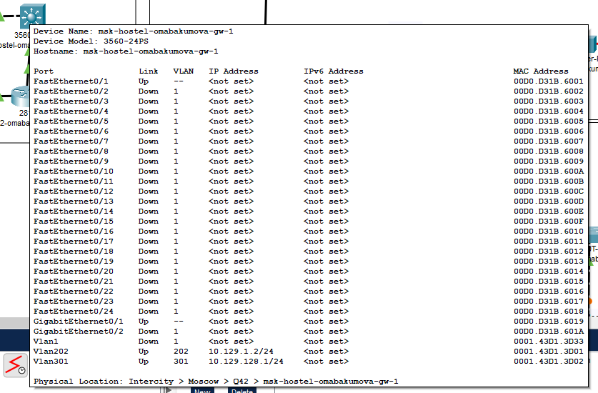{#fig:022 width=80%}

Как можно заметить настройка проведена по Fa0/1.
Пробуем пропинговать с маршрутизатора 42 квартала msk-hostel-omabaumova-gw-1 (рис. [-@fig:023]):

{#fig:023 width=80%}

Последнее, что осталось провести настройку на коммутаторе msk-hostel-omabakumova-sw-1 (рис. [-@fig:024]):

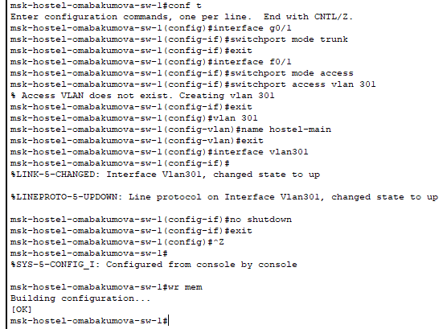{#fig:024 width=80%}

Также сразу проведем ряд тестов с помощью пинга.Для начала проведем настройку оконечного устройства pc-hostel-omabakumova-1 (рис. [-@fig:025]):

{#fig:025 width=80%}

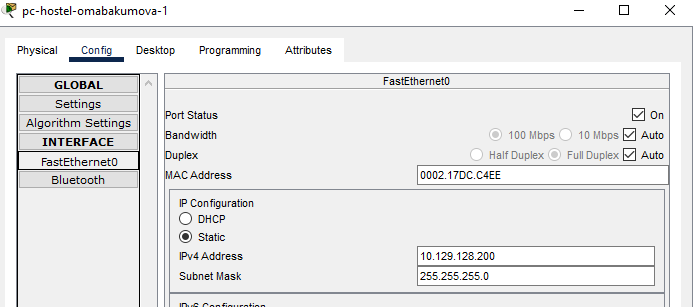{#fig:026 width=80%}

{#fig:027 width=80%}

Пинг не прошел к маршрутизатору 42 квартала.Так и должно быть.

## Настройка площадки в Сочи

Перейдем к области г.Сочи.Проведем настройку для маршрутизатора и коммутатора (рис. [-@fig:028]):

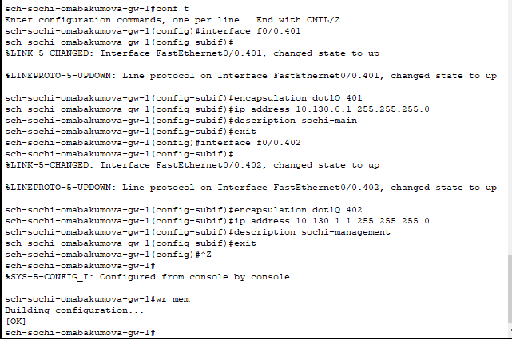{#fig:028 width=80%}

{#fig:029 width=80%}

Также в этой области настроим оконечное устройство (рис. [-@fig:030]):

{#fig:030 width=80%}

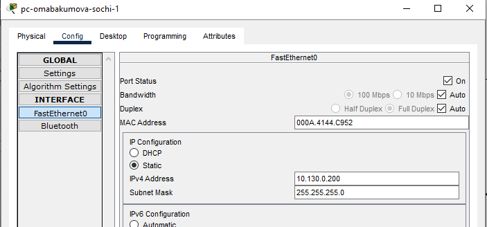{#fig:031 width=80%}

## Настройка маршрутизации между площадками

Настроим маршрутизацию между площадками, начиная с маршрутизатора в области Донская (рис. [-@fig:032]):

{#fig:032 width=80%}

Попробуем с этого маршрутизатора пропинговать оконечное устройство 42 квартала (рис. [-@fig:033]):

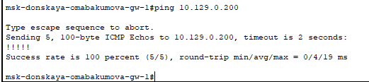{#fig:033 width=80%}

Пинг успешно проходит.
Попробуем с лаптопа admin в области Донская пропинговать (рис. [-@fig:034]):

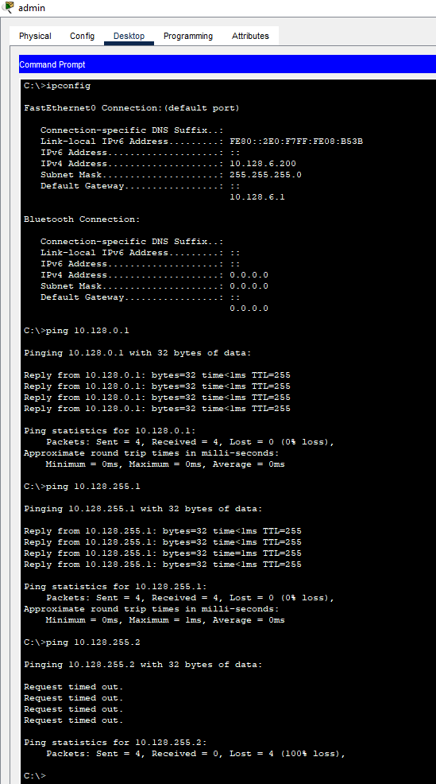{#fig:034 width=80%}

Как можно заметить нам снова недоступен только тот, что за пределами нашей досигаемости.
Исправить это можно легко и просто.Зайдем на маршрутизатор 42 квартала (рис. [-@fig:035]):

{#fig:035 width=80%}

Вернемся к оконечному устройству и снова попробуем пропинговать (рис. [-@fig:036]):

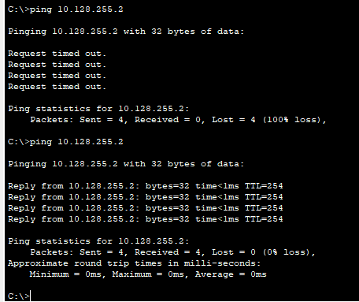{#fig:036 width=80%}

После проведенной настройки на маршрутизаторе 42 квартала пинг стал проходить.Также можем пропинговать и другие устройства 42 квартала: маршрутизатор и оконечное устройство (рис. [-@fig:037]):

{#fig:037 width=80%}

Завершим настройкой на маршрутизаторе в области г.Сочи (рис. [-@fig:038]):

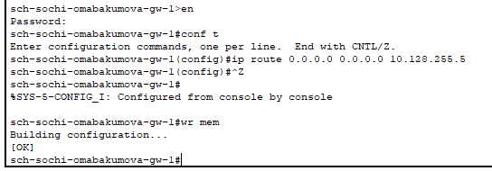{#fig:038 width=80%}

## Настройка маршрутизации на 42 квартале

Проведем настройку маршрутизации на маршрутизаторе и маршрутизирующем коммутаторе в 42 квартале (рис. [-@fig:039]):

{#fig:039 width=80%}

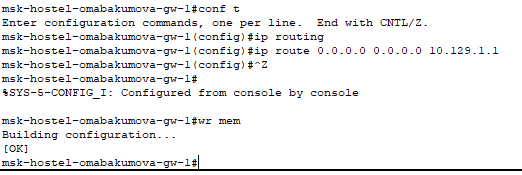{#fig:040 width=80%}

Удостоверимся в работоспособности(доступности) сети снова с помощью пингования (рис. [-@fig:041]):

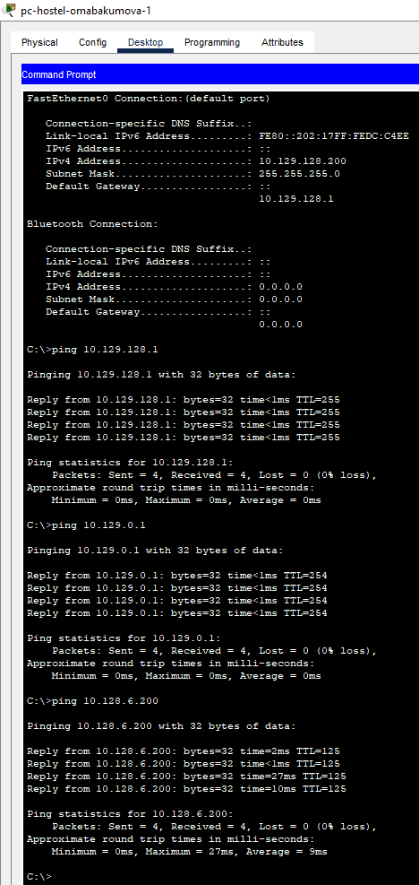{#fig:041 width=80%}

## Настройка NAT

Проведем настройку NAT а маршрутизаторе msk-donskaya-omabakumova-gw-1 (рис. [-@fig:042]):

{#fig:042 width=80%}

{#fig:043 width=80%}

Проверим доступность www.yandex.ru и www.rudn.ru с оконечного устройства (рис. [-@fig:044]):

{#fig:044 width=80%}

{#fig:045 width=80%}

Весь пинг успешно прошел.Доступ в интернет есть.

# Контрольные вопросы 

1. Приведите пример настройки статической маршрутизации между двумя
подсетями организации.
Пример настройки на маршрутизаторе Cisco:

```cisco
Router(config)# ip route 192.168.2.0 255.255.255.0 192.168.1.2
```
Где:
- `192.168.2.0` - целевая подсеть
- `255.255.255.0` - маска подсети
- `192.168.1.2` - IP-адрес следующего hop (интерфейс соседнего маршрутизатора)

Для двусторонней связи нужно настроить маршрут на обоих маршрутизаторах.

2. Опишите процесс обращения устройства из одного VLAN к устройству из
другого VLAN.

- Устройство в VLAN 1 отправляет пакет на шлюз по умолчанию (L3-интерфейс VLAN на маршрутизаторе или L3-коммутаторе)
- Маршрутизатор проверяет таблицу маршрутизации для определения пути к VLAN 2
- Если маршрут существует, маршрутизатор перенаправляет трафик:
   - Через trunk-порт (если VLANы на одном устройстве)
   - Через межсетевое соединение (если VLANы на разных устройствах)
- Пакет доставляется в целевую VLAN 2 с новым VLAN-тегом

3. Как проверить работоспособность маршрута?

```cisco
ping <целевой_IP>      # Проверка доступности
traceroute <целевой_IP> # Просмотр пути
show ip route <сеть>    # Проверка наличия маршрута
```

Пример:
```cisco
Router# ping 192.168.2.1
Router# traceroute 192.168.2.1
Router# show ip route 192.168.2.0
```

4. Как посмотреть таблицу маршрутизации?

```cisco
show ip route
```

# Выводы

В процессе выполнения лабораторной работы я настроила взаимодействие через сеть провайдера посредством статической
маршрутизации локальной сети организации с сетью основного здания, расположенного в 42-м квартале в Москве, и сетью филиала, расположенного
в г. Сочи.
