---
## Front matter
lang: ru-RU
title: Лабораторная работа № 15. Динамическая маршрутизация
author:
  - Абакумова О. М.
institute:
  - Российский университет дружбы народов, Москва, Россия

## i18n babel
babel-lang: russian
babel-otherlangs: english

## Formatting pdf
toc: false
toc-title: Содержание
slide_level: 2
aspectratio: 169
section-titles: true
theme: metropolis
header-includes:
 - \metroset{progressbar=frametitle,sectionpage=progressbar,numbering=fraction}
mainfont: Open Sans Light
---

# Информация

## Докладчик

:::::::::::::: {.columns align=center}
::: {.column width="70%"}

  * Абакумова Олеся Максимовна
  * Студентка
  * Российский университет дружбы народов
  * 1132220832@pfur.ru
  * <https://github.com/omabakumova>

:::
::: {.column width="30%"}

:::
::::::::::::::

# Цель работы

Настроить динамическую маршрутизацию между территориями организации.

# Теоретическое введение

Протокол внутренней маршрутизации Open Shortest Path First (OSPF, RFC
2328) используется на маршрутизаторах для распространения данных
маршрутизации внутри одной автономной системы.

## Теоретическое введение

: Идентификация маршрутизаторов 

| IP-адреса         | Примечание               |
|-------------------|--------------------------|
| 10.128.254.0/24   | Сеть для идентификации маршрутизаторов |
| 10.128.254.1      | msk-donskaya-gw-1        |
| 10.128.254.2      | msk-q42-gw-1             |
| 10.128.254.3      | msk-hostel-gw-1          |
| 10.128.254.4      | sch-sochi-gw-1           |

## Теоретическое введение

: Таблица IP линка 42 квартал–Сочи

| IP-адреса         | Примечание                      | VLAN |
|-------------------|---------------------------------|------|
| 10.128.255.8/30   | Линк между 42 кварталом и Сочи  | 7    |
| 10.128.255.9      | msk-q42-gw-1                    |      |
| 10.128.255.10     | sch-sochi-gw-1                  |      |

# Задание

1. Настроить динамическую маршрутизацию по протоколу OSPF на
маршрутизаторах msk-donskaya-gw-1, msk-q42-gw-1, msk-hostel-gw-1,
sch-sochi-gw-1.

2. Настроить связь сети квартала 42 в Москве с сетью филиала в г. Сочи
напрямую.

3. В режиме симуляции отследить движение пакета ICMP с ноутбука адми-
нистратора сети на Донской в Москве (Laptop-PT admin) до компьютера
пользователя в филиале в г. Сочи pc-sochi-1.

## Задание

4. На коммутаторе провайдера отключить временно vlan 6 и в режиме симуля-
ции убедиться в изменении маршрута прохождения пакета ICMP с ноутбука
администратора сети на Донской в Москве (Laptop-PT admin) до компьютера пользователя в филиале в г. Сочи pc-sochi-1.

5. На коммутаторе провайдера восстановить vlan 6 и в режиме симуляции
убедиться в изменении маршрута прохождения пакета ICMP с ноутбука администратора сети на Донской в Москве (Laptop-PT admin) до компьютера
пользователя в филиале в г. Сочи pc-sochi-1.

6. При выполнении работы необходимо учитывать соглашение об именовании.

# Выполнение лабораторной работы

## Настройка OSPF

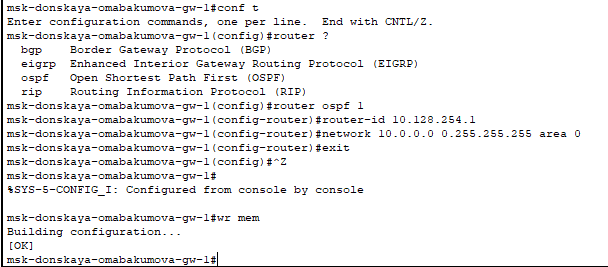{#fig:001 width=50%}

## Настройка OSPF

{#fig:002 width=50%}

## Настройка OSPF

{#fig:003 width=80%}

## Настройка OSPF

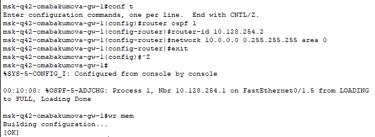{#fig:004 width=50%}

## Настройка OSPF

{#fig:005 width=50%}

## Настройка OSPF

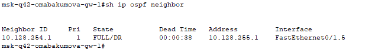{#fig:006 width=50%}

## Настройка OSPF

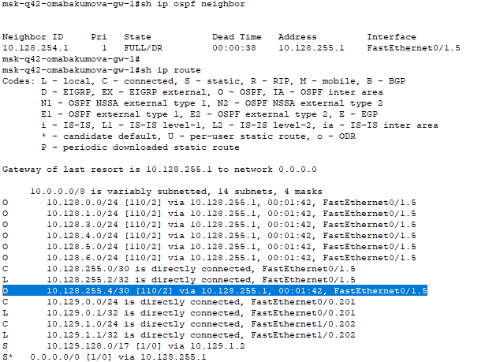{#fig:007 width=50%}

## Настройка OSPF

{#fig:008 width=50%}

## Настройка OSPF

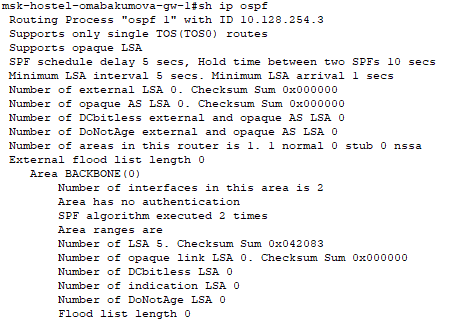{#fig:009 width=50%}

## Настройка OSPF

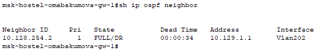{#fig:010 width=50%}

## Настройка OSPF

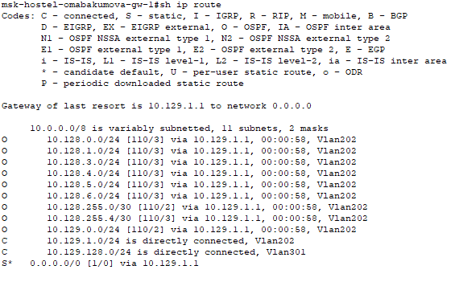{#fig:011 width=50%}

## Настройка OSPF

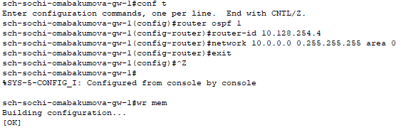{#fig:012 width=50%}

## Настройка OSPF

{#fig:013 width=50%}

## Настройка OSPF

{#fig:014 width=50%}

## Настройка OSPF

{#fig:015 width=50%}

## Настройка линка 42-й квартал–Сочи

{#fig:016 width=50%}

## Настройка линка 42-й квартал–Сочи

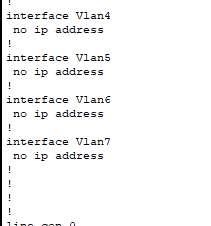{#fig:017 width=20%}

## Настройка линка 42-й квартал–Сочи

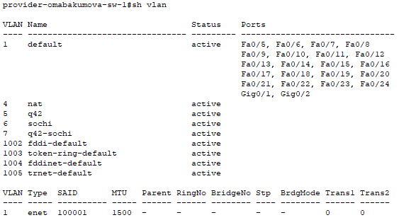{#fig:018 width=50%}

## Настройка линка 42-й квартал–Сочи

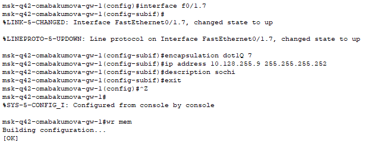{#fig:019 width=50%}

## Настройка линка 42-й квартал–Сочи

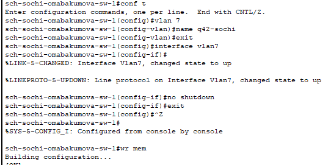{#fig:020 width=50%}

## Настройка линка 42-й квартал–Сочи

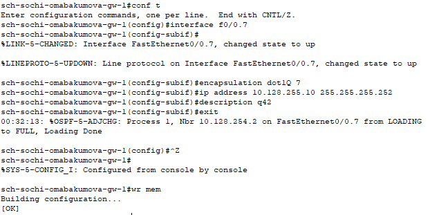{#fig:021 width=50%}

## Настройка линка 42-й квартал–Сочи

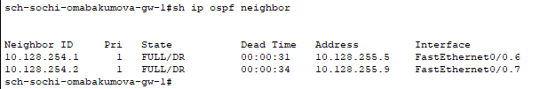{#fig:022 width=50%}

## Отправление пакетов

{#fig:023 width=25%}

## Отправление пакетов

{#fig:024 width=50%}

## Отправление пакетов

{#fig:025 width=50%}

## Отправление пакетов

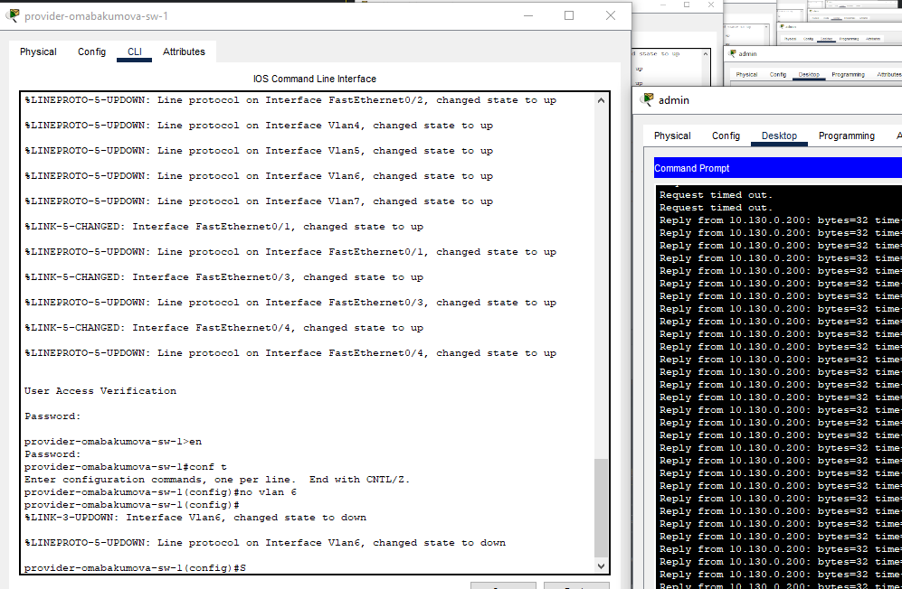{#fig:026 width=50%}

## Отправление пакетов

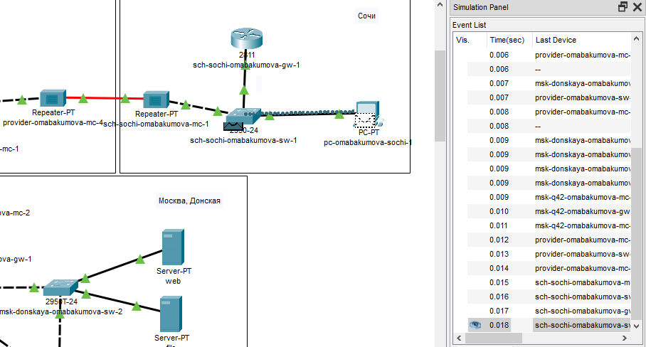{#fig:027 width=50%}

## Отправление пакетов

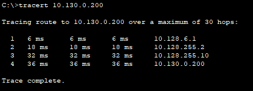{#fig:028 width=50%}

## Отправление пакетов

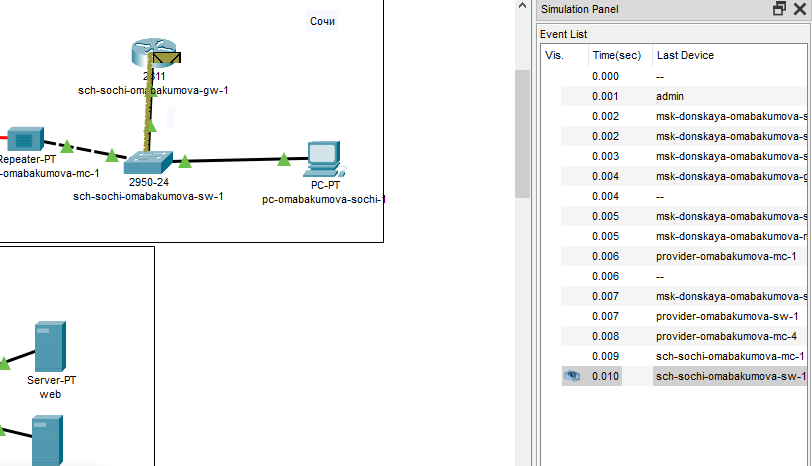{#fig:029 width=50%}

# Выводы

В процессе выполнения лабораторной работы я настроила динамическую маршрутизацию между территориями организации.

