---
## Front matter
title: "Лабораторная работа № 15. Динамическая маршрутизация"
author: "Абакумова Олеся Максимовна, НФИбд-02-22"

## Generic otions
lang: ru-RU
toc-title: "Содержание"

## Bibliography
bibliography: bib/cite.bib
csl: pandoc/csl/gost-r-7-0-5-2008-numeric.csl

## Pdf output format
toc: true # Table of contents
toc-depth: 2
lof: true # List of figures
lot: true # List of tables
fontsize: 12pt
linestretch: 1.5
papersize: a4
documentclass: scrreprt
## I18n polyglossia
polyglossia-lang:
  name: russian
  options:
	- spelling=modern
	- babelshorthands=true
polyglossia-otherlangs:
  name: english
## I18n babel
babel-lang: russian
babel-otherlangs: english
## Fonts
mainfont: IBM Plex Serif
romanfont: IBM Plex Serif
sansfont: IBM Plex Sans
monofont: IBM Plex Mono
mathfont: STIX Two Math
mainfontoptions: Ligatures=Common,Ligatures=TeX,Scale=0.94
romanfontoptions: Ligatures=Common,Ligatures=TeX,Scale=0.94
sansfontoptions: Ligatures=Common,Ligatures=TeX,Scale=MatchLowercase,Scale=0.94
monofontoptions: Scale=MatchLowercase,Scale=0.94,FakeStretch=0.9
mathfontoptions:
## Biblatex
biblatex: true
biblio-style: "gost-numeric"
biblatexoptions:
  - parentracker=true
  - backend=biber
  - hyperref=auto
  - language=auto
  - autolang=other*
  - citestyle=gost-numeric
## Pandoc-crossref LaTeX customization
figureTitle: "Рис."
tableTitle: "Таблица"
listingTitle: "Листинг"
lofTitle: "Список иллюстраций"
lotTitle: "Список таблиц"
lolTitle: "Листинги"
## Misc options
indent: true
header-includes:
  - \usepackage{indentfirst}
  - \usepackage{float} # keep figures where there are in the text
  - \floatplacement{figure}{H} # keep figures where there are in the text
---

# Цель работы

Настроить динамическую маршрутизацию между территориями организации.

# Теоретическое введение

Протокол внутренней маршрутизации Open Shortest Path First (OSPF, RFC
2328) [@rfc2328] используется на маршрутизаторах для распространения данных
маршрутизации внутри одной автономной системы. Под автономной системой
(autonomous system) в данном случае понимается группа маршрутизаторов,
использующих общий протокол маршрутизации для обмена маршрутной информацией.
В основе работы OSPF лежит технология отслеживания состояния канала
(link-state technology), которая использует алгоритм Дейкстры для нахождения
кратчайшего пути.
Для обозначения области действия протокола OSPF внутри автономной
системы используется понятие зоны (area) — совокупность сетей и маршрутизаторов, имеющих один и тот же идентификатор зоны. Для определения
маршрутизаторов внутри зоны используется уникальный идентификатор каждого маршрутизатора (router ID, RID).

В табл. [-@tbl:gw] представлены IP-адреса, выделяемые в моделируемой нами
сети для идентификации маршрутизаторов по протоколу OSPF.

: Идентификация маршрутизаторов {#tbl:gw}

| IP-адреса         | Примечание               |
|-------------------|--------------------------|
| 10.128.254.0/24   | Сеть для идентификации маршрутизаторов |
| 10.128.254.1      | msk-donskaya-gw-1        |
| 10.128.254.2      | msk-q42-gw-1             |
| 10.128.254.3      | msk-hostel-gw-1          |
| 10.128.254.4      | sch-sochi-gw-1           |

В табл. [-@tbl:link] представлены IP-адреса, выделяемые в моделируемой нами
сети для организации прямого соединения между сетью квартала 42 в Москве
и сетью филиала в г. Сочи.

: Таблица IP линка 42 квартал–Сочи {#tbl:link}

| IP-адреса         | Примечание                      | VLAN |
|-------------------|---------------------------------|------|
| 10.128.255.8/30   | Линк между 42 кварталом и Сочи  | 7    |
| 10.128.255.9      | msk-q42-gw-1                    |      |
| 10.128.255.10     | sch-sochi-gw-1                  |      |

# Задание

1. Настроить динамическую маршрутизацию по протоколу OSPF на
маршрутизаторах msk-donskaya-gw-1, msk-q42-gw-1, msk-hostel-gw-1,
sch-sochi-gw-1.
2. Настроить связь сети квартала 42 в Москве с сетью филиала в г. Сочи
напрямую.
3. В режиме симуляции отследить движение пакета ICMP с ноутбука адми-
нистратора сети на Донской в Москве (Laptop-PT admin) до компьютера
пользователя в филиале в г. Сочи pc-sochi-1.
4. На коммутаторе провайдера отключить временно vlan 6 и в режиме симуля-
ции убедиться в изменении маршрута прохождения пакета ICMP с ноутбука
администратора сети на Донской в Москве (Laptop-PT admin) до компьютера пользователя в филиале в г. Сочи pc-sochi-1.
5. На коммутаторе провайдера восстановить vlan 6 и в режиме симуляции
убедиться в изменении маршрута прохождения пакета ICMP с ноутбука администратора сети на Донской в Москве (Laptop-PT admin) до компьютера
пользователя в филиале в г. Сочи pc-sochi-1.
6. При выполнении работы необходимо учитывать соглашение об именовании.

# Выполнение лабораторной работы

## Настройка OSPF

Включение OSPF на маршрутизаторе предполагает, во-первых,
включение процесса OSPF командой `router ospf <process-id>`, во-
вторых --- назначение областей (зон) интерфейсам с помощью команды
`network` `<network or IP address> <mask> area <area-id>` (рис. [-@fig:001]):

{#fig:001 width=80%}

Идентификатор процесса OSPF (process-id) по сути идентифицирует маршрутизатор в автономной системе, и, вообще говоря, он не должен совпадать
с идентификаторами процессов на других маршрутизаторах.

Значение идентификатора области (area-id) может быть целым числом от
0 до 4294967295 или может быть представлено в виде IP-адреса: A.B.C.D.
Область 0 называется магистралью, области с другими идентификаторами
должны подключаться к магистрали.

Проверим состояние протокола OSPF на маршрутизаторе, аналогично проведем проверку и при других настройках (рис. [-@fig:002]):

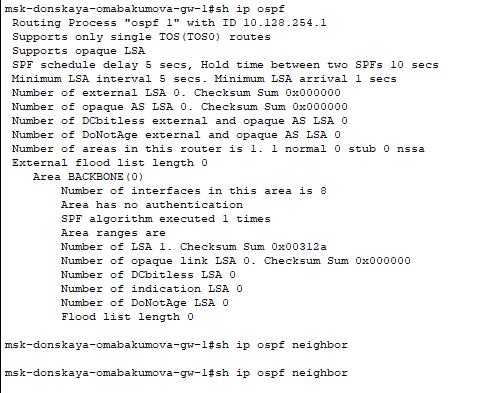{#fig:002 width=80%}

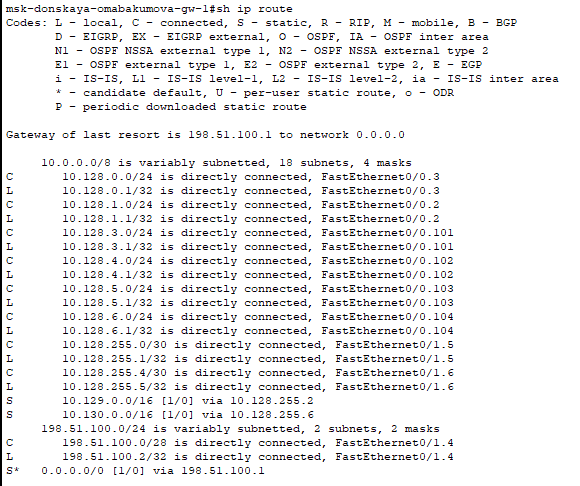{#fig:003 width=80%}

Маршрутизаторы с общим сегментом являются соседями в этом
сегменте. Соседи выбираются с помощью протокола Hello. Команда
show ip ospf neighbor показывает статус всех соседей в заданном сегменте.
Команда show ip ospf route (или show ip route) выводит информацию из
таблицы маршрутизации.

Проведем аналогичную настройку на остальных устройствах:

1. На msk-q42-omabakumova-gw-1 (рис. [-@fig:004]):

{#fig:004 width=80%}

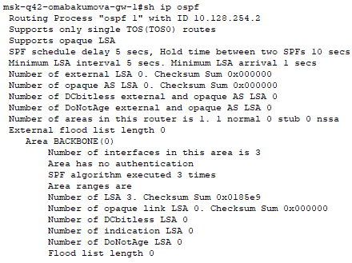{#fig:005 width=80%}

{#fig:006 width=80%}

{#fig:007 width=80%}

2. На msk-hostel-omabakumova-gw-1 (рис. [-@fig:008]):

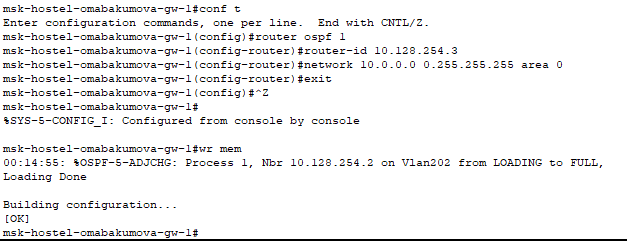{#fig:008 width=80%}

{#fig:009 width=80%}

{#fig:010 width=80%}

{#fig:011 width=80%}

3. На sch-sochi-omabakumova-gw-1 (рис. [-@fig:012]):

{#fig:012 width=80%}

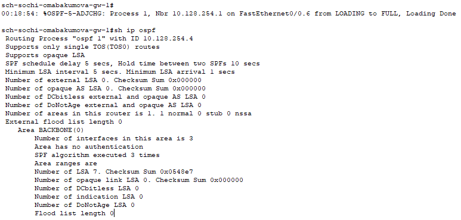{#fig:013 width=80%}

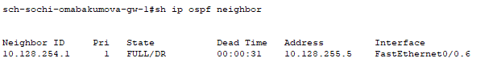{#fig:014 width=80%}

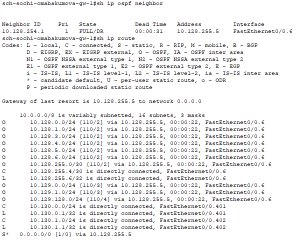{#fig:015 width=80%}

Какой вывод можно сделать:

1. Для маршрутизатора на Донской появилась информация о соседях, в ней нет маршрутизирующего коммутатора msk-hostel-omabakumova-gw-1, так как с ним связь происходит через маршрутизатор msk-q42-omabakumova-gw-1

2. У msk-q42-gw-1 сосед msk-donskaya-omabakumova-gw-1 и msk-hostel-omabakumova-gw-1, так как пока что не настроена прямая связь между территориями Сочи и 42 квартал. Это также отражено в таблице маршрутизации -- указано, что пакеты не только на устройства на Донской идут через msk-donskaya-omabakumova-gw-1(адрес из подсети линка на 42 квартал), но и в Сочи. К оконечным устройствам общежития пакеты идут через msk-hostel-omabakumova-gw-1.

3. У sch-sochi-omabakumova-gw-1 один сосед -- msk-donskaya-omabakumova-gw-1, так как пока что не настроена прямая связь между территориями Сочи и 42 квартал. Это также отражено в таблице маршрутизации -- указано, что пакеты не только на устройства на Донской идут через  msk-donskaya-omabakumova-gw-1(адрес из подсети линка в Сочи), но и в 42 квартал.

## Настройка линка 42-й квартал–Сочи

Перейдем к настройке линка 42-й квартал–Сочи:

1. На provider-omabakumova-sw-1 (рис. [-@fig:016]):

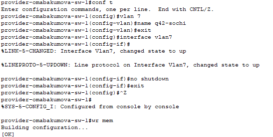{#fig:016 width=80%}

{#fig:017 width=80%}

{#fig:018 width=80%}

2. На msk-q42-omabakumova-gw-1 (рис. [-@fig:019]):

{#fig:019 width=80%}

3. На sch-sochi-omabakumova-sw-1 (рис. [-@fig:020]):

{#fig:020 width=80%}

4. На sch-sochi-omabakumova-gw-1 (рис. [-@fig:021]):

{#fig:021 width=80%}

{#fig:022 width=80%}

## Отправление пакетов

Теперь убедимся в работоспособности сети, зайдя на оконечное устройство области Донская (рис. [-@fig:023]):

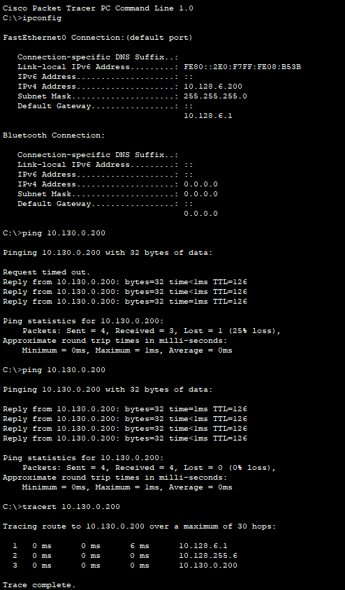{#fig:023 width=80%}

Убедившись в дотсупности оконечного устройства из области г.Сочи попробуем отправить туда пакет (рис. [-@fig:024]):

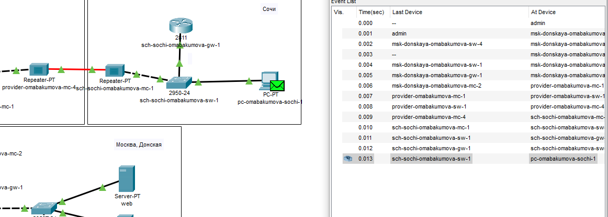{#fig:024 width=80%}

Теперь временно отключим vlan6 и посмотрим как изменится маршрут пакета (рис. [-@fig:025]):

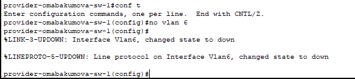{#fig:025 width=80%}

{#fig:026 width=80%}

На изменение маршрута требуется некоторое время, после этого пинг снова будет проходить и пакет успешно дойдет (рис. [-@fig:027]):

{#fig:027 width=80%}

Также можно ознакомиться с измененной таблицей маршрутизации (рис. [-@fig:028]):

{#fig:028 width=80%}

Ну и аналогично будет для восстановления маршрута,если мы снова включим vlan6, то опять же потребуется некоторое время, чтобы маршрут восстановился и пинг снова стал проходить (рис. [-@fig:029]):

{#fig:029 width=80%}

# Контрольные вопросы 

1. Какие протоколы относятся к протоколам динамической маршрутизации?  

К протоколам динамической маршрутизации относятся:  

- **RIP (Routing Information Protocol)** – дистанционно-векторный протокол, использует количество прыжков (hops) как метрику.  

- **OSPF (Open Shortest Path First)** – протокол состояния каналов (link-state), использует алгоритм Дейкстры для вычисления кратчайшего пути.  

- **EIGRP (Enhanced Interior Gateway Routing Protocol)** – гибридный протокол (Cisco), сочетает черты дистанционно-векторных и link-state протоколов.
  
- **BGP (Border Gateway Protocol)** – протокол внешней маршрутизации (EGP), используется между автономными системами (AS) в интернете. 
 
- **IS-IS (Intermediate System to Intermediate System)** – link-state протокол, похожий на OSPF, но работающий на уровне 2 модели OSI.  

2. Охарактеризуйте принципы работы протоколов динамической маршрутизации.  

Основные принципы работы:  

- **Обмен маршрутной информацией** – маршрутизаторы рассылают информацию о доступных сетях соседям.  

- **Выбор оптимального пути** – на основе метрик (задержка, количество прыжков, пропускная способность и др.).  

- **Адаптация к изменениям** – при выходе из строя маршрута протокол автоматически пересчитывает пути.  

- **Типы протоколов:**  

  - **Дистанционно-векторные (RIP, EIGRP)** – передают всю таблицу маршрутизации соседям. 
   
  - **Link-state (OSPF, IS-IS)** – строят топологию сети и вычисляют пути независимо.  
  
  - **Гибридные (EIGRP)** – комбинируют подходы.  

3. Опишите процесс обращения устройства из одной подсети к устройству из другой подсети по протоколу динамической маршрутизации.  

- **Отправка пакета** – устройство проверяет, принадлежит ли адрес назначения своей подсети. Если нет, отправляет пакет шлюзу по умолчанию.  

- **Маршрутизация на шлюзе** – маршрутизатор ищет путь в таблице маршрутизации (например, через OSPF).  

- **Передача между маршрутизаторами** – если путь известен, пакет передаётся следующему маршрутизатору, иначе запрашивается обновление маршрутов. 
 
- **Доставка в целевую подсеть** – конечный маршрутизатор доставляет пакет получателю.  

4. Опишите выводимую информацию при просмотре таблицы маршрутизации.  

Таблица маршрутизации содержит:  

- **Сеть назначения** (например, `192.168.1.0/24`) – адрес целевой подсети. 
 
- **Метрика** – стоимость маршрута (например, `10` для OSPF).  

- **Следующий хоп (Next Hop)** – IP следующего маршрутизатора (например, `192.168.2.1`).  

- **Интерфейс выхода** – через какой интерфейс отправить пакет (например, `eth0`).  

- **Тип маршрута** – `C` (connected), `S` (static), `O` (OSPF), `R` (RIP) и т. д.  

- **Административное расстояние** – приоритет источника маршрута (меньше = лучше).  

# Выводы

В процессе выполнения лабораторной работы я настроила динамическую маршрутизацию между территориями организации.

# Список литературы{.unnumbered}

::: {#refs}
:::
