---
## Front matter
lang: ru-RU
title: Лабораторная работа № 16. Настройка VPN
author:
  - Абакумова О. М.
institute:
  - Российский университет дружбы народов, Москва, Россия

## i18n babel
babel-lang: russian
babel-otherlangs: english

## Formatting pdf
toc: false
toc-title: Содержание
slide_level: 2
aspectratio: 169
section-titles: true
theme: metropolis
header-includes:
 - \metroset{progressbar=frametitle,sectionpage=progressbar,numbering=fraction}
mainfont: Open Sans Light
---

# Информация

## Докладчик

:::::::::::::: {.columns align=center}
::: {.column width="70%"}

  * Абакумова Олеся Максимовна
  * Студентка
  * Российский университет дружбы народов
  * 1132220832@pfur.ru
  * <https://github.com/omabakumova>

:::
::: {.column width="30%"}

:::
::::::::::::::

# Цель работы

Получение навыков настройки VPN-туннеля через незащищённое Интернет-
соединение.

# Предварительные сведения

**Виртуальная частная сеть (Virtual Private Network, VPN)** — технология,
обеспечивающая одно или несколько сетевых соединений поверх другой сети
(например, Интернет).

# Модельные предположения

: Адреса туннеля VPN 

| IP-адреса         | Примечание         |
|--------------------|--------------------|
| 10.128.255.252/30 | Линк VPN           |
| 10.128.255.253    | msk-donskaya-gw-1  |
| 10.128.255.254    | pisa-unipi-gw-1    |

## Модельные предположения

: Адреса интерфейсов loopback 

| IP-адреса       | Примечание          |
|-----------------|---------------------|
| 10.128.254.0/24 | Сеть адресов loopback интерфейсов |
| 10.128.254.1/32 | msk-donskaya-gw-1   |
| 10.128.254.2/32 | msk-q42-gw-1        |
| 10.128.254.3/32 | msk-hostel-gw-1     |
| 10.128.254.4/32 | sch-sochi-gw-1      |
| 10.128.254.5/32 | pisa-unipi-gw-1     |

# Задание

1. Настроить VPN-туннель между сетью Университета г. Пиза (Италия) и сетью «Донская» в г. Москва 
2. При выполнении работы необходимо учитывать соглашение об именовании.

# Выполнение лабораторной работы

## Настройка площадки в г. Пиза

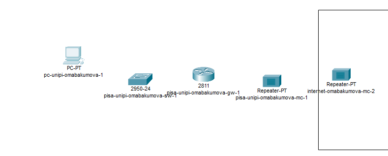{#fig:001 width=50%}

## Настройка площадки в г. Пиза

{#fig:002 width=50%}

## Настройка площадки в г. Пиза

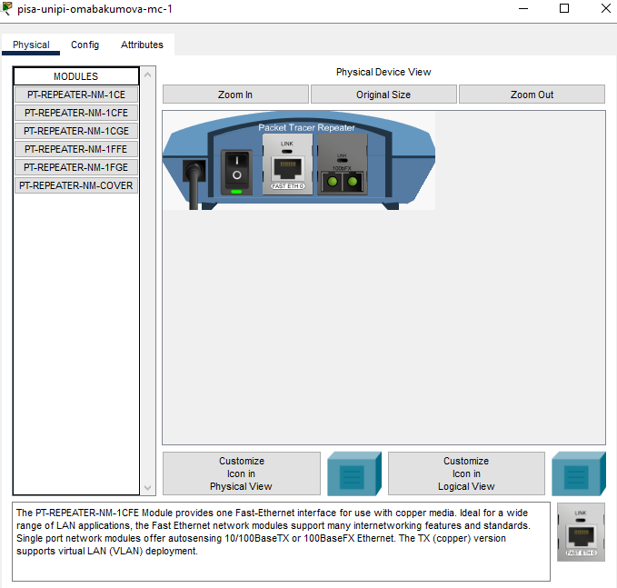{#fig:003 width=50%}

## Настройка площадки в г. Пиза

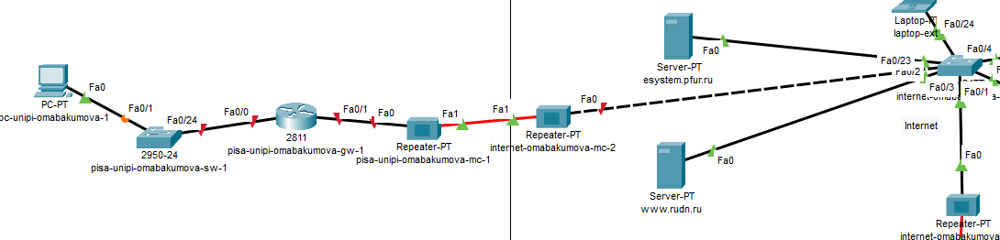{#fig:004 width=50%}

## Настройка площадки в г. Пиза

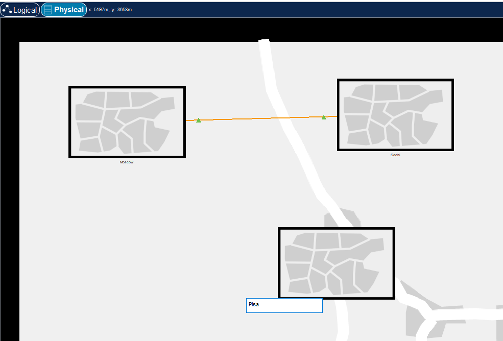{#fig:005 width=50%}

## Настройка площадки в г. Пиза

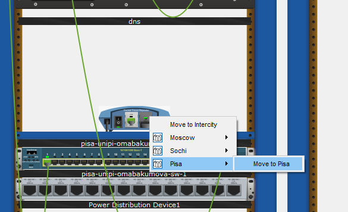{#fig:006 width=50%}

## Настройка площадки в г. Пиза

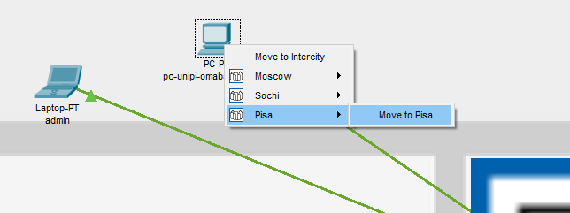{#fig:007 width=50%}

## Настройка площадки в г. Пиза

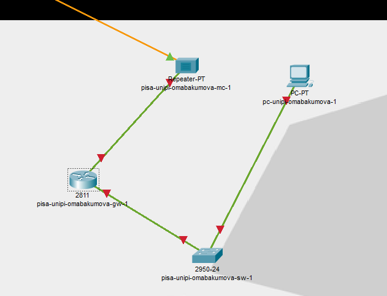{#fig:008 width=50%}

## Настройка площадки в г. Пиза

{#fig:009 width=50%}

## Настройка площадки в г. Пиза

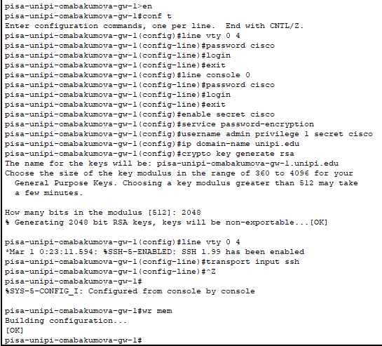{#fig:010 width=50%}

## Настройка площадки в г. Пиза

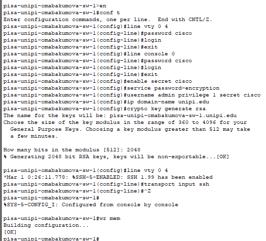{#fig:011 width=50%}

## Настройка площадки в г. Пиза

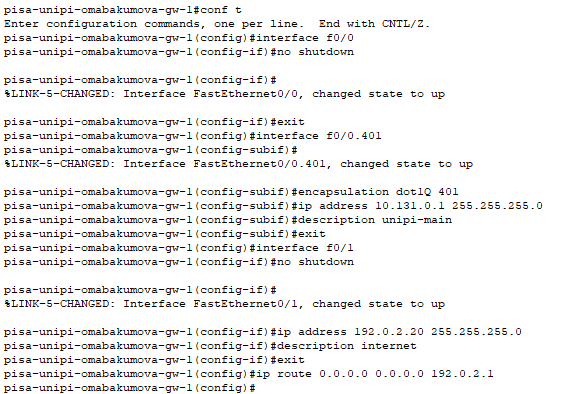{#fig:012 width=50%}

## Настройка площадки в г. Пиза

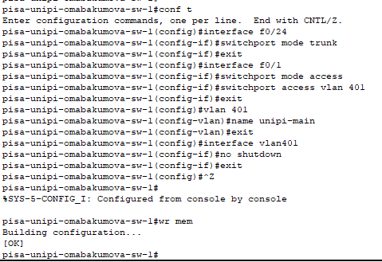{#fig:013 width=50%}

## Настройка площадки в г. Пиза

{#fig:014 width=50%}

## Настройка площадки в г. Пиза

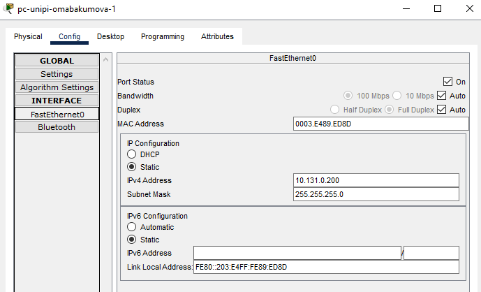{#fig:015 width=50%}

## Настройка площадки в г. Пиза

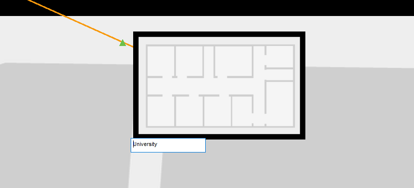{#fig:016 width=50%}

## Настройка площадки в г. Пиза

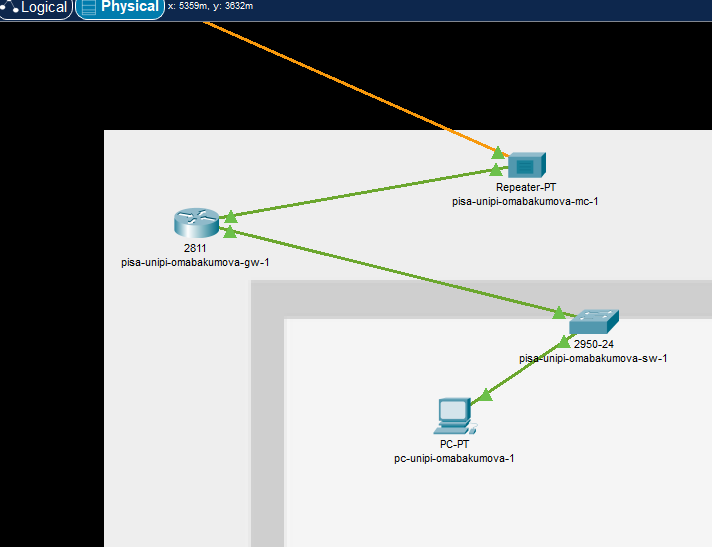{#fig:017 width=50%}

## Настройка площадки в г. Пиза

{#fig:018 width=50%}

## Настройка площадки в г. Пиза

{#fig:019 width=25%}

## Настройка VPN на основе GRE

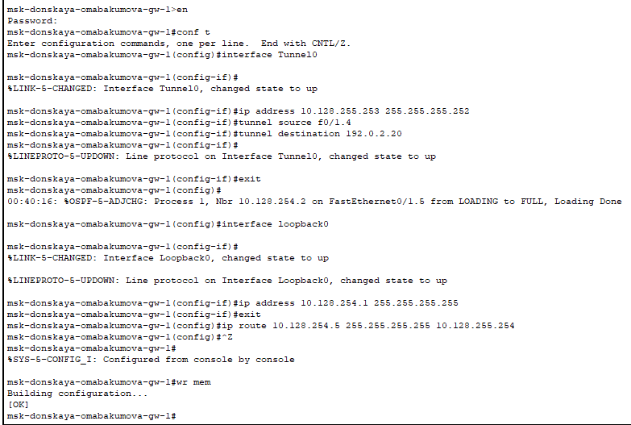{#fig:020 width=50%}

## Настройка VPN на основе GRE

{#fig:021 width=50%}

## Настройка VPN на основе GRE

{#fig:022 width=50%}

## Настройка VPN на основе GRE

{#fig:023 width=50%}

# Выводы

В процессе выполнения лабораторной работы я получила навыки настройки VPN-туннеля через незащищённое Интернет-
соединение.

