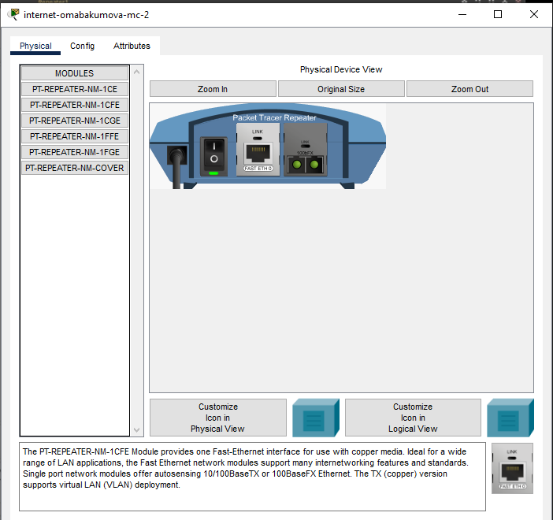
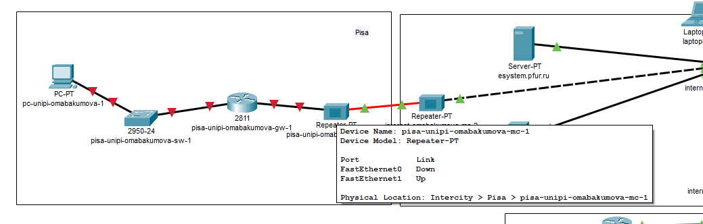
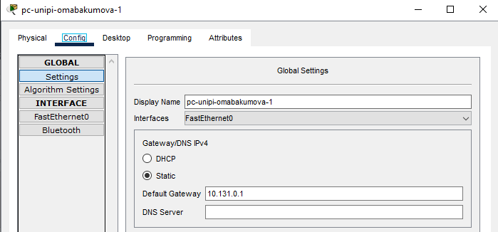
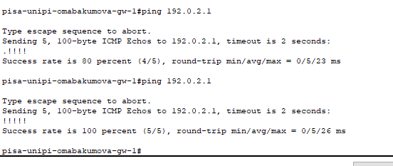
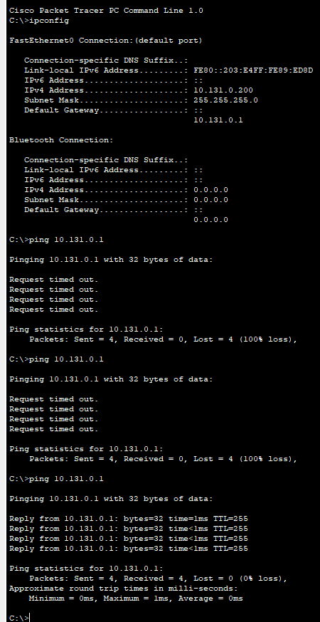
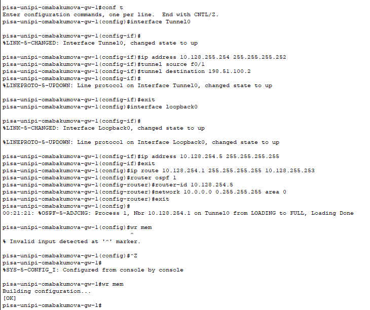
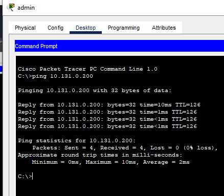

---
## Front matter
title: "Лабораторная работа № 16. Настройка VPN"
author: "Абакумова Олеся Максимовна, НФИбд-02-22"

## Generic otions
lang: ru-RU
toc-title: "Содержание"

## Bibliography
bibliography: bib/cite.bib
csl: pandoc/csl/gost-r-7-0-5-2008-numeric.csl

## Pdf output format
toc: true # Table of contents
toc-depth: 2
lof: true # List of figures
lot: true # List of tables
fontsize: 12pt
linestretch: 1.5
papersize: a4
documentclass: scrreprt
## I18n polyglossia
polyglossia-lang:
  name: russian
  options:
	- spelling=modern
	- babelshorthands=true
polyglossia-otherlangs:
  name: english
## I18n babel
babel-lang: russian
babel-otherlangs: english
## Fonts
mainfont: IBM Plex Serif
romanfont: IBM Plex Serif
sansfont: IBM Plex Sans
monofont: IBM Plex Mono
mathfont: STIX Two Math
mainfontoptions: Ligatures=Common,Ligatures=TeX,Scale=0.94
romanfontoptions: Ligatures=Common,Ligatures=TeX,Scale=0.94
sansfontoptions: Ligatures=Common,Ligatures=TeX,Scale=MatchLowercase,Scale=0.94
monofontoptions: Scale=MatchLowercase,Scale=0.94,FakeStretch=0.9
mathfontoptions:
## Biblatex
biblatex: true
biblio-style: "gost-numeric"
biblatexoptions:
  - parentracker=true
  - backend=biber
  - hyperref=auto
  - language=auto
  - autolang=other*
  - citestyle=gost-numeric
## Pandoc-crossref LaTeX customization
figureTitle: "Рис."
tableTitle: "Таблица"
listingTitle: "Листинг"
lofTitle: "Список иллюстраций"
lotTitle: "Список таблиц"
lolTitle: "Листинги"
## Misc options
indent: true
header-includes:
  - \usepackage{indentfirst}
  - \usepackage{float} # keep figures where there are in the text
  - \floatplacement{figure}{H} # keep figures where there are in the text
---

# Цель работы

Получение навыков настройки VPN-туннеля через незащищённое Интернет-
соединение.

# Задание

1. Настроить VPN-туннель между сетью Университета г. Пиза (Италия) и сетью «Донская» в г. Москва 
2. При выполнении работы необходимо учитывать соглашение об именовании.

# Предварительные сведения

**Виртуальная частная сеть (Virtual Private Network, VPN)** — технология,
обеспечивающая одно или несколько сетевых соединений поверх другой сети
(например, Интернет).
Для организации защищённого VPN-туннеля может использоваться протокол общей инкапсуляции маршрутов (Generic Routing Encapsulation, GRE)
компании Cisco. Основное назначение GRE — инкапсуляция пакетов сетевого уровня сетевой модели взаимодействия открытых систем (Open Systems
Interconnection Basic Reference Model), например, IP, CLNP, IPX, AppleTalk
и др., в IP пакеты.

# Модельные предположения

Сеть Университета г. Пиза (Италия) содержит маршрутизатор Cisco 2811
pisa-inipi-gw-1, коммутатор Cisco 2950 pisa-unipi-sw-1 и конечное устройство PC pc-unipi-1.
Адреса для организации VPN-туннеля представлены в табл. [-@tbl:vpn]

: Адреса туннеля VPN {#tbl:vpn}

| IP-адреса         | Примечание         |
|--------------------|--------------------|
| 10.128.255.252/30 | Линк VPN           |
| 10.128.255.253    | msk-donskaya-gw-1  |
| 10.128.255.254    | pisa-unipi-gw-1    |

Для идентификации маршрутизаторов предполагается использовать
loopback-адреса представлены в табл. [-@tbl:loopback]

: Адреса интерфейсов loopback {#tbl:loopback}

| IP-адреса       | Примечание          |
|-----------------|---------------------|
| 10.128.254.0/24 | Сеть адресов loopback интерфейсов |
| 10.128.254.1/32 | msk-donskaya-gw-1   |
| 10.128.254.2/32 | msk-q42-gw-1        |
| 10.128.254.3/32 | msk-hostel-gw-1     |
| 10.128.254.4/32 | sch-sochi-gw-1      |
| 10.128.254.5/32 | pisa-unipi-gw-1     |

# Выполнение лабораторной работы

## Настройка площадки в г. Пиза

Для начала разместим необходимые устройства дл площадки (рис. [-@fig:001]):

{#fig:001 width=80%}

Зададим им верные именования согласно соглашению и поменем на репитерах модули (рис. [-@fig:002]):

{#fig:002 width=80%}

{#fig:003 width=80%}

Теперь соединим наши устройства (рис. [-@fig:004]):

{#fig:004 width=80%}

Теперь необходимо перейти в физическую область и создать там еще один город, соответствующий г. Пиза и переместить с серверной на Донской устройства, принадлежащие ей.Также переместить репитер internet-omabakumova-mc-2 в область Internet (рис. [-@fig:005]):

{#fig:005 width=80%}

{#fig:006 width=80%}

Также у нас есть оконечное устройство, оно неинаходится в серверной, нужно его тоже переместить в г. Пиза (рис. [-@fig:007]):

{#fig:007 width=80%}

{#fig:008 width=80%}

{#fig:009 width=80%}

**Конечно же тут ничего не работает, потому что кто-то забыл добавить здание на территорию г. Пиза**

Проведем первоначальную настройку маршрутизатора и коммутатора в г. Пиза (рис. [-@fig:010]):

{#fig:010 width=80%}

{#fig:011 width=80%}

Проведем настройку интерфейсов дл маршрутизатора и коммутатора (рис. [-@fig:012]):

{#fig:012 width=80%}

{#fig:013 width=80%}

Также добавим шлюз и статический адрес оконечному устройству (рис. [-@fig:014]):

{#fig:014 width=80%}

{#fig:015 width=80%}

**Тест на дурака был пройден, поэтому никакие тесты не пройдут, пока не вернемся в физическую область и не поправим все**

Создаем в г. Пиза здание (рис. [-@fig:016]):

{#fig:016 width=80%}

{#fig:017 width=80%}

Сеть заработала.Можем провести простые тесты с помощью пинга (рис. [-@fig:016]):

{#fig:018 width=80%}

{#fig:019 width=80%}

**Все тесты прошли успешно, сеть работоспособна**

## Настройка VPN на основе GRE

Проведем настройку VPN на маршрутизаторе (рис. [-@fig:020]):

{#fig:020 width=80%}

Аналогично на коммутаторе (рис. [-@fig:021]):

{#fig:021 width=80%}

ПОсмотрим результат настройки (рис. [-@fig:022]):

{#fig:022 width=80%}

ПРоверим доступность сети с лаптопа-админ в области Донская (рис. [-@fig:023]):

{#fig:023 width=80%}

Сеть доступна, все настрйоки проведены корректно.

# Контрольные вопросы 

1. Что такое VPN?  

VPN (Virtual Private Network) — это технология, которая создает зашифрованное соединение между устройством пользователя и удаленным сервером. Это позволяет безопасно передавать данные через публичные сети (например, интернет), скрывать реальный IP-адрес и обходить географические ограничения. VPN часто используется для защиты конфиденциальности, доступа к корпоративным ресурсам и анонимного серфинга.  

2. В каких случаях следует использовать VPN?  
VPN полезен в следующих ситуациях:  

- **Безопасность в публичных сетях** (например, в кафе или аэропорту) — защита от перехвата данных. 
 
- **Доступ к заблокированным ресурсам** — обход региональных ограничений (например, для просмотра контента из других стран).  

- **Удаленная работа** — безопасное подключение к корпоративной сети.  

- **Анонимность** — скрытие реального IP-адреса от сайтов и трекеров. 
 
- **Обход цензуры** — доступ к информации в странах с ограничениями интернета.  

3. Как с помощью VPN обойти NAT?  

NAT (Network Address Translation) преобразует локальные IP-адреса в публичные, но может ограничивать прямое подключение извне. VPN помогает обойти NAT следующим образом:  

- **Установка VPN-туннеля** — устройство за NAT подключается к VPN-серверу, создавая безопасный канал.  

- **Сквозное соединение** — VPN-сервер выступает как посредник, позволяя внешним устройствам взаимодействовать с внутренними через зашифрованный туннель.  

- **Пример:** Если компьютер в локальной сети (за NAT) подключен к VPN, он получает виртуальный IP-адрес от сервера. Внешние запросы идут через этот адрес, минуя ограничения NAT.  

**Примечание:** Для обхода NAT также используются технологии вроде **Port Forwarding** или **UPnP**, но VPN — более безопасный и универсальный способ.

# Выводы

В процессе выполнения лабораторной работы я получила навыки настройки VPN-туннеля через незащищённое Интернет-
соединение.

